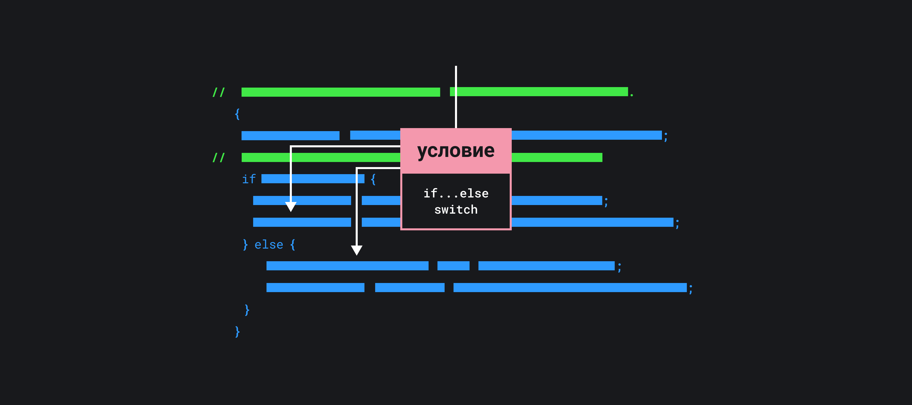

## Кратко

Управляющая конструкция. В зависимости от условия выбирает, какой блок кода выполнить.

## Как пишется

- Выполнить один, либо другой блок кода, в зависимости от условия:

```js
if (условие) {
  console.log('выполнится, если условие истинное (true)')
} else {
  console.log('выполнится, если условие ложное (false)')
}
```

- Выполнить блок кода, если условие истинное, либо пропустить его:

```js
if (условие) {
  console.log('выполнюсь, если условие истинное')
}
```

- Выполнить блок кода, у которого условие истинное и находится выше всего в списке, остальные проверки проигнорировать:

```js
if (условие1) {
  // ...
} else if (условие2) {
  // ...
} else if (условие3) {
  // ...
} else {
  // выполнится, если все условия выше были ложными
}
```

## Как понять

Зачем нужны управляющие конструкции, читайте в статье [«Порядок выполнения»](/js/execution-order/).

В разработке много задач, в которых нужно по-разному обрабатывать данные. Все эти примеры описываются фразой «если ..., то ...»:

- _если_ пользователь вошёл в систему, _то_ показать содержание почтового ящика. В противном случае — форму логина.
- _если_ сумма покупки больше 2000₽, то посчитать скидку 10%.
- _если_ покупка оплачена, то показать экран успеха. В противном случае — экран с ошибкой.

Фразой «если ...» определяется _условие._ Если условие выполняется, то мы выполняем часть, описанную фразой «то...». Если условие не выполняется, то нужно смотреть на фразу «В противном случае ...», когда она есть.

Если мы хотим решать подобные задачи с помощью кода, то язык программирования должен содержать аналогичные конструкции. Конструкция должна выбирать, какой код выполнять, в зависимости от условия. Такая конструкция называется `if...else`. Она предоставляет возможность _ветвления_.

По аналогии с русским языком, конструкция содержит _условие_ и _блоки кода_, которые будут выполняться в зависимости от условия. Блоки кода иногда называют _ветками_:

```js
if (условие) {
  // блок кода, выполнится если условие выполняется
} else {
  // блок кода, выполнится в противном случае
}
```



Пример ниже выведет на печать слово «Привет», если во всплывающее окно ввести «Друг» и «Я тебя не знаю» в противном случае:

```js
let phrase = prompt('Скажи слово друг и заходи')

if (phrase === 'Друг') {
  alert('Привет')
} else {
  alert('Я тебя не знаю')
}
```

### Условие

Для того чтобы хорошо понимать if, нужно разобраться с понятием _условие_. Условие — это выражение, которое JavaScript вычислит в значение.

В самом простом случае, условие должно вычисляться в [логический тип данных](/js/boolean/): `true`, либо `false`. Такие выражения получаются при использовании операторов сравнения `==`, `===`, `>`, `<`, `>=`, `<=`, `!==`, `!=`.

Например:

```js
// применяем скидку, если цена больше или равна 2500 рублей
if (price >= 2500) {
  price = price * 0.9
}

if (foundItems === 0) {
  console.log('Ничего не найдено')
} else {
  console.log('печатаем результаты поиска')
}

if (user.isAdmin) {
  // сокращенная запись user.isAdmin === true
  console.log('Привет, админ!')
} else {
  console.log('Привет, пользователь!')
}
```

Выражения в условии можно комбинировать с помощью [логических операторов](/js/logic-operators/).

В более сложном случае условие будет вычисляться в какой-либо другой тип: число, строку, массив, объект и так далее. В этом случае JavaScript будет приводить получившееся значение к логическому типу.

Какой из блоков кода выполнится?

```js
let foundItems = 0

if (foundItems) {
  console.log('Ничего не найдено')
} else {
  console.log('печатаем результаты поиска')
}
```

Чтобы понять, какой блок кода выполнится, нужно запомнить правила приведения разных типов к логическому. Важное правило:

> Все, что не приводится к `false`, будет `true`

Осталось запомнить 8 значений, которые приводятся к `false`:

- `false`
- `0`
- `-0`
- `''`
- [`null`](/js/null-primitive/)
- [`undefined`](/js/undefined/)
- [`NaN`](/js/number/#specialnye-znacheniya)
- `0n` (тип [BigInt](/js/bigint/))

Зная это правило, мы поймём, что в примере выше есть баг: мы будем писать «Ничего не найдено» всегда, кроме случая, когда в переменной `foundItems` окажется `0`. Тогда мы попытаемся напечатать результаты поиска.

### Вариации

#### `if` без `else`

Если мы хотим выполнить действие, когда условие верно, но в противном случае не делать ничего, то достаточно написать только `іf` без блока `else`.

Напечатаем приветствие только Виктору, для других не делаем ничего:

```js
if (username === 'Виктор') {
  console.log('Привет, Витёк! Эта пасхалка для тебя')
}
```

#### `if ... else if ... else`

Задача может содержать больше чем два случая. Для её решения можно собирать `if...else` в цепочки:

Например, в зависимости от статуса пользователя менять размер скидки:

```js
let discount = 0
if (userStatus === 'VIP') {
  discount = 25
} else if (userStatus === 'privileged') {
  discount = 15
} else if (userStatus === 'clubMember') {
  discount = 5
}
```

В этом случае выполнится тот блок кода, условие которого истинное и находится выше по коду. Остальные условия будут проигнорированы.

Когда условий становится много, то страдает читаемость кода. В этом случае лучше писать [switch](/js/switch/), но он подходит не всегда.
