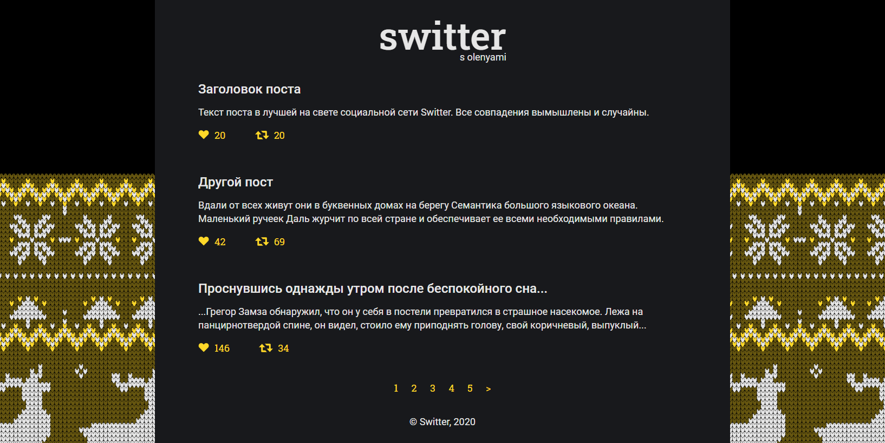
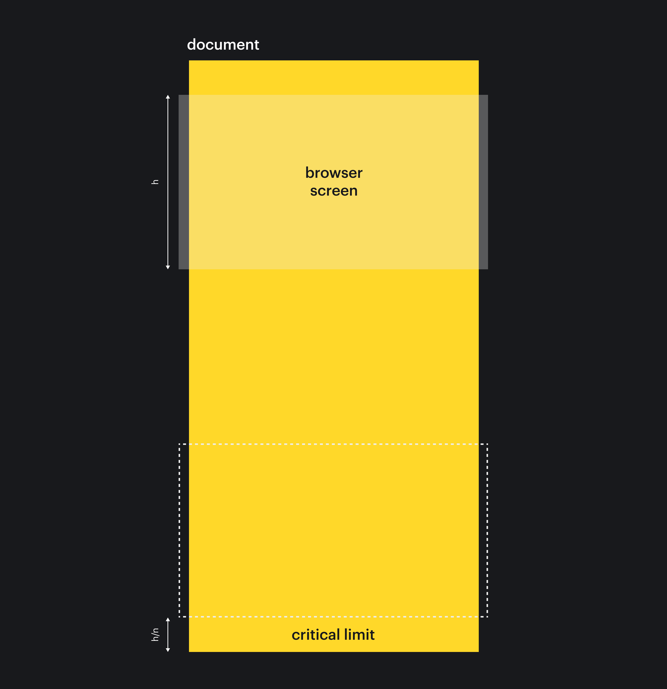
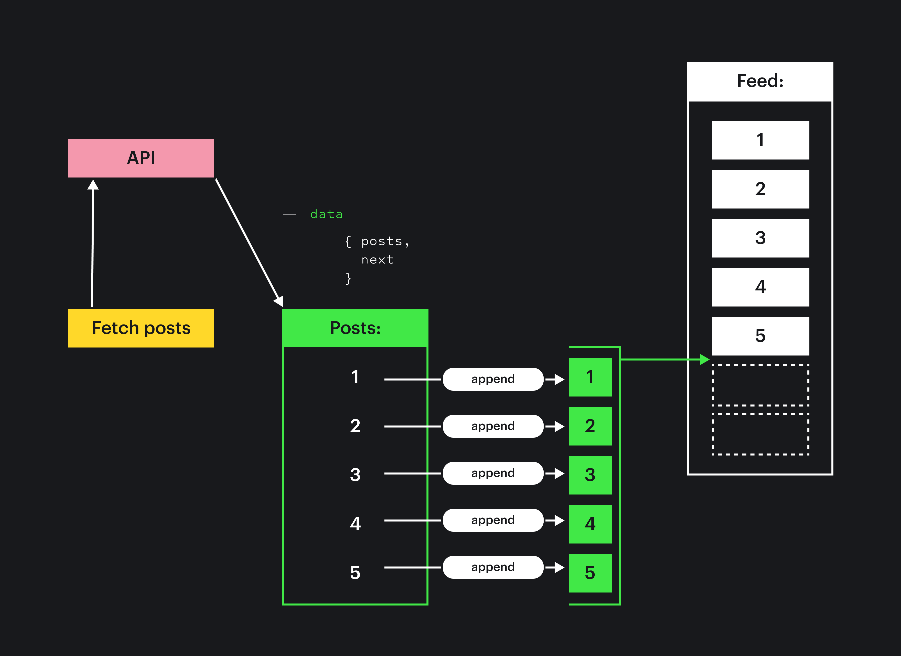

## Кратко

В вебе хорошим тоном считается не загружать в браузер ничего лишнего. Например, стили, скрипты и изображения, которые пользователю не понадобятся, можно считать лишними и не загружать. С контентом дело обстоит так же — по возможности мы хотим загружать только то, что пользователю понадобится «прямо сейчас».

В этой статье мы разберёмся, зачем нам это нужно и какие приёмы используются, чтобы этого добиться.

## Лишний код

Сперва поймём, почему мы не хотим держать в проекте лишний код и загружать его в браузер. На это у нас несколько причин.

### Трафик дорожает

В первую очередь, ненужный код — это лишний сетевой трафик. Он может быть дорогим, особенно мобильный, особенно в Европе. Сайт или приложение, которые загружают ненужное (особенно изображения), могут оказаться в прямом смысле дорогими.

### Время исполнения увеличивается

Это в меньшей степени относится к изображениям и в большей — к JS-файлам. Чем больше JS-кода браузеру необходимо распарсить и выполнить, тем больше времени это займёт. Потраченное время мы украдём у пользователей, пока они будут «ждать загрузки».

Особенно остро это будет досаждать людям с «медленными» устройствами: относительно старыми телефонами или компьютерами. На таких устройствах время исполнения может увеличиваться в разы.

### Удобство работы уменьшается

Чем больше кода, который не используется, но занимает место, тем больше времени у разработчиков будет уходить на исправление багов и реализацию фич.

Навигация внутри проекта и «загрузка проекта в голову» требуют времени и усилий. Чем больше проект, тем сложнее его охватить и понять. Лишний код только сбивает с мысли и не даёт сосредоточиться на важном.

## Код и контент

Стратегий борьбы с лишним кодом много: [код-сплиттинг](/tools/web-app-works/#kod-splitting) и минификация, оптимизация изображений, кэширование, рефакторинг и удаление старого кода.

С контентом ситуация и похожа, и непохожа одновременно. С одной стороны, мы так же не хотим загружать то, что пользователю не нужно, с другой стороны — мы не знаем, что именно пользователю понадобится, и не можем предсказать, на какую страницу он решит перейти. Да и сам контент может постоянно меняться — как в соцсетях.

Поэтому из всех стратегий «сплиттинг» нам подходит больше всего.

<aside>

💡 _Сплиттингом_ мы будем называть передачу контента по кускам: когда первый кусок отдаётся автоматически, а остальные — по запросу пользователя.

</aside>

Такая стратегия используется уже давно, и скорее всего вы уже встречались с её реализацией в виде пагинаторов.

### Пагинаторы

<aside>

📄 _Пагинатор_ — элемент интерфейса, который помогает переходить между «частями» контента. Раньше такие части всегда были отдельными страницами на сайте, отсюда и название.

</aside>

Когда сайты были проще, а [AJAX](/tools/web-app-works/#klient-servernaya-arhitektura) и [JSON](/tools/json/) ещё не были распространены, пагинаторы были единственным способом поделить большое количество контента на куски.

Их и сейчас можно встретить, например, на Google.com:


Пример пагинатора.

Когда же JSON и AJAX стали обычным делом, у разработчиков и дизайнеров появилось больше возможностей «делить» контент на части и показывать его пользователю. Одна из таких возможностей — это бесконечный скролл.

### Бесконечная прокрутка

<aside>

📜 _Бесконечная прокрутка (ещё говорят бесконечный скролл)_ — это приём, когда при прокрутке страницы ближе к концу на сервер отправляется запрос за новой порцией контента, которая встраивается в конец «ленты».

</aside>

Чаще всего такой приём можно увидеть в соцсетях: Twitter, Facebook, Instagram и прочих. Когда пользователь докручивает до «конца» страницы, браузер получает от сервера новую порцию постов, и лента становится бесконечной.

Давайте навестим нашу печально известную соцсеть Switter, знакомую нам по [статье о безопасности веб-приложений](/tools/web-security/), и поможем её разработчикам создать такую бесконечную загрузку. ~~(Может быть, хотя бы это убережёт их акции от полного краха.)~~

## Switter сейчас

Сейчас Switter выглядит как лента со свитами и пагинатор внизу.



Наша задача — реализовать бесконечную прокрутку. Нам стоит учесть:

- Switter — маленькая соцсеть, и контент пользователя всё-таки может закончиться. Поэтому нужно предусмотреть ситуацию, когда мы больше не отправляем запросы за новыми порциями.
- Если прокрутка будет работать на страницах, которые видны всем, пользователи могут захотеть поделиться конкретной страницей. Нам нужно сохранять текущую страницу в адресной строке, чтобы ей можно было поделиться.
- Нам не хочется, чтобы пользователи постоянно «упирались» в дно страницы. Поэтому нужно, чтобы «контент уже ждал пользователя», а не наоборот.

## Заглушка для сервера

Первым делом мы сделаем заглушку для сервера, чтобы имитировать запросы к нему. Для краткости мы скроем шаг с созданием.

<details>
  <summary>Но если вам интересно, как всё устроено — добро пожаловать под капот :–)</summary>

Вначале создадим «базу данных».

Это объект поста, которые мы будем отдавать в качестве новой порции контента:
```js

const post = {
  title: 'Заголовок поста',
  body:
    'Текст поста в лучшей на свете социальной сети Switter. Все совпадения вымышлены и случайны.',
  likes: 77,
  reposts: 7,
}
```

Теперь создадим «сервер API»:

```js
// Метод posts возвращает Promise, имитируя асинхронное общение
// между клиентом и сервером («запрос/ответ»).
const server = {
  // Аргумент page — курсор, номер страницы, которую надо загрузить.
  // С этим номером мы определяем, какую порцию контента отправить.
  // В нашем примере порции отличаться не будут, но в жизни
  // курсор бы влиял на то, какой диапазон постов сервер бы доставал из БД.
  posts(page = 1) {
    // В нашем случае, если текущая страница — 5-я,
    // мы считаем, что контент закончился.
    const finished = page >= 5

    // Иначе сервер отправляет курсор next.
    // Он указывает, какая страница будет по счёту следующей.
    // Так клиент будет знать, стоит ли ему отправлять запрос
    // за новой порцией контента.
    const next = finished ? null : page + 1

    // В качестве постов отправляем массив из 5 объектов post.
    const posts = Array(5).fill(post)

    return new Promise((resolve) => {
      // Таймаут имитирует сетевую «задержку».
      setTimeout(() => {
        resolve({ posts, next })
      }, 150)
    })
  },
}
```

</details>

Вызывать метод для получения новых постов `posts()` мы будем с помощью [`await`](/js/async-in-js/):

```js
const response = await server.posts()
```

## Клиент

Когда сервер готов, мы можем приступать к разработке клиентской части. Первым делом спроектируем, как должно работать приложение.

### Проектирование

Мы хотим подгружать новый контент, когда пользователь докручивает до конца страницы. Здесь можно выделить несколько задач:

- Следить за положением прокрутки. Когда мы приближаемся к концу страницы, нужно запрашивать следующую порцию данных.
- Уметь общаться с сервером. Нам нужно отправлять запросы и обрабатывать ответы.
- Преобразовывать данные в вёрстку на странице и отображать её.
- Не забыть о [правильной обработке события прокрутки](/js/throttle/), чтобы ничего не тормозило.

Начнём с вёрстки.

### Вёрстка и шаблоны

Свит свёрстан как [`<article>`](/html/article/), внутри есть заголовок, текст и кнопки «Нравится» и «Ресвитнуть»:

```html
<article class="post">
  <h1>Заголовок поста</h1>
  <p>
    Текст поста в лучшей на свете социальной сети Switter. Все совпадения
    вымышлены и случайны.
  </p>
  <footer>
    <button type="button">❤️ 20</button>
    <button type="button">🔄 20</button>
  </footer>
</article>
```

Вёрстка нас устраивает. ([`<footer>`](/html/footer/) можно заменить на `<menu>`, но в целом ок.)

Из этой вёрстки мы сделаем шаблон для будущих свитов, которые мы будем загружать с сервера. Шаблон нужен, потому что с сервера мы будем загружать только данные. Как эти данные должны отображаться, сервер не знает. Шаблон будет нужен именно для этого — чтобы браузер мог правильно отобразить данные на странице.


Данные с сервера будут заполнять шаблон, в итоге получится компонент свита.

```html
<!--  Тег template используется, чтобы хранить куски кода,
      которые не должен видеть пользователь. -->
<template id="post_template">
  <!--  Внутри повторяем разметку свита,
        удаляя все тексты и числа.
        Оставляем только «скелет» компонента. -->
  <article class="post">
    <h2></h2>
    <p></p>
    <footer>
      <button type="button">❤️ </button>
      <button type="button">🔄 </button>
    </footer>
  </article>
</template>
```

Если мы добавим этот код на страницу, то визуально ничего не изменится, но у нас появится возможность «штамповать» новые свиты с помощью JS-кода. Подробнее об этом мы поговорим чуть ниже.

### Отслеживание положения скролла

Дальше нам потребуется написать функцию, которая будет определять, когда пора отправлять новый запрос.

```js
function checkPosition() {
  // Нам потребуется знать высоту документа и высоту экрана:
  const height = document.body.offsetHeight
  const screenHeight = window.innerHeight

  // Они могут отличаться: если на странице много контента,
  // высота документа будет больше высоты экрана (отсюда и скролл).

  // Записываем, сколько пикселей пользователь уже проскроллил:
  const scrolled = window.scrollY

  // Обозначим порог, по приближении к которому
  // будем вызывать какое-то действие.
  // В нашем случае — четверть экрана до конца страницы:
  const threshold = height - screenHeight / 4

  // Отслеживаем, где находится низ экрана относительно страницы:
  const position = scrolled + screenHeight

  if (position >= threshold) {
    // Если мы пересекли полосу-порог, вызываем нужное действие.
  }
}
```



Когда мы докрутим и пересечём порог, отправим запрос за новой порцией контента.

Теперь сделаем эту функцию обработчиком события прокрутки и изменения размера окна:

```js
;(() => {
  window.addEventListener('scroll', checkPosition)
  window.addEventListener('resize', checkPosition)
})()
```

### Улучшение производительности

Обработку прокрутки [стоит немного притормаживать](/js/throttle/), чтобы она выполнялась чуть реже и таким образом меньше нагружала браузер.

Добавим функцию `throttle()`:
```js
function throttle(callee, timeout) {
  let timer = null

  return function perform(...args) {
    if (timer) return

    timer = setTimeout(() => {
      callee(...args)

      clearTimeout(timer)
      timer = null
    }, timeout)
  }
}
```

И теперь назначим обработчиком событий слегка заторможенную функцию:

```js
;(() => {
  window.addEventListener('scroll', throttle(checkPosition, 250))
  window.addEventListener('resize', throttle(checkPosition, 250))
})()
```

### Запросы к серверу

Дальше создадим функцию для запросов к серверу:

```js
async function fetchPosts() {
  const { posts, next } = await server.posts(nextPage)
  // Делаем что-то с posts и next.
}
```

И используем её в `checkPosition()`. Так как `fetchPosts()` асинхронная, `checkPosition()` тоже станет асинхронной:

```js
async function checkPosition() {
  // ...Старый код.

  if (position >= threshold) {
    await fetchPosts()
  }
}
```

### Обработка данных от сервера

В функции `fetchPosts()` мы получаем список постов, каждый из которых мы хотим добавить на страницу. Напишем функцию `appendPost()`, которая будет этим заниматься:

```js
function appendPost(postData) {
  // Если данных нет, ничего не делаем:
  if (!postData) return

  // Храним ссылку на элемент, внутрь которого
  // добавим новые элементы-свиты:
  const main = document.querySelector('main')

  // Используем функцию composePost,
  // которую напишем чуть позже —
  // она превращает данные в HTML-элемент:
  const postNode = composePost(postData)

  // Добавляем созданный элемент в main:
  main.append(postNode)
}
```

Функция `appendPost()` использует внутри себя `composePost()`. Напишем и её тоже:

```js
function composePost(postData) {
  // Если ничего не передано, ничего не возвращаем:
  if (!postData) return

  // Обращаемся к шаблону, который создали ранее:
  const template = document.getElementById('post_template')

  // ...и вытаскиваем его содержимое.
  // В нашем случае содержимым будет «скелет» свита, элемент article.
  // Указываем, что нам необходимо его склонировать, а не использовать сам элемент,
  // иначе он изменится сам, и мы не сможем сделать несколько свитов:
  const post = template.content.cloneNode(true)

  // Из postData получаем всю необходимую информацию:
  const { title, body, likes, reposts } = postData

  // Добавляем соответствующие тексты и числа в нужные места в «скелете»:
  post.querySelector('h1').innerText = title
  post.querySelector('p').innerText = body
  post.querySelector('button:first-child').innerText += likes
  post.querySelector('button:last-child').innerText += reposts

  // Возвращаем созданный элемент,
  // чтобы его можно было добавить на страницу:
  return post
}
```



Представить это можно как цепочку событий: запрашиваем данные, получаем ответ, для каждого поста наполняем шаблон данными, получившиеся элементы встраиваем на страницу.

В реальном приложении нам бы потребовалось ещё повесить обработчики кликов по кнопкам в этом новом свите. Без обработчиков кнопки не будут ничего делать. Но для краткости эту часть в статье мы опустим.

Добавим обработку данных в `fetchPosts()`:

```js
async function fetchPosts() {
  const { posts, next } = await server.posts(nextPage)
  posts.forEach(appendPost)
}
```

Осталось лишь правильно обработать случаи, когда мы отправили запрос и ждём ответа, и когда контент закончился.

### Обработка промежуточных и крайних случаев

Если сейчас запустить приложение, то оно будет работать. Но при прокрутке к концу страницы вместо одной порции контента будет присылать несколько. (И никогда не закончит это делать 😁)

Чтобы решить эти проблемы, нужно завести переменные, которые будут следить за [состоянием приложения](/tools/web-app-works/#sostoyanie-prilozheniya):

```js
// Какая страница следующая:
let nextPage = 2

// Если отправили запрос, но ещё не получили ответ,
// не нужно отправлять ещё один запрос:
let isLoading = false

// Если контент закончился, вообще больше не нужно
// отправлять никаких запросов:
let shouldLoad = true
```

Подправим функцию `fetchPosts()`:

```js
async function fetchPosts() {
  // Если мы уже отправили запрос, или новый контент закончился,
  // то новый запрос отправлять не надо:
  if (isLoading || !shouldLoad) return

  // Предотвращаем новые запросы, пока не закончится этот:
  isLoading = true

  const { posts, next } = await server.posts(nextPage)
  posts.forEach(appendPost)

  // В следующий раз запрашиваем страницу с номером next:
  nextPage = next

  // Если мы увидели, что контент закончился,
  // отмечаем, что больше запрашивать ничего не надо:
  if (!next) shouldLoad = false

  // Когда запрос выполнен и обработан,
  // снимаем флаг isLoading:
  isLoading = false
}
```

Теперь функция работает правильно.

### Что можно улучшить ещё

Мы создали базовую функциональность подгрузки, но есть ряд улучшений, о которых стоит помнить в реальном приложении. Они чаще всего сложны в реализации, поэтому в этом подразделе мы поговорим о таких улучшениях, но не будем реализовывать их.

#### Изменение адресной строки

Хорошим тоном считается, когда мы можем дать ссылку на публичную страницу, и другой человек увидит всё в точности, как мы: сортировку контента, его количество, начало и конец. Для этого используется адресная строка и URL-страницы.

В нашем случае при изменении номера текущей страницы мы можем изменять часть адреса.

<aside>

☝️ Для таких задач можно использовать [History API](/js/window-history/).

</aside>

#### Восстановление прокрутки при открытии страницы

При открытии страницы нам надо будет проверить адрес. Если там указано, что нам нужно «прокрутить» контент к какой-то странице, мы это сделаем программно.

Эту задачу часто решают на сервере. Это может быть проще и эффективнее, потому что сервер в таком случае заранее знает, какие данные нужно достать и отдать клиенту. Получается меньше запросов, и приложение для пользователя субъективно быстрее.

## Результат

В результате мы получим переработанную страницу Switter, которая будет получать контент в тот момент, когда он нужен пользователю.

<iframe title="Бесконечная социальная сеть Switter — Подгрузка контента при прокрутке — Дока" src="demos/switter/" height="800"></iframe>
