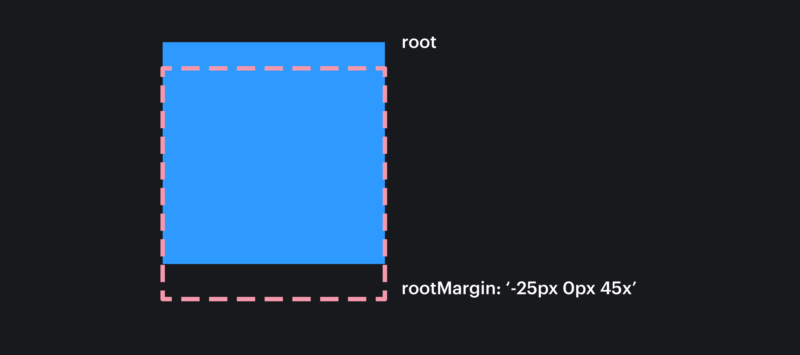

## Кратко
*Intersection Observer* — браузерный API, который позволяет асинхронно отслеживать пересечение элемента с его родителем или областью видимости документа (viewport). В момент пересечения можно запустить какое-либо действие, например, подгрузить дополнительные посты в ленте новостей («бесконечный скролл») или сделать «ленивую» загрузку контента.

## Пример

Для наглядности область наблюдения выделена жёлтой рамкой, а снизу показано как изображения прокручиваются к этой области. Видно, что изображения начинают загружаться при пересечении пунктира, то есть чуть раньше, чем они появляются в видимой области. Это возможно благодаря свойству `rootMargin`.

Ещё одна фишка — изображение Морти немного увеличивается, когда полностью оказывается в наблюдаемой области. Такой трюк делается с помощью свойств `threshold` и `intersectionRatio`, о которых будет рассказано ниже.

<aside>

👴🏼 Морти — паренёк в жёлтой футболке. Вдруг вы не знали.

</aside>

<iframe title="Имитация вьюпорта с прокручиваемыми изображениями" src="demos/index/" height="800"></iframe>


Упрощённый код для этого примера выглядит приблизительно так.

```js
const lazyImages = document.querySelectorAll('.lazy-image')

const callback = (entries, observer) => {
  entries.forEach((entry) => {
    if (entry.isIntersecting) {
      console.log('Пользователь почти докрутил до картинки!')

      entry.target.src = entry.target.dataset.src
      observer.unobserve(entry.target)
    }
  })
}

const options = {
  // root: по умолчанию window, но можно задать любой элемент-контейнер
  rootMargin: '0px 0px 75px 0px',
  threshold: 0,
}

const observer = new IntersectionObserver(callback, options)

lazyImages.forEach((image) => observer.observe(image))
```

## Как пишется

Intersection Observer создаётся с помощью конструктора:

```js
const observer = new IntersectionObserver(callback, options)
```

На вход принимает функцию-колбэк, которая будет выполняться при пересечении области и элементов, а также дополнительные настройки пересечения `options`.

### Функция-колбэк

Колбэк принимает два аргумента:

1️⃣ _entries_ — список объектов с информацией о пересечении. Для каждого наблюдаемого элемента создаётся один объект [_IntersectionObserverEntry_](https://w3c.github.io/IntersectionObserver/#intersection-observer-entry).

Объект содержит несколько свойств, самые полезные это:

- `isIntersecting` — булево значение. `true` если есть пересечение элемента и наблюдаемой области.
- `intersectionRatio` — доля пересечения от 0 до 1. Если элемент полностью в наблюдаемой области, то значение будет _1_, а если наполовину, то — _0.5_.
- `target` — сам наблюдаемый элемент для дальнейших манипуляций. Например, для добавления [классов](/html/class/).

Есть и другие свойства, которые позволяют узнать время и координаты пересечения, а также размеры и положение наблюдаемых элементов.

2️⃣ _observer_ — ссылка на экземпляр наблюдателя для вызова методов прослушивания:

- `observe(элемент)` — запускает наблюдение за переданным элементом;
- `unobserve(элемент)` — убирает элемент из списка наблюдаемых;
- `disconnect()` — останавливает наблюдения за всеми элементами.

### `options`

Необязательный аргумент в виде объекта с тремя свойствами:

- _root_ — элемент, который будет областью наблюдения. Должен быть предком наблюдаемого элемента. По умолчанию — `window`.
- _rootMargin_ — строка с отступами для области наблюдения. Синтаксис почти такой же, как у CSS-свойства [`margin`](/css/margin/) — `'0px 0px 0px 0px'` _(top, right, bottom, left)_, так же доступна короткая запись, например `'50px 100px'` или `'200px'`. По умолчанию — `'0px 0px 0px 0px'`. Если они установлены, то пересечение будет учитывать эти отступы.

<aside>

  ⚠️ Важно прописывать единицы измерения даже для нулевых значений.
  В качестве единиц измерения можно использовать только пиксели и проценты.

</aside>



- _threshold_ — порог пересечения, при котором будет срабатывать колбэк. Может быть либо одним числом от `0` до `1`, либо массивом значений, например `[0, 0.5, 1]`. По умолчанию — `0`.

<details>
  <summary>Подробнее о значениях <em>threshold</em></summary>

  * `0` — сработает даже при пересечении на один пиксель;
  * `1` — сработает только при полном появлении элемента в наблюдаемой области;
  * `[0, 0.5, 1]` — колбэк сработает три раза: сначала при попадании хотя бы одного пикселя элемента в область наблюдения, затем на половине элемента и ещё один раз, когда элемент окажется полностью в области наблюдения.
</details>

## Как понять

Intersection Observer называется так, потому что он реализует паттерн программирования [«Наблюдатель»](/tools/design-patterns-behaviorial/#nablyudatel). Наблюдатель следит за положением наблюдаемых элементов и выполняет действия при их пересечении с контейнером. Это работает аналогично подпискам на события через метод [`addEventListener()`](/js/element-addeventlistener/).

Intersection Observer работает асинхронно и не блокирует основной поток. Это позволяет приложениям оставаться плавными и при этом творить магию, например, как на сайте Apple.

Intersection Observer работает через колбэк. При создании нужно описать за какими элементами мы хотим следить и пересечение с каким контейнером отслеживать. В дальнейшем колбэк будет вызываться каждый раз, когда происходит пересечение наблюдаемой области и какого-либо элемента из отслеживаемых.

В коде ниже проверяется факт пересечения элемента и области наблюдения. Так как мы не знаем, какой элемент из нашего списка пересёк границу контейнера, то нужно найти его с помощью обхода `entries`. Если элементы пересекаются, то в консоль выводится сообщение, а затем наблюдение за этим элементом прекращается с помощью вызова метода `unobserve()`. Такое поведение подходит, например, для «ленивой» загрузки.

```js
const callback = (entries, observer) => {
  entries.forEach((entry) => {
    if (entry.isIntersecting) {
      console.log('Элемент пересёк границу области и всё ещё соприкасается с ней!')

      observer.unobserve(entry.target)
    }
  })
}
```

Другой случай — необходимо определить, какая часть элемента находится в области наблюдения. Для этого используем объект `options`:

```js
const options = {
  root: document.querySelector('.container'),
  marginRoot: '0px',
  threshold: [0, 0.5, 1],
}
```

В качестве наблюдаемой области возьмём элемент с классом `container` без каких-либо дополнительных отступов. Интерес здесь представляет свойство `threshold`. Оно означает, что необходимо вызвать колбэк в трёх случаях:
- сначала элемент пересёк область хотя бы на 1 пиксель;
- затем половина элемента оказалась в области;
- и наконец элемент полностью внутри наблюдаемой области.

Остаётся узнать какое именно событие произошло. Для этого у _IntersectionObserverEntry_ есть свойство `intersectionRatio`.

<aside>

💡 _Intersection Observer_ — асинхронный API, из-за чего значения `intersectionRatio` могут незначительно отличаться от переданных в `threshold`.

Например, при быстрой прокрутке значения будут примерно такими — `0.01...`, `0.52....`, `1`. Учитывайте это при написании условий в колбэке.

</aside>

```js
const callback = (entries) => {
  entries.forEach(({ isIntersecting, intersectionRatio }) => {
    if (isIntersecting) {
      if (intersectionRatio >= 0 && intersectionRatio < 0.45) {
        console.log('Элемент появился в области наблюдения')
      }

      if (intersectionRatio >= 0.45 && intersectionRatio < 0.75) {
        console.log('Элемент наполовину в области наблюдения')
      }

      if (intersectionRatio === 1) {
        console.log('Элемент полностью в области наблюдения')
      }
    }
  })
}
```

После определения колбэка и настроек создаём сам наблюдатель и запускаем прослушивание на элементах с классом `element`:

```js
const targetElement = document.querySelector('.element')
const observer = new IntersectionObserver(callback, options)

observer.observe(targetElement)
```

При необходимости можно прекратить наблюдение за всеми элементами или за каким-то одним:

```js
observer.disconnect()

observer.unobserve(targetElement)
```

### Применение

С помощью этого инструмента можно создавать бесконечные ленты как во многих популярных соц. сетях, запускать красивые анимации как на сайте [Apple](https://www.apple.com/ru/macbook-pro-14-and-16/) и даже создавать необычные странички как [bertani.net](https://www.bertani.net).

Исторически обнаружение видимости отдельного элемента или видимости двух элементов по отношению друг к другу было непростой задачей. Варианты решения этой задачи были ненадёжными и замедляли работу браузера из-за работы в основном потоке. _Intersection Observer API_ работает асинхронно, что несомненно улучшает производительность приложения.

Наглядные сравнения можно найти в статье [Scroll listener vs Intersection Observers: a performance comparison](https://itnext.io/1v1-scroll-listener-vs-intersection-observers-469a26ab9eb6)


