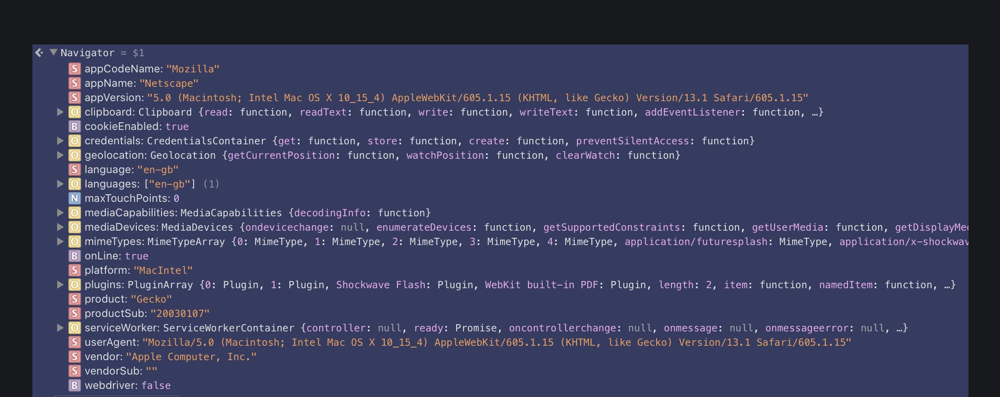
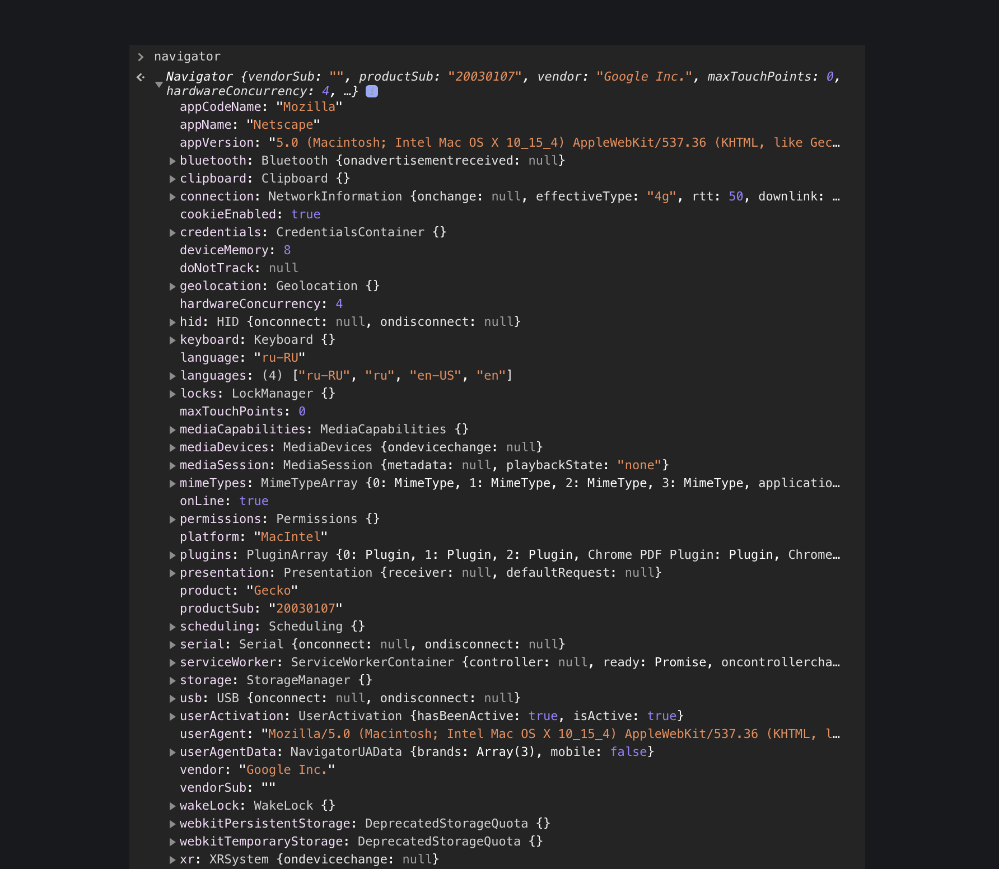

## Кратко

Современный JavaScript используется не только в браузерах. Среда, в которой он запускается, будь то браузер, сервер или что-то ещё, называется _окружением_.

У разных окружений разные возможности и функциональность. В этой статье рассмотрим браузерное окружение и браузерную модель документа.

Окружение предоставляет языку дополнительные возможности и функции. Браузерное окружение, например, даёт возможность работать со страницами сайтов.

Представление этих дополнительных возможностей и функциональности в виде объектов, к которым у языка есть доступ — это объектная модель.

В случае с браузерным окружением — это объектная модель браузера (_Browser Object Model, BOM_). Она предоставляет доступ к `navigator`, `location`, `fetch` и другим объектам.

```js
/*
                              BOM
                              |
    __________________________|______________________________________
    |             |           |             |             |         |
navigator      screen      location       fetch        history     ...

*/
```

## `navigator`

Объект `navigator` содержит информацию о браузере: название, версия, платформа, доступные плагины, доступ к буферу обмена и прочее. Это один из самых больших объектов в окружении.

Так, например, может выглядеть содержимое этого объекта в Safari:



Или, например, так в Chrome:



С помощью этого объекта можно узнать, разрешён ли доступ к кукам, получить доступ к буферу обмена, геолокации, узнать, с какого браузера пользователь смотрит на страницу через `userAgent`.

Забавный факт, поле `userAgent` объекта `navgiator` часто используется, чтобы определять, с какого именно браузера пользователь смотрит страницу сайта. Но читать его глазами [достаточно трудно](<https://docs.microsoft.com/en-us/previous-versions/windows/internet-explorer/ie-developer/compatibility/ms537503(v=vs.85)?redirectedfrom=MSDN>), поэтому лучше это дело оставить какому-нибудь парсеру.

Также с помощью `navigator` можно зарегистрировать Service-Worker.

## `screen`

Объект `screen` содержит информацию об экране браузера.


`width` и `height` указывают ширину и высоту экрана в пикселях соответственно. `avail-`метрики указывают, сколько ширины и высоты доступно — то есть ширину и высоту с учётом интерфейсных деталей браузера типа полос прокрутки.

`pixelDepth` указывает количество битов на один пиксель экрана.

## `location`

Объект `location` даёт возможность узнать, на какой странице мы находимся (какой у неё URL) и перейти на другую страницу программно.

Например, для страницы `https://www.google.com?search?sxsrf=ALekK02Nk...` этот объект будет содержать:


Внутри него есть полезные поля для того, чтобы искать нужную часть адреса.

- `href` содержит URL целиком, включая в себя полный адрес хоста, страницы и все query-параметры.
- `host` и `hostname` указывают имя хоста. Разница между ними в том, что `host` включает в себя порт. Если бы мы стучались не на `[google.com](http://google.com)`, а на `google.com:8080`, то `host` содержал бы значение `www.google.com:8080`, в то время как `hostname` остался бы тем же.
- `pathname` указывает путь от корня адреса до текущей страницы.
- `search` указывает query-параметры, которые находятся в адресной строке, если они есть.
- `hash` указывает хеш (ID элемента после `#`) страницы. Его ещё называют якорем, потому что при переходе на страницу с хешем браузер найдёт элемент с ID, равным этому хешу, и прокрутит страницу к этому элементу.

Если мы хотим изменить адрес и перейти на другую страницу, мы можем указать новый `location.href`:

```js
location.href = "yandex.ru"
// И браузер перейдёт на страницу с адресом `yandex.ru`.
```

## `fetch`

`fetch` предоставляет возможность работы с сетью, с его помощью можно отправлять запросы на сервер.

```js
fetch("http://example.com/movies.json")
  .then((response) => {
    return response.json()
  })
  .then((data) => {
    console.log(data)
  })
```

- [ ] Ссылка на статью о fetch.

## `history`

`history` даёт доступ к истории браузера, которая ограничена текущей вкладкой. То есть с её помощью можно перейти на страницу назад, только если мы пришли с неё.

Чтобы перемещаться по истории назад и вперёд, можно использовать методы `back` и `forward`:

```js
history.back() // перешли на страницу назад
history.forward() // ...на страницу вперёд.
```

Для более точного управления историей рекомендуется использовать `pushState`:

```js
// state — любые данные, которые связаны с переходом;
// бывает полезно, когда нужно разбить форму на несколько
// шагов, но при этом помнить, какие данные были введены
// на каждом из них — их можно сохранять в state:
const state = { user_id: 5 }

// title — заголовок для отображения во вкладке браузера:
const title = "Some Page Title"

// url — адрес:
const url = "/another-page/"

history.pushState(state, title, url)
// Браузер «перейдёт» на страницу `/another-page/`.
// Перейдёт не по-анстоящему, потому что страница
// не перезагрузится, а лишь сменит адрес в строке.
// Это удобно при работе с одностраничными приложениями,
// когда мы не хотим, чтобы страница перезагружалась.
```

## `localStorage`, `sessionStorage`

Локальные хранилища используются, чтобы хранить какие-то данные в браузере пользователя.

Они удобны, когда мы не хотим отправлять данные на сервер, потому что они, например, промежуточные, или нужны только на клиенте.

```js
// Допустим, у нас есть форма из 5 шагов,
// и мы хотим, чтобы все введённые данные
// сохранились, и пользователь закрыв браузер
// и через какое-то время вернувшись,
// мог не набирать их заново.

function saveToStorage(data) {
  try {
    window.localStorage.setItem("some-key", JSON.stringify(data))
  } catch {
    alert("Failed to save data to local storage.")
  }
}

function loadFromStorage() {
  try {
    return JSON.parse(window.localStorage.getItem("some-key"))
  } catch {
    alert("Failed to load data from local storage.")
  }
}

// ...Код обработки формы...

function nextStep() {
  // ...При переходе сохраняем всё, что введено:
  saveToStorage(formData)
}
```

Разница между `localStorage` и `sessionStorage` во длительности хранения данных. Данные из `sessionStorage` сотрутся, когда пользователь закроет вкладку с приложением. Данные же из `localStorage` не стираются сами по себе.
