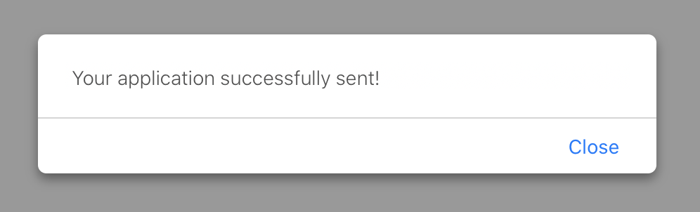
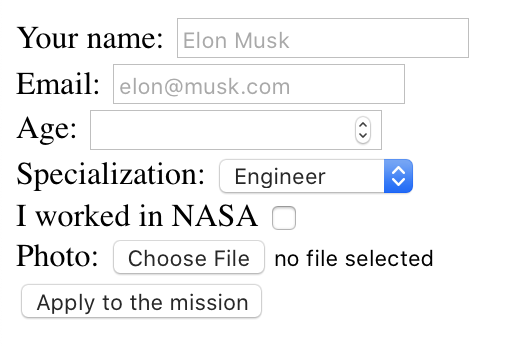

## Кратко

Помимо стандартных средств работы с формами (ссылка на статью о формах в HTML) можно использовать JavaScript, чтобы проверять формы на валидность, получать доступ ко значениям и отправлять информацию на сервер.

Проще всего трюки для работы с формами в JS показать на примере. В этой статье мы соберём форму заявки на колонизаторскую миссию на Марс, в которой стандартные HTML-атрибуты мы немножко приправим динамикой из JS.

## Разметка и требования

Наша форма заявки на миссию “Mars Once” будет состоять из 6 полей:

```html
<form id="marsOnce" action="/apply/" method="POST">
  <!-- Спрашиваем имя, чтобы знать, как обращаться в ответном письме. -->
  <label>
    Your name:
    <input
      type="text"
      name="name"
      id="name"
      placeholder="Elon Musk"
      required
      autofocus
    >
  </label>

  <!-- Спрашиваем почту, чтобы знать, куда это письмо слать. -->
  <label>
    Email:
    <input
      type="email"
      name="email"
      id="email"
      placeholder="elon@musk.com"
      required
    >
  </label>

  <!-- Возраст — нужны только молодые, сорри. -->
  <label>
    Age:
    <input type="number" name="age" required>
  </label>

  <!-- Инженеры и учёные пригодятся для основной работы;
    психологи нужны, чтобы команда друг друга
    не перегрызла за 10-летнюю колонизаторскую миссию. -->
  <label>
    Specialization:
    <select name="specialization" required>
      <option value="engineer" selected>Engineer</option>
      <option value="scientist">Scientist</option>
      <option value="psychologist">Psychologist</option>
      <option value="other">Other</option>
    </select>
  </label>

  <!-- Если человек работал в NASA — это большой плюс. -->
  <label>
    I worked in NASA
    <input type="checkbox" name="nasaExperience" value="1">
  </label>

  <!-- Фотография нужна для прессы. -->
  <label>
    Photo:
    <input type="file" accept="image/jpeg" name="photo" required>
  </label>

  <button type="submit">Apply to the mission</button>
</form>
```

<p class="codepen" data-height="251" data-theme-id="light" data-default-tab="result" data-user="bespoyasov" data-slug-hash="rNLMQrY" style="height: 251px; box-sizing: border-box; display: flex; align-items: center; justify-content: center; border: 2px solid; margin: 1em 0; padding: 1em;" data-pen-title="doka-forms-js">
  <span>See the Pen <a href="https://codepen.io/bespoyasov/pen/rNLMQrY">
  doka-forms-js</a> by Alexander Bespoyasov (<a href="https://codepen.io/bespoyasov">@bespoyasov</a>)
  on <a href="https://codepen.io">CodePen</a>.</span>
</p>
<script async src="https://static.codepen.io/assets/embed/ei.js"></script>

В целом форма рабочая: обязательные поля не пропустят пустые значения, атрибут `type` проследит, чтобы вместо почты нам не прислали номер телефона, а по нажатию на кнопку валидная форма отправит все данные.

Но нам кроме всего этого хочется:

- чтобы страница при отправке не перезагружалась;
- во время запроса показывался лоадер, при успешной отправке — поздравление, а при ошибке — причина ошибки;
- чтобы кнопка была заблокирована до тех пор, пока форма не валидна.

Приступим.

## Отправка без перезагрузки

Первым делом настроим отправку формы без перезагрузки страницы.

Перезагрузка страницы — это поведение по умолчанию для отправки формы. Чтобы его предотвратить, нам нужно «перехватить» управление в момент отправки и сказать форме, что делать вместо этого.

### Предотвращаем отправку данных

Для «предотвращения» поведения событий мы можем использовать метод `preventDefault()` на объекте события. В нашем случае событием будет — отправка формы `submit`.

```js
/* Если наше событие находится в переменной event,
  то для предотвращения поведения по умолчанию
  мы можем вызвать event.preventDefault(). */
```

Чтобы «соединить» форму с нашей будущей собственной отправкой данных, мы напишем функцию, которая будет «слушать» событие отправки и реагировать на него.

```js
function handleFormSubmit(event) {
  // Просим форму не отправлять данные самостоятельно:
  event.preventDefault()

  // И пока что просто выводим в консоль какую-нибудь строчку,
  // чтобы проверить, что всё работает.
  console.log("Submit!")
}

// Находим форму на странице:
const applicantForm = document.getElementById("marsOnce")

// Следим за событием отправки:
applicantForm.addEventListener("submit", handleFormSubmit)

// Мы можем просто передать функцию handleFormSubmit
// как второй аргумент в addEventListener,
// так как он автоматически передаст событие
// в качестве аргумента для handleFormSubmit.

// Получится, что при отправке формы
// сработает событие submit, которое
// запустит наш обработчик handleFormSubmit.

// В этот обработчик будет передано событие отправки
// как аргумент event. Мы вызовем event.preventDefault()
// и форма не отправится самостоятельно.
```

### Собираем данные из формы

Следующий шаг — собрать всё, что необходимо отправить.

Нам не хочется собирать каждое значение отдельно.

- Это может быть долго: если форма состоит из 10 полей, это уже требует достаточно много кода.
- Это не масштабируется: если мы захотим добавить ещё пару полей, нам придётся писать код и для этих полей тоже.

Вместо этого мы будем использовать возможности языка, чтобы достать все поля и элементы управления из формы. Напишем функцию `serializeForm`:

```js
function serializeForm(formNode) {
  console.log(formNode.elements)
}

function handleFormSubmit(event) {
  event.preventDefault()
  serializeForm(applicantForm)
}

const applicantForm = document.getElementById("marsOnce")
applicantForm.addEventListener("submit", handleFormSubmit)

// Аргумент функции serializeForm — это элемент формы.
// Именно элемент, не селектор а конкретный узел в DOM-дереве.

// У форм есть свойство elements,
// которое содержит в себе все элементы управления
// и поля этой формы.

// Именно этим свойством мы воспользуемся,
// чтобы получить все данные из формы.
```

Если сейчас мы вызовем эту функцию, передав туда нашу форму как аргумент, то в консоли появится список всех элементов:

```
HTMLFormControlsCollection
  0 <input type="text" name="name" id="name" placeholder="Elon Musk" autofocus>
  1 <input type="email" name="email" id="email" placeholder="elon@musk.com">
  2 <input type="number" name="age">
  3 <select name="specialization">
  4 <input type="checkbox" name="nasaExperience" value="1">
  5 <input type="file" accept="image/jpeg" name="photo">
  6 <button type="submit">Apply to the mission</button>
```

Обратите внимание, что тип этого набора элементов — `HTMLFormControlsCollection`. Это не массив, нам это будет важно далее.

Нам останется собрать имя и значение каждого из полей:

```js
// Разберём по шагам.

function serializeForm(formNode) {
  // Сперва мы используем деструктуризацию,
  // чтобы получить доступ к свойству elements
  // и записать его в переменную elements:
  const { elements } = formNode

  // Затем мы хотим пройтись по каждому из этих элементов.
  // Мы не можем использовать forEach прямо на elements,
  // потому что у HTMLFormControlsCollection нет такого метода.

  // Сперва нам нужно превратить HTMLFormControlsCollection в массив,
  // чтобы мы могли использовать forEach, filter, map
  // и другие методы массивов.

  // С помощью Array.from() мы превращаем
  // наш набор элементов в массив.
  Array.from(elements)

    // Далее мы можем использовать forEach,
    // чтобы пройтись по каждому из элементов
    // и получить его название (name)
    // и значение (value).
    .forEach((element) => {
      const { name, value } = element
      // Всё это мы выводим в консоль:
      console.log({ name, value })
    })
}
```

В консоли после запуска мы получим вывод по каждому из полей:

```
1 {name: 'name', value: 'Alex'}
2 {name: 'email', value: 'some@mail.com'}
3 {name: 'age', value: '24'}
4 {name: 'specialization', value: 'engineer'}
5 {name: 'nasaExperience', value: '1'}
6 {name: 'photo', value: 'C:\\fakepath\\image.jpg'}
7 {name: '', value: ''}
```

Заметим, чтобы последняя строчка не имеет ни названия, ни значения. Это потому, что последний элемент, который мы проверяли, — это кнопка.

Чтобы элементы без названия на не мешались, мы отфильтруем наш набор:

```js
function serializeForm(formNode) {
  const { elements } = formNode

  // В этот раз мы всё запишем в переменную data.
  const data = Array.from(elements)

    // Массив элементов мы фильтруем,
    // оставляя только те элементы,
    // у которых есть поле name.
    .filter((item) => !!item.name)

    // Вместо forEach мы используем map.
    // Это метод, который проходит по каждому из элементов
    // массива, что-то с ними делает и создаёт из них новый.
    .map((element) => {
      // В нашем случае мы достаём из каждого элемента формы
      // свойства name и value, а затем создаём объект,
      // состоящий только из этих двух свойств.
      const { name, value } = element

      // Этот объект мы возвращаем, создавая таким образом
      // новый массив их объектов, содержащих по два поля.
      return { name, value }
    })

  console.log(data)
}
```

На выходе в консоли получится массив из объектов с `name` и `value`:

```js
[
  {name: 'name', value: 'Alex'},
  {name: 'email', value: 'some@mail.com'},
  {name: 'age', value: '24'},
  {name: 'specialization', value: 'engineer'},
  {name: 'nasaExperience', value: '1'},
  {name: 'photo', value: 'C:\\fakepath\\image.jpg'}
]
```

### Значения чекбоксов

Сейчас можно заметить, что `nasaExperience` имеет значение `"1"`. Это неправильно:

- мы не отмечали чекбокс, а значение почему-то `"1"`;
- в целом хотелось бы, чтобы значение этого поля было булевым.

Для этого мы можем использовать особое свойство `checked`, которое есть у чекбоксов.

```js
const isOn = someCheckboxInput.checked
// Значение этого поля как раз булево,
// что мы можем использовать в нашей функции serializeForm.
```

Но это свойство мы хотим использовать только на чекбоксе, а не на остальных полях. Это тоже можно сделать:

```js
function serializeForm(formNode) {
  const { elements } = formNode

  const data = Array.from(elements)
    .map((element) => {
      const { name, type } = element

      // Вместо того, чтобы просто записать value,
      // как в прошлый раз, мы сперва проверим тип поля.
      // Если тип — это чекбокс, то мы будем использовать
      // свойство checked в качестве значения.
      // Если же тип какой-то другой — всё останется по-старому.
      const value = type === "checkbox" ? element.checked : element.value

      return { name, value }
    })
    .filter((item) => !!item.name)

  console.log(data)
}
```

Теперь значение поля `nasaExperience` будет `true`, если чекбокс отмечен и `false`, если пропущен. Увидим такой вывод:

```js
[
  {name: 'name', value: 'Alex'},
  {name: 'email', value: 'some@mail.com'},
  {name: 'age', value: '24'},
  {name: 'specialization', value: 'engineer'},
  {name: 'nasaExperience', value: false'},
  {name: 'photo', value: 'C:\\fakepath\\image.jpg'}
]
```

### Формат данных

В целом, нынешний формат данных в виде массива объектом нам может и подойти, но мы с вами используем кое-что лучше — `FormData`.

`FormData` — это особый тип данных, который можно использовать для отправки данных формы на сервер.

Мы воспользуемся им, чтобы сохранить данные из формы:

```js
function serializeForm(formNode) {
  const { elements } = formNode

  // Создаём переменную типа FormData:
  const data = new FormData()

  Array.from(elements)
    .filter((item) => !!item.name)
    .forEach((element) => {
      const { name, type } = element
      const value = type === "checkbox" ? element.checked : element.value

      // Для каждого элемента из массива
      // добавляем его название и значение в data
      // с помощью метода append:
      data.append(name, value)
    })

  // Теперь все значения хранятся с этой переменной:
  return data
}
```

Но так как тип `FormData` специально создан для работы с формами, можно сделать гораздо проще 🙂

```js
function serializeForm(formNode) {
  return new FormData(formNode)
}
```

Стоит отметить, что `nasaExperience` в таком случае попадёт, лишь если чекбокс отметили. Если его не отметить, то в финальных данных он не окажется.

Когда чекбокс `nasaExperience` выделен, получим такой вывод:

```js
[
  ["name", "Alex"],
  ["email", "example@test.com"],
  ["age", "24"],
  ["specialization", "engineer"],
  ["nasaExperience", "1"],
  ["photo", File],
]
```

Когда чекбокс не выделен — такой:

```js
[
  ["name", "Alex"],
  ["email", "example@test.com"],
  ["age", "24"],
  ["specialization", "engineer"],
  ["photo", File],
]
```

В первом случае чекбокс был отмечен, поэтому в списке есть элемент `nasaExperience`, во втором случае чекбокс был пропущен, поэтому такого элемента в списке данных нет.

Чтобы проверить, какие данные в себе содержит переменная типа `FormData`, можно использовать метод `.entries()`

```js
console.log(Array.from(data.entries()))
// Выведет список с данными, как в примере выше.
```

### Отправка на сервер

Теперь нам надо данные из формы отправить на сервер. Представим, что наш бэкенд предоставляет [API-эндпоинт](/js/long/api) для сохранения данных. Попробуем отправить их.

```js
// Функция будет асинхронной,
// потому что работает с сетевыми запросами.

// В качестве параметра принимаем FormData:
async function sendData(data) {
  // Затем делаем запрос к нашему API:
  return await fetch("/api/apply/", {
    // Используем POST, потому что это [создание объекта](/js/long/api):
    method: "POST",

    // Указываем Content-Type, так как мы отправляем данные
    // из формы как будто бы это и есть форма:
    headers: { "Content-Type": "multipart/form-data" },

    // В качестве тела запроса указываем наши данные:
    body: data,
  })
}

// Функция вернёт результат запроса к серверу,
// который мы сможем проверить на ошибки.
```

Теперь используем эту функцию в обработчике события отправки:

```js
// Эта функция тоже стала асинхронной:
async function handleFormSubmit(event) {
  // Предотвращаем перезагрузку:
  event.preventDefault()

  // Собираем данные из формы:
  const data = serializeForm(event.target)

  // event.target — это ссылка на элемент,
  // на котором было вызвано событие,
  // в нашем случае — это сама форма,
  // так как отправилась бы именно она.

  // Мы испольузем именно event.target
  // вместо applicantForm, чтобы функция была более независимой
  // и её можно было использовать с разными формами.

  // Делаем запрос и получаем ответ:
  const response = await sendData(data)
}
```

Теперь внутри `response` будет поле `status`, по которому мы сможем определить, успешно ли прошёл запрос и вывести соответствующее сообщение пользователю.

## Обработка загрузки и вывод сообщения о результате

Теперь немножко улучшим UX нашей формы. Сейчас она просто отправляет данные и ничего не сообщает пользователям. Это не круто, потому что отправителю будет непонятно, получилось ли записаться в “Mars Once” или нет.

Мы хотим:

- При отправке формы показывать лоадер, пока идёт запрос;
- При успешной отправке показать сообщение, что форма отправлена и спрятать форму;
- При ошибке указать пользователю, где именно была ошибка.

Начнём с лоадера.

### Показываем лоадер во время отправки

У нас вместо лоадера будет просто показываться строка ”Sending...“. Добавим его после кнопки и спрячем:

```html
  <!-- Форма... -->
  <button type="submit">Apply to the mission</button>

  <!-- Лоадер в виде спрятанного элемента: -->
  <style>.hidden {display:none}</style>
  <div id="loader" class="hidden">Sending...</div>

  <!-- В идеале для этого бы использовать тег <template>,
    но об этом мы поговорим как-нибудь в другой раз. -->
</form>
```

Прячем мы его, потому что хотим показать его лишь во время запроса. Для этого напишем функции, которые будут управлять его состоянием:

```js
// Эта функция будет переключать класс hidden на элементе:
function toggleLoader() {
  const loader = document.getElementById("loader")
  loader.classList.toggle("hidden")
}

// А использовать мы её будем так:
async function handleFormSubmit(event) {
  event.preventDefault()
  const data = serializeForm(event.target)

  // Показываем лоадер перед тем,
  // как начать запрос:
  toggleLoader()

  // Пока запрос идёт, лоадер виден.
  const response = await sendData(data)

  // Как только мы получили ответ,
  // прячем лоадер:
  toggleLoader()
}
```

### Обрабатываем успешную отправку

Давайте теперь проверять ответ сервера. Допустим, нам хочется, чтобы при успешной отправке мы показывали `alert` с сообщением об успешной отправке и прятали форму.

```js
// Эта функция при вызове покажет alert
// и проставит класс hidden на указанной форме:
function onSuccess(formNode) {
  alert("Your application successfully sent!")
  formNode.classList.toggle("hidden")
}

// Вызовем её вот так:
async function handleFormSubmit(event) {
  event.preventDefault()
  const data = serializeForm(event.target)

  toggleLoader()
  const { status } = await sendData(data)
  toggleLoader()

  // Если отправка успешна, вызываем эту функцию,
  // передав аргументом нашу форму:
  if (status === 200) {
    onSuccess(event.target)
  }
}
```



При успешной отправке покажется это сообщение, а форма пропадёт.

### Обрабатываем ошибки

Если что-то пошло не так, то мы хотим сказать пользователям об этом. Напишем функцию, которая будет вызывать `alert` с сообщением, которое пришлёт сервер:

```js
function onError(error) {
  alert(error.message)
}

// Мы могли бы вызвать alert сразу на месте,
// но лучше вынести обработку ошибки в отдельную функцию.
// Так, если нам захочется добавить какие-то действия
// в обработке ошибок, нам будет проще ориентироваться в коде.

async function handleFormSubmit(event) {
  event.preventDefault()
  const data = serializeForm(event.target)

  toggleLoader()

  // Вместе со статусом получаем возможную ошибку,
  // которую сервер мог нам прислать:
  const { status, error } = await sendData(data)
  toggleLoader()

  if (status === 200) {
    onSuccess(event.target)
  }

  // Если статус отличается, вызываем обработчик ошибок:
  else {
    onError(error)
  }
}
```


Если что-то пошло не так, мы увидим причину. Форма останется на месте.

## Блокируем кнопку отправки на невалидной форме

Сейчас кнопку отправки можно нажать в любой момент, даже если форма невалидна. И хоть пользователь не сможет отправить форму из-за HTML-валидации, было бы неплохо заранее предупредить, что кнопку нажимать пока рано.

Давайте будем её блокировать до тех пор, пока не будут заполнены все поля, которые требуется заполнить.

```js
// Эта функция будет проверять валидность формы
// и блокировать кнопку, если требуется.

// Аргументом она принимает событие ввода с клавиатуры:
function checkValidity(event) {
  // Так как событие ввода будет происходить на полях,
  // а не на самой форме, то event.target — это поле.
  // Мы можем использовать closest('form'),
  // чтобы получить доступ к родителю,
  // но с элементами форм это не обязательно.

  // У всех элементов форм есть свойство form,
  // значением которого является ссылка на родительскую форму.
  // Им мы и воспользуемся:
  const formNode = event.target.form

  // Чтобы проверить, валидны ли значения,
  // мы используем стандартный метод checkValidity,
  // который использует атрибуты type, required и другие,
  // чтобы определить, правильно ли введены значения в поля:
  const isValid = formNode.checkValidity()

  // А дальше проставим значение атрибуту disabled у кнопки.
  // Этот атрибут определяет, заблокирован ли элемент.
  // Значение атрибута — булево:
  formNode.querySelector("button").disabled = !isValid
}

// Вызывать её будем на событие ввода, так:
applicantForm.addEventListener("input", checkValidity)
```


Теперь, пока форма не будет заполнена, кнопка будет заблокирована.

## Что у нас получилось

Мы сделали форму, которая отправляет данные без перезагрузки страницы, показывает сообщение об ошибке или успешной отправке и блокирует кнопку, пока не введены значения.



Для всего этого мы использовали методы HTML-элементов и элементов форм, которые нам предоставляет браузер и веб-платформа.

Конечно, этим работа с формами не заканчивается. Ещё можно сделать валидацию каждого поля в отдельности, загрузку картинок с возможностью их редактирования, добавить всякие комбо-боксы и нестандартные элементы.

Но для первой формы, с которой мы работали в JS этого достаточно 🙂
