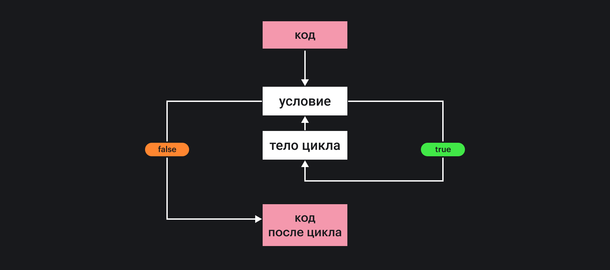
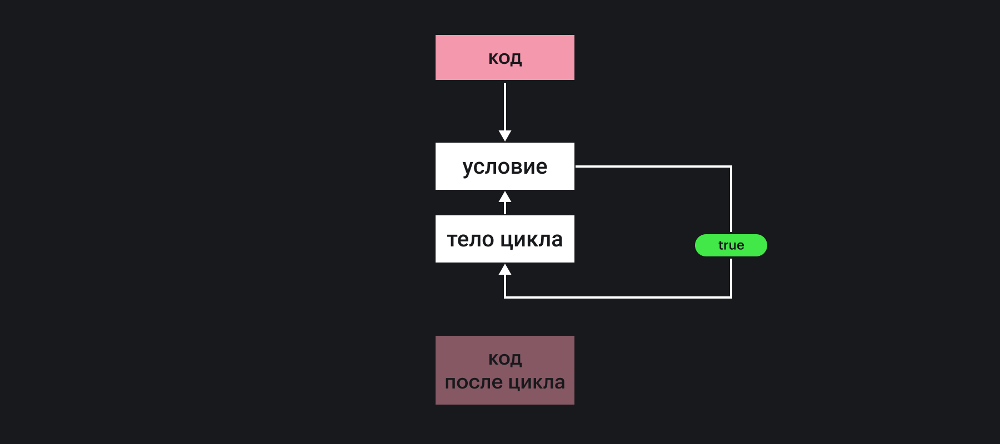

## Кратко

Цикл — это повторяющаяся последовательность действий.

Цикл состоит из _условия_ и _тела цикла_.

Перед запуском цикла проверяется _условие._ Если условие истинное, то выполняется блок кода, который называется _телом цикла._ Затем этот шаг повторяется. Так будет продолжаться, пока условие не станет ложным.

Каждое выполнение тела цикла называется _итерацией_.

JavaScript предоставляет несколько способов создания цикла. Самые распространённые из них — [while](/js/while/) и [for (инициализация; условие; завершающая операция) {}](/js/for/)

## Как понять

Зачем нужны циклы, читайте в статье [Порядок выполнения](/js/execution-order/)


В программировании есть много задач, когда нужно выполнять заранее неизвестное количество однотипных шагов:

- напечатать все сообщения из списка;
- обозначить на карте присланные пользователем координаты;
- уточнять значения при вычислении функций (например, [считать квадратный корень](https://ru.wikipedia.org/wiki/%D0%98%D1%82%D0%B5%D1%80%D0%B0%D1%86%D0%B8%D0%BE%D0%BD%D0%BD%D0%B0%D1%8F_%D1%84%D0%BE%D1%80%D0%BC%D1%83%D0%BB%D0%B0_%D0%93%D0%B5%D1%80%D0%BE%D0%BD%D0%B0)).

До выполнения программы невозможно знать, сколько будет сообщений или сколько раз нужно уточнить значение для точного расчёта квадратного корня. Такие задачи решают циклы.

Циклы выполняют блок кода до тех пор, пока выполняется _условие_. С помощью условия можно управлять, сколько раз выполнять код, который называется _телом цикла_. Например, выполнять код до тех пор, пока все сообщения не будут напечатаны.

Цикл завершается, когда условие перестаёт выполняться. Такого может и не произойти и цикл будет работать бесконечно. Обычно бесконечный цикл — результат ошибки программиста. Программа зависает, так как тело цикла будет выполняться вечно.

Опишем работу цикла словами:

1. проверь, выполняется ли условие.
2. если условие выполняется, выполни тело цикла. Затем вернись в пункт 1.
3. если условие не выполняется, цикл завершён.

Цикл удобно представлять схемой:



### Условие

Нужно хорошо понимать, как работает условие, чтобы уверенно работать с циклами. Условие — это выражение, которое JavaScript вычислит в значение.

В простом случае, условие вычисляется в [логический тип](/js/boolean/): `true`, либо `false`. Такие выражения получаются при использовании операторов сравнения `==`, `===`, `>`, `<`, `>=`, `<=`, `!==`, `!=`.

Например:

```js
let count = 10
while (count > 0) {
  console.log(count)
  count--
}
```

Код напечатает числа от 10 до 1 на экран.

Выражения в условии можно комбинировать с помощью [логических операторов](/js/logic-operators/).

В более сложном случае условие будет вычисляться в какой-либо другой тип: число, строку, массив, объект и т.д. В этом случае JavaScript будет [приводить получившееся значение к логическому типу](/js/typecasting/).

```js
let count = 10

while (count) {
  console.log(count)
  count--
}
```

Чтобы понять, какой когда цикл остановится, нужно запомнить правила приведения различных типов к логическому. Главное правило:

> Все, что не приводится к `false`, будет `true`

Осталось запомнить 8 значений, которые приводятся к `false`:

- `false`
- `0`
- `-0`
- `''`
- `null`
- `undefined`
- `NaN`
- `0n`(тип [BigInt](/js/bigint/))

Зная это правило, мы поймём, что цикл перестанет работать после 10 итераций и напечатает числа от 10 до 1.

### Тело цикла

Тело цикла — это набор инструкций, заключённый в фигурные скобки. Одно выполнение тела называют _итерацией цикла_.

Ограничений на операции в теле цикла нет. Тело может содержать объявление переменных, вызовы функций, другие управляющие конструкции и циклы.

#### Бесконечные циклы

Если условие цикла написано так, что оно никогда не станет ложным, цикл будет выполняться бесконечно.



Такой цикл занимает все выделенные ресурсы компьютера. В итоге вкладка браузера или целая программа зависает.

Нажмите на кнопку «Нажми на меня» и на экране появится сообщение. Если же нажать кнопку «Стартовать бесконечный цикл», то «Нажми на меня» перестанет работать — у системы не будет ресурсов обработать нажатие, потому что все ресурсы займёт бесконечный цикл.

<iframe title="Название — Цикл — Дока" src="demos/Lopinopulos-xxOQLvO/" height="50"></iframe>

К бесконечному циклу могут привести две ошибки:

- неверное условие;
- условие написано верно, но в теле цикла никак не изменяются переменные, которые используются в условии.
