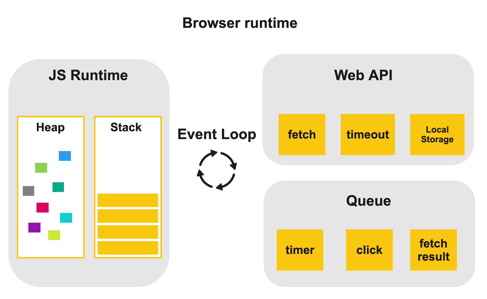
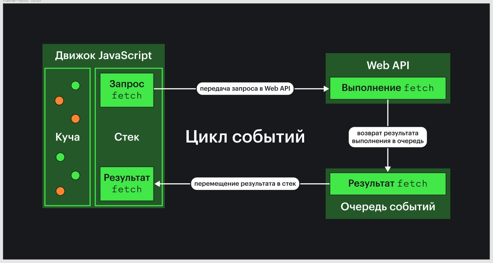

В этой статье мы рассмотрим различия макро- и микрозадач, а также слегка коснёмся рендеринга страницы. Понимание разницы между задачами и их приоритетности помогает создавать более производительные, отзывчивые и надёжные веб-приложения, а ещё эффективно управлять асинхронными операциями и событиями.

## Event loop

Перед тем как начать, давайте вспомним, как функционирует Event loop (цикл событий) в браузере. Он состоит из трёх основных частей.

**Движок JavaScript** — компонент, который выполняет код JavaScript и обеспечивает доступ к Web API, стеку (stack) и куче (heap).

**Стек** — это место, куда попадает наш код, выполняющийся по принципу LIFO (последним вошёл и первым вышел). Давайте рассмотрим на примере:

```javascript
function first() {
  console.log('Выполнение первой функции')

  // Вызов второй функции, добавляется в стек
  second()
  console.log('Возврат в первую функцию после второй')
}

function second() {
  console.log('Выполнение второй функции')

  // Вызов третьей функции, добавляется в стек
  third()
  console.log('Возврат во вторую функцию после третьей')
}

function third() {
  console.log('Выполнение третьей функции')
}

// Начало с первой функции
first()
```

Вот что выведется в консоль:

```javascript
Выполнение первой функции
Выполнение второй функции
Выполнение третьей функции
Возврат во вторую функцию после третьей
Возврат в первую функцию после второй
```

Стек определяет порядок выполнения кода и хранит локальные переменные. Для переменных ссылочного типа на стеке хранится только указатель на данные в куче. Когда функция вызывает другую функцию, контекст первой добавляется в стек, и выполнение передаётся следующей. Когда выполнение завершается, контекст извлекается из стека, и код продолжает выполнение с предыдущей функции.

**Куча** — это область памяти, в которой хранятся ссылочные типы данных.

**Web API** — это интерфейсы браузера, такие как `fetch()`, таймеры и другие функции.

**Очереди задач** — место, где накапливаются задачи, соответствующие различным событиям пользовательского интерфейса и событиям, инициированным Web API. Например, результат выполнения `fetch`.



Event loop работает следующим образом:

1. **Выполнение задач или кода в стеке:** прежде всего цикл событий ждёт, пока стек вызовов не станет пустым.
2. **Проверка очереди событий:** как только стек вызовов опустошён, цикл событий начинает проверять очереди событий. В браузерах существует несколько очередей для разных типов задач, таких как макрозадачи и микрозадачи.
3. **Выбор задачи из очереди:** специальный механизм в браузере определяет, какую задачу из очереди следует выполнить следующей. При выполнении задачи она удаляется из очереди, и код обработки помещается на стек.
    - **Выполнение микрозадач:** цикл событий обработает все микрозадачи до того, как перейдёт к следующей макрозадаче в очереди. После этого шага очередь микрозадач станет пустой;
    - **Переход к следующей макрозадаче:** после того как все микрозадачи выполнены, цикл событий возвращается к выбору и запуску следующей макрозадачи из очереди. Стоит заметить, что, если в процессе выполнения макрозадачи возникают микрозадачи, они получают приоритет. Только после обработки всех микрозадач будет взята в работу одна следующая макрозадача.
4. **Повторение цикла** – бесконечное выполнение шагов цикла событий. Цикл событий постоянно следит за стеком и очередью событий, обеспечивая эффективное выполнение задач.

Посмотрим на схему, чтобы разобраться, как это работает:



1. Сначала мы выполняем запрос, вызывая функцию `fetch()`.
1. Из стека задача помещается в Web API.
1. Браузер выполняет запрос и возвращает результат выполнения в очередь в своём внутреннем представлении.
1. Event loop помещает результат выполнения `fetch` в стек, где его обрабатывает JavaScript-движок.

💡 Обратите внимание: Event loop не является частью движка JavaScript.

## Микрозадачи и макрозадачи

Перед тем, как разбираться с примерами кода, узнаем, что такое микро- и макрозадача.

_Микрозадачи_ (или _микротаски_) — это отложенные задачи, которые имеют приоритет над макрозадачами.

Примеры микрозадач:

- операции с промисами (например, `Promise.then()`, `Promise.catch()`, `fetch()` и так далее);
- операции с очередью мутации (например, используемые в API `MutationObserver` для наблюдения за изменениями DOM);
- операции, связанные с `queueMicrotask()`, — функцией для явного добавления микрозадач.

_Макрозадачи_ (или _макротаски_) — это тоже отложенные задачи, у которых меньший приоритет по сравнению с микрозадачами.

Примеры макрозадач:

- обработка таймеров (`setTimeout`, `setInterval`);
- обработка событий пользовательского ввода (например, клики, скроллинг);
- выполнение AJAX-запросов.

## Асинхронность в браузере

Рассмотрим два вида асинхронного поведения, доступного в браузере.

### Асинхронность WebAPI

Разберём этот вид асинхронности на примере работы функции `fetch()`. Движок JavaScript выполняет код функции `fetch()`. Далее вызов передаётся на сторону Web API, а основной поток браузера продолжает работу. После того как `fetch`-запрос завершится, Web API вернёт результат выполнения в очередь. После результат выполнения подхватит Event loop и обработает JavaScript-движок.

### Асинхронность JavaScript-кода (псевдоасинхронность)

Что произойдёт, если завернуть в промис функцию, которая выполняет цикл от 0 до 1 000 000 000? Правильно, браузер зависнет. Дело в том, что, оборачивая код в промис, мы только просим браузер отложить выполнение этого кода на момент, пока очередь не будет обработана. Оборачивание синхронного кода в `Promise` или его запуск через `queueMickotask` помещают его _почти_ в конец очереди. Почему почти? С этим разберёмся чуть позже.

💡 Есть ли способ выполнить JavaScript-код параллельно с основным потоком? Да! Это возможно с помощью [Web Worker API](/js/web-workers/). Web Worker API можно использовать как для синхронного, так и для асинхронного выполнения кода с гарантией того, что основной поток никогда не будет заблокирован кодом воркера.

## Примеры макрозадач

Макрозадачи включают в себя задачи, связанные с таймерами (`setTimeout`, `setInterval`), и запланированные на выполнение одна за другой.

```javascript
console.log('Начало')

setTimeout(() => {
  console.log('Макрозадача выполнена')
}, 0)

console.log('Конец')
```

В этом примере порядок вывода такой:

```javascript
Начало
Конец
Макрозадача выполнена
```

Даже если задержка `setTimeout` равна нулю миллисекунд, колбэк не выполняется немедленно. Он будет запланирован как макрозадача и согласно приоритету выполнения: сначала будут обработаны задачи в стэке, далее микрозадачи и только после них будет выполнена макрозадача, в нашем случае, `setTimeout`.

## Примеры микрозадач

Микрозадачи включают в себя промисы (promises) и обработчики, связанные с ними.

```javascript
console.log('Начало')

Promise.resolve().then(() => {
  console.log('Микрозадача выполнена')
})

console.log('Конец')
```

Здесь порядок выполнения такой:

```javascript
Начало
Конец
Микрозадача выполнена
```

Поскольку микрозадачи имеют более высокий приоритет, чем макрозадачи, колбэк из промиса выполняется сразу после завершения текущего цикла выполнения, но перед следующим циклом событий. Это работает таким образом, даже если в Event loop уже есть макрозадачи.

## Комбинированный пример: микро- плюс макрозадача

Рассмотрим комбинированный пример, который включает в себя и микрозадачи, и макрозадачи:

```javascript
console.log('Начало')

setTimeout(() => {
  console.log('Макрозадача выполнена')
}, 0)

Promise.resolve().then(() => {
  console.log('Микрозадача выполнена')
})

Promise.resolve().then(() => {
  console.log('Микрозадача выполнена 2')
})

console.log('Конец')
```

Порядок выполнения будет следующим:

```javascript
Начало
Конец
Микрозадача выполнена
Микрозадача выполнена 2
Макрозадача выполнена
```

Этот пример показывает, что микрозадачи (здесь — промисы) выполняются перед макрозадачами (здесь — таймеры), даже если они были запланированы в коде позже. Это подчёркивает их приоритетность в Event loop. Обратите внимание на приоритеты. Сначала будут выполнены _все_ микрозадачи, а потом — _одна_ макрозадача.

## Асинхронность при рендеринге страницы

Мы опустили детали, когда упомянули, что после всех микрозадач выполняется одна макрозадача. На самом деле, после микрозадач может произойти рендеринг страницы. Если вы используете `requestAnimationFrame`, вызовы могут выполняться до того, как начнётся выполнение макрозадачи. Браузер старается вставить `requestAnimationFrame` в ближайший рендеринг. Все вызовы `requestAnimationFrame` происходят примерно каждые 16–67 миллисекунд, но _строго_ после завершения всех микрозадач. Давайте разберём на примере ниже:

```javascript
console.log('Синхронный старт')

// макрозадача с setTimeout
setTimeout(() => {
  console.log('Макрозадача 1: setTimeout')
}, 0)

// Макрозадача с setTimeout
setTimeout(() => {
  console.log('Макрозадача 2: setTimeout')
}, 0)

// Микрозадача с Promise
Promise.resolve()
  .then(() => {
    console.log('Микрозадача 1: выполнение первого промиса')
  })
  .then(() => {
    console.log('Микрозадача 2: выполнение второго промиса')
  })

requestAnimationFrame(() => {
  console.log('Первый requestAnimationFrame: обновление анимации')
})

requestAnimationFrame(() => {
  console.log('Второй requestAnimationFrame: обновление анимации')
})

console.log('Синхронный конец')
```

Порядок вывода:

```javascript
Синхронный старт
Синхронный конец
Микрозадача 1: выполнение первого промиса
Микрозадача 2: выполнение второго промиса
Первый requestAnimationFrame: обновление анимации
Второй requestAnimationFrame: обновление анимации
Макрозадача 1: setTimeout
Макрозадача 2: setTimeout
```

Нам повезло, и requestAnimationFrame-вызовы выполнились перед макрозадачами. Если мы выполним этот код ещё раз, порядок requestAnimationFrame и микрозадачи могут поменяться местами.

## Пример макрозадач, создающих микрозадачи

```javascript
console.log('Начало скрипта')

setTimeout(() => {
  console.log('Макрозадача: setTimeout')

  // Микрозадача, созданная внутри макрозадачи
  Promise.resolve().then(() => {
    console.log('Микрозадача: обработка промиса внутри setTimeout')
  })

  Promise.resolve().then(() => {
    console.log('Микрозадача: обработка промиса внутри setTimeout 2')
  })
}, 0)

setTimeout(() => {
  console.log('Макрозадача: setTimeout 2')
}, 0)

Promise.resolve().then(() => {
  console.log('Микрозадача: обработка первого промиса')
})

console.log('Конец скрипта')
```

Последовательность вывода будет следующей:

```javascript
Начало скрипта
Конец скрипта
Микрозадача: обработка первого промиса
Макрозадача: setTimeout
Микрозадача: обработка промиса внутри setTimeout
Микрозадача: обработка промиса внутри setTimeout 2
Макрозадача: setTimeout 2
```

Обратите внимание на ситуацию, когда микрозадача создаётся в макрозадаче. Пока макрозадача не выполнит свой колбэк, браузер не узнает о том, что внутри есть микрозадача. Если в списке задач есть макрозадачи, которые ожидают обработки, а в процессе выполнения одной из макрозадач появились микрозадачи, выполнение оставшихся макрозадач отложится. Это продлится до тех пор, пока все микрозадачи не завершатся, даже если они появились после макрозадач.

## Контексты цикла событий

В этом разделе рассмотрим изолированные контексты с собственными циклами обработки событий: основная страница браузера, [`<iframe>`](/html/iframe/) и Web Worker. Каждый из элементов обладает уникальным циклом событий, который не пересекается с другими. С Web Worker всё довольно прямолинейно. Сначала задача отправляется в Worker, и процесс обработки происходит независимо от основного потока браузера.

Ситуация с `<iframe>` сложнее. Хотя `<iframe>` и обладает собственным циклом событий, у него нет отдельного потока выполнения. Однако это не означает, что основная вкладка браузера зависнет из-за затратной задачи. Зависнет только `<iframe>`, а вкладка продолжит работу, хотя браузер будет уведомлять пользователя о проблеме.

## Философия микро- и макрозадач

До 2015 года стандарт не подразумевал микрозадачи, до 2014 не подразумевал и Web Worker, а `requestAnimationFrame` появился только в 2011. Разработчикам приходилось довольствоваться асинхронностью, основанной на макрозадачах или Timer API. В итоге сетап был такой: ни макрозадач, ни `requestAnimationFrame`, ни Web Worker, и никакого праздника.

Представим ситуацию, когда нужно посчитать что-то сложное на клиенте или, например, вы создаёте кастомные анимации, которые невозможно сделать через CSS. При этом окно браузера не должно блокироваться, а задача должна выполняться. В браузере нет многопоточности, есть только однопоточный Event loop. Как мы можем выйти из ситуации? Правильно, разбить задачу на много подзадачек и выполнить их, постепенно освобождая процесс для рендеринга, событий и запросов.

Рассмотрим пример:

```javascript
function processArrayInChunks(array, chunkProcessingTime) {
  let index = 0
  const startTime = Date.now()

  function processChunk() {
    const chunkStartTime = Date.now()

    while (index < array.length && (Date.now() - chunkStartTime < chunkProcessingTime)) {
      // Пример обработки: увеличиваем каждый элемент массива на 1
      array[index] += 1
      index++
    }

    if (index < array.length) {
      console.log(`Processed ${index} elements so far...`)
      // Запланировать следующий чанк сразу после текущего
      setTimeout(processChunk, 1000)
    } else {
      console.log(`Completed processing ${array.length} elements in ${Date.now() - startTime} ms`)
    }
  }

  processChunk()
}

// Создаём большой массив
const largeArray = new Array(1000000).fill(0)

// Запускаем обработку массива, ограничивая время выполнения подзадачи 17 миллисекундами
processArrayInChunks(largeArray, 17)
```

Что здесь происходит?

- `processArrayInChunks` принимает массив и время обработки каждой подзадачи. Она инициирует процесс разделения задачи на части.
- `processChunk` вызывается рекурсивно через `setTimeout`. Она обрабатывает часть массива за раз, ограничивая время выполнения заданной длительностью (`chunkProcessingTime` ).
- Условие выхода из цикла определяется, когда текущий индекс достигает конца массива. После завершения выводится общее время обработки.

💡 Чтобы замедлить выполнение задачи, пришлось запустить `setTimeout` с интервалом в секунду.

Благодаря особенности с выполнением одной макрозадачей за раз, фоновая задача не блокирует страницу.

Такая же логика применяется к браузерным событиям. Разработчик подписывается на событие, и очевидно, что он изменяет состояние DOM. После изменений процесс браузера освободится, например, случится рендеринг, и дальше он возьмёт следующую макрозадачу.

💡 Кстати, браузерные UI-события — это не что иное, как макрозадачи.

Давайте подведём промежуточный итог. Макрозадачи — это механизм браузера, предназначенный для «ручного» неблокирующего выполнения _больших_ задач. Говоря больших, имеем в виду, что берём большую задачу и разбиваем её на мелкие подзадачи.

Теперь настаёт очередь метода `requestAnimationFrame`. Он призван оптимизировать рендеринг и избавить разработчиков от выполнения кастомных сложных анимаций с помощью Timer API. Основная идея тут в том, что попросим браузер запланировать визуальное изменение в ближайшем кадре. Не конкретно одно изменение, а все `requestAnimationFrame`, которые возможно выполнить в следующем кадре. Давайте рассмотрим на примере:

```javascript
let lastTimestamp = Date.now()

function heavyTask() {
  const start = Date.now()

  const workloadPeriod = Math.random() * 10

  while (Date.now() - start < workloadPeriod) {
    // Искусственная загрузка
  }
  console.log('Тяжёлая задача завершена!')
}

let frame = 0
const runFrame = () => {
  frame++
  console.log('кадр', frame, Date.now() - lastTimestamp)

  lastTimestamp = Date.now()

  if (frame < 10) {
    requestAnimationFrame(runFrame)
  }
}

requestAnimationFrame(runFrame)

for (let i = 0; i < 50; i++) {
  setTimeout(() => {
    requestAnimationFrame(() => {
      console.log('requestAnimationFrame из макрозадачи', Date.now() - lastTimestamp)
    })
    heavyTask()
  }, 0)
}
```

Проясним, что делает код. Мы запускаем `requestAnimationFrame`, который не загружен, для лога кадров. Ожидается, что он выполняется каждые 17 миллисекунд. Далее, через цикл, создаём 50 макрозадач, которые останавливают цикл событий на отрезке от 0 до 10 миллисекунд. Также выводим в консоль номер кадра и отслеживаем разницу с предыдущим. Этот пример демонстрирует, как браузер планирует выполнение `requestAnimationFrame`.

В консоли браузера увидим примерно следующее:

- `кадр 1` — `requestAnimationFrame` обработан через 2 миллисекунды после начала выполнения кода;
- `Тяжёлая задача завершена!` — выполнено 15 макрозадач;
- `кадр 2` — с последнего `requestAnimationFrame` прошло 104 миллисекунд;
- `requestAnimationFrame из макрозадачи`— вызвано 15 `requestAnimationFrame` c интервалом в 0 миллисекунд;
- `Тяжёлая задача завершена!` — выполнено 18 макрозадач;
- `кадр 3` — с последнего `requestAnimationFrame` прошло 105 миллисекунд;
- `requestAnimationFrame из макрозадачи` — вызвано 18 `requestAnimationFrame` c интервалом в 0 миллисекунд;
- `Тяжёлая задача завершена!` — выполнено 16 макрозадач;
- `кадр 4` — с последнего `requestAnimationFrame` прошло 102 миллисекунды;
- `requestAnimationFrame из макрозадачи` — вызвано 16 `requestAnimationFrame` c интервалом в 0 миллисекунд;
- `Тяжёлая задача завершена!` — выполнено 19 макрозадач;
- `кадр 5` — с последнего `requestAnimationFrame` прошло 102 миллисекунды;
- `requestAnimationFrame из макрозадачи`— вызвано 19 `requestAnimationFrame` c интервалом в 0 миллисекунд;
- `Тяжёлая задача завершена!` — выполнено 20 макрозадач;
- `кадр 6` — с последнего `requestAnimationFrame` прошло 104 миллисекунды;
- `requestAnimationFrame из макрозадачи` — вызвано 20 `requestAnimationFrame` c интервалом в 0 миллисекунд;
- `Тяжёлая задача завершена!` — выполнено 12 макрозадач;
- `кадр 7` — с последнего `requestAnimationFrame` прошло 64 миллисекунды;
- `requestAnimationFrame из макрозадачи` — вызвано 12 `requestAnimationFrame` c интервалом в 0 миллисекунд;
- `кадр 8` — с последнего `requestAnimationFrame` прошло 0 миллисекунд;
- `кадр 9` — с последнего `requestAnimationFrame` прошло 13 миллисекунд;
- `кадр 10` — с последнего `requestAnimationFrame` прошло 17 миллисекунд.

Давайте разберём вывод в консоли. Каждый `setTimeout` вызывает `requestAnimationFrame` и тяжёлую задачу, блокирующую цикл событий. Как только браузер понимает что накопилось достаточно `requestAnimationFrame` для выполнения рендеринга, он пытается применить изменения, которые были запрошены через `requestAnimationFrame` из `setTimeout`. Судя по логу, у браузера получилось выполнить 15–20 микрозадач перед тем, как выполнить запросы `requestAnimationFrame`. В среднем браузер планировал накопившиеся вызовы `requestAnimationFrame` каждые 100 миллисекунд.

Какой вывод можно сделать? Во-первых, браузер стремится выполнить `requestAnimationFrame` в ближайший кадр (каждые 17 миллисекунд). Во-вторых, браузер планирует как можно больше задач перед следующими вызовами `requestAnimationFrame` и старается положить в один кадр как можно больше вызовов `requestAnimationFrame`, инициированные макрозадачами.

Пример иллюстрирует базовые аспекты взаимодействия браузера с `requestAnimationFrame`. На практике вызовы `requestAnimationFrame` включают операции, влияющие на DOM и потребляющие ресурсы процессора. Это может привести к тому, что браузер постарается объединить несколько изменений в один рендеринговый цикл и отложить изменения DOM до следующего кадра для оптимизации производительности.

Дальше, после `requestAnimationFrame`, в стандарте появляются микрозадачи. Они предназначены для оптимизации браузерного рендеринга и собирают _как можно больше_ изменений состояния приложения. Эти состояния сначала повлияют на DOM, а потом выполнится рендеринг. Дело в том, что процесс рендеринга — дорогая и сложная операция для браузера. Разработчики активно пытаются оптимизировать рендеринг, поэтому в стандарте появляются дополнительные возможности событийного цикла, например, `requestAnimationFrame` и концепция микрозадач.

Запустим этот код и докажем, что рендеринг выполнится после выполнения всех макрозадач.

```javascript
Promise.resolve('Данные загружены').then((message) => {
  console.log(message)
  requestAnimationFrame((timestamp) => {
    console.log('Анимация для:',message, timestamp)
  })
})

Promise.resolve('Настройки загружены').then((message) => {
  console.log(message)
  requestAnimationFrame((timestamp) => {
    console.log('Анимация для:',message, timestamp)
  })
})

Promise.resolve('Данные пользователя загружены').then((message) => {
  console.log(message)
  requestAnimationFrame((timestamp) => {
    console.log('Анимация для:' ,message, timestamp)
  })
})
```

Вывод будет таким:

```javascript
Данные загружены
Настройки загружены
Данные пользователя загружены
Анимация для: Данные загружены 9516312.2
Анимация для: Настройки загружены 9516312.2
Анимация для: Данные пользователя загружены 9516312.2
```

Можно заметить, все вызовы requestAnimationFrame выполнились после микрозадач, и у них одинаковый `timestamp`. Это говорит о том, что _в нашем случае_ браузер запланировал анимацию (сопутствующие изменения в DOM) в ближайший цикл обновления страницы.

Ещё раз подсветим различия между микро- и макрозадачами:

- браузер выполняет все микрозадачи подряд, а потом переходит к рендерингу и одной макрозадаче;
- микрозадачи выполняются без каких либо задержек, как, например, это может происходить у Timer API (минимальная задержка в 4 миллисекунды);
- принцип выполнения макрозадач — одна занимающая процесс макрозадача, после её выполнения событийный цикл должен быть разблокирован для других задач. Только после этого будет взята следующая макрозадача если конечно же она есть;
- у микрозадач гарантированный порядок исполнения. То есть, если где-то в коде отложите задачи с помощью микрозадач, они будут выполнены только в порядке создания. У вас может возникнуть вопрос: а что с Fetch API? `fetch` — это же промис, значит, микрозадача. Он должен выполняться согласно порядку вызова микрозадач! Когда используете `fetch` для выполнения HTTP-запроса, он работает асинхронно, возвращая промис. Этот промис сам по себе не микрозадача, но он будет добавлен в очередь микрозадач после того, как запрос завершится. Будет получен результат или запрос завершится с ошибкой.

```javascript
console.log('Начало скрипта')

// Асинхронный запрос через fetch
fetch('https://jsonplaceholder.typicode.com/todos/1')
  .then(response => response.json())
  .then(data => {
    console.log('Данные получены:', data)
  })
  .catch(error => {
    console.error('Ошибка при запросе:', error)
  })

  // Добавление микрозадачи
  queueMicrotask(() => {
    console.log('Выполнение микрозадачи')
  })

  // Установка таймера с задержкой 0 миллисекунд
  setTimeout(() => {
    console.log('Выполнение макрозадачи (setTimeout)')
  }, 0)

  console.log('Конец скрипта')
```

Порядок вывода:

```javascript
Начало скрипта
Конец скрипта
Вызов fetch
Выполнение микрозадачи (queueMicrotask)
Выполнение макрозадачи (setTimeout)
Микрозадача then(response => response.json())
Микрозадача then(data => ...)
Микрозадача catch(error => ...)
```

Заметим что, несмотря на вызов `fetch` раньше макрозадачи, результат запроса обработан только после выполнения задачи.
