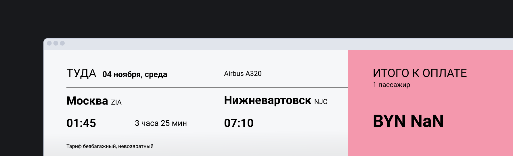

🛠 При анализе ввода пользователя всегда нужно проверять результаты вычислений, иначе пользователь вместо расчёта — например «Итого» в корзине увидит непонятные для себя символы. Вот, к примеру, очень приятная цена ✈️

Попробуйте имитировать ошибку и ввести в поле что-то помимо числа скидки, без проверки тоже получится `NaN`:

<iframe title="Калькулятор скидки — Number.isNaN() — Дока" src="../demos/index/" height="430"></iframe>
