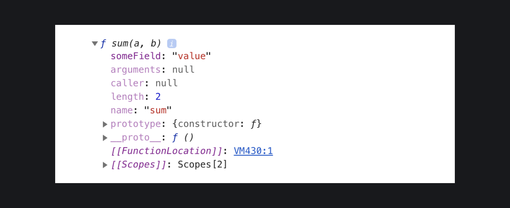
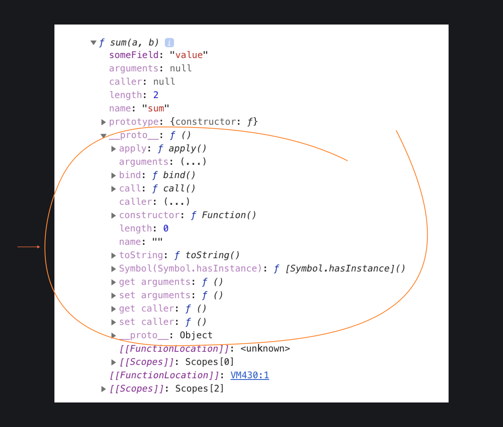
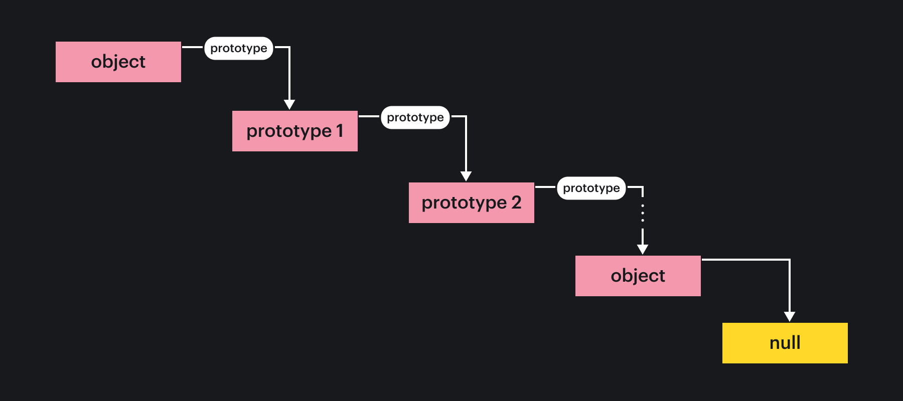

## Кратко

В JavaScript объект является прародителем всех других сущностей. Все типы данных и структуры, кроме примитивных, являются потомками объекта. По этой причине абсолютно у всех наследников объекта имеется набор общих методов: `toString()`, `valueOf()` и др.

## Как понять

### Массивы и функции

[Объект](/js/object/) — это сущность с набором свойств. Мы можем добавлять, менять и удалять эти свойства.

```javascript
const programmer = { name: 'John', level: 'Junior' }

programmer.mainLanguage = 'JavaScript'
delete programmer.level

console.dir(programmer)
```


<aside>

🛠 `console.dir()` — это функция, которая отображает любой объект в виде иерархического дерева. Полезно, когда нужно провести анализ прототипов.

</aside>

Если взглянуть на массив, то у него тоже есть набор свойств, но свой. Например, у массива есть длина, есть методы для работы с ним. Обращение к элементу массива по индексу, как можно заметить, это очень похоже на обращение к полю объекта с помощью квадратных скобок.

```javascript
const shows = ['Breakind Bad', 'The Office', 'Silicon Valley']

shows.length // свойство массива

shows[1] // получить элемент массива, аналогично как у объекта shows['1']
```

Аналогичная ситуация с функциями — у них тоже есть набор свойств, который можно увидеть, выведя информацию о ней в консоль.

```javascript
function sum(a, b) {
  return a + b
}

sum.arguments // можно вызвать свойство функции
sum.someField = 'value' // можно присвоить значение в поле

console.dir(sum)
```

В выводе есть и свойство `someField`, которое мы присвоили, и набор встроенных свойств и методов.



Такая структура массивов и функций очень похожа на структуру объектов. Но на самом деле это и есть объекты, и в этом можно легко убедиться.

Давайте посмотрим на свойство `__proto__` у функции `sum()`, описанной выше.

Свойство `__proto__` является [устаревшим (deprecated](https://developer.mozilla.org/en-US/docs/Web/JavaScript/Reference/Global_Objects/Object/proto)), не используйте его в коде, особенно для того, чтобы самостоятельно устанавливать прототип.



Если посмотреть свойство прототипа, то можно заметить, что прототипом текущего прототипа является объект. Заглянув в этот прототип, можно увидеть такую картину:


В этой цепочке следующего прототипа уже нет, а это значит, что мы дошли до самого конца цепочки, т.е нашли прародителя. Если подобным образом вывести в консоль любой массив, то спускаясь ниже по цепочке прототипов, в конце обязательно будет именно прототип объекта. Любая сущность в JavaScript наследуется от объекта.



### Примитивы

В JavaScript существуют примитивные типы данных, такие как строки, числа или булевы значения. При работе со строкой можно обнаружить, что у неё тоже есть свойства и методы, к которым можно обратиться.

```javascript
const show = 'Breaking Bad'

console.log(show.length)
// 12
console.log(show.charAt(1))
// 'r'
console.log(show.toUpperCase())
// 'BREAKING BAD'
```

Но строка является примитивным типом данных, откуда же у неё поведение как у объекта? Когда происходит обращение к какому-то свойству или методу у примитива, происходит автоматическая обёртка (`autoboxing`) в специальный конструктор для примитива, который является наследником объекта. Для строки это будет функция `String()`. У этого объекта есть свойства и методы, которые и вызываются.

```javascript
const pet = 'dog'
const pet2 = new String('dog') // будет создан объект

console.log(pet === pet2)
// false, потому что в pet2 находится объект

console.dir(pet2)
/* Выведет
{
  0: "d",
  1: "o",
  2: "g",
  length: 3
}
*/
```

Для других типов данных есть аналогичные функции: `Number()` для чисел, `Boolean()` для булевых значений. Все эти функции так же являются наследниками объекта.

Главное отличие между объектами (массивами, функциями) и примитивами в том, что примитивы **неизменяемые**. Попытка изменения или добавления свойств к примитиву ничего не сделает.

```javascript
const cat = 'Boris'

cat.color = 'red' // свойство не добавится
delete color.length // также ничего не изменится

const cats = ['Boris', 'Vasya', 'Murzik']
cats.length = 5 // теперь массив стал длинной в 5 элементов
cats.someField = 'value' // добавилось поле

console.dir(cats)
/*
{
  0: "Boris",
  1: "Vasya",
  2: "Murzik",
  someField: "value",
  length: 5
}
*/
```
Но не стоит путать примитив и объект, созданный через конструктор для примитива:

```js
const cat = new String('Boris')
cat.color = 'black'
// добавится, так как в cat лежит объект, а не строка
```

## Как пишется

У объектов и массивов поля и методы можно вызывать всегда: и через переменную, и инлайн (inline), т.е без использования переменной.

```javascript
const array = [1, 2, 3, 4]
console.log(array[1])
// 2
const pos = 3
console.log(array[pos])
// 4

console.log(array.map(a => a + 1))
// [2, 3, 4, 5]
const f = 'map'
console.log(array[f](a => a + 1))
// [2, 3, 4, 5]

const obj = { name: 'Boris', color: 'red' }
console.log(obj.color)
// 'red'
console.log(obj['name']);
// 'Boris'

const age = Object.assign(obj, {
  name: 'Vasya',
  age: 30
}).age
console.log(age)
// 30
```

Почти у всех примитивов без переменной тоже можно обращаться к методам:

```js
true.toString()
// 'true'

Infinity.toString()
// 'Infinity'

'hello world'.toString()
// 'hello world'

Symbol('tag').toString()
// 'Symbol(tag)'

9007199254740991n.toString()
// '9007199254740991'
```

Правда, в случае с числами можно получить синтаксическую ошибку, потому что точка воспринимается как часть самого числа:

```js
42.toString()
// Uncaught SyntaxError: Invalid or unexpected token
```

Чтобы этого избежать, можно использовать две точки, взять выражение в скобки или вызвать обёртку примитивного типа:

```js
42..toString()
// '42'

(42).toString()
// '42'

Number(42).toString()
// '42'
```

Вызов методов или свойств не сработает у [`null`](/js/null-primitive/) и [`undefined`](/js/undefined/):

```js
null.toString()
// Uncaught TypeError: Cannot read property 'toString' of null

null.valueOf()
// Uncaught TypeError: Cannot read property 'valueOf' of null

null.length
// Uncaught TypeError: Cannot read property 'length' of null

undefined.toString()
// Uncaught TypeError: Cannot read property 'toString' of undefined

undefined.valueOf()
// Uncaught TypeError: Cannot read property 'valueOf' of undefined

undefined.length
// Uncaught TypeError: Cannot read property 'length' of undefined
```
