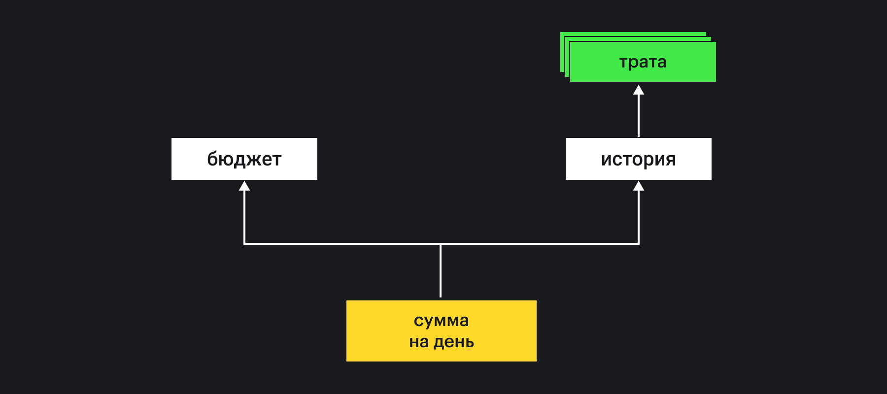

## Кратко

Программировать — сложно.

Хороший код адекватно отражает систему, которую описывает, он устойчив к изменениям в этой системе. Плохой код запутанный, хрупкий и непонятный — он замедляет разработку.

Код становится плохим, когда он перестаёт соответствовать реальности — бизнес-логике, правилам поведения частей системы, их отношениям друг с другом. Бизнес-логика — это территория. Код — [карта](https://www.lesswrong.com/tag/the-map-is-not-the-territory) этой территории. Чем точнее карта, тем проще справляться с изменениями в требованиях и даже предвидеть их.

Объектно-ориентированное программирование — одна из парадигм, которые помогают спроектировать программу так, чтобы она верно отражала эти правила и была устойчивой к изменениям.

<aside>

📚 Прочитайте [обзор парадигм программирования](/js/programming-paradigms/), чтобы узнать про альтернативные подходы и разницу в декларативном и императивном стилях.

</aside>

Работа над любой программой, как правило, начинается с определения цели — что эта программа будет делать; и проектирования — как мы хотим достичь этой цели.

По ходу этой статьи мы попробуем создать клон приложения [«Тяжеловато»](https://www.fuckgrechka.ru/tzlvt/), используя принципы объектно-ориентированного программирования. (Пусть этот клон называется... «Трудновато».)


Пользователь указывает сумму, которая у него или неё есть, и количество дней, на которое эта сумма рассчитана. Приложение показывает, сколько можно тратить в день.


Каждая трата уменьшает сумму на день и попадает в историю расходов.


В истории хранится список совершённых трат.

Цель приложения — помочь пользователям сэкономить деньги. Мы будем отталкиваться от этой цели, чтобы определить, как оно будет работать изнутри — то есть спроектируем систему.

## Проектирование

Сухим академическим языком _[проектирование](/js/architecture-and-design-patterns/)_ — это «определение внутренних свойств системы и детализация её внешних (видимых) данных» 🤨

На деле это значит, что, проектируя систему, мы определяем как минимум две вещи:

- как программа должна общаться с внешним миром;
- как части программы должны общаться между собой.

Общение с внешним миром происходит через данные. Мы их где-то сохраняем, откуда-то получаем. Чтобы программа могла с этими данными работать, она должна знать, как их обрабатывать и как их сохранять, чтобы общение происходило без ошибок.

Внутреннее устройство влияет на то, как данные извне будут использоваться и преобразовываться внутри. Как одна часть программы будет «разговаривать» с другими, что они друг другу будут пересылать.

Части программы, которые могут общаться друг с другом, называются сущностями (_entity_).

### Сущности

Сущности в программе — главные действующие лица. Они определяют общение, какие данные и как будут использоваться.

Считается, что сущности и их взаимодействие отражают _бизнес-логику_ — то есть наборы правил из предметной области, которую отражает программа.

Если мы пишем калькулятор, то бизнес-логика — это правила математики, то какие действия и над какими числами разрешены и к каким результатам они приводят.

В случае с нашим приложением сущностями могут быть «Бюджет», «История трат» и непосредственно «Трата».

### Отношения между сущностями

Их ещё называют _связи_ — то, как сущности в программе соотносятся друг с другом.

В случае с «Трудновато» отношения между сущностями можно было бы изобразить так:

- бюджет содержит сумму и срок, на который эта сумма рассчитана;
- каждая трата содержит количество денег, которое отнимается от бюджета;
- история содержит в себе список трат;
- из истории и бюджета получается сумма, которую можно тратить в день.



Направление стрелок обычно указывает, какая сущность от какой зависит. Например, здесь История зависит от Трат, поэтому и стрелка указывает на Траты.

Для создания подобных диаграмм используются разные инструменты, на чаще всего — [UML (Unified Modeling Language)](https://ru.wikipedia.org/wiki/UML).

Такая диаграмма отношений говорит нам, что из нескольких Трат получается История, которая вместе с Бюджетом помогает рассчитать Сумму на день.

Это основа бизнес-логики приложения — то есть сущностей и правил, по которым эти сущности живут.

## Выражение в коде

После того, как система спроектирована, можно приступать к написанию кода.

Когда мы работаем в парадигме ООП, наши сущности представляются в коде _объектами_. Каждый объект может посылать и принимать сообщения, а также реагировать на них.

Давайте посмотрим, как, например, может выглядеть объект Траты:

```js
const spending = {
  // Он включает в себя количество потраченных денег:
  amount: 100,

  // ...и время, когда была совершена трата.
  dateTime: Date.now(),
}
```

История по сути — это список Трат. Хочется сделать её просто массивом, но нам следует сделать её тоже объектом, чуть позже мы увидим, почему.

```js
const history = {
  // Список Трат мы будем хранить
  // в поле records объекта Истории:
  records: [spending],
}
```

Бюджет же мы пока можем представить как сумму, дату старта и количество дней:

```js
const budget = {
  amount: 10000,
  startDate: Date.now(),
  daysCount: 10,
}
```

### Несколько однотипных объектов

На каждую трату, которую вводит пользователь, нам надо создать новый объект Траты.

```js
const spending1 = {
  /*...*/
}
const spending2 = {
  /*...*/
}
const spending3 = {
  /*...*/
}
```

Делать это руками неудобно.

1. Слишком просто ошибиться и опечататься в каком-то поле;
2. Делать одинаковые операции руками — дурной тон.

Мы можем написать функцию, которая будет создавать такие объекты — фабрику.

### Фабрика

Фабрика — это такой приём, когда мы используем нечто для создания однотипных объектов.

По-умному это называется шаблоном проектирования.

В нашем случае функция-фабрика будет создавать объекты Трат:

```js
// Количество денег мы заранее предсказать не можем,
// поэтому оно должно быть аргументом функции.
function createSpending(amount) {
  return {
    // А вот создать дату без участия извне —
    // это пожалуйста:
    dateTime: Date.now(),

    // Количество же мы просто передаём, как есть:
    amount,
  }
}

// Теперь создание Траты —
// это всегда вызов функции:
const spending1 = createSpending(250)
const spending2 = createSpending(100)
```

В целом такой подход вполне рабочий. В случае с небольшими объектами он прост для понимания, и его может быть достаточно. Но давайте попробуем продвинуться чуть дальше и написать функциональность для добавления Траты в Историю.

### Добавление Траты в Историю

Вспомним, как выглядит наша История:

```js
const history = {
  records: [spending],
}
```

Мы не зря сделали её объектом, а не простым массивом. На первый взгляд кажется, что массив подойдёт лучше: ведь История — это _список_ Трат.

Однако хорошим тоном считается, чтобы _сущности знали друг о друге как можно меньше_. Это значит, что только История должна знать, каким образом добавить в себя новую Трату.

Если бы мы сделали Историю простым массивом, то знание о том, как добавить новую трату, пришлось бы держать где-то ещё.

```js
// Если История — это массив:
const history = [spending1]

// ...то знание о том, как добавлять Траты,
// утекает куда-то вовне:
function addRecord(record) {
  history.push(record)
}
```

Лучше держать знания о сущностях внутри самой сущности (или её модуля):

```js
const history = {
  records: [spending1],

  // Теперь знание о том, как добавлять Трату,
  // содержится внутри Истории.
  addRecord(record) {
    history.records.push(record)
  },
}
```

Такой подход избавляет нас от необходимости переписывать всю программу, если мы вдруг захотим изменить структуру Истории.

Принцип, при котором знания о сущности хранятся в модуле этой сущности, называется _инкапсуляцией_.

Окей, с этим разобрались, но возникает ещё одна проблема — что, если История не одна? Вдруг у нас в приложении можно заводить несколько счетов, и у каждого История своя?

```js
const history = {
  // ...

  // Проблема вот тут:
  addRecord(record) {
    // Как нам быть уверенными, что эта операция
    // добавит запись именно в нужную Историю?
    history.records.push(record)
  },
}
```

Хотелось бы как-то уметь ссылаться на «собственный объект», чтобы обновить записи именно в нём. На самом деле эту проблему уже решили, и решение — классы.

### Классы

Классы в JS — это синтаксический сахар над прототипным наследованием. Чтобы в деталях изучить тонкости его работы, советуем прочитать [статью о контексте выполнения в JavaScript](/js/function-context/).

_Класс_ — это схема создания и работы какого-то объекта. Типа как абстрактный чертёж, по которому строится конкретный дом.

В классе указываются поля и методы, которыми будут обладать созданные по нему объекты.

Поля и методы класса — как свойства у объекта. Поля отвечают за данные, а методы — за действия.

Например, класс Истории может выглядеть так:

```js
class History {
  // Список Трат мы будем хранить в *поле* класса:
  records = []

  // А добавление записи — в *методе*:
  addRecord(record) {
    // Заметьте, что теперь мы ссылаемся на this.records —
    // то есть на список Трат в одной определённой Истории:
    this.records.push(record)
  }
}

const history1 = new History()
history1.addRecord(record)
// Добавит Трату в history1.

const history2 = new History()
history2.addRecord(record)
// Добавит Трату в history2.
```

Классом же мы можем представить и Трату:

```js
class Record {
  // Конструктор — это специальный метод,
  // который вызывается при создании объекта.
  constructor(amount) {
    this.amount = amount
    this.dateTime = Date.now()
  }
}

// Когда мы создаём объект с помощью new,
// создаётся новый объект (экземпляр класса),
// в этот момент вызывается constructor():
const spending = new Record(100)

// В этом случае мы при создании указываем значения
// для полей this.amount и this.dateTime.

// Конструктор может принимать аргументы
// и потом как-то их использовать.
// В нашем случае мы используем аргумент,
// чтобы узнать, какое количество денег будет потрачено.
```

Самое крутое, что `spending` можно использовать как обычный объект, то есть:

```js
console.log(spending.amount)
// 100
console.log(spending.dateTime)
// 1604565329555 (timestamp)
```

А значит, что такие объекты можно смело передавать в Историю:

```js
const spending = new Record(100)

const history = new History()
history.addRecord(spending)
```

### Классы остальных сущностей

Давайте для полноты картины добавим класс для бюджета:

```js
class Budget {
  constructor(amount, daysCount) {
    this.amount = amount
    this.startDate = Date.now()
    this.daysCount = daysCount
  }
}
```

Для суммы на день нам придётся немного подумать. Поведение этого класса будет зависеть от двух других: Истории и Бюджета. Такие классы, от которых зависит поведение другого, называются зависимостями.

Есть несколько стратегий работы с зависимостями, но одной из самых популярных и удобных считается _внедрение зависимостей_.

Само по себе внедрение зависимостей заслуживает [отдельной статьи](https://bespoyasov.ru/blog/di-ts-in-practice/). Мы с вами сосредоточимся на простом ручном внедрении через конструктор.

```js
class DailyAmount {
  // Как аргументы конструктора мы указываем
  // экземпляры Бюджета и Истории,
  // с которыми собираемся работать.
  constructor(budget, history) {
    // Сохраняем ссылки на эти объекты в поля класса,
    // чтобы потом удобно к ним обращаться.
    this.budget = budget
    this.history = history
  }
}

// Тогда мы будем создавать экземпляр этого класса так:
const budget = new Budget(10000, 10)
const history = new History()

const daily = new DailyAmount(budget, history)
```


Таким образом мы «соединяем» сущности друг с другом. Обратим внимание, что направление зависимостей совпадает с диаграммой, которую мы обозначили ранее. Это помогает следить за тем, что бизнес-логика не нарушается, а отношения между сущностями отражают действительность.

Кроме того, это помогает избегать [циклических зависимостей](https://ru.wikipedia.org/wiki/Dependency_hell). Но эта тема тоже заслуживает отдельной статьи.

## Принципы ООП и их польза

Организация кода в примере может показаться излишне сложной. Когда мы доберёмся до вычислений, станет видно, зачем это нужно.

По пути с вычислениями мы обратим внимание на основные принципы ООП и рассмотрим каждый из них. С первым мы бегло знакомы — это инкапсуляция.

### Инкапсуляция

Когда мы подготовили основу, мы можем приступить к подсчёту суммы на день. И как мы увидим, разделение сущностей на классы помогает не запутаться и строго определить, что за что отвечает.

Сперва подумаем, что нам понадобится для подсчёта суммы на день:

```js
/*
  Формула будет примерно такой:
  (Сумма на день) = ((Сумма в бюджете) / (Количество дней)) - (Потрачено сегодня)

  Мы слегка упрощаем, не учитывая всякие сложные случаи,
  но основа подсчёта будет именно такой.
*/
```

Чтобы это реализовать, вернёмся в класс `DailyAmount`:

```js
class DailyAmount {
  constructor() {
    /* ... */
  }

  // Геттеры в классах работают так же,
  // как и на обычных объектах,
  // поэтому мы можем использовать get
  // для доступа к нашему значению:
  get valueOf() {
    // Первым делом поделим сумму в бюджете
    // на количество дней:
    const perDay = this.budget.amount / this.budget.daysCount

    // Затем посчитаем, сколько потрачено сегодня:
    const spent = this.history.reduce((result, record) => {
      // isToday — функция, которая проверит,
      // находится ли указанная дата в сегодняшних сутках.
      // Если да, то мы прибавим ко значению сумму траты,
      // если нет, то не прибавим ничего.
      return (result += isToday(record.dateTime) ? record.amount : 0)
    }, 0)

    // Вернём разницу как результат:
    return perDay - spent
  }
}
```

В целом оно выглядит неплохо и даже будет работать, но на самом деле мы допустили одну из самых частых ошибок: мы не разделили зоны ответственности между классами.

Сейчас абсолютно всё делает класс `DailyAmount`. Но если мы посмотрим внимательно, например, на вычисление потраченного сегодня, станет ясно, что этим может заняться История. А делением суммы бюджета на количество дней — Бюджет.

Давайте порефакторим:

```js
class Budget {
  constructor(amount, daysCount) {
    /* ... */
  }

  // Перенесём деление в Бюджет:
  get perDay() {
    return this.amount / this.daysCount
  }
}

class History {
  records = []

  addRecord() {
    /* ... */
  }

  // А вычисление потраченного сегодня — в Историю:
  get spentToday() {
    return this.records.reduce((result, record) => {
      return (result += isToday(record.dateTime) ? record.amount : 0)
    }, 0)
  }
}

// Теперь мы можем использовать поля perDay и spentToday
// на объектах, которые передадим в класс DailyAmount:
class DailyAmount {
  constructor() {
    /* ... */
  }

  get valueOf() {
    return this.budget.perDay - this.history.spentToday
  }
}
```

**Что изменилось**

1. Код класса `DailyAmount` стал сильно чище;
2. Но самое главное — мы выделили всю функциональность, которая зависит только от Истории в класс Истории, а всё, что зависит только от бюджета — в класс Бюджета.

Это может показаться небольшим изменением, которое ни на что не влияет, но это не так. Представим ситуацию, когда нам бы пришлось вычислять потраченное сегодня где-то ещё.

Если мы не вынесем эту функциональность в класс Истории, нам придётся заново писать, как считать это значение. Это плохо, потому что когда в нашем коде много одинаковой функциональности раскидано по разным модулям, мы легко можем забыть обновить какой-то из модулей при изменении.

Суть инкапсуляции — спрятать код и данные модуля внутри этого модуля, исключить бесконтрольный доступ к ним извне.

Когда наш код организован так, что внутри модуля содержится лишь код, который занимается близкими задачами (всё про бюджет — в модуле Бюджета, а всё про историю — в модуле Истории) — у него _[высокая связность](https://ru.wikipedia.org/wiki/Связность_(программирование))_. Инкапсуляция помогает повысить связность.

**Плюсы**

1. _Мы понимаем, где что искать_, потому что модули лучше организованы по смыслу — то есть увеличиваем связность кода.
2. _Мы ограничиваем зоны ответственности_, поэтому при изменении требований нам не придётся менять несколько частей приложения, а только ту, что меняется.
3. _Мы контролируем доступ к данным_ и состоянию модулей, защищая их таким образом от случайных изменений — изменить данные теперь можно только через специальные методы, которые модули предоставляют.

### Полиморфизм

Следующее, на что мы обратим внимание, это почему наши траты представляются классом `Record`, а не, например, `Spending`.

Дело в том, что мы не знаем, как изменятся требования к приложению. Представим ситуацию, когда к нам приходят дизайнер с аналитиком и говорят:

— Тут такое дело, надо бы добавить пополнения в приложение, чтобы люди могли не только траты вводить, но и доходы тоже.

В случае со `Spending` нам бы пришлось создавать дополнительный класс (например, `Income`), чтобы покрыть это требование. Но в случае с `Record` — достаточно объявить, какого типа эта запись будет.

```js
class Record {
  constructor(amount, type) {
    this.type = type
    this.amount = amount
    this.dateTime = Date.now()
  }
}

const spending = new Record(400, 'spending')
const income = new Record(400, 'income')
```

Эту же проблему можно решить с помощью _наследования_, но мы чуть дальше обсудим, почему наследование лучше не использовать.

Мы все так же можем использовать класс `Record` для пополнения истории записей, но теперь там могут содержаться уже не только траты, но и доходы. Это и есть полиморфизм.

Полиморфизм — возможность использовать объект, не зная какой это конкретно объект, а лишь опираясь на некоторые заранее определённые абстрактные признаки.

В нашем случае класс `Record` полиморфен — он может быть как тратой, так и доходом. И обе разновидности такого объекта мы можем добавить в историю, даже не меняя предыдущий метод:

```js
const spending = new Record(400, 'spending')
const income = new Record(400, 'income')

// Сработает в обоих случаях:
history.addRecord(spending)
history.addRecord(income)
```

В целом мы, конечно, здесь немного отступаем от канонов ООП, потому что по-хорошему `Record` должен быть не классом, а [интерфейсом](https://ru.wikipedia.org/wiki/Интерфейс_(объектно-ориентированное_программирование)).

Интерфейс — это такой «контракт на поведение». Он говорит, как именно должен себя вести любой объект, который его реализует.

Интерфейсы могли бы нам помочь обеспечить полиморфность. Так как интерфейс — это всего лишь «контракт на поведение», _любая реализующая его сущность_ этот контракт выполняет. Это значит, что тот, кто пользуется реализацией этого интерфейса, может использовать _любой реализующий его объект_.

Но в JavaScript интерфейсов нет, поэтому и полиморфизма мы достигаем таким отчасти костыльным способом. (К интерфейсам мы ещё вернёмся ближе к концу статьи.)

```ts
// Псевдокод, в JS такого нет.

// Интерфейс может выглядеть примерно так.
// В названии описывается, какое поведение
// этим интерфейсом предоставляется:
interface Disposable {
  // А в указанных методах —
  // как каждый метод называется,
  // какие аргументы (каких типов)
  // принимает (если принимает),
  // а также, что возвращает как результат.
  dispose: () => void;
}
```

Код, написанный и заточенный под одну конкретную сущность, как правило, высоко сцеплен.

В отличие от связности, о которой мы говорили до этого, высокое [сцепление](https://ru.wikipedia.org/wiki/Зацепление_(программирование)) — это когда модули слишком много знают друг о друге. Это плохо, потому что при высоком сцеплении изменение в одной части программы будет вызывать много изменений в других частях. Полиморфизм помогает уменьшить сцепление кода.

**Плюсы**

1. _Меньше [`if-else`](/js/if-else/) веток_, потому что нам реже нужно знать, какой именно перед нами объект, чтобы сделать над ним какое-то действие.
2. _При изменении системы нужно менять меньше кода_, это напрямую вытекает из первого пункта — то есть уменьшается сцепление.

### Композиция

«Классическое трио», которое вы могли слышать, — это «инкапсуляция, полиморфизм, наследование». На деле же последний пункт не столько о непосредственно наследовании, сколько об абстрагировании и разделении ответственностей.

_Наследование_ подразумевает проектирование от общего к частному в виде иерархии сущностей. Как, например, в биологии:

Эукариоты → Животные → Хордовые → Млекопитающие → Приматы → Гоминиды → Человек.

Но такие иерархии не всегда правильно отражают связи сущностей в проектируемой системе. Иногда иерархий вовсе может быть несколько одновременно, тогда наследование зайдёт в тупик — по какой иерархии наследоваться и как?

_Композиция_ же подразумевает проектирование от частного к общему в виде совокупности нескольких обособленных наборов «фич». На примере той же биологии это будет:

Человек = Скелет + Нервная система + Иммунная система + Сердечно-сосудистая система + ...

Композиция не строит чётких иерархий, поэтому из наборов фич можно составить и другие организмы:

Червячок = Нервная система + Иммунная система + Сердечно-сосудистая система + ...

Таким образом _мы не ограничиваем себя рамками одной иерархии_, а значит, нам необязательно подводить каждый аспект бизнес-логики под эту иерархию.

**Чем достигается композиция**

Как правило, на этапе проектирования мы определяем, какие фичи у сущности должны быть. Затем мы группируем эти фичи по наборам.

Один такой набор определяется интерфейсом. Например:

```ts
// Псевдокод, в JS такого нет.

// Всё, что относится к сердечно-сосудистой системе,
// собираем в интерфейсе CardioVascularSystem:
interface CardioVascularSystem {
  pumpBlood: () => void;
  getOxigenLevel: () => number;
  getSugarLevel: () => number;
  // ...
}

// А всё, что связано с иммунной системой, —
// в интерфейсе ImmuneSystem.
interface ImmuneSystem {
  fightInfection: () => void;
  produceTCells: () => TCell[];
  // ...
}

// При создании класса указываем,
// какие фичи этот класс содержит,
// то есть какие интерфейсы реализует.
// Композиция в этом случае — это перебор
// тех интерфейсов, которые нам нужны.
class Human implements CardioVascularSystem, ImmuneSystem, SkeletalSystem {
  // ...
}

// Другой класс может реализовывать
// другой набор интерфейсов.
// Никакой иерархии не требуется:
class Worm implements CardioVascularSystem, ImmuneSystem {
  // ...
}
```

**Без интерфейсов**

...Использовать композицию довольно сложно, хотя и возможно.

Можно использовать «миксины» через [спред-синтаксис](/js/spread/) на объектах, чтобы «примешивать» какие-то методы. Можно использовать разные паттерны проектирования, чтобы собирать объекты, которые нам требуются.

В любом случае без интерфейсов добиться читаемой композиции сильно сложнее.

**Плюсы композиции**

1. _Нет ограничения в виде иерархии сущностей_, которая часто не совпадает или перестаёт совпадать с бизнес-логикой.
2. _Композиция заставляет группировать близкие по смыслу фичи_ в компактных наборах — интерфейсах, которые потом удобнее использовать.

## SOLID

Помимо принципов, которые мы рассмотрели ранее, есть ещё 5 принципов, которые также помогают спроектировать устойчивую систему.

Мы не будем сильно углубляться в детали каждого, рассмотрим лишь основные положения.

Если вам хочется подробнее узнать о каждом, рассмотреть примеры из реальных проектов и после проверить знания, взгляните на [Солидбук](https://ota-solid.now.sh).

### Принцип единой ответственности (SRP) — S

[Принцип единой ответственности](https://ota-solid.now.sh/srp) (Single Responsibility Principle) означает, что у модуля должна быть только одна причина для изменения. Весь код, который меняется по этой причине, должен быть собран в этом модуле.

Проще говоря, принцип предлагает нам проводить границы между модулями так, чтобы изменение в бизнес-логике затрагивало как можно меньше модулей, в идеале — один.

Основной инструмент принципа — объединять те части, которые меняются по одной причине, и разделять те, которые меняются по разным.

Смысл принципа — в объединении частей, которые меняются по одной причине, и разделении тех, которые меняются по разным.

**Применительно к нашему приложению** этот принцип означает, что всеми аспектами работы с записью (создание, определение типа, изменение значения) должен заниматься класс `Record`. Всем, что связано с историей — `History` и так далее.

### Принцип открытости и закрытости (OCP) — O

[Принцип открытости и закрытости](https://ota-solid.now.sh/ocp) (Open-Closed Principle) — решает проблему, когда вносить изменения в проект слишком сложно, долго или дорого.

Модули, которые удовлетворяют этому принципу:

- _открыты для расширения_ — их функциональность может быть дополнена с помощью других модулей, если изменятся требования;
- _закрыты для изменения_ — их код менять нельзя (можно лишь исправлять ошибки).

**Применительно к нашему приложению** этот принцип означает, что мы не хардкодим запись траты как класс `Spending`, а делаем более абстрактный `Record`, который потом можем расширять, если потребуется.

В идеале [здесь бы пригодился интерфейс](https://ota-solid.now.sh/ocp), но так как мы работаем с JS, приходится страдать.

### Принцип подстановки Барбары Лисков (LSP) — L

[Принцип подстановки Барбары Лисков](https://ota-solid.now.sh/lsp) (Liskov Substitution Principle) решает одну из частых ошибок проектирования — попытку полностью скопировать иерархию объектов из реального мира.

Простыми словами — реализующие классы не должны противоречить базовому типу или интерфейсу. Поведение таких классов должно быть ожидаемым для функций, которые используют базовый тип.

Этот принцип чем-то похож на [контрактное программирование](https://ru.wikipedia.org/wiki/Контрактное_программирование).

**Применительно к нашему приложению** этот принцип означает, что мы используем класс `Record` как базовый тип. Объекты такого класса можно использовать при любой операции, которая работает с тратами или доходами — например, подсчёт общего количества денег каких-то операций.

Опять-таки, с типами и интерфейсами работать проще. Советуем посмотреть на [примеры того, как этот принцип можно применять в TypeScript](https://ota-solid.now.sh/lsp).

### Принцип разделения интерфейса (ISP) — I

[Принцип разделения интерфейса](https://ota-solid.now.sh/isp) (Interface Segregation Principle) содержит правила и ограничения для того, как следует проектировать интерфейсы.

В частности, он предлагает группировать их по темам или фичам. Можно сказать, что это такой SRP для интерфейсов.

### Принцип инверсии зависимостей (DIP) — D

[Принцип инверсии зависимостей](https://ota-solid.now.sh/dip) (Dependency Inversion Principle) предполагает, что:

- Высокоуровневые модули не должны зависеть от низкоуровневых; оба типа должны зависеть от абстракций (интерфейсов).
- Абстракции не должны зависеть от деталей, детали должны зависеть от абстракций.

В JavaScript это сделать непросто, потому что в языке просто нет для этого инструментов.

## ООП в JavaScript

Писать в «труъшном» стиле ООП на JS довольно проблематично. Хотя в JS и есть классы, у языка нет пользовательских типов и интерфейсов, а это базовая концепция абстракции и полиморфизма.

### Что есть

- Классы и базовая работа с объектами;
- Некое подобие пользовательских типов или интерфейсов, которого можно добиться с помощью библиотек.

### Чего не хватает

- Пользовательских типов и интерфейсов;
- Нативной работы с абстракциями.

### На что посмотреть

В отличие от JavaScript, в [TypeScript](https://www.typescriptlang.org) есть такие понятия, как интерфейс и пользовательские типы.

Безусловно, TS требует чуть большего погружения, настройки и навыков для работы с ним. Но если хочется попробовать писать в стиле, более похожем на классическое ООП, можно посмотреть в сторону TS.

### На что обратить внимание

В этой статье мы не говорили о прототипном наследовании, которое работает «под капотом» классов. Для этого (да-да, опять) понадобилась бы отдельная статья.

В JS нет (пока) настоящих приватных полей у классов, из-за чего к чему угодно можно иметь доступ.
