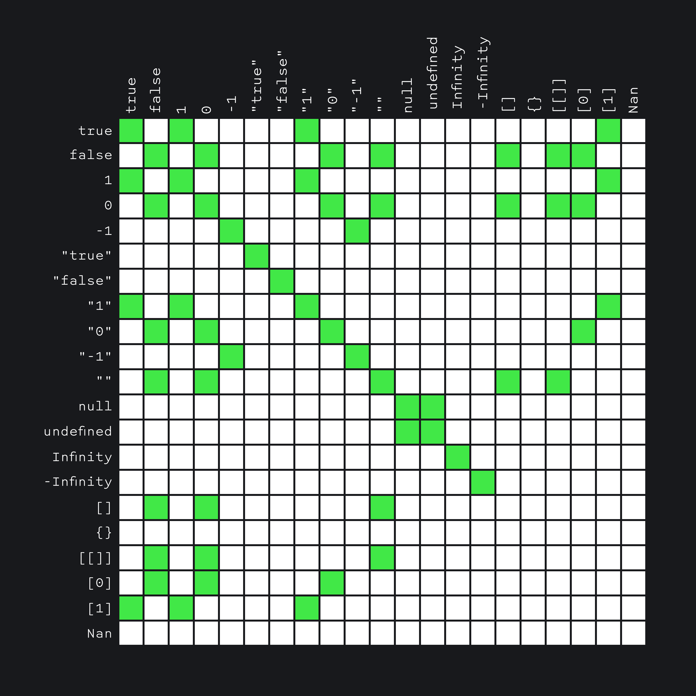
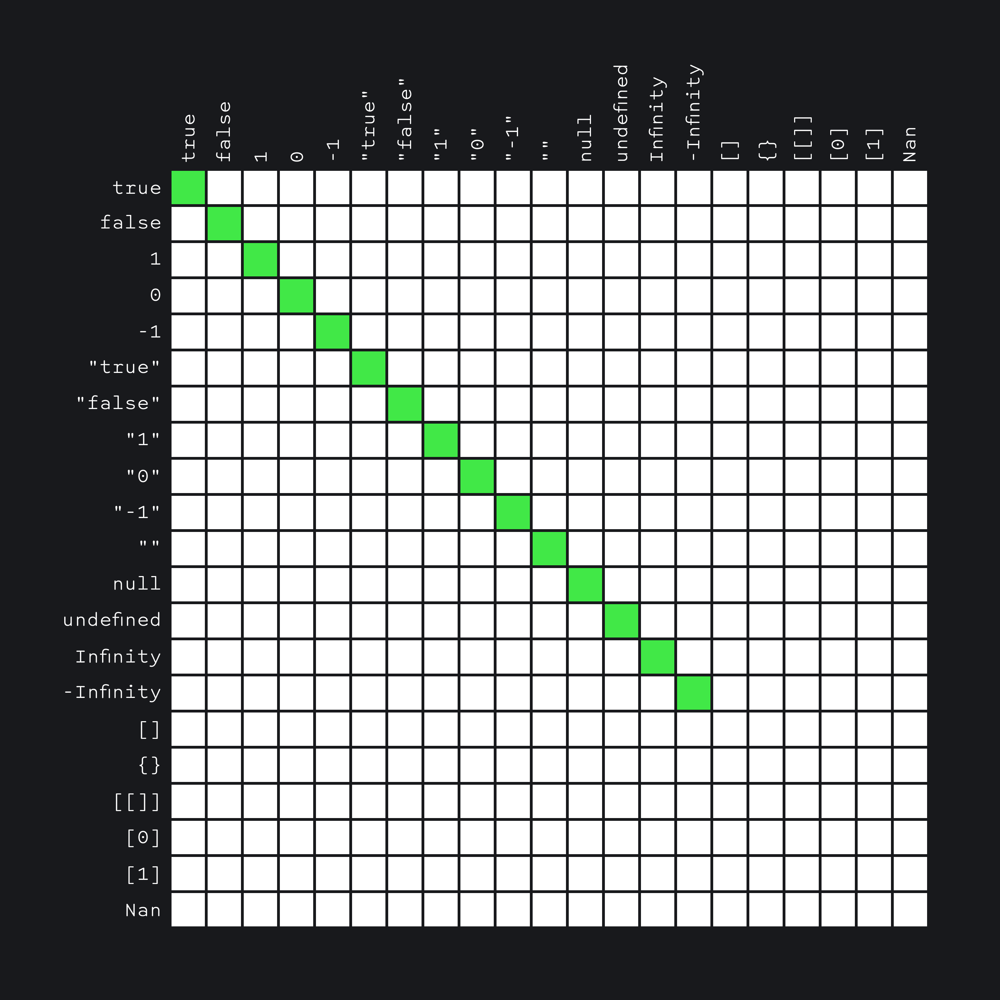

## Кратко

Многие операторы сравнения известны нам из математики.

В JavaScript они записываются так:

Больше или меньше: `a > b`, `a < b`;
Больше или равно, меньше или равно: `a >= b`, `a <= b`;
Равно: `a == b`;
Не равно: a != b;
Строго равно: `a === b`;
Строго не равно: `a !== b`;

Строгое равенство (`===`) в отличие от нестрогого (`==`) проверяет равенство без приведения типов, т. е. если величины разных типов, вернёт false, даже не сравнивая.

Когда же мы _[сравниваем значения нестрого](https://developer.mozilla.org/ru/docs/Web/JavaScript/Reference/Operators#equality_operators)_ между собой с помощью (`==`), JavaScript приводит типы самостоятельно:

Все операторы сравнения возвращают булево значение, `true` или `false`.

## Как пишется

```js
5 == "5" // true
5 === "5" // false
5 > 5 // false
5 >= 5 // true
```

## Как понять

### Строгое и нестрогое равенство

Неявное преобразование также используется, когда мы сравниваем значения через нестрогое равенство `==`.

В отличие от строгого равенства (`===`), в нём интерпретатор пробует привести типы к одному, чтобы сравнить.

Полный алгоритм [сложный](https://262.ecma-international.org/5.1/#sec-11.9.3). Для удобства его свели в [большую матрицу](https://dorey.github.io/JavaScript-Equality-Table/unified/), которая показывает, «что чему равно» при строгом и нестрогом равенстве.

Вот таблица нестрогого равенства (зелёным отмечены значения, которые «равны»):



А вот — для строгого:



Хорошей практикой считается использовать только строгое сравнение, чтобы избежать неявного преобразования типов при сравнении.

### Сравнение строк

Чтобы определить, что одна строка больше другой, JavaScript использует «алфавитный» или «лексикографический» порядок. Другими словами, строки сравниваются посимвольно.

```javascript
alert( 'Я' > 'А' ); // true
alert( 'Коты' > 'Кода' ); // true
alert( 'Сонный' > 'Сон' ); // true
```

Алгоритм сравнения двух строк довольно прост:

1. Сначала сравниваются первые символы строк.
2. Если первый символ первой строки больше (меньше), чем первый символ второй, то первая строка больше (меньше) второй. Сравнение завершено.
3. Если первые символы равны, то таким же образом сравниваются уже вторые символы строк.
4. Сравнение продолжается, пока не закончится одна из строк. Если обе строки заканчиваются одновременно, то они равны. Иначе, большей считается более длинная строка.

### Сравнение разных типов

При сравнении значений разных типов JavaScript приводит каждое из них к числу.

```javascript
alert( '2' > 1 ); // true, строка '2' становится числом 2
alert( '01' == 1 ); // true, строка '01' становится числом 1
```

Логическое значение true становится 1, а false – 0.

```javascript
alert( true == 1 ); // true
alert( false == 0 ); // true
```
