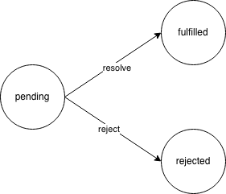
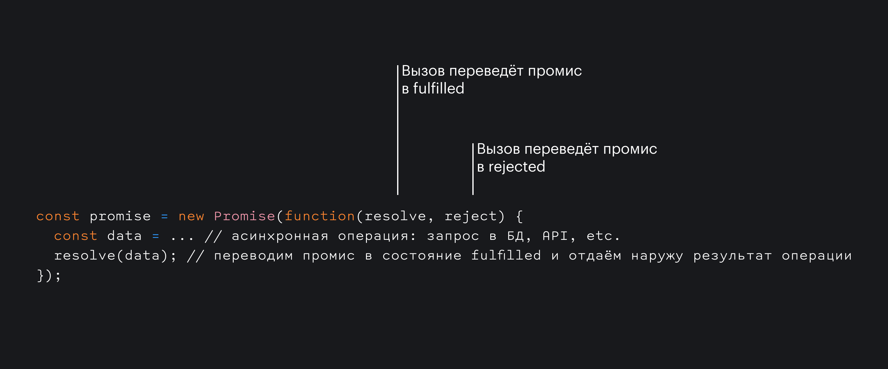
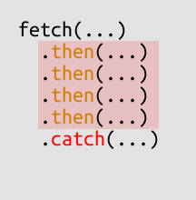
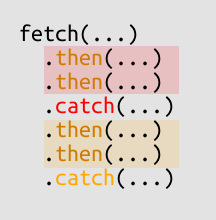
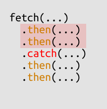

<aside>

💡 Эта документация связана с понятием асинхронности в JavaScript. Зачем нужен асинхронный код и как он работает описано в обзорной статье «[Асинхронность в JS](/js/async-in-js/)».

</aside>

## Кратко

Промис (Promise) — специальный объект JavaScript, который используется для написания и обработки асинхронного кода.

Асинхронные функции возвращают объект `Promise` в качестве значения. Внутри промиса работает асинхронная операция, которая управляет его состоянием.

Промис может находиться в одном из трёх состояний:

- _pending_ — стартовое состояние, операция стартовала;
- _fulfilled_ — получен результат;
- _rejected_ — ошибка.

Поменять состояние можно только один раз: перейти из `pending` либо в `fulfilled`, либо в `rejected`:



У промиса есть методы `then()` и `catch()`, которые позволяют выполнять код при изменении его состояния.

## Как пишется

Промис создаётся с помощью конструктора.

В конструктор передаётся функция-исполнитель асинхронной операции (англ. executor). Она вызывается сразу после создания промиса. Задача этой функции — выполнить асинхронную операцию и перевести состояние промиса в `fulfilled` (успех) или `rejected` (ошибка).

Изменить состояние промиса можно, вызвав колбэки, переданные аргументами в функцию:



```js
const promise = new Promise(function (resolve, reject) {
  // делаем асинхронную операцию
  const data = resolve(data) // запрос в БД, API, etc. // переводим промис в состояние fulfilled и отдаём наружу результат операции
})

const errorPromise = new Promise(function (resolve, reject) {
  reject(new Error('ошибка')) // переводим промис в состояние rejected и отдаём наружу ошибку
})
```

- первый параметр (в примере кода назван `resolve`) — колбэк для перевода промиса в состояние `fulfilled`, при его вызове аргументом передаётся результат операции;
- второй параметр (в примере кода назван `reject`) — колбэк для перевода промиса в состояние `rejected`, при его вызове аргументом передаётся информация об ошибке.

## Как понять

Промис решает задачу выполнения кода, который зависит от результата [асинхронной операции](/js/async-in-js/).

Промис устроен таким образом, что рычаги управления его состоянием остаются у асинхронной функции. После создания, промис находится в состоянии ожидания `pending`. Когда асинхронная операция завершается, функция переводит промис в состояние успеха `fulfilled` или ошибки `rejected`.

С помощью методов `then()`, `catch()` и `finally()` мы можем реагировать на изменение состояния промиса и выполнять код.

Пример ниже показывает состояние промиса, который создаётся при нажатии на кнопку купить. Промис случайным образом завершается успехом или ошибкой:

<iframe title="Пример состояний промиса" src="demos/Lopinopulos-QWNLMwR/" height="250"></iframe>

## Методы

В работе мы чаще используем промисы, чем создаём. Использовать промис — значит выполнять код при изменении состояния промиса.

Существует три метода, которые позволяют реагировать на изменение промиса:

- `then()`
- `catch()`
- `finally()`

**`then`**

<aside>

Подробнее о работе `then()` читайте в статье [Promise. Метод `then()`](/js/promise-then/).

</aside>

Метод `then()` используют, чтобы выполнить код после успешного выполнения асинхронной операции.

Например, мы запросили у сервера список фильмов и хотим отобразить их на экране, когда сервер получит результат. В этом случае:

- асинхронная операция — запрос данных у сервера;
- код, который мы хотим выполнить после её завершения, — отрисовка списка.

Метод `then()` принимает в качестве аргумента функцию-колбэк, которая выполняется сразу после того, как промис поменял состояние на `fulfilled`. Параметр колбэка содержит результат выполнения операции:

```js
fetch(`https://swapi.dev/api/films/${id}/`).then(function (movies) {
  renderList(movies)
})
```

В коде выше, асинхронная функция `fetch()` возвращает промис, к которому применяется метод `then`. При его выполнении в переменной `movies` будет ответ сервера.

**`catch`**

<aside>

Подробнее о работе `catch()` читайте в статье [Promise. Метод `catch()`](/js/promise-catch/).

</aside>

Метод `catch()` используют, чтобы выполнить код в случае ошибки при выполнении асинхронной операции.

Например, мы запросили у сервера список фильмов и хотим показать экран обрыва соединения, если произошла ошибка. В этом случае:

- асинхронная операция — запрос данных у сервера;
- код, который мы хотим выполнить при ошибке — экран обрыва соединения.

Метод `catch()` принимает в качестве аргумента функцию-колбэк, которая выполняется сразу после того, как промис поменял состояние на `rejected`. Параметр колбэка содержит экземпляр ошибки:

```js
fetch(`https://swapi.dev/api/films/${id}/`).catch(function (error) {
  renderErrorMessage(error)
})
```

В коде выше, асинхронная функция `fetch()` возвращает промис, к которому применяется метод `catch()`. При его выполнении в переменной `error` будет экземпляр ошибки.

**`finally`**

<aside>

Подробнее о работе `finally()` читайте в статье [Promise. Метод `finally()`](/js/promise-finally/).

</aside>

Метод `finally()` используют, чтобы выполнить код при завершении асинхронной операции. Он будет выполнен вне зависимости от того, была ли операция успешной или завершилась ошибкой.

Самый частый сценарий использования `finally()` — работа с индикаторами загрузки. Перед началом асинхронной операции разработчик включает индикатор загрузки. Индикатор нужно убрать вне зависимости от того, как завершилась операция. Если этого не сделать, то пользователь не сможет взаимодействовать с интерфейсом.

Метод `finally()` принимает в качестве аргумента функцию-колбэк, которая выполняется сразу после того, как промис поменял состояние на `rejected` или `fulfilled`:

```js
let isLoading = true
fetch(`https://swapi.dev/api/films/${id}/`).finally(function () {
  isLoading = false
})
```

### Цепочки методов

Методы `then()`, `catch()` и `finally()` часто объединяют в цепочки вызовов, чтобы обработать и успешный, и ошибочный сценарии:

```js
let isLoading = true

fetch(`https://swapi.dev/api/films/${id}/`)
  .then(function (movies) {
    renderList(movies)
  })
  .catch(function (err) {
    renderErrorMessage(err)
  })
  .finally(function () {
    isLoading = false
  })
```

В этом случае при успешном завершении операции мы выполним код из `then()`, при ошибке — код из `catch()`. Затем выполнится код из `finally()`.

Цепочки методов — очень гибкий подход. Он позволяет создавать зависимые асинхронные операции.

Например, нужно отобразить информацию о фильме и главном герое. Мы не знаем, кто главный герой, не получив эту информацию из данных о фильме. Таким образом, запрос данных о герое _зависит_ от результата запроса данных о фильме.

Промисы делают решение простым и читаемым. Мы можем начинать следующее асинхронное действие внутри колбэка метода `then()`. Все, что возвращается из колбэка, оборачивается в промис, поэтому в цепочку можно добавить новый `then()`:

```js
fetch(`https://swapi.dev/api/films/${id}/`)
  .then(function (response) {
    // этот then сработает, когда разрешится промис с запросом данных о фильме
    return response.json() // нужно распарсить ответ сервера, это асинхронная операция
  })
  .then(function (movie) {
    // этот then сработает, когда данные о фильме распарсятся
    const characterUrl = movie.characters[0]
    return fetch(characterUrl) // вызов fetch вернет промис, возвращаем его из колбэка, чтобы продолжить цепочку
  })
  .then(function (response) {
    // этот then сработает, когда разрешится промис с результатами запроса персонажа
    return response.json()
  })
  .then(function (character) {
    renderCharacterProfile(character)
  })
  .catch(function (err) {
    // catch сработает, когда любая из операций выше завершится ошибкой
    renderErrorMessage(err)
  })
```

### Обработка ошибок в цепочках методов

<iframe title="Какие catch обрабатывают ошибки" src="demos/promise-catch/" height="350"></iframe>

Цепочки `then()` при обработке промисов могут быть очень большими. В примере выше цепочка состоит из четырёх `then()` и одного `catch()`. Как в этом случае отработает `catch()`?

☝️ `catch()` обрабатывает ошибки от всех `then()` между ним и предыдущим `catch()`.

<div class="columns"><div class="columns__line"><div class="columns__item">



</div><div class="columns__item">

В примере выше наш `catch()` — последний, а предыдущего нет, поэтому он будет обрабатывать все ошибки.

</div></div><div class="columns__line"><div class="columns__item">



</div><div class="columns__item">

Если в цепочке несколько `catch()`, то каждый ловит ошибки от `then()`, находящихся выше.

</div></div><div class="columns__line"><div class="columns__item">



</div><div class="columns__item">

Возможен вариант, когда финального `catch()` нет. Тогда ошибки от последних `then()` не будут обрабатываться.

</div></div></div>

⚠️ Такой код — плохой. Если в одном из последних `then()` произойдёт ошибка, то вся дальнейшая цепочка не отработает, при этом, из-за асинхронной природы промиса, прочий код вне промиса продолжит работать и приложение не упадёт.

## Как создать асинхронную функцию с промисом

1. Создать функцию, которая будет выполнять асинхронную операцию:

```js
function earnAllMoney() {}
```

2. Вернуть из функции свежесозданный промис:

```js
function earnAllMoney() {
  return new Promise()
}
```

3. Аргументом в конструктор передать функцию, которая выполняет асинхронную операцию и переводит промис в состояние «успех» или «ошибка» в зависимости от результата:

```js
function earnAllMoney() {
  return new Promise(function (resolve, reject) {
    const result = tryEarnAllMoney() // асинхронная операция
    if (result.ok) {
      resolve(result) // успех → переводим промис в fulfilled и передаём результат
    } else {
      reject(new Error(result)) // ошибка → переводим промис в rejected
    }
  })
}
```

💡 Если асинхронная операция работает через колбэки, то её стоит обернуть в промис, чтобы писать более читаемый код.

Функция `getData` в примере ниже принимает два аргумента — колбэк при успехе и колбэк при ошибке. Завернём её в промис:

```js
function promisifiedGetData() {
  return new Promise(function (resolve, reject) {
    const result = getData(
      function (result) {
        resolve(result)
      },
      function (error) {
        reject(error)
      }
    )
  })
}
```

Теперь можно использовать методы `then()` и `catch()`:

```js
promisifiedGetData()
  .then(function () {
    console.log('success')
  })
  .catch(function (err) {
    console.error(err.message)
  })
```
