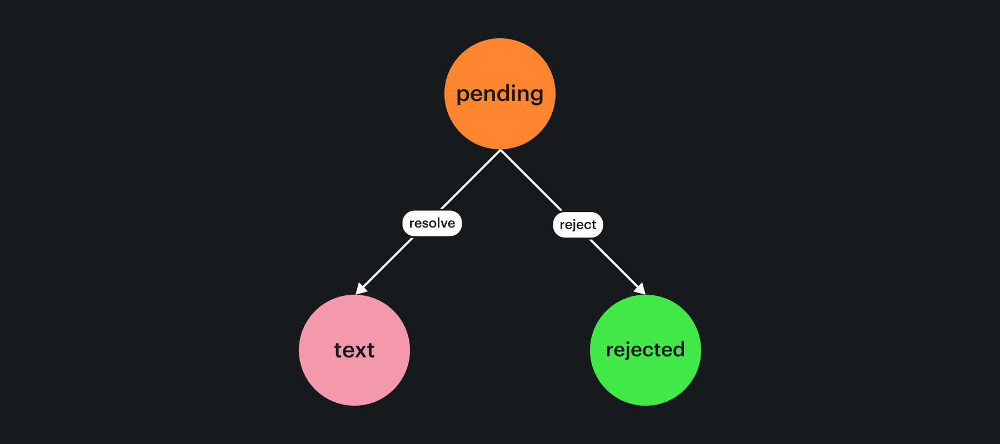
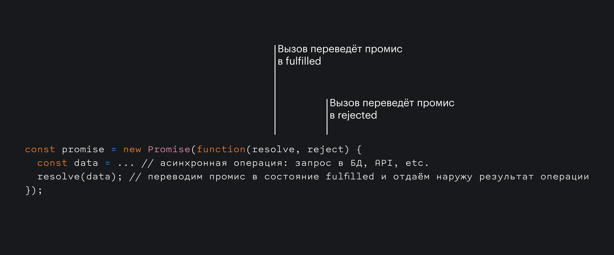
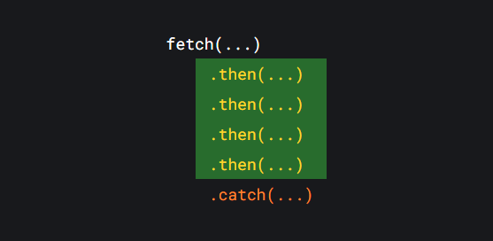
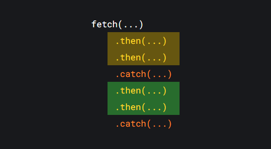
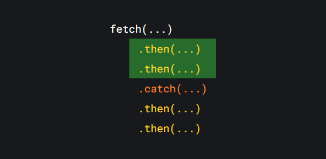

<aside>

💡 Эта документация связана с понятием асинхронности в JavaScript. Зачем нужен асинхронный код и как он работает описано в обзорной статье «[Асинхронность в JavaScript](/js/async-in-js/)».

</aside>

## Кратко

Промис (Promise) — специальный объект JavaScript, который используется для написания и обработки асинхронного кода.

Асинхронные функции возвращают объект `Promise` в качестве значения. Внутри промиса хранится результат вычисления, которое может быть уже выполнено или выполнится в будущем.

Промис может находиться в одном из трёх состояний:

- _pending_ — стартовое состояние, операция стартовала;
- _fulfilled_ — получен результат;
- _rejected_ — ошибка.

Поменять состояние можно только один раз: перейти из `pending` либо в `fulfilled`, либо в `rejected`:



У промиса есть методы `then()`, `catch()` и `finally()`, которые выполнят код при смене состояния.

## Как пишется

Промис создаётся с помощью конструктора.

В конструктор передаётся функция-исполнитель асинхронной операции (англ. executor). Она вызывается сразу после создания промиса. Задача этой функции — выполнить асинхронную операцию и перевести состояние промиса в `fulfilled` (успех) или `rejected` (ошибка).

Изменить состояние промиса можно, вызвав колбэки, переданные аргументами в функцию:



```js
const promise = new Promise(function (resolve, reject) {
  // Делаем асинхронную операцию:
  // Запрос текущего местоположения устройства.
  // В случае успешного выполнения запроса
  // колбэк-функция получит данные о местоположении.
  navigator.geolocation.getCurrentPosition(function (data) {
    // Переводим промис в состояние fulfilled.
    // Результат выполнения — объект data
    resolve(data)
  }
})

const errorPromise = new Promise(function (resolve, reject) {
  // Переводим промис в состояние rejected.
  // Результат выполнения — объект Error
  reject(new Error('ошибка'))
})
```

Первый параметр (в примере кода назван `resolve`) — колбэк для перевода промиса в состояние `fulfilled`, при его вызове аргументом передаётся результат операции.

Второй параметр (в примере кода назван `reject`) — колбэк для перевода промиса в состояние `rejected`, при его вызове аргументом передаётся информация об ошибке.

## Как понять

Промис решает задачу выполнения кода, который зависит от результата [асинхронной операции](/js/async-in-js/).

Промис устроен таким образом, что рычаги управления его состоянием остаются у асинхронной функции. После создания, промис находится в состоянии ожидания `pending`. Когда асинхронная операция завершается, функция переводит промис в состояние успеха `fulfilled` или ошибки `rejected`.

С помощью методов `then()`, `catch()` и `finally()` мы можем реагировать на изменение состояния промиса и использовать результат его выполнения.

Пример ниже показывает состояние промиса, который создаётся при нажатии на кнопку купить. Промис случайным образом завершается успехом или ошибкой:

<iframe title="Пример состояний промиса" src="demos/promise-states/" height="250"></iframe>

## Методы

В работе мы чаще используем промисы, чем создаём. Использовать промис — значит выполнять код при изменении состояния промиса.

Существует три метода, которые позволяют работать с результатом выполнения вычисления внутри промиса: `then()`, `catch()` и `finally()`.

**Метод `then()`** используют, чтобы выполнить код после успешного выполнения асинхронной операции.

Например, мы запросили у сервера список фильмов и хотим отобразить их на экране, когда от сервера придёт результат. В этом случае:

- асинхронная операция — запрос данных у сервера;
- код, который мы хотим выполнить после её завершения — отрисовка списка.

Метод `then()` принимает в качестве аргумента две функции-колбэка. Если промис в состоянии `fulfilled`, выполнится первая функция. Если в состоянии `rejected` — вторая. Хорошей практикой считается не использовать второй аргумент метода `then()` и обрабатывать ошибки при помощи метода `catch()`.

```js
fetch(`https://swapi.dev/api/films/${id}/`).then(function (movies) {
  renderList(movies)
})
```

В коде выше, асинхронная функция `fetch()` возвращает промис, к которому применяется метод `then`. При его выполнении в переменной `movies` будет ответ сервера.

Подробнее о работе `then()` читайте в статье «[Promise. Метод `then()`](/js/promise-then/)».

**Метод `catch()`** используют, чтобы выполнить код в случае ошибки при выполнении асинхронной операции.

Например, мы запросили у сервера список фильмов и хотим показать экран обрыва соединения, если произошла ошибка. В этом случае:

- асинхронная операция — запрос данных у сервера;
- код, который мы хотим выполнить при ошибке — экран обрыва соединения.

Метод `catch()` принимает в качестве аргумента функцию-колбэк, которая выполняется сразу после того, как промис поменял состояние на `rejected`. Параметр колбэка содержит экземпляр ошибки:

```js
fetch(`https://swapi.dev/api/films/${id}/`).catch(function (error) {
  renderErrorMessage(error)
})
```

В коде выше асинхронная функция `fetch()` возвращает промис, к которому применяется метод `catch()`. При его выполнении в переменной `error` будет экземпляр ошибки.

Подробнее о работе `catch()` читайте в статье «[Promise. Метод `catch()`](/js/promise-catch/)».

**Метод `finally()`** используют, чтобы выполнить код при завершении асинхронной операции. Он будет выполнен вне зависимости от того, была ли операция успешной или завершилась ошибкой.

Самый частый сценарий использования `finally()` — работа с индикаторами загрузки. Перед началом асинхронной операции разработчик включает индикатор загрузки. Индикатор нужно убрать вне зависимости от того, как завершилась операция. Если этого не сделать, то пользователь не сможет взаимодействовать с интерфейсом.

Метод `finally()` принимает в качестве аргумента функцию-колбэк, которая выполняется сразу после того, как промис поменял состояние на `rejected` или `fulfilled`:

```js
let isLoading = true
fetch(`https://swapi.dev/api/films/${id}/`).finally(function () {
  isLoading = false
})
```

Подробнее о работе `finally()` читайте в статье «[Promise. Метод `finally()`](/js/promise-finally/)».

### Цепочки методов

Методы `then()`, `catch()` и `finally()` часто объединяют в цепочки вызовов, чтобы обработать и успешный, и ошибочный сценарии:

```js
let isLoading = true

fetch(`https://swapi.dev/api/films/${id}/`)
  .then(function (movies) {
    renderList(movies)
  })
  .catch(function (err) {
    renderErrorMessage(err)
  })
  .finally(function () {
    isLoading = false
  })
```

При успешном завершении операции выполнится код из `then()`, при ошибке — код из `catch()`. Затем выполнится код из `finally()`.

Цепочки методов — очень гибкий подход. Он позволяет создавать зависимые асинхронные операции.

Например, нужно отобразить информацию о фильме и главном герое. Мы не знаем, кто главный герой, не получив эту информацию из данных о фильме. Таким образом, запрос данных о герое _зависит_ от результата запроса данных о фильме.

Промисы делают решение простым и читаемым. Мы можем начинать следующее асинхронное действие внутри колбэка метода `then()`. Всё, что возвращается из колбэка, оборачивается в промис, поэтому в цепочку можно добавить новый `then()`:

```js
fetch(`https://swapi.dev/api/films/${id}/`)
  .then(function (response) {
    // Сработает, когда разрешится промис с запросом данных о фильме.
    // Следует распарсить ответ сервера: это асинхронная операция
    return response.json()
  })
  .then(function (movie) {
    // Сработает, когда данные о фильме распарсятся.
    // Возвращаем промис из колбэка, чтобы продолжить цепочку
    const characterUrl = movie.characters[0]
    return fetch(characterUrl)
  })
  .then(function (response) {
    // Сработает, когда разрешится промис с результатами запроса персонажа
    return response.json()
  })
  .then(function (character) {
    renderCharacterProfile(character)
  })
  .catch(function (err) {
    // Сработает, когда любая из операций выше завершится ошибкой
    renderErrorMessage(err)
  })
```

### Обработка ошибок в цепочках методов

<iframe title="Какие catch обрабатывают ошибки" src="demos/promise-catch/" height="450"></iframe>

Цепочки `then()` при обработке промисов могут быть большими. В предыдущем примере цепочка состоит из четырёх `then()` и одного `catch()`. Как в этом случае отработает `catch()`?

`catch()` обрабатывает ошибки от всех `then()` между ним и предыдущим `catch()`.

Наш `catch()` — последний, а предыдущего нет, поэтому он будет обрабатывать все ошибки:



Если в цепочке несколько `catch()`, каждый ловит ошибки от `then()`, находящихся выше:



Возможен вариант, когда финального `catch()` нет. Тогда ошибки от последних `then()` не будут обрабатываться:



Код с длинными цепочками — плохой. Если в одном из последних `then()` произойдёт ошибка, то вся дальнейшая цепочка не отработает. Из-за асинхронной природы промиса, остальной код вне промиса продолжит работать и приложение не упадёт.

## Другие методы промисов

Иногда нужно обернуть уже известный результат вычисления в промис. Для этого используйте метод `Promise.resolve()`:

```js
const happyDog = Promise.resolve('🐶')

happyDog.then(function (dog) {
  console.log(dog) // 🐶
})
```

Другой метод `Promise.reject()` используется реже. Обратите внимание, что результатом выполнения `sadDog.catch()` будет промис, который перейдёт в статус `fulfilled` после успешного выполнения функции, переданной в `catch()`:

```js
const sadDog = Promise.reject('🐶')

sadDog.catch(function (dog) {
  console.log(dog) // 🐶
})
.then(function () {
  console.log('ok')
})
```

## Синхронная функция с промисом

Создадим функцию, которая выполняет асинхронную операцию:

```js
function earnAllMoney() {}
```

Вернём из функции только что созданный промис:

```js
function earnAllMoney() {
  return new Promise(function (resolve, reject) { /* ... */ })
}
```

Передайте функцию в конструктор в качестве аргумента. Функция выполняет синхронную операцию и переводит промис в состояние «успех» или «ошибка» в зависимости от результата:

```js
function earnAllMoney() {
  return new Promise(function (resolve, reject) {
    //  Возвращает статус
    const result = tryEarnAllMoney()
    if (result.ok) {
      // Успех → переводим промис в fulfilled
      // и передаём результат
      resolve(result)
    } else {
      // Ошибка → переводим промис в rejected
      reject(new Error(result))
    }
  })
}
```

## Асинхронная функция с промисом

Рассмотрим пример с функцией `getData`. Функция принимает два колбэка: первый вызывается при успехе, второй — при ошибке. Код этой функции может выглядеть так:

```js
function getData(onSuccess, onError) {
  setTimeout(function () {
    const result = Math.random()
    if (result > 0.5) {
      onSuccess(result)
    } else {
      onError(new Error('Что-то пошло не так'))
    }
  }, 1000)
}
```

Завернём её в промис:

```js
function promisifiedGetData() {
  return new Promise(function (resolve, reject) {
    getData(
      function (result) {
        resolve(result)
      },
      function (error) {
        reject(error)
      }
    )
  })
}
```

Теперь используем методы `then()` и `catch()`:

```js
promisifiedGetData()
  .then(function () {
    console.log('success')
  })
  .catch(function (err) {
    console.error(err.message)
  })
```

## Схлопывание промисов

Интересная и удобная особенность промисов – если вложить один промис в другой, они схлопнутся в один. Например:

```js
const promise = Promise.resolve(Promise.resolve(Promise.resolve('🐶')))
// Promise {<fulfilled>: '🐶'}
promise.then(console.log)
// 🐶
```
