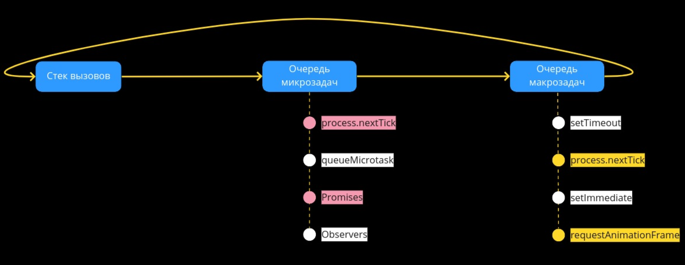

## Кратко

Браузерное API, которое выполняет переданный код асинхронно.

## Как пишется

`queueMicrotask()`:
- Принимает функцию, которая будет передана в очередь микрозадач;
- Возвращает `undefined`.

```js
queueMicrotask(() => {
    console.log('Хэй, я выполнюсь асинхронно!')
})
```

## Как понять

Код выше схож со сценарием использования [`setTimeout()`](/js/settimeout/). Оба выполнят код асинхронно:

```js
setTimeout(() => {
    console.log('Хэй, я выполнюсь асинхронно благодаря setTimeout')
}, 0)
```

Так в чем же принципиальная разница между ними?

`queueMicrotask()` добавляет переданную функцию в _очередь микрозадач_. Функции в этой очереди выполняются одна за другой (_FIFO: First in First Out_) — когда текущая функция выполнилась, запускается следующая функция в очереди.

Все микрозадачи в очереди будут выполнены только после того, как текущий _[стек вызовов](/js/async-in-js/#stek-vyzovov)_ окажется пустым, но перед выполнением следующей макрозадачей.

Если вернуться к сравнению с `setTimeout()`, то передаваемые в него функции этого относятся к _макрозадачам_. Каждая из них будет взята из очереди задач, после того как управление передастся циклу событий.

Поэтому, если вызвать `queueMicrotask()` после `setTimeout()`, или наоборот — функция, переданная в `queueMicrotask()`, начнёт своё исполнение первой.

<details>

<summary>Подробнее про микро и макрозадачи</summary>



JavaScript имеет в своём арсенале различные _виды очередей_, а также _стек вызовов_. Давайте кратко разберём необходимый минимум, который поможет разобраться с процессом работы:
- _Стек вызовов_ — служит для выполнения синхронных операций;
- _Очередь микрозадач_ — контейнер для хранения асинхронных операций, имеющих высокий приоритет;
- _Очередь макрозадач_ — контейнер для хранения асинхронных операций с низким приоритетом.

Что же, кажется, самое время рассмотреть процесс работы между этими самыми элементами:
- Первый, кто начинает процесс выполнения — стек вызовов;
- После того, как JavaScript убеждается, в том, что стек пуст — в него по очереди добавляются задачи из очереди микрозадач;
- Процесс выполнения продолжается до тех пор, пока не станет ясно, что очередь опустела. Как только это произойдёт — выполняются задачи из очередь макрозадач;
- Очередь макрозадач является завершающим этапом. После того как список в нем станет пустым — все повторяется по новой.

</details>

## Пример

Убедимся, что функция, переданная в `queueMicrotask()` выполнится раньше, чем через `setTimeout()`. Для этого создадим страницу с формой, при отправке которой будут запускаться оба задания. Каждое из них будет печатать на экран уникальный текст:

```html
<form class="compare-form" name="compare-form">
  <h2>
    Вывод значений с помощью <code>queueMicrotask</code> и <code>setTimeout</code>:
  </h2>
  <p id="compare-output"
    class="compare-form__output"
  ></p>
  <button type="submit" class="button compare-form__submit-button">
    Вывести текст
  </button>
  <button type="reset" class="button compare-form__reset-button">
    Очистить содержимое
  </button>
</form>
```

При отправке формы запустим наши задачи — первым будет располагаться `setTimeout()`, а после него `queueMicrotask()`.

```html
<script>
  const handleFormSubmit = (e) => {
    e.preventDefault()

    setTimeout(() => {
      output.innerText += 'Фраза добавлена из setTimeout()\n\n'
    }, 0)
    queueMicrotask(() => {
      output.innerText += 'Фраза добавлена из queueMicrotask()\n'
    })
  }
</script>
```

Вот и все! Давайте посмотрим, что у нас получилось:

<iframe title="Сравнение queueMicrotask() и setTimeout()" src="demos/queueMicrotask-vs-setTimeout/" height="450"></iframe>

## Подсказки

Основная причина использования `queueMicrotask()` — обеспечение последовательности выполнения задач, одновременно снижая риск заметных пользователю задержек в операциях.

Представим ситуацию, в которой необходимо получать данные по указанному урлу. Либо же, если запрос выполнялся ранее  — запросить данные из кэша:

```js
const output = document.querySelector('.logging-form__output')
let data = []
const cache = {}

function getData(url) {
  if (url in cache) {
    data = cache[url]
    output.dispatchEvent(new Event('data-loaded'))
  } else {
    fetch(url)
      .then((response) => response.json())
      .then(({ data }) => {
        cache[url] = data
        data = data
        output.dispatchEvent(new Event('data-loaded'))
      })
  }
}
```

_Какую проблему тут можно заметить?_

В теле одного условия используется цепочка промисов, в другом — обычное синхронное выполнение. Из этого можно сделать вывод, что в разных условиях, процесс выполнения также будет отличаться.

Для наглядности, навесим обработчик на событие `submit`, в котором будет происходить вызов функции `getData`:

```js
const form = document.querySelector('.logging-form')

const handleFormSubmit = (e) => {
  e.preventDefault()

  output.innerText += 'Процесс загрузки данных...\n'
  getData('https://reqres.in/api/users/2')
  output.innerText += 'Процесс загрузки данных выполняется...\n'
}

form.addEventListener('submit', handleFormSubmit)
```

Не забываем про кастомное событие `data-loaded`, инициируемое внутри функции `getData`. Навесим обработчик и на него:

```js
const output = document.querySelector('.logging-form__output')

const handleOutputDataLoaded = () => {
  output.innerText += 'Данные загружены\n'
}

output.addEventListener('data-loaded', handleOutputDataLoaded)
```

Давайте посмотрим, к каким результатам это может привести. Для этого необходимо нажать на кнопку получения данных 2 раза:

<iframe title="Неочевидный порядок выполнения кода" src="demos/when-to-use/ordering-with-conditional-operator/not-obvious/" height="450"></iframe>

После второго нажатия, когда данные берутся из кэша, можно заметить недочёт. Строка «Процесс загрузки данных выполняется...» выводится после «Данные загружены». Причём, когда данные приходили впервые — вывод строк был совершенно иным. Это происходит из-за того, что при первом чтении событие `data-loaded` отправляется из асинхронного кода, а в случае чтения из кэша — из синхронного.

Чтобы исправить проблему, необходимо обернуть тело первого условного блока в `queueMicrotask()` и таким образом сделать чтение данных из кэша асинхронной операцией:

```js
if (url in cache) {
  queueMicrotask(() => {
    data = cache[url]
    textarea.dispatchEvent(new Event('data-loaded'))
  })
}
```

Взглянем на итоговое решение после небольшой корректировки:

<iframe title="Очевидный порядок выполнения кода" src="demos/when-to-use/ordering-with-conditional-operator/obvious/" height="450"></iframe>

Отлично! Теперь процесс выполнения работает идентично как при получении данных с сервера, так и при вытаскивании их из кэша.
