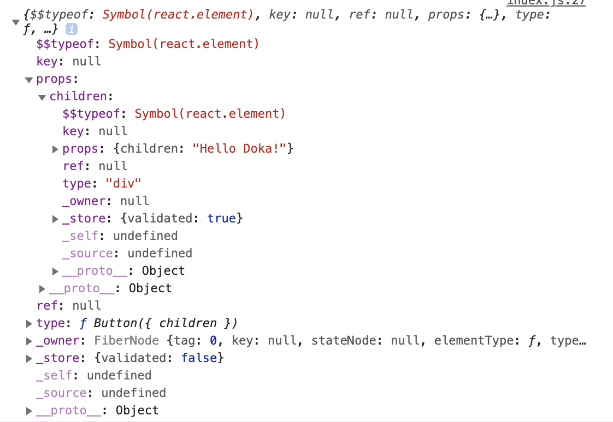

На текущий момент в мире фронтенда существует множество различных фреймворков для разработки SPA. Большинство из них различаются подходами к разработке и инструментами, которыми они обладают. Но в основе всех этих фреймворков часто лежат одни и те же концепции. Эти концепции и различия в подходах мы рассмотрим в данной статье.

## Кратко

Virtual DOM – объект, который хранит структуру дерева компонентов и их текущее состояние.

React использует Virtual DOM для отслеживания изменений. После каждого изменения состояния, React создаёт новый Virtual DOM и сравнивает его с предыдущем, чтобы узнать какие части приложения изменились.

Angular не использует Virtual DOM, но патчит браузерный DOM API, чтобы иметь возможность следить из изменением данных. Таким образом, если пользователь взаимодействует со страницей, то Angular проверяет не изменились ли какие-то данные приложения.

Vue использует Virtual DOM и специальные объекты Proxy, чтобы узнавать когда изменились данные.

Svelte не использует Virtual DOM, но во время компиляции приложения формирует функции, которые следят за изменением данных и обновляют соответствующие DOM-элементы.

## Реактивность

Все фреймворки стараются следовать принципам [реактивности](/js/reactivity/), но используют разные способы, чтобы организовать её. Различия кроются в том, как фреймворк отслеживает изменения и как проводит синхронизацию модели в DOM браузера.

## React

В React каждое приложение (или отдельные компоненты) имеет состояние. Состояние это данные, за которыми React следит. У React [однонаправленный поток данных](/js/architecture-data-flow) и он предоставляет специальный API для обновления состояния. Когда в приложении необходимо обновить состояние, разработчик будет вызывать функцию для установки нового значения. Благодаря этому API React знает когда нужно сделать перерисовку, потому что реагирует на его вызовы. Такой подход по сути является pull-реактивностью, так как мы явно даём знать React, что данные изменились, но фреймворк сам решит в какой момент времени нужно обновить подписчиков.

Главная особенность React – это Virtual DOM. Когда React только появился это было его главным нововведением. Вся логика отображения, выявления изменений и обновление браузерного DOM строится вокруг Virtual DOM.

### Virtual DOM

Virtual DOM – это легковесный объект, которое описывает собой структуру React-приложения. Объект Virtual DOM сопоставляет дерево компонентов в браузерное [DOM-дерево](/js/dom/). Таким образом React знает какой компонент соответствует определённым элементам на странице. Это дерево хранится в памяти и обновляется каждый раз в соответствии с изменениями.

То что возвращает функция `render()` в классовом компоненте или результат из функционального компонента является Virtual DOM. Все элементы в Vitual DOM является объектами с одинаковым набором свойств, аналогично как и [DOM-элементы](/js/element/).



Вложенные друг в друга элементы Virtual DOM можно увидеть с помощью свойства `children` внутри свойства `props`. Так получается древовидная структура. На картинке выше если проследить за структурой можно увидеть, что внутри исходного компонента находится `div`, а внутри него находится строка `"Hello Doka"`.

Когда происходит изменение в приложении (к примеру поменялось состояние), React запускает алгоритм сравнения двух Virtual DOM: старого и нового. Он рекурсивно проходит по всему дереву и пытается найти отличия в их структуре. Если различия найдены, то DOM в браузере обновится соответственно. Все это происходит в реальном времени, но работает очень быстро, потому пользователь никаких задержек.

Алгоритм сравнения содержит множество нюансов, подробности лучше посмотреть в [официальной документации](https://ru.reactjs.org/docs/reconciliation.html).

:::callout ☝️

Стоит помнить, что факт обновления браузерного DOM не значит, что элементы будут удалятся и создаваться заново (кроме явных случаев). React будут стараться сохранить элемент на странице и производить только точечные изменения.

:::

Virtual DOM существует и работает только в рантайме, то есть во время выполнения программы и все своё состояние он хранит в памяти. Большие приложения могут создавать очень большие деревья, а многочисленные изменения будут приводить к многократным пересозданием отдельных поддеревьев и их проверкам с предыдущей версией. Все эти факторы влияют на производительность.

## Angular

Angular, чтобы связывать данные приложения и отображение, использует HTML-подобный синтаксис для своих шаблонов и компилирует эти шаблоны набор инструкций, которые создают браузерные DOM-элементы. Angular не использует Virtual DOM, чтобы хранить дерево компонентов в памяти.

У Angular есть две стратегии для обнаружения изменений: `default` и `onPush`.

Стандартный механизм обнаружения изменения довольно простой: Angular рекурсивно проходит по дереву компонентов и для каждого выражения, используемого в шаблоне, он сравнивает текущее значение с предыдущим. Если значения отличаются, то фреймворк помечает их, и в итоге меняет отображение в DOM.

При этом Angular умеет самостоятельно запускать обнаружение изменений, например после клика или после вызова асинхронного `setTimeout`. Чтобы отлавливать изменения, которые происходят через браузерное API, Angular использует `zone.js`. Это библиотека, которая связывает асинхронный API браузера и Angular. При запуске приложения `zone.js` патчит браузерный DOM, например [addEventListener](/js/element-addeventlistener/), `setTimeout`, `setInterval` и API для AJAX-запросов. Он добавляет туда возможность Angular отслеживать изменения и делать обновления, если они случились.

```js
// Пример как это может выглядеть
function addEventListener(name, handler, options) {
    this.addEventListener(name, (...args) => {
      handler(...args);

      angular.runChangeDetection();
    })
}

EventTarget.prototype.addEventListener = addEventListener
```

Таким образом фреймворк старается самостоятельно отслеживать изменения, снимая с разработчика эту рутину.

Стандартный способ обнаружения изменений является удобным и используется по умолчанию, но в больших приложениях может вызывать проблему с производительностью из-за частых перезапусков проверок на любое событие. Чтобы решить эти проблемы и сделать обнаружение изменений более явным используют стратегию `onPush`.

Стратегия `onPush` заменяет механизм обнаружения изменения. Теперь компонент обновляется только если меняются входные данные, аналогично как работают props в React компонентах. Когда входные данные компонента изменяются Angular пройдётся по всему поддереву и обновит дочерние элементы.

Обе стратегии обновления могут использоваться одновременно и часто `onPush` применяют для оптимизации высоконагруженных частей приложения.

## Vue

Vue реализует реактивность с помощью Proxy. Proxy – это специальный объект в JavaScript, который позволяет следить за изменениями свойств другого объекта. Это даёт Vue возможность узнавать когда свойство объекта было изменено или считано и реагировать на это действие. При этом объект, отслеживаемый с помощью Proxy, ничем не отличается от обычного.

Помимо отслеживание свойств объектов Vue оборачивает функции в *эффекты*. Эффект – это обёртка вокруг функции, которая формирует порядок вызова и следит какую функцию нужно вызвать.

```js
// Место где храним порядок вызванных эффектов
const effects = []

// Обертка, создаяющий эффекты
const addEffect = fn => {
  const runEffect = () => {
    // Добавляем функцию перед вызовом, чтобы в любом месте можно было узнать что выполняется
    effects.push(runEffect)
    fn()

    // Убираем после вызова, т.к эффект выполнился
    effects.pop()
  }

  runEffect()
}

const makeChanges = () => {
  console.log(effects) // Выведет массив с одной функцией [ ƒ ]
}

const fn = () => {
  // ...
  makeChanges()
}

addEffect(fn)

```

Пример выше это приближенный пример как работают эффекты в Vue.

Для обновления DOM в браузере Vue тоже использует Virtual DOM. Vue использует свой синтаксис шаблонов похожий на Angular, но при компиляции приложения эти шаблоны преобразуются в вызовы render-функций, создающий Virtual DOM. Алгоритм обхода и свойства объекта в Virtual DOM во Vue отличаются от React, но основные подходы очень похожи.

## Svelte

Svelte отличаются от других фреймворков тем, что функции для отслеживания изменений формируются во время компиляции приложения.

Svelte имеет свой язык шаблонов как Angular или Vue и благодаря ему компилятор умеет просчитывать все зависимости заранее. В итоге Svelte сформирует набор функций, которая следят только за определёнными значениями и обновляют DOM при их изменениях. Это быстрее подхода Virtual DOM, так как не нужно проверять все дерево, чтобы узнать где произошли изменения и не нужно хранить все дерево компонентов в памяти.

Предположим есть код, который увеличивает значение переменной.

```js
let count = 0;

function increment() {
  count = count + 1;
}

```

Во время компиляции Svelte ищет все места, где меняются данные, и на выходе добавит вызов специальной функций, которая пометит, что изменение произошло.

```js
function instance($$self, $$props, $$invalidate) {
  let count = 0;

  function increment(event) {
    $$invalidate(0, count = count + 1);
  }

  return [count, increment];
}
```

Код выше это небольшая часть того, что скомпилирует Svelte. Здесь видно как в изначальную функцию добавилась специальная функция `$$invalidate`, которая пометит, что данные изменились и запланирует обновление DOM-элемента, где используется это значение.
