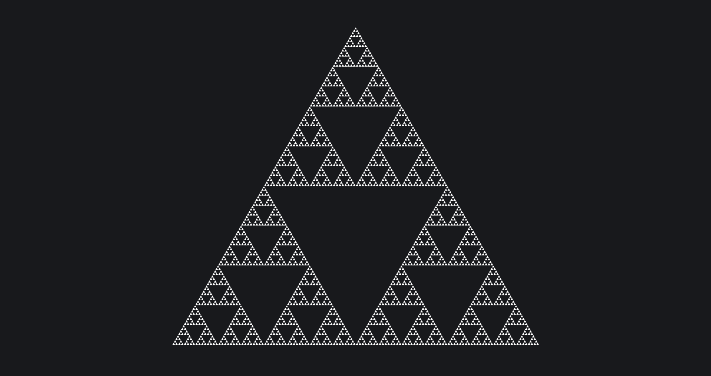
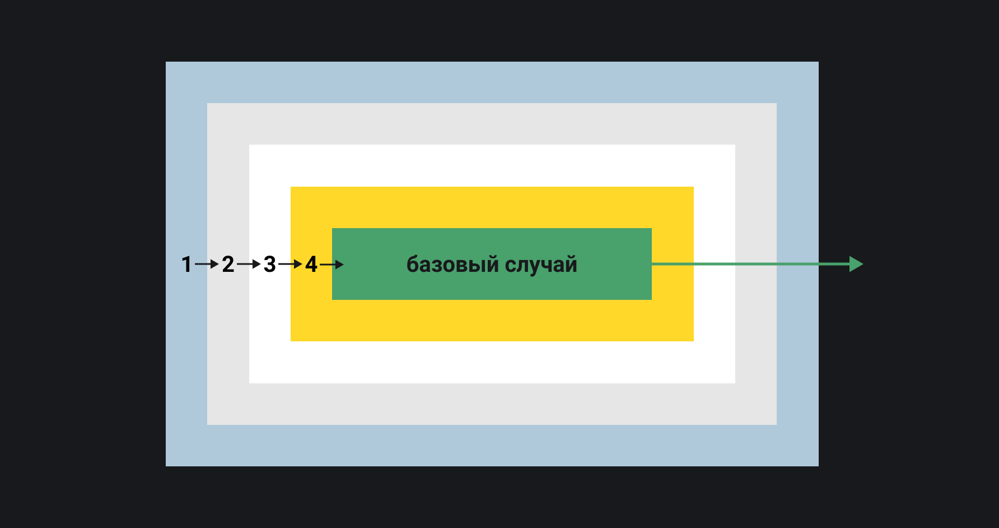
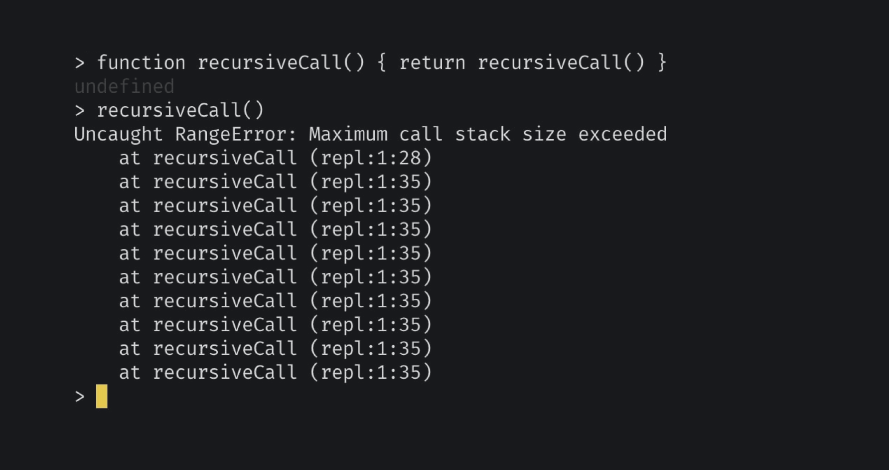

## Кратко

_Рекурсия_ — это что-то, что описывает само себя.

Представить рекурсию проще всего на примере зеркального коридора — когда напротив друг друга стоят два зеркала. Если посмотреть в одно, то в нём будет отражение второго, во втором — отражение первого и так далее.


В «Начале» Нолана есть момент с зеркальным коридором, когда в отражении зеркала видно отражение зеркала, в котором видно отражение зеркала, в котором видно...

Второй пример, чуть более академически правильный — это фрактал. Тот же [треугольник Серпинского](https://ru.wikipedia.org/wiki/Треугольник_Серпинского) — это пример рекурсии, потому что часть фигуры — это одновременно вся фигура.



Треугольник состоит из 3 точно таких же треугольников.

## Рекурсия в программировании

В программировании под рекурсией чаще всего понимают функцию, которая вызывает саму себя.

При решении некоторых задач мы можем обнаружить, что решение можно разбить на несколько простых действий и более простой вариант той же задачи.

Например, при возведении числа в степень мы берём число, умножаем его на себя несколько раз. Эту операцию можно представить в виде:

```js
// 2^5 = 2 * 2 * 2 * 2 * 2
//
// 1 шаг: 2
// 2 шаг: 2 * 2
// 3 шаг: 2 * 2 * 2
// 4 шаг: 2 * 2 * 2 * 2
// 5 шаг: 2 * 2 * 2 * 2 * 2
//
// Какой по счёту шаг —
// столько и умножений.
```

Но это же можно представить в виде нескольких последовательных умножений на 2:

```js
// 2^5 = ((((2 * 2) * 2) * 2) * 2)
//
// 1 шаг: 2
// 2 шаг: 2 * 2  (результат 1-го шага * 2)
// 3 шаг: 4 * 2  (результат 2-го шага * 2)
// 4 шаг: 8 * 2  (результат 3-го шага * 2)
// 5 шаг: 16 * 2  (результат 4-го шага * 2)
//
// Для получения нового результата
// мы берём предыдущий и умножаем его на 2.
```

При таком представлении всё возведение в степень — это лишь умножение предыдущего результата на 2:

```js
// 2^n = 2^(n-1) * 2
// Значение степени двойки —
// это предыдущее значение, умноженное на 2.
```

Именно такие задачи называются _рекурсивными_ — когда часть условия ссылается на всю задачу в целом (или похожую на неё).

У рекурсии 2 составляющие: повторяющиеся операции и базовый случай.

### Повторяющиеся операции

В примере с возведением в степень повторяющиеся операции — это умножение.

Такие операции могут быть сложными и включать в себя несколько подзадач. Такое, например, часто встречается в математике.

<aside>

💡 Знаменитая [сумма всех натуральных чисел](https://en.wikipedia.org/wiki/1_%2B_2_%2B_3_%2B_4_%2B_⋯) контринтуитивно равняется -1/12. А [доказывается](https://www.youtube.com/watch?v=w-I6XTVZXww) это именно рекурсивно.

</aside>


### Базовый случай

Вторая важная часть рекурсии — это базовый случай.

<aside>

💡 _Базовый случай_ — это условие, при выполнении которого рекурсия заканчивается и функция больше не вызывает саму себя.

</aside>


Например, при возведении в степень базовый случай наступает, когда значение степени становится равно искомому.



Как только выполнение доходит до базового случая, оно останавливается.

Без базового случая любая рекурсивная функция уйдёт в бесконечное выполнение, потому что будет вызывать себя без конца.

В JS это приводит к переполнению [стека вызовов](/js/async-in-js/#stek-vyzovov), и функция останавливается с ошибкой.



Если выполнить функцию без базового случая, которая лишь вызывает себя, получим ошибку.

## Цикл и рекурсия

Из-за повторяющихся операций рекурсия схожа с циклом. Их часто считают взаимозаменяемыми, но это всё же не совсем так.

Рекурсия проигрывает циклу в следующем:

- Отлаживать рекурсию значительно сложнее, чем цикл, а если функция написана плохо — то и просто читать.
- Она может приводить к переполнению стека. Особенно это ощутимо в таких языках как JS, где переполнение стека может наступить раньше базового случая с высокой вероятностью.
- Её выполнение может (хотя необязательно) занимать больше памяти.

Цикл же проигрывает рекурсии в таких вещах:

- Его нельзя использовать в [функциональном программировании](/tools/programming-paradigms/), потому что он императивен.
- Циклом гораздо сложнее обходить вложенные структуры данных, например, каталоги файлов.
- Результат выполнения рекурсивной функции проще закэшировать, чтобы ускорить выполнение, с циклом это сделать сложнее.
- При работе с общими ресурсами или асинхронными задачами чаще удобнее использовать рекурсивные функции из-за [замыканий](/js/closures/).

Поэтому на вопрос «Что использовать: рекурсию или цикл?» ответом будет «Зависит от задачи», серебряной пули здесь нет :–)

Давайте решим одну и ту же задачу с использованием цикла и рекурсии, чтобы увидеть разницу в подходах. Будем писать функцию для нахождения факториала.

<aside>

💡 _Факториал числа_ — это произведение всех чисел от единицы до этого числа. Например, факториал 5 — это произведение (1 &times; 2 &times; 3 &times; 4 &times; 5) = 120.

</aside>


### Факториал с помощью цикла

Сперва решим задачу нахождения факториала с помощью цикла.

```js
function factorial(n) {
  // Начальный результат будет равен 1,
  // чтобы его можно было умножать на последующие числа.
  // 0 подходит только для подсчёта суммы,
  // потому что умножение на 0 всегда даёт 0.
  let result = 1

  for (let i = 0; i < n; i++) {
    // Так как наш счётчик начинается с 0
    // и растёт до n-1, нам нужно прибавить к нему
    // единицу, чтобы правильно рассчитать произведение.
    result *= i + 1
  }

  return result
}

console.log(factorial(5))
// 120
```

В этой функции мы используем цикл, чтобы умножить каждое число на результат предыдущего умножения. То же самое мы можем сделать и рекурсивно.

### Факториал с помощью рекурсии

Для расчёта факториала рекурсивно мы создадим функцию, в которой в первую очередь опишем базовый случай, а уже потом — повторяющиеся действия.

<aside>

💡 Хорошим правилом при работе с рекурсией считается первым делом описывать базовый случай (как ранний выход, early return) и только потом — всё остальное. Это позволяет сделать работу с рекурсией безопаснее.

</aside>


В виде блок-схемы мы можем представить алгоритм факториала как условие и под-вызов той же функции.

```js
function factorial(n) {
  // Если мы пытаемся найти факториал 1,
  // возвращаем 1 — это базовый случай.
  if (n <= 1) {
    return 1
  }

  // В остальных случаях
  // возвращаем произведение n
  // на факториал предыдущего числа —
  // таким образом мы от n дойдём до 1,
  // перебрав каждое число.
  return n * factorial(n - 1)
}

console.log(factorial(5))
// 120
```

Кроме того, что функция стала заметно короче, она теперь выражает непосредственно математическую суть факториала.


Процесс вычисления факториала 5 будет состоять из 4 под-вызовов функции `factorial()`.

Разберём по шагам, что происходит с переменной `n` и результатом функции `factorial` после каждого вызова:

```js
/*

Сперва мы «спускаемся вглубь» вызовов.
Первый вызов создаёт новую область видимости:
factorial(5) {
  в ней  переменная n становится равной 5;
  n - 1 => 4; функция возвращает 5 * factorial(4);

  Второй вызов создаёт ещё одну область видимости:
  factorial(4) {
    n => 4
    n - 1 => 3
    return 4 * factorial(3)

    Третий вызов, ещё одна область видимости:
    factorial(3) {
      n => 3
      n - 1 => 2
      return 3 * factorial(2)

      Четвёртый вызов, ещё одна область:
      factorial(2) {
        n => 2
        n - 1 => 1
        return 2 * factorial(1)

        Финальный вызов, последняя область,
        базовый случай:
        factorial(1) {
          n => 1
          Так как это базовый случай, возвращаем 1.
          После базового случая мы «поднимаемся наверх».
        }

        В этот момент результат factorial(1) становится равен 1
        Возвращаем return 2 * 1
      }

      Результат factorial(2) => 2
      return 3 * 2
    }

    factorial(3) => 6
    return 4 * 6
  }

  factorial(4) => 24
  return 5 * 24
}

После каждого return область видимости соответствующей функции очищается.
Результат вызова становится равным конкретному числу.

*/
```

Минусы такой реализации:

- Много [областей видимости](/js/closures/) (замыканий), которые относительно требовательны к памяти.
- Относительно просто читать, но сложнее отлаживать, чем цикл.

Плюсы:

- Если мы часто считаем факториалы, мы можем кэшировать результаты выполнения, чтобы не считать факториалы заново. Рекурсивная функция с кешем будет возвращать посчитанный ранее результат сразу же, цикл же будет считать заново.
- Невозможно повлиять на процесс подсчёта как-то извне, замыкания не дают внешнему миру получить доступ к переменным внутри.

## Рекурсивные структуры данных

Раньше мы упомянули, что в программировании _чаще всего_ под рекурсией понимают функцию, которая вызывает сама себя. Но кроме рекурсивных функций ещё есть рекурсивные структуры данных.

<aside>

💡 _Структура данных_ — это контейнер, который хранит данные в определённом формате. Этот контейнер решает, каким образом внешний мир может эти данные считать или изменить.

</aside>

Структуры данных, части которых включают в себя такие же структуры, называются (вы угадали) рекурсивными. Работать с такими структурами в цикле не очень удобно. Чтобы понять почему, рассмотрим пример одной из рекурсивных структур данных — дерева.

### Деревья

<aside>

💡 _Дерево_ — это структура, в которой у каждого узла может быть несколько дочерних подузлов — «детей».

</aside>


Мы уже встречались с деревьями в статье [«Как браузер рисует страницы»](/tools/how-the-browser-creates-pages/). Мы рассматривали DOM, CSSOM и Render Tree. Вспомним, как выглядит DOM-дерево.

```html
<!-- Для такого документа: -->
<html>
  <head>
    <meta charset="utf-8">
    <title>Hello</title>
  </head>
  <body>
    <p class="text">Hello world</p>
    
  </body>
</html>

<!-- ...получится такое дерево:

                          html
                    ______|_______
                    |             |
                  body           head
                ___|____       ___|___
                |       |     |       |
                p      img   meta    title
                |                     |
            "Hello world"           "Hello"

-->
```

У каждого дерева есть корень — узел, из которого берут начало остальные узлы. Корень DOM-дерева выше — это элемент `html`.

Работать с деревьями с помощью циклов (итеративно) неудобно. Представьте, что мы хотим получить названия всех элементов на странице. Да, мы можем пройтись циклом по 1-му уровню или 2-му, но дальше нужно думать, как определять, где мы были, где ещё нет и куда идти дальше.

С рекурсией обход дерева становится немного проще.

### Рекурсивный обход

В случае с рекурсией мы можем придумать например такой алгоритм для обхода дерева:

- базовый случай: если у узла дерева нет дочерних узлов вовсе, или мы обошли их все — возвращаем название этого элемента;
- повторяемые операции: рекурсивно обходим каждый дочерний элемент, собирая их названия.

Таким образом, начав с элемента [`<html>`](/html/html/), мы пройдём по каждому элементу дерева и запишем их названия. В псевдокоде это выглядело бы так:

```js
// Псевдокод:

function nameOf(element) {
  /* ...Возвращает название элемента. */
}

function eachChild(element, func) {
  /* ...Вызывает функцию func
      на каждом дочернем узле элемента element. */
}

function childrenOf(node) {
  /* ...Возвращает дочерние узлы данного узла,
      если их нет, возвращает null. */
}

function traverse(treeNode) {
  // Если дочерних узлов нет, это базовый случай;
  // возвращаем массив с названием текущего элемента.
  // Массив здесь нужен для последовательности,
  // так как дальше мы будем возвращать массивы с названиями других узлов,
  // то чтобы нам не приходилось каждый раз проверять тип результата,
  // мы всегда возвращаем массив.
  if (!childrenOf(treeNode)) {
    return [nameOf(treeNode)]
  }

  // Если же случай не базовый,
  // то мы проходим по каждому из дочерних узлов
  // и вызываем на нём функцию traverse.
  // В nameArrays у нас получится список списков названий.
  // (На каждый дочерний узел по списку.)
  const namesArrays = eachChild(treeNode, traverse)

  // Нам останется сделать список плоским
  // и вернуть его как результат.
  const names = namesArrays.flat()
  return names
}

// Начав обход с корневого узла дерева,
// вы получим на выходе список имён всех элементов.
const names = traverse(rootNode)
```

## Когда использовать рекурсию

Сама по себе рекурсия — это всего лишь инструмент. Нет чётких правил, когда её надо использовать, а когда — нет. Есть лишь некоторые рекомендации.

- Если вы работаете с рекурсивной структурой данных, лучше использовать рекурсию — это будет сильно проще.
- Если промежуточный результат выполнения функции можно закэшировать, то стоит подумать об использовании рекурсии.

## Когда использовать цикл

- Если рекурсивную функцию сложно читать или отлаживать, можно превратить её в цикл. Код станет менее лаконичным, но сил на отладку будет уходить меньше.
- Если вам _жизненно необходимо_ оптимизировать работу программы, рекурсию можно переписать на цикл. Это почти всегда работает быстрее, хотя код и становится менее читаемым.
