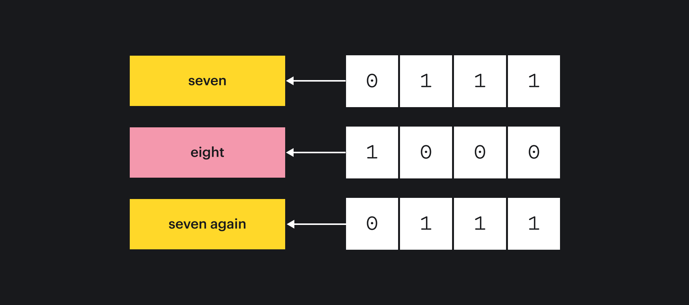

## Кратко

Для хранения различных значений в переменных мы используем разные типы данных. Однако хранятся эти значения по-разному. Примитивные значения (например, числа или строки) хранятся в переменной как есть, а объекты, массивы и функции — по ссылке на место в памяти.

Представим ситуацию, когда у вас в руках есть ложка из набора, и вы кладёте её в какой-то ящик. Такой простой метафорой можно описать присвоение значения в переменную, если представить ящик как переменную, а ложку как значение. Таким образом можно определить и **хранение по значению**. В следующий раз, когда вы захотите взять ложку, вы можете открыть тот же самый ящик и получить это значение-ложку.

Теперь представим, что у нас есть другая ложка — это специальная ложка, удобная, но при этом никто не знает, какого она размера и как её правильно хранить. Но для удобства вам хотелось так же использовать ящик. Поэтому, когда вы открыли этот же ящик, то там уже не лежит эта ложка, зато находится записка о том, где эту ложку можно найти.

В итоге, чтобы получить ложку, нужно обратиться по этому «адресу». Предположим, что теперь все такие ложки лежат в специальной «ложечной», которая может их вместить, и только оттуда их можно достать. А потому, чтобы получить ложку вам нужно обратиться по данному адресу. Аналогичным образом мы можем положить записки с тем же адресом и в другие ящики, чтобы каждый, кто обращался к ящику знал где найти ложку. Теперь ваша ложка **хранится по ссылке**.

**В чем же фундаментальное отличие?**

Отличий несколько, некоторые могут приводить к неприятным последствиями в нашем коде.

То, как будут храниться данные, жёстко связано с типом данных. Нельзя заставить значение примитивного типа храниться по ссылке, и наоборот.

Для того чтобы понять, как хранятся разные типы данных, заглянем в память компьютера.

## Примитивные типы данных

Когда мы объявляем переменную и сохраняем в неё примитивное значение, то в память записывается какое-то количество байт, которое описывает это значение. Таким образом можно сказать, что наша переменная уже сразу содержит эти байты.

```js
const seven = 7 // 0b0111
const eight = 8 // 0b1000
```

Если присвоить какое-то значение переменной в другую, то мы просто скопируем это же количество байт в новое место.

```js
const sevenAgain = seven // 0b0111
```

В итоге все наши переменные можно схематически отобразить таким образом:



Когда мы сравниваем два значения, то у нас по сути произойдёт побайтовое сравнение этих величин.

```js
console.log(seven === sevenAgain)
// true
```


```js
console.log(seven === eight)
// false
```


Из-за того, что все примитивные значения хранятся в небольшом и фиксированном количестве байт, операции над ними выполнять несложно. Такие типы данных называют _примитивными_. В них входят числа ([`number`](/js/number/)), строки ([`string`](/js/string/)), булевы ([`boolean`](/js/boolean/)), а так же специальные значения [`null`](/js/null-primitive/) и [`undefined`](/js/undefined/).

## Ссылочные типы данных

С объектами и другими сложными данными дела обстоят сложнее из-за того, что мы не знаем, какое количество памяти для них понадобится. Во время работы с такой структурой компьютеру необходимо следить за тем, сколько памяти уже есть, сколько понадобится, и выделять новую. Работать с такими данными сложнее. Для этого компьютер отдаёт нам ссылку на место, где данные хранятся, и самостоятельно будет работать с ними по инструкциям, которые мы ему даём. Таким образом в переменную мы получаем лишь ссылку на данные.

```js
const myData = {}
```


Обратите внимание, что направление стрелки поменялось. Так мы обозначим, что наша переменная ссылается на участок памяти.

☝️ Если сейчас присвоить значение из `myData` в другую переменную, то мы скопируем ссылку, а не само значение.

```js
const yourData = myData
```


Такой тип данных называется **ссылочным** и в него входят **объекты**, **массивы** и **функции**. На самом деле и массивы и функции все они так же являются объектами, но это другая история.

Можно ли в таком случае рассчитывать, что значения будут равными? Конечно, можно! В этом случае сравниваться будут ссылки на объект, а не их содержимое. Потому, если обе переменных указываются на одно и то же, смело можно сказать, что значения равны.

```js
const data = {}
const anotherData = data

console.log(data === anotherData)
// true
```

И не стоит забывать, что никакого сравнения по значениям не будет, даже если мы создадим абсолютно одинаковые объекты.

```js
const cat = { name: 'Феликс' }
const dog = { name: 'Феликс' }

// Странно ожидать равность кошки и собаки ¯\_(ツ)_/¯ но теперь мы знаем причину
console.log(cat === dog)
// false
```

Однако факт того, что несколько переменных могут ссылаться на один и тот же объект означает в себе и некоторые другие особенности. Если кто-то из двух владельцев ссылки будет изменять объект, то изменения отразятся на всех.

```js
yourData.name = 'Саша'
console.log(myData)
// { name: 'Саша' }

myData.name = 'Михаил'
console.log(yourData)
// { name: 'Михаил' }
```

Эта особенность часто становится причиной ошибок при работе со ссылочными типами данных, т.к можно легко забыть или даже не знать, что же ещё ссылается на тот же объект.

Если переменная потеряет ссылку на объект, то изменения уже не будут на него влиять

```js
let user = { name: 'Анна', age: 21 }
const admin = user

// Переопределение никак не повлияет на admin, потому что мы создали новый объект
user = { name: 'Иван' }

console.log(admin) // { name: 'Анна', age: 21 }

admin.isAdmin = true

console.log(user) // { name: 'Иван' }
console.log(admin) // { name: 'Анна', age: 21, isAdmin: true }
```

### Мутации и неизменяемость

Изменение значений у полей объекта, добавление или удаление их отразится на всех, кто владеет ссылкой на этот объект. Такие операции называют **мутациями**. В современных веб-разработке мутаций стараются избегать, потому что мутирование объектов может приводить к ошибкам, которые очень трудно отследить. Однако если мы твердо уверены, что объект нигде более не используется или чётко контролируем ситуацию, то изменение объекта напрямую гораздо проще.

Если нужно безопасно модифицировать объект, то для начала придётся его скопировать. Скопировать объект можно двумя способами: через `Object.assign()` или используя [спред-синтаксис `...`](/js/spread/)

```js
const admin = {
  name: 'Анна',
  age: 21,
  isAdmin: true,
}

// Чтобы скопировать через Object.assign() нужно передать пустой объект
const adminCopy = Object.assign({}, admin)

const anotherCopy = {
  ...admin,
}
```

Таким образом будет создана совсем новая сущность, которая будет содержать ровно те же значения. Любые изменения в новом объекте уже не затронут предыдущий.

```js
anotherCopy.age = 30
anotherCopy.isAdmin = false

console.log(anotherCopy)
// {name: 'Анна', age: 30, isAdmin: false }

console.log(admin)
// {name: 'Анна', age: 25, isAdmin: true }
```

Здесь стоит внести важную оговорку о вложенных объектах. При копировании объекта указанным способом копируются только поля верхней вложенности (сработает [поверхностное копирование](/js/shallow-or-deep-clone/)). Любые вложенные объекты **копируются по ссылке**. Их изменение затронет и первоисточник:

```js
const original = {
  b: {
    c: 1,
  },
}

const copy = { ...original }
copy.b.c = 2

// Тоже изменился!
console.log(original)
// { b: { c: 2 }}
```

Изменения можно так же внести при копировании.

```js
const cat = {
  name: 'Феликс',
  color: 'чёрный',
  isHomeless: false,
}

const catInBoots = {
  ...cat,
  name: 'Пушок',
  hasBoots: true,
}

console.log(catInBoots)
// {name: 'Пушок', color: 'чёрный', isHomeless: false, hasBoots: true }

const redCat = Object.assign(cat, { color: 'рыжий', name: 'Борис' })

console.log(redCat)
// {name: 'Борис', color: 'рыжий', isHomeless: false }
```

Если каждый раз создавать объект, когда мы вносим изменения, то такие объекты называют **иммутабельными (immutable)** или **неизменяемыми**. Результатом любой модификации такого объекта всегда должен быть новый объект, при этом старый никак не изменится.

С массивами, кстати, ситуация точно такая же — если изменять содержимое, то изменения отразятся на всех владельцев ссылки. Для копирования массивов, кроме оператора троеточия, можно использовать метод массива `slice()`. Методы [`map()`](/js/array-map/) и [`filter()`](/js/array-filter/) — они тоже создают новый массив. Причём некоторые другие методы (например `sort()`, `splice()`) при использовании мутируют исходный массив, потому использовать их стоит с осторожностью. Подробнее о том, какой метод мутирует массив можно найти на [Does It Mutate](https://doesitmutate.xyz/).

Очевидным минусом использования иммутабельности может быть большее использование памяти, но в реалиях современной разработки это часто не бывает проблемой, учитывая те плюсы, которые мы получаем.

#### Аргументы функций

Про тип данных стоит помнить особенно внимательно при использовании функций. Когда мы используем значение как аргумент функции, то все особенности его типа данных сохраняются:

- При передаче примитивного типа данных, его значение копируется в аргумент.
- При использовании ссылочного типа данных копируется ссылка. Все изменения в объекте, который был передан в качестве аргумента, будут видны всем, кто владеет ссылкой:

```js
const member = { id: '123', name: 'Иван' }

function makeAdmin(user) {
  user.isAdmin = true

  return user
}

const admin = makeAdmin(member)

console.log(admin)
// { id: '123', name: 'Иван', isAdmin: true }
console.log(member)
// { id: '123', name: 'Иван', isAdmin: true }

// Это один и тот же объект
console.log(admin === member)
// true
```

## Заключение

Итак, что мы узнали?

- **Примитивные** типы данных (числа, булевы и строки) хранятся и сравниваются по значению. Можно безопасно менять значение переменной и не бояться, что изменится что-то ещё
- **Ссылочные** типы данных (объекты, массивы) хранятся и сравниваются по ссылке. При этом при сравнении будет учитываться именно факт того, что две переменные ссылаются на один и тот же объект. Даже если два объекта содержат идентичные значения это ни на что не повлияет
- Изменения внутри объекта будут видны всем у кого есть ссылка на этот объект. Прямое изменение данных объекта называется **мутирование**. Лучше стараться избегать мутации объекта, т.к это может приводить к неочевидным ошибкам
- Чтобы безопасно менять ссылочный тип данных его необходимо предварительно скопировать. Таким образом будет создана другая ссылка и любые изменения не затронут старый объект
