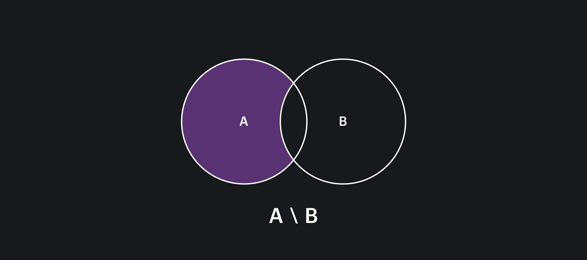

## Кратко

Метод `difference()` сравнивает текущую коллекцию с другой и возвращает новую, состоящую из элементов, входящих только в первую коллекцию.

В математике это называется разность двух множеств и описывается так: разность множеств A и B – это множество, в которое входят все элементы множества A, не входящие в множество B.

Это можно выразить формулой:

```
A \ B = { x ∈ A | x ∉ B }
```



## Пример

Допустим, у нас есть два списка имён в виде коллекций строк. Необходимо сравнить эти коллекции и получить список имён, встречающихся только в первой коллекции:

```js
const names1 = new Set(['Аглая', 'Настасья', 'Елизавета', 'Соня'])
const names2 = new Set(['Лев', 'Родион', 'Настасья'])

const diff = names1.difference(names2)

console.log(diff)
// Set(3) { 'Аглая', 'Елизавета', 'Соня' }
```

## Как пишется

Метод `difference()` принимает один обязательный аргумент — объект, содержащий коллекцию для вычисления разности. Если аргумент не указан, будет брошено исключение `TypeError`.

Аргументом может быть как `Set`-объект, так и Set-подобный объект, например, [`Map`](/js/map/).

Метод `difference()` возвращает новый [`Set`-объект](/js/set/), содержащий разность исходной и указанной коллекций. Порядок элементов будет соответствовать порядку элементов в исходной коллекции.

## Как понять

В случае использования коллекций часто требуется выполнять над ними операции как с математическими множествами. Одна из распространённых операций над множествами — разность двух множеств.

Метод `difference()` сравнивает и получает разность двух коллекций без необходимости писать дополнительный код обхода коллекций.

Поддержка метода `difference()` в основных браузерах и в [Node.js](/tools/nodejs/) появилась в 2024 году. Например, если попробовать использовать `difference()` в Node.js ниже версии v.22.0.0, это приведёт к ошибке:

```js
const painters = new Set(['Леонардо','Микеланджело','Рафаэль'])
const turtles = new Set(['Донателло','Рафаэль'])
try {
  console.log(painters.difference(turtles))
} catch (err) {
  console.error('Поймали ошибку! Вот она: ', err.message)
}
// Поймали ошибку! Вот она: painters.difference is not a function
```
