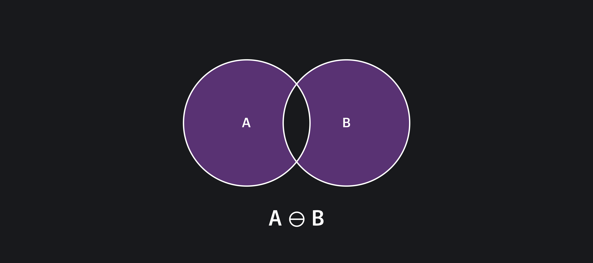

## Кратко

Метод `symmetricDifference()` сравнивает текущую коллекцию с другой и возвращает новую, состоящую из элементов, входящих только в одну из коллекций.

В математике это называется симметрическая разность двух множеств. Она описывается так: симметрическая разность множеств A и B — это множество, которое состоит из элементов, находящихся только в множестве А, либо только в множестве B.

Это можно выразить формулой:

```
A ⊖ B = ( A \ B ) ∪ ( B \ A)
```



## Пример

Два коллекционера винилов The Beatles решили создать перечень уникальных альбомов, встречающихся только в одной из двух коллекций. Нужно сравнить две коллекции и получить список альбомов, встречающихся или только в первой, или только во второй коллекции. В этом им поможет метод `symmetricDifference()`:

```js
const albumList1 = new Set(['White Album', 'Revolver', 'Help!'])
const albumList2 = new Set(['Revolver', 'Rubber Soul', 'Help!', 'Abbey Road'])

const result = albumList1.symmetricDifference(albumList2)

console.log(result)
// Set(3) { 'White Album', 'Rubber Soul', 'Abbey Road' }
```

## Как пишется

Метод `symmetricDifference()` принимает один обязательный аргумент — объект, содержащий коллекцию для вычисления разности. Если аргумент не указан, будет брошено исключение `TypeError`.

Аргументом может быть как [`Set`-объект](/js/set/), так и `Set`-подобный объект, например, [`Map`](/js/map/).

Метод `symmetricDifference()` возвращает новый `Set`-объект, содержащий симметрическую разность исходной и указанной коллекций. Порядок элементов будет соответствовать порядку исходной, а затем указанной коллекции.

## Как понять

Метод `symmetricDifference()` позволяет получить уникальные для двух коллекций элементы без необходимости писать дополнительный код обхода и сравнения.

Поддержка метода `symmetricDifference()` в основных браузерах и в [Node.js](/tools/nodejs/) появилась в 2024 году. Если попробуете использовать метод в более ранних версиях, это приведёт к ошибке.
