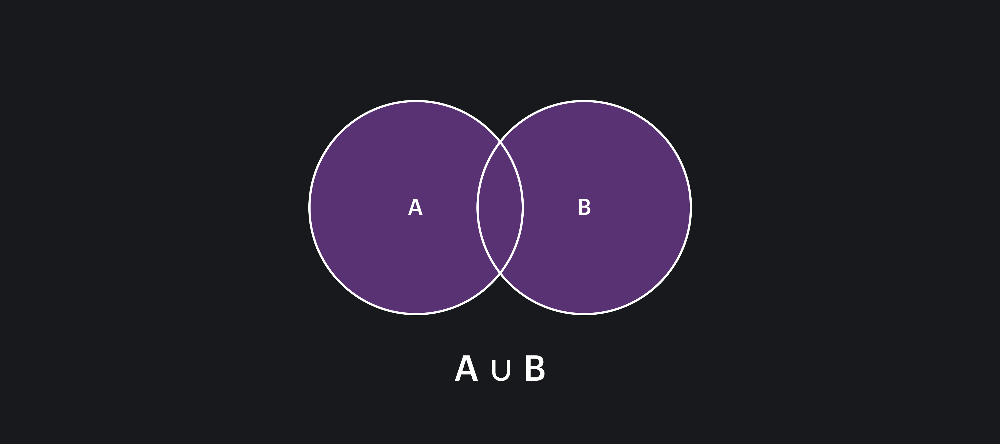

## Кратко

Метод `union()` объединяет текущую коллекцию с другой и возвращает новую, состоящую из элементов, которые есть в любой из коллекций.

В математике это называется объединением двух множеств. Оно описывается так: объединение множеств A и B — это множество, которое состоит из элементов, находящихся в любом из множеств А и B.

Это можно выразить формулой:

```
A ∪ B = { x | x ∈ A ∨ x ∈ B }
```



## Пример

В двух последних проектах инженер Фёдор использовал определённый стек технологий. При составлении CV, Фёдор решает перечислить навыки, которыми он теперь обладает. Нужно сравнить две коллекции и получить список технологий, используемых хотя бы в одном из проектов. В этом Фёдору поможет метод `union()`:

```js
const project1 = new Set(['PHP', 'Bash', 'Docker', 'JavaScript', 'CSS'])
const project2 = new Set(['Docker', 'JavaScript', 'Bash', 'Postgres', 'MongoDB'])

const result = project1.union(project2)

console.log(result)
// Set(7) {
//   'PHP',
//   'Bash',
//   'Docker',
//   'JavaScript',
//   'CSS',
//   'Postgres',
//   'MongoDB'
// }
```

## Как пишется

Метод `union()` принимает один обязательный аргумент — объект, содержащий коллекцию для объединения. Если аргумент не указан, будет брошено исключение `TypeError`.

Аргументом может быть как [`Set`-объект](/js/set/), так и `Set`-подобный объект, например, [`Map`](/js/map/).

💡 `Set`-подобный (Set-like) объект должен иметь свойство `size` и методы `has()` и `keys()`. Обычный массив, а также [`WeakSet`-объект](/js/weak-set/) не являются `Set`-подобными объектами, так как не обладают всеми требуемыми свойствами и методами.

Метод `union()` возвращает новый `Set`-объект, содержащий объединение исходной и указанной коллекций. Порядок элементов будет соответствовать порядку исходной, а затем указанной коллекции.

## Как понять

Метод `union()` позволяет объединять две коллекции элементов без необходимости писать дополнительный код обхода и сравнения.

Поддержка метода `union()` в основных браузерах и в [Node.js](/tools/nodejs/) появилась в 2024 году. Если попробуете использовать метод в более ранних версиях, это приведёт к ошибке.
