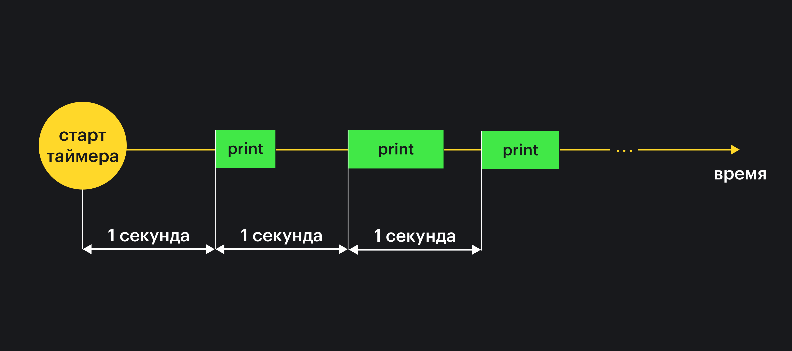

## Кратко

`setInterval()` позволяет регулярно исполнять функцию через указанный промежуток времени.

## Пример

Раз в секунду напечатать текст в консоль:

```js
const intervalId = setInterval(function() {
  console.log('Я выполняюсь каждую секунду')
}, 1000)
```

## Как пишется

Функция `setInterval()` принимает два аргумента:
- функцию, которая будет регулярно выполняться при истечении таймера;
- время в миллисекундах между запусками функции.

<aside>

⏱ Миллисекунда – это одна тысячная доля секунды. Одна секунда состоит из 1000 миллисекунд.

</aside>

Возвращает идентификатор установленного таймера. Индикатор передаётся в функцию [`clearInterval`](/js/clearinterval/), чтобы остановить регулярное выполнение функции.

Есть вариант вызова `setInterval()` с произвольным количеством аргументов. Тогда все аргументы после второго будут передаваться в выполняемую функцию:

```js
setInterval(function(name, age) {
  console.log(`Раз в секунду печатаю имя «${name}» и ${age}`)
}, 1000, 'Ivan', 33)

// Раз в секунду печатаю имя «Иван» и 33
```

Этот вариант вызова используется редко.

## Как понять

В JavaScript код выполняется [по порядку сверху вниз](/js/execution-order/). Если интерпретатор встречает вызов функции, то он сразу выполняет её. Но разработчику может понадобится запланировать вызов функции, чтобы она выполнилась регулярно через заданные промежутки времени. Например, чтобы регулярно проверять обновления данных на сервере.

Запланировать регулярное выполнение функции по расписанию можно с помощью `setInterval()`. Выполнение `setInterval()` создаёт активный таймер в окружении браузера. Таймеры имеют числовой идентификатор, он хранится в браузере в [списке активных таймеров](https://html.spec.whatwg.org/multipage/timers-and-user-prompts.html#list-of-active-timers). Этот идентификатор нужно использовать, чтобы остановить регулярное выполнение функции.

### Время между запусками

Указанное вторым аргументом число в миллисекундах обозначает время между запусками функции. При этом не учитывается время работы самой функции.

Рассмотрим пример:

```js
let i = 1
setInterval(function print() {
  console.log(i)
  i++
}, 1000)
```



Если функция выполняется долго, то может сложиться ситуация, когда следующая функция вызывается сразу после завершения текущей, потому что указанное время вышло.
