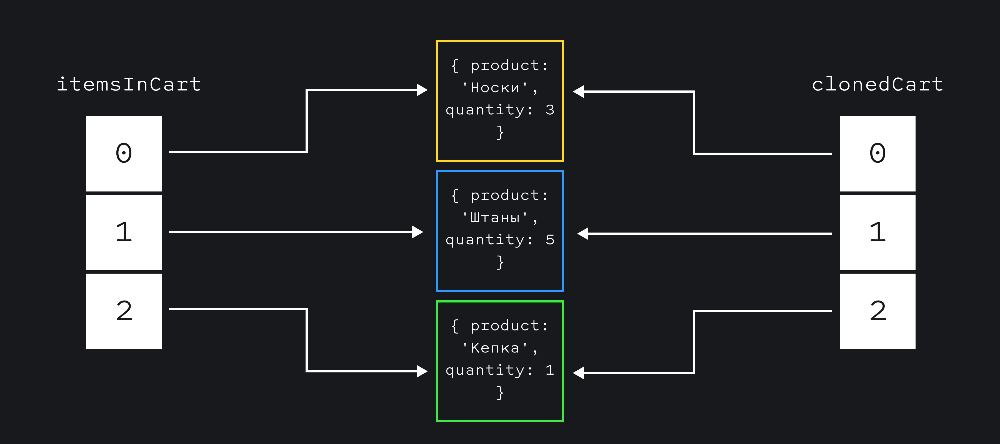
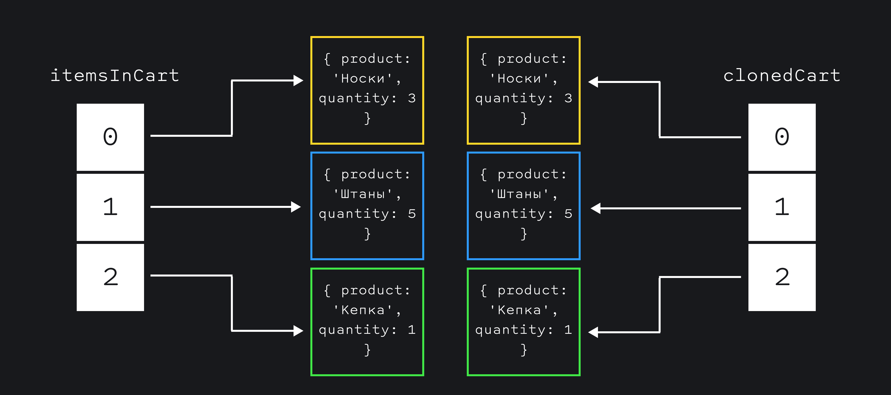

## Кратко

При копировании объектов или массивов JavaScript копирует данные только на один уровень вглубь. Этот тип копирования называется _поверхностным_ (shallow).

Если необходимо полностью скопировать сложную структуру данных, например, массив с объектами, то нужно делать _глубокое_ (deep) или полное копирование данных. JavaScript не содержит функций для глубокого копирования, лучший вариант сделать глубокую копию — сериализовать структуру в [JSON](/tools/json/) и тут же распарсить.

## Как понять

### Проблема поверхностного копирования

Поверхностное копирование работает быстро и в большинстве случаев его достаточно. Проблемы появляются, когда приходится копировать вложенные структуры:

```js
const itemsInCart = [
  { product: 'Носки', quantity: 3 },
  { product: 'Штаны', quantity: 1 },
  { product: 'Кепка', quantity: 1 },
]

const clonedCart = [...itemsInCart]
```

Если изменять элементы этой структуры после копирования, то эти изменения будут также видны в исходной структуре:

```js
clonedCart[1].quantity = 5

console.log(clonedCart)
// [
//    { product: 'Носки', quantity: 3 },
//    { product: 'Штаны', quantity: 5 },
//    { product: 'Кепка', quantity: 1 },
// ]

console.log(itemsInCart)
// [
//    { product: 'Носки', quantity: 3 },
//    { product: 'Штаны', quantity: 5 },
//    { product: 'Кепка', quantity: 1 },
// ]
```

Непримитивные типы данных, такие как массивы и объекты, хранятся [по ссылке](/js/ref-type-vs-value-type/#ssylochnye-tipy-dannyh). Так как копирование происходит только на один уровень вглубь, то при копировании массива происходит копирование _ссылок на старые объекты_ в новый массив.

В итоге получается картина, когда разные массивы ссылаются на одни и те же объекты в памяти:

```js
console.log(itemsInCart[1] === clonedCart[1])
// true
```



### Как получить глубокую копию

JavaScript не содержит отдельных функций для глубокого копирования массивов или объектов. Существуют различные способы сделать глубокое копирование.

Можно написать функцию глубокого копирования вручную. Скорее всего ваша функция будет [рекурсивной](/js/recursion/), и она будет работать только для конкретных данных — написать универсальную функцию не так-то просто.

Можно воспользоваться готовой библиотекой. Например, функцию глубокого копирования содержит популярная библиотека утилит [_lodash_](https://lodash.com/docs/4.17.15#cloneDeep). Функция гарантировано работает в подавляющем большинстве случаев, потому что используется в десятках тысяч проектов каждый день. Исходный код библиотеки открыт, можно изучить [исходный код функции глубокого копирования](https://github.com/lodash/lodash/blob/4.17.15/lodash.js#L2620).

```js
import cloneDeep from 'lodash.clonedeep'

const deep = cloneDeep(itemsInCart)
console.log(itemsInCart[1] === deep[1])
// false
```

Самый быстрый способ глубокого копирования звучит глупо — нужно сериализовать копируемый объект в JSON и тут же распарсить его. В результате появится полная копия объекта:

```js
const deep = JSON.parse(JSON.stringify(itemsInCart))
console.log(itemsInCart[1] === deep[1])
// false
```



У этого метода есть ограничение — копируемые данные должны быть сериализуемыми. Если объект содержит методы или массив содержит функции, то копирование с помощью JSON-преобразования не сработает:

```js
const fns = [
  function() { console.log('aaa') },
  function() { console.log('bbb') },
]
const copyFns = JSON.parse(JSON.stringify(fns))

console.log(copyFns)
// [null, null]
```
