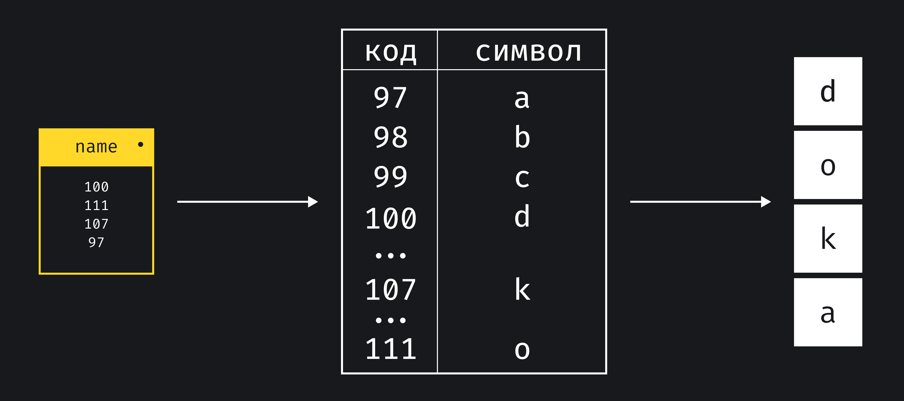

## Кратко

Любые текстовые данные в JavaScript — это строки (англ. _string_). Строки представляют собой последовательность символов. Созданная строка является иммутабельной (immutable) и не может быть изменена.

## Как пишется

Есть несколько способов создать строку:
- одинарными кавычками `'`;
- двойными кавычками `"`;
- [шаблонной строкой](/js/template-strings/) через обратный апостроф `` ` ``.

Записи одинарными и двойными кавычками идентичны:

```js
const double = "Окна были распахнуты настежь, и булыжник мостовой просыхал после дождя."
const single = 'Солнце высушивало мокрые лица домов напротив моего окна'
```

Можно создать пустую строку или строку из пробелов:

```js
const empty = ''
const spaces = '   '
```

Если в записи одинарными кавычками нужно поставить апостроф, то символ _экранируют_ обратным слэшем `\`. Так мы даём JavaScript понять, что это просто символ, а не закрывающая кавычка:

```js
const who = 'I\'m a good person.'
```

Шаблонные строки позволяют подставлять в строку значения переменных. Между обратными апострофами пишется текст, а в местах, где нужно вставить значение из переменной используется синтаксис `${имя_переменной}`:

```js
const product = 'Штаны'
const qty = 1

console.log(`Набор программиста: ${product}, ${qty}шт.`)
// Набор программиста: Штаны, 1шт.
```

Детальное описание работы с шаблонными строками, читайте в статье [«Шаблонные строки»](/js/template-strings/).

## Как понять

Строка сложно устроена внутри, несмотря на то, что это примитив. Визуально текст представляет собой последовательность символов, но как компьютер хранит эти символы?

Символ, который видно на экране хранится в компьютере как одно или несколько чисел, каждое такое число называют _юнитом_. Компьютер хранит таблицу в которой числу соответствует символ. Такие таблицы называют _кодировкой_.

В JavaScript используется кодировка [UTF-16](https://ru.wikipedia.org/wiki/UTF-16), самая распространённая в мире. Таблица этой кодировки настолько большая, что покрывает не только все современные алфавиты и иероглифические системы записи, но и шумерскую клинопись, и древнеегипетские иероглифы. Эмодзи тоже содержатся в этой таблице, поэтому нам не нужно ничего устанавливать на компьютер чтобы видеть их 🙌



Отдельный символ строки можно получить по порядковому номеру символа в строке, он начинается с 0:

```js
const greeting = 'Привет!'

console.log(greeting[0])
// П
console.log(greeting[3])
// в
```

### Операции со строками

Для строк определена операция сложения, её также называют конкатенацией строк. При сложении двух строк получается новая строка, склеенная из исходных:

```js
const desire = 'Я хочу'
const food = 'пельменей'

const bad = desire + food
console.log(bad)
// Я хочупельменей

const good = desire + ' ' + food
console.log(good)
// Я хочу пельменей
```

Строки можно сравнивать между собой, для сравнения используется лексикографический порядок. Это означает, что первые символы алфавита считаются меньше последних.

Алгоритм посимвольно сравнивает строки до первого несовпадения, либо пока не закончится одна из строк. Например, для произвольных строк `s1` и `s2`:

1. Сравниваются символы `s1[0]` и `s2[0]`. Если символы разные, то большей будет та строка, символ которой больше. Сравнение завершено.
1. Если первые символы совпали, аналогично проверяем вторые символы. Продолжаем, пока не найдём несовпадение или не закончится одна из строк.
1. Если строки закончились одновременно, то они равны. Если закончилась одна из строк, то большей строкой считается строка с большим количеством символов.

```js
console.log('А' > 'Я')
// false
console.log('Кот' > 'Код')
// true
console.log('Код' > 'Кодер')
// false
console.log('Код' === 'Код')
// true
```

Сравнение учитывает регистр букв, если необходимо регистронезависимое сравнение, то обе строки приводятся к верхнему или нижнему регистру с помощью методов `toUpperCase` или `toLowerCase`:

```js
const capitalized = 'Арбуз'
const lowercased = 'арбуз'
console.log(capitalized === lowercased)
// false

console.log(capitalized.toLowerCase() === lowercased.toLowerCase())
// true
```

### Специальные символы

Когда компьютеры только появились, главным способом взаимодействия с компьютером был текст. Неформатированный текст сложно воспринимать, поэтому появились специальные символы, которые обозначали различные операции, которые нужно сделать с текстом при выводе на экран.

На сегодняшний день актуальными остаются два таких символа:

- `\n` — начало новой строки;
- `\t` — табуляция, аналогично нажатию кнопки Tab.

Если эти символы есть в строке, то при печати на экран будет выполнено указанной действие:

```js
const phrase = 'Мы —\n\tЭдисоны\n\t\tневиданных взлётов,\n\t\t\tэнергий\n\t\t\t\tи светов.'
console.log(phrase)
// Мы —
//     Эдисоны
//         невиданных взлётов,
//             энергий
//                 и светов.
```

### Длина строки

Часто используемая операция над строкой — получение её длины:

```js
const str = 'Строка текста неизвестной длины'
console.log(str.length)
// 31
```

Эта операция может вернуть неверное количество символов в строке в тех случаях, когда используются эмодзи. Такой пример рассмотрен в [статье о свойстве `length` строки](/js/string-length/).

### Дополнительные методы

Сам по себе примитивный тип «строка» не имеет методов. Когда происходит вызов метода, оно автоматически оборачивается в специальную обёртку, которая и содержит методы:

```js
const lowercased = 'арбуз'

console.log(lowercased.toUpperCase())
// АРБУЗ
```

Методы обёртки часто используются, они подробно описаны в [отдельной статье](/js/string-wrapper/).
