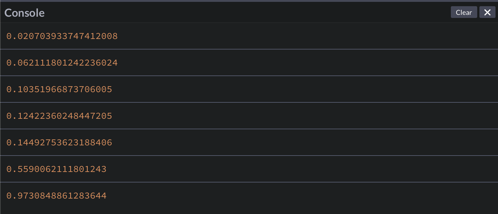

## Кратко

На современных сайтах встречаются элементы, которые обновляются по мере прокрутки страницы или при изменении её размеров.

Просто запускать сложные и дорогостоящие операции на события `scroll` и `resize` — расточительно, потому что это может сильно нагрузить браузер и плохо сказаться на производительности.

Вместо этого можно обрабатывать изменения «раз в какое-то количество времени», используя `throttle`.

<aside>

💡 `throttle()` — это функция, которая вызывает другую функцию, «пропуская» некоторые вызовы с определённой периодичностью.

</aside>

<video controls muted width="580" poster="images/poster.png">
  <source src="video/1.mp4" type="video/mp4">
  <source src="video/1_safari.mp4" type="video/mp4">
</video>

## Дизайн и задача

Представим, что дизайнеры попросили нас сделать горизонтальный прогресс-бар, который бы показывал, какую часть статьи пользователь успел прочесть.

Этот элемент в начале страницы должен показывать 0%, а при прокрутке менять значение. Вот так:

<video controls muted width="800">
  <source src="video/demo.mp4" type="video/mp4">
  <source src="video/demo_safari.mp4" type="video/mp4">
</video>

Мы не будем обращать внимания, что у нас уже есть полоса прокрутки справа, а примем задачу как данность.

## Разметка и стили

В разметке у нас будет только шапка и статья:

```html
<header>
  <!-- В качестве прогресс-бара
      будем использовать элемент progress 😃 -->
  <progress value="0" max="100">
</header>
<main>
  <!-- Много-много-много текста... -->
</main>
```

В стилях ограничим всё по ширине и отцентрируем:

```css
/* Зафиксируем прогресс-бар наверху страницы: */
progress {
  position: fixed;
  top: 0;
  left: 20px;
  right: 20px;
  width: calc(100% - 40px);
  max-width: 800px;
  margin: auto;
}

main {
  padding-top: 15px;
  max-width: 800px;
  margin: auto;
}
```

## Обработчик прокрутки

Сперва напишем обработчик прокрутки без оптимизаций.

```javascript
// В переменной progress будем хранить
// ссылку на элемент, показывающий прогресс чтения.
const progress = document.querySelector('progress')

// Функция recalculateProgress будет пересчитывать,
// какую часть страницы пользователь уже успел прочесть.
function recalculateProgress() {
  // Высота экрана:
  const viewportHeight = window.innerHeight
  // Высота страницы:
  const pageHeight = document.body.offsetHeight
  // Текущее положение прокрутки:
  const currentPosition = window.scrollY

  // Из высоты страницы вычтем высоту экрана,
  // чтобы при прокручивании до самого низа
  // прогресс-бар заполнялся до конца.
  const availableHeight = pageHeight - viewportHeight

  // Считаем процент «прочитанного» текста:
  const percent = (currentPosition / availableHeight) * 100

  // Проставляем посчитанное значение
  // в качестве значения для value прогресс-бара:
  progress.value = percent
}
```

Теперь повесим пересчёт на событие прокрутки `scroll`, а также на событие изменения размеров страницы `resize` — чтобы следить за изменениями высоты и страницы, и статьи.

```javascript
window.addEventListener('scroll', recalculateProgress)
window.addEventListener('resize', recalculateProgress)
```

## Пишем `throttle()`

Конкретно в этом примере мы не заметим особой разницы в производительности. В `recalculateProgress()` не выполняется много особо дорогостоящих операций. Мы используем простой пример, чтобы было проще вникнуть в концепцию и не отвлекаться от самого `throttle()`.

Однако мы можем посмотреть, сколько раз функция выполняется в обоих случаях, используя [`console.log()`](/js/console-log/):



Мы прокрутили совсем немного (около 40–50 пикселей), но функция вызвалась аж 7 раз

С интервалом пропускания в 50 мс, ситуация улучшилась в 2,5 раза (3 события), а с интервалом в 150 мс стало лучше в 3,5 раза (2 события).

Если представить, что при прокрутке мы «много считаем чего-то сложного», то прокрутка начнёт заметно тормозить.

`throttle()` решает эту проблему, «пропуская» некоторые вызовы функции-обработчика. Она будет принимать функцию, которую необходимо «попропускать».

<aside>

💡 Такие функции, которые принимают другие функции как аргументы или возвращают функцию как результат, называются функциями высшего порядка.

</aside>

<aside>

☝️ ...А иногда такой приём ещё называют декорированием, а функции высшего порядка — [декораторами](/tools/design-patterns-structural/).

</aside>

Итак, `throttle` — это функция высшего порядка, которая будет принимать аргументом функцию, которую надо «попропускать».

```js
// Функция throttle будет принимать 2 аргумента:
// - callee, функция, которую надо вызывать;
// - timeout, интервал в мс, с которым следует пропускать вызовы.
function throttle(callee, timeout) {
  // Таймер будет определять,
  // надо ли нам пропускать текущий вызов.
  let timer = null

  // Как результат возвращаем другую функцию.
  // Это нужно, чтобы мы могли не менять другие части кода,
  // чуть позже мы увидим, как это помогает.
  return function perform(...args) {
    // Если таймер есть, то функция уже была вызвана,
    // и значит новый вызов следует пропустить.
    if (timer) return

    // Если таймера нет, значит мы можем вызвать функцию:
    timer = setTimeout(() => {
      // Аргументы передаём неизменными в функцию-аргумент:
      callee(...args)

      // По окончании очищаем таймер:
      clearTimeout(timer)
      timer = null
    }, timeout)
  }
}
```

Теперь мы можем использовать его вот так:

```js
// Функция, которую мы хотим «пропускать»:
function doSomething(arg) {
  // ...
}

doSomething(42)

// А вот — та же функция, но обёрнутая в throttle:
const throttledDoSomething = throttle(doSomething, 250)

// throttledDoSomething — это именно функция,
// потому что из throttle мы возвращаем функцию.

// throttledDoSomething принимает те же аргументы,
// что и doSomething, потому что perform внутри throttle
// прокидывает все аргументы без изменения в doSomething,
// так что и вызов throttledDoSomething будет таким же,
// как и вызов doSomething:
throttledDoSomething(42)
```

## Применяем `throttle()`

Теперь мы можем применить `throttle()` для оптимизации обработчика:

```js
function throttle(callee, timeout) {
  /* ... */
}

// Указываем, что нам нужно ждать 50 мс,
// прежде чем вызвать функцию заново:
const optimizedHandler = throttle(recalculateProgress, 50)

// Передаём новую throttled-функцию в addEventListener:
window.addEventListener('scroll', optimizedHandler)
window.addEventListener('resize', optimizedHandler)
```

Обратите внимание, что API функции не поменялось. То есть для внешнего мира throttled-функция ведёт себя точно так же, как и простая функция-обработчик.

Это удобно, потому что меняется лишь одна небольшая часть программы, не затрагивая системы в целом.

### Результат

Пример такого прогресс-бара получится таким:

<iframe title="Прогресс-бар для статьи — Throttle на примере изменения страницы при прокрутке — Дока" src="demos/article-progress/" height="500"></iframe>
