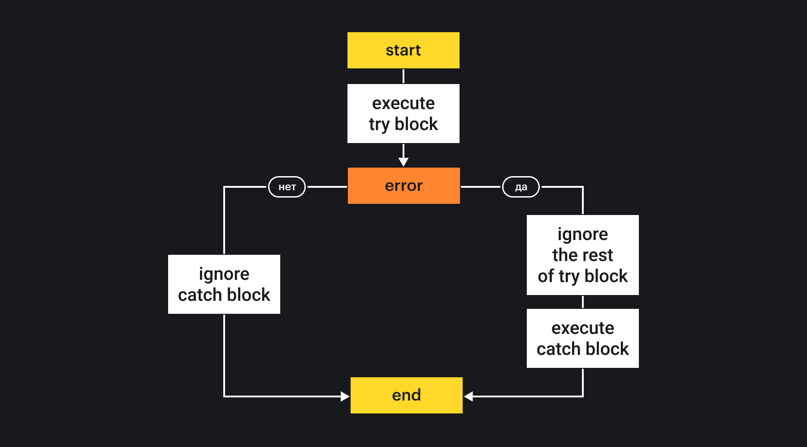
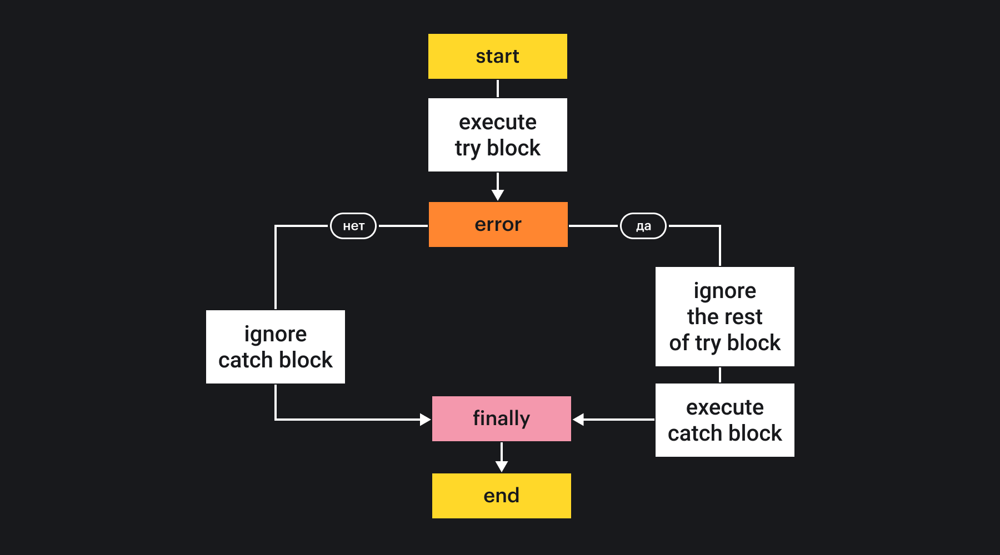

## Кратко

Конструкция `try...catch` позволяет выполнить произвольный код, но если в нем произошла ошибка, то программа не остановит своё выполнение, а перейдёт в блок `catch`, где ошибку можно обработать.

## Как понять

Ошибки в программах это очень неприятно, но никто не застрахован от их появления. К тому же, ошибки могут появляться в тех ситуациях, которые не зависят от нас самих. Например, пользователь неправильно воспользовался программой. Поэтому в языке необходимы конструкции, которые позволяют выполнить произвольный код, но в случае ошибки дать возможность её обработать.

В JavaScript ситуация ещё сложнее. Если во время работы скрипта возникла ошибка и она не была обработана, то выполнение останавливается, и программа больше не работает.

Конструкция `try...catch` делает программы стабильнее — в случае ошибки мы можем продолжить выполнение. Мы можем написать любой синтаксически верный код и, если он выполнится без ошибок, то отлично. Если же что-то пойдёт не так, то выполнится код, написанный в `catch`.

Представьте, что вы тренируетесь отбивать мяч в бейсбол. У вас есть партнёр, который будет __ловить__ мяч, в случае вашей __ошибки__, если отбить мяч не удастся. В большинстве __попыток__ у вас все будет получаться хорошо, но если же случится промах, то второй игрок поймает мяч и вернёт его на место, чтобы можно было попробовать снова.

С пойманной в `catch` ошибкой можно поступить как угодно: отправить данные в специальный логгер, обработать данные из неё и даже выбросить новую ошибку, которая может быть поймана в другом месте и т.д.

## Как пишется

### Базовый случай

Чтобы использовать `try...catch`, необходимо в блоке `try` написать код, который нужно исполнить, а в блоке `catch` написать, что делать в случае ошибки.

```js
try {
  someFunction()
  anotherFunction()
} catch (err) {
  console.log('Поймали ошибку! Вот она: ', err.message)
}
```

Если в блоке `try` не произошло ошибок, то код в блоке `catch` не выполнится.

Важно помнить, что код в `try` должен быть _синтаксически верным_. Если написать невалидный код (например, не закрыть фигурные скобки), то скрипт не запустится, потому что JavaScript не поймёт код. Ошибки, которые обработает блок `catch`, будут ошибками во время выполнения программы.

В случае ошибки выполнение в блоке `try` прерывается и сразу же переходит в блок `catch` . После него скрипт продолжит своё выполнение, как и прежде.

```js
try {
  const six = 6 // 1. Создаём константу
  console.log(six) // 2. Выведет 6

  six = 7 // Ошибка! Присваиваем новое значение в const

  // с этого места управление переходит в catch

  const nine = 9 // не выполнится
  console.log(six + nine) // и это тоже не исполнится
} catch (err) {
  console.log('Поймали ошибку!') // 3. Обработали ошибку
}

console.log('Что ж, можно и продолжать') // 4. Будет выполняться дальше
```



### `finally`

Рассмотрим ситуацию, когда в случае успеха или неудачи выполнения какого-то участка кода нам необходимо проводить какие-то действия, чтобы корректно завершить работу скрипта.

```js
try {
  // подключаемся к вебсокету, но в конце нужно обязательно отключиться
  webSocket.connect('ws://....')

  callMayThrowError()
} catch (err) {
  ...
}

// Пробуем отключаться после try...catch
webSocket.disconnect('ws://....')
```

Казалось бы никаких проблем с этим кодом быть не должно, ведь неважно выполнится код в блоке `try` правильно или попадёт в `catch`, следующая строчка должна выполниться. Однако возможна ситуация, что в блоке `catch` тоже возникнет ошибка, и тогда выполнение следующей строчки уже не случится.

```js
function doSomeWithError(e) {
  throw new Error('new error')
}

try {
  // подключаемся к вебсокету, но в конце нужно обязательно отключиться
  webSocket.connect('ws://....')

  callMayThrowError()
} catch (err) {
  // Здесь тоже может возникнуть ошибка
  doSomeWithError(err)
}

// В случае ошибки эта строчка уже не выполнится
webSocket.disconnect('ws://....')
```

Как же тогда гарантированно освободить ресурсы при любом исходе выполнения?

В конструкцию `try...catch` можно добавить блок `finally`, который выполнится после блоков `try` и `catch`. Неважно какой код выполнился в предыдущих блоках, после их завершения (даже если из `catch` была выброшена новая ошибка) исполнится код в блоке `finally`.

```js
try {
  webSocket.connect('ws://....')

  callMayThrowError()
} catch (err) {
  // Здесь тоже может возникнуть ошибка
  doSomeWithError(err)
} finally {
  // Выполнится всегда
  webSocket.disconnect('ws://....')
}
```



Наличие блока `finally` необязательно. `finally` можно использовать и без блока `catch`.

```js
try {
  // Отправить данные на сервер, здесь нам неважна обработка ошибки
  sendData()
} finally {
  // Закрыть соединение при любом результате
  closeConnection()
}
```

### Ошибки в catch

Может возникнуть ситуация, когда скрипт обработки ошибки тоже может сломаться. При этом могут возникнуть случаи, когда мы хотим намеренно выбросить новую ошибку из `catch`, или пробросить текущую, чтобы её обработать в другом месте.

Хорошей практикой считается обрабатывать в модуле только те ошибки, которые связаны непосредственно с ним, а все остальные пробрасывать дальше.

```js
// parse-module.js

// Есть свой тип ошибки
class ParsingError extends Error {
  ...
}

function parse(data) {
  try {
    parseData(data)
  } catch (err) {
    if (err.name !== 'ParsingError') {
      // Другой тип ошибок пробрасываем дальше
      throw err
    }

    logError(err)
}
}
```

Таким образом, можно разделить ответственность, а обработкой проброшенной ошибки займётся внешний catch.

```js
import parse from 'parse-module'

try {
  parse(data)
} catch (e) {
  console.log('Неизвестная ошибка парсинга:', e)
}
```

### Ошибки в асинхронном коде

Конструкция `try...catch` работает только синхронно. Таким образом, с помощью `try...catch` нельзя обработать ошибку, которая возникла в асинхронном коде.

```js
try {
  // Код выполнится корректно, т.к. отсюда вернулся промис
  Promise.reject('err')
} catch (e) {
  // Ошибка не будет поймана
  console.log('Ошибка', e)
}

try {
  // Здесь также код выполнится корректно, потому что установил таймаут без ошибок
  setTimeout(() => {
    throw Error('ошибка')
  }, 1000)
} catch (e) {
  // Ошибка из таймаута также сюда не попадёт
  console.log('Ошибка', e)
}
```

Однако, если записать асинхронный код в синхронном стиле с помощью [async/await](/js/async-await/), то в этом случае обработку ошибок можно осуществлять с помощью `try...catch`.

```js
async function handlePromise() {
  try {
    // Промис вернется с ошибкой
    await Promise.reject('err')
  } catch (e) {
    // Теперь ошибка будет поймана
    console.log('Ошибка', e) // err
  }
}

handlePromise()
```

Чтобы поймать ошибку из [`setTimeout()`](/js/settimeout/), блоки `try...catch` должны находиться внутри функции.
