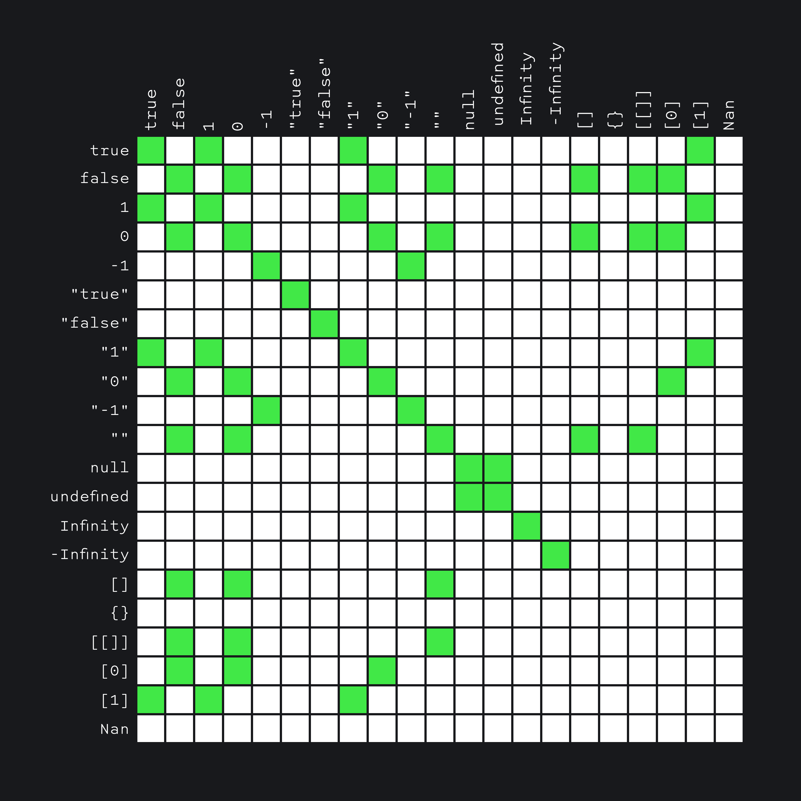
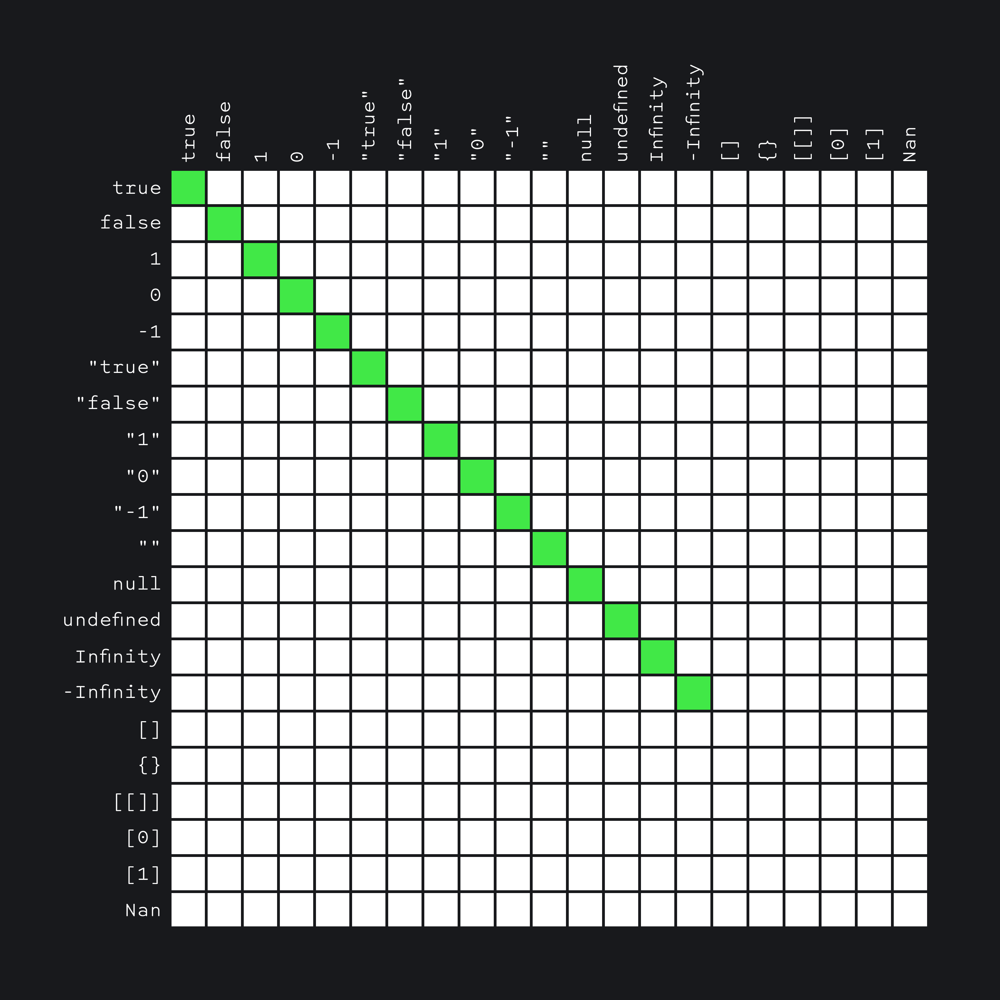

## Кратко

Представим ситуацию: у нас есть форма с полем, в которое пользователь вписывает свой возраст в годах.

По умолчанию любой ввод в полях — это [строка](/js/string/). Если мы хотим работать с этим значением, как с [числом](/js/number/), то нам нужно _привести его к числу_.

Приведение (или преобразование) типов — это процесс конвертации значения из одного типа в другой.

В JavaScript типы можно преобразовывать явно и неявно.

Когда мы вызываем функцию, чтобы получить конкретный тип — это явное преобразование:

```js
const x = '4'
Number(x)

const y = 4
String(y)
```

Сравнение бывает строгим и нестрогим. При строгом сравнении (`===`) интерпретатор учитывает типы сравниваемых значений.

Когда же мы _[сравниваем значения нестрого](https://developer.mozilla.org/ru/docs/Web/JavaScript/Reference/Operators/Операторы*сравнения#Равно)_ между собой с помощью `==`, JavaScript приводит типы самостоятельно:

```js
console.log(5 == '5')
// true
console.log(5 === '5')
// false
```

Чтобы понять, почему так, нам надо сперва разобраться, какие типы в JS есть.

Сперва проведём границу между примитивными типами, объектами и другими.

## Примитивные типы

В JavaScript [примитивные типы](/js/#primitivnye-tipy-dannyh) следующие:

```js
// 1. Undefined
typeof undefined === 'undefined'

// 2. Boolean, логический
typeof true === 'boolean'
typeof false === 'boolean'

// 3. Number, число
typeof 42 === 'number'
typeof 4.2 === 'number'
typeof -42 === 'number'
typeof Infinity === 'number'
typeof -Infinity === 'number'

// 4. String, строка
typeof '' === 'string'
typeof 'string' === 'string'
typeof 'number' === 'string'
typeof 'boolean' === 'string'

// 5. Symbol, символ, ES6
typeof Symbol() === 'symbol'

// 6. BigInt, большое число, ES6
typeof 9007199254740991n === 'bigint'
typeof BigInt(9007199254740991) === 'bigint'

// 7. Null
typeof null === 'object'
// О том, почему здесь “object” — чуть позже.
```

Примитивные типы — это такие типы, значения которых можно только перезаписать, но нельзя изменить.

Например, если мы создали переменную со значением `42`, изменить это значение будет нельзя. Мы сможем его только полностью перезаписать:

```js
let theAnswerToUltimateQuestion = 42
theAnswerToUltimateQuestion = 43
// Новое значение полностью перезаписало старое;
// старое собрано сборщиком мусора и забыто.

let theAnswers = [42, 43, 44]
theAnswers[0] = 142
// Теперь значение переменной [142, 43, 44];
// мы не перезаписали его полностью, а лишь изменили часть.
```

Этот механизм связан с тем, как значения переменных хранятся в памяти. Мы не пойдём слишком глубоко в эту тему, но, грубо говоря, примитивные типы «ссылаются на одно и то же значение в памяти», а не примитивные — на разные. Этот вопрос мы разбираем подробнее в статье [«Хранение по ссылке и по значению »](/js/ref-type-vs-value-type/)

Из-за этого, например, примитивы можно сравнивать по значению:

```js
const a = 5
const b = 5
console.log(a == b)
// true
```

А вот не примитивы — не получится:

```js
const a = [1, 2, 3]
const b = [1, 2, 3]
console.log(a == b)
// false
```

Даже несмотря на то, что массивы содержат одни и те же числа, при сравнении они не являются «одинаковыми». Когда JavaScript сравнивает `a` и `b`, он, грубо говоря, «сравнивает места в памяти, на которые ссылаются эти переменные». У не примитивов, эти места — разные, из-за чего они считаются неодинаковыми.

## Объекты

[Объекты](/js/object/) в JavaScript используются для хранения коллекций значений.

Массивы (Array) в JS — [тоже объекты](/js/objects-objects-everywhere/).

Как мы уже говорили, не примитивы сравниваются по ссылке, а не по значению. Объекты и массивы — это как раз не примитивы.

У объектов в JavaScript собственный тип — `object`.

```js
const keyValueCollection = { key: 'value' }
typeof keyValueCollection === 'object'

const listCollection = [1, 2, 3]
typeof listCollection === 'object'
```

У [`null`](/js/null-primitive/) оператор `typeof` возвращает `'object'`, хотя это тоже примитив:

```js
console.log(typeof null === 'object')
// true
```

## Функции

У функций в JavaScript тоже тип — `object`, хотя `typeof` возвращает `'function'`:

```js
function simpleFunction() {}
console.log(typeof simpleFunction === 'function')
// true

const assignedFunction = function () {}
console.log(typeof assignedFunction === 'function')
// true

const arrowFunction = () => {}
console.log(typeof arrowFunction === 'function')
// true

console.log(typeof function () {} === 'function')
// true
```

Разницу между разными видами функций мы описали в статье о функциях [Функции](/js/function/).

## `typeof`

Оператор `typeof` [возвращает не непосредственно «тип», а строку](https://tc39.es/ecma262/multipage/ecmascript-language-expressions.html#sec-typeof-operator). Для всех примитивов, кроме `null`, этой строкой будет название этого примитива.

Для объектов он сначала проверит, [можно ли его «вызвать»](https://tc39.es/ecma262/multipage/ecmascript-data-types-and-values.html#function-object). Функции — это как раз такие объекты, поэтому оператор возвращает `function`.

Несмотря на то, что `typeof` не всегда возвращает то, что мы бы могли ожидать, им удобно пользоваться в некоторых случаях в коде, например, для определения функций.

## Преобразование типов

Теперь, когда мы разобрались с типами, посмотрим, как мы можем преобразовывать значения одного типа в значения другого.

В JavaScript существует лишь 3 типа конвертации: в строку, в число или в логическое значение.

Чтобы конвертировать значение в эти типы, можно воспользоваться одноимёнными функциями:

```js
String(42) // Приводит к строке.
Number('42') // Приводит к числу.
Boolean(42) // Приводит к логическому значению.
```

Приведение к строке, числу и логическому значению можно проводить над любыми значениями:

```js
// К строке:
String(123) // '123'
String(-12.3) // '-12.3'
String(null) // 'null'
String(undefined) // 'undefined'
String(true) // 'true'
String(false) // 'false'
String(function () {}) // 'function () {}'
String({}) // '[object Object]'
String({ key: 42 }) // '[object Object]'
String([]) // ''
String([1, 2]) // '1,2'
```

К числу также можно пытаться приводить любые значения. Если JavaScript не сможет привести какое-то значение к числу, мы получим `NaN` — [особое значение](/js/number/#specialnye-znacheniya), представляющее не-число (Not-a-Number).

```js
// К числу:
Number('123') // 123
Number('123.4') // 123.4
Number('123,4') // NaN
Number('') // 0
Number(null) // 0
Number(undefined) // NaN
Number(true) // 1
Number(false) // 0
Number(function () {}) // NaN
Number({}) // NaN
Number([]) // 0
Number([1]) // 1
Number([1, 2]) // NaN

// Обратите внимание, что Number от пустого массива — 0,
// от массива с одним числом — это число
// и от массива с несколькими числами — NaN.
// Почему так происходит, мы поймём чуть ниже.
```

К логическому также можно приводить любые значения:

```js
Boolean('') // false
Boolean('string') // true
Boolean('false') // true
Boolean(0) // false
Boolean(42) // true
Boolean(-42) // true
Boolean(NaN) // false
Boolean(null) // false
Boolean(undefined) // false
Boolean(function () {}) // true
Boolean({}) // true
Boolean({ key: 42 }) // true
Boolean([]) // true
Boolean([1, 2]) // true

// Грубо говоря, всё, кроме пустой строки, нуля,
// NaN, null и undefined — true.
```

## Неявное преобразование типов

В секции выше мы преобразовывали типы «руками», с помощью функций. Но JavaScript может делать такие преобразования за нас самостоятельно. (Из-за чего в языке появляется много [странностей](https://github.com/denysdovhan/wtfjs), за которые его [не очень сильно любят](https://www.destroyallsoftware.com/talks/wat).)

Такая типизация, при которой тип значения определяется во время присвоения, а по ходу программы может меняться, — называется [динамической](https://ru.wikipedia.org/wiki/Динамическая_типизация).

Неявное преобразование происходит, когда мы заставляем JavaScript работать со значениями разных типов. Например, если мы хотим «сложить» число и строку:

```js
5 + '3' === '53'
5 - '3' === 2
5 + '-3' === '5-3'
5 - +3 === 2
5 + -3 === 2

// Из-за этого же появилась и такая шутка:
Array(16).join('wat' - 1) + ' Batman!'
// 'NaNNaNNaNNaNNaNNaNNaNNaNNaNNaNNaNNaNNaNNaNNaN Batman!'
```

Дело в том, как JavaScript пробует эти два типа «сопоставить» друг с другом, чтобы с ними работать.

Вначале посмотрим на примитивы.

<!-- prettier-ignore -->
1. Интерпретатор приведёт примитивные значения к логическим, если мы используем `&&` или `||`.
2. К строке, если мы используем `+`, когда один из операндов — строка.
3. К числу, если:
    1. мы используем операторы сравнения `<`, `<=`, `>`, `>=`;
    2. используем арифметические операции `-`, `+` (за исключением пункта 2), `/`, `*`.
    3. используем унарный плюс: `+'2' === 2`;
    4. используем оператор [нестрогого сравнения](https://developer.mozilla.org/ru/docs/Web/JavaScript/Reference/Operators/Операторы_сравнения#Равно) `==`.

Но примитивами дело не заканчивается, JavaScript также неявно приводит и не примитивные значения.

Интерпретатор приводит их к логическому, если мы используем `&&` или `||`. (Объекты — всегда `true`).

С числом и строкой всё немного интереснее. Чтобы определить, к строке приводить значение или к числу, JavaScript смотрит, какой из двух методов (`valueOf()` и `toString()`) в текущем объекте объявлен.

1. Если перед нами не объект `Date`, то метод `valueOf()` вызывается, обычно, первым (если не сильно углубляться в [детали спецификации](http://es5.github.io/#x8.12.8)).
2. Если возвращённое после этого значение — это примитив, то возвращается оно.
3. Если нет, то вызывается другой метод (если `valueOf()` не вернул примитив, то вызывается `toString()` и наоборот).
4. Если после этого вернулся примитив, возвращается он.
5. Если даже после этого не вернулся примитив, то будет ошибка `Uncaught TypeError: Cannot convert object to primitive value`.

## На примерах

```js
// 1. Простой объект
const obj1 = {}
obj1.valueOf() // {}
obj1.toString() // '[object Object]'

// Чтобы «сложить» число с объектом,
// вначале будет вызван obj1.valueOf().
// Он вернёт объект (непримитив),
// после чего будет вызван obj1.toString().

1 + obj1
// 1 + '[object Object]'
// '1' + '[object Object]'
// '1[object Object]'

// 2. Объект с указанным .valueOf()
const obj2 = {}
obj2.valueOf = () => 'obj2'
obj2.valueOf() // 'obj2'
obj2.toString() // '[object Object]'

// Теперь, когда мы объявили метод .valueOf(),
// при вызове он будет возвращать строку.
// Так как строка — примитив,
// она и будет использована при «сложении».

1 + obj2
// 1 + 'obj2'
// '1' + 'obj2'
// '1obj2'

// 2.1. Если же мы будем возвращать число
const obj2 = {}
obj2.valueOf = () => 42
obj2.valueOf() // 42
obj2.toString() // '[object Object]'

1 + obj2
// 1 + 42
// 43

// 3. Даты
const date = new Date()
date.valueOf() // 1467864738527
date.toString() // 'Sun Sep 15 2019...'

// У дат приоритет методов обратный:
// то есть вначале будет вызываться .toString(),
// и только после него — .valueOf().

1 + date
// 1 + 'Sun Sep 15 2019...'
// '1' + 'Sun Sep 15 2019...'
// '1Sun Sep 15 2019...'
```

## Строгое и нестрогое равенство

Неявное преобразование также используется, когда мы сравниваем значения через нестрогое равенство `==`.

В отличие от строгого равенства (`===`), в нём интерпретатор пробует привести типы к одному, чтобы сравнить.

Полный алгоритм [сложный](https://262.ecma-international.org/5.1/#sec-11.9.3). Для удобства его свели в [большую матрицу](https://dorey.github.io/JavaScript-Equality-Table/unified/), которая показывает, «что чему равно» при строгом и нестрогом равенстве.

Вот таблица нестрогого равенства (зелёным отмечены значения, которые «равны»):



А вот — для строгого:



Хорошей практикой считается использовать только строгое сравнение, чтобы избежать неявного преобразования типов при сравнении.
