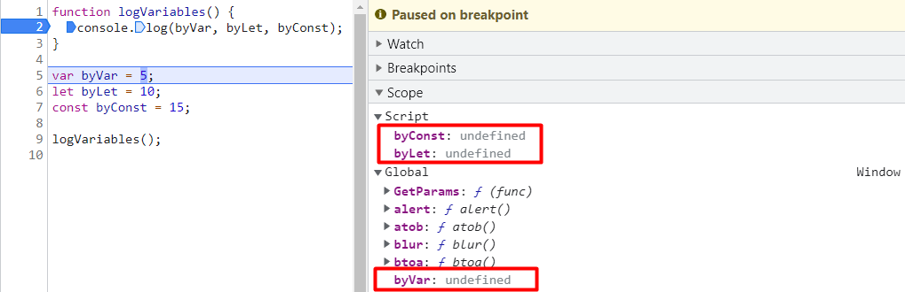
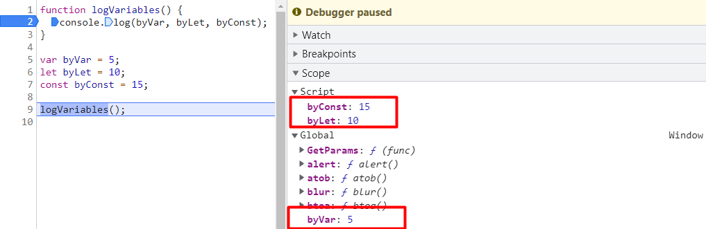
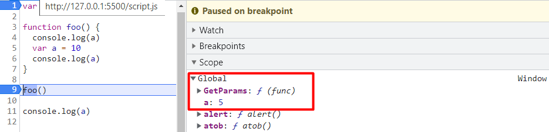
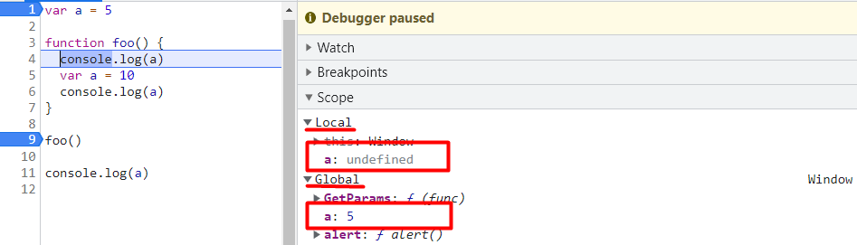
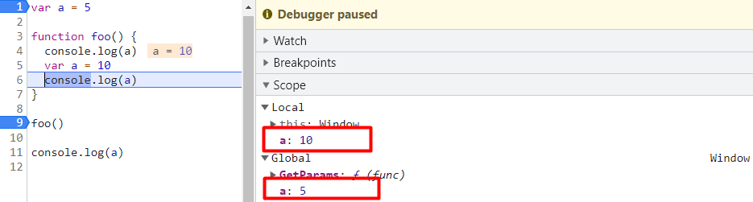
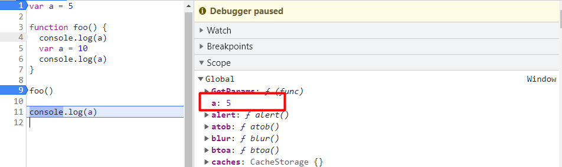

## Кратко

Переменные в JavaScript хранят значения, которыми оперирует код. Для создания переменных используются ключевые слова `var`, `let` и `const`.

<aside>

🤖 Использование `var` оправданно, если нужно писать код для старых браузеров времён IE 11 или Opera mini. Во всех остальных случаях лучше использовать `let` и `const`, так как они не позволят допустить ошибки, приводящие к неправильным значениям в переменных или изменениям глобальных переменных.

</aside>

## Что такое переменные

Переменные — это именованные контейнеры для хранения данных.

Для создания переменной используется ключевое слово `let`, `const` или `var`. Сразу за ключевым словом идёт название переменной либо перечень переменных через запятую. Создание переменной также называют _объявлением переменной_. Например:

```js
var singleVariable

let firstVariable, secondVariable, thirdVariable
```

Чаще всего, при объявлении переменной ей устанавливают стартовое значение при помощи оператора присваивания `=`. Тип значения может быть абсолютно любым — [строка](/js/string/), [число](/js/number/), [объект](/js/object/), [массив](/js/arrays/) и так далее.

```js
// Объявление переменной и присваивание
let string = 'foo'
const array = ['foo', 'bar', 'baz']
var number = 10

// Множественное объявление и присваивание
let firstNumber = 5,
  secondNumber = 10
```

Затем переменную можно использовать как заменитель значения в коде:

```js
let name = 'Уолтер'
let surname = 'Вайт'
let fullName = name + ' ' + surname

console.log(fullName)
// Уолтер Вайт
```

## Правила именования переменных

Для имени переменной можно использовать следующие символы:

- буквы латинского алфавита;
- цифры;
- символы `$` и `_`.

Первый символ не должен быть цифрой:

```js
let letters, &ampersand, _underscore

let 1number
// SyntaxError: Invalid or unexpected token
```

В качестве названий переменных нельзя использовать зарезервированные языком слова. Например: `class`, `super`, `throw`, `yield`, `var`, `let`, `const` и так далее. С полным списком таких слов можно ознакомиться [здесь](https://developer.mozilla.org/ru/docs/Web/JavaScript/Reference/Lexical_grammar#%D0%B7%D0%B0%D1%80%D0%B5%D0%B7%D0%B5%D1%80%D0%B2%D0%B8%D1%80%D0%BE%D0%B2%D0%B0%D0%BD%D0%BD%D1%8B%D0%B5_%D0%BA%D0%BB%D1%8E%D1%87%D0%B5%D0%B2%D1%8B%D0%B5_%D1%81%D0%BB%D0%BE%D0%B2%D0%B0_%D0%B2_ecmascript_2015).

## Создание переменных

Перед выполнением скрипта JavaScript находит код создания переменных и заранее создаёт их. Получается, что в начале выполнения скрипта все переменные, описанные в коде, уже объявлены. В зависимости от браузера, они могут быть равны [`undefined`](/js/undefined/) (в Chrome и Safari), либо, в случае с `let` и `const` в браузере Firefox, не равны ничему и иметь специальное состояние `uninitialized`:

```js
console.log('Старт')

var byVar = 5
let byLet = 10
const byConst = 15

console.log('Конец')
```


Код ещё не начал выполняться, а переменные уже объявлены.

В конце скрипта, после того как произошло присвоение стартовых значений, переменные равны `5`, `10` и `15`:


JavaScript выполнил код объявления переменных и установил значения.

Получается, что некоторое время переменная может содержать значение `undefined` и быть доступной для чтения. Этим нужно пользоваться с осторожностью.

## Переменные `let` и `const`

Переменные `let` и `const` появились в версии [EcmaScript 2015 года](/js/language-versions/) (ES6), и сейчас используются намного чаще чем `var`.

### Объявление

Используя ключевое слово `let`, можно объявить переменную без присвоения ей начального значения. В таком случае она будет равна `undefined`:

```js
let a
console.log(a)
// undefined

a = 5
console.log(a)
// 5
```

При помощи `const` нельзя объявлять переменные без значения:

```js
const a
// SyntaxError: Missing initializer in const declaration

// Правильно
const b = 5
```

К переменным `let` и `const` нельзя обращаться до их объявления в коде:

```js
console.log(a)
// ReferenceError: Cannot access 'a' before initialization
console.log(b)
// ReferenceError: Cannot access 'b' before initialization

let a = 5
const a = 5
```

<details>
  <summary>Почему так?</summary>

У `let` и `const` есть так называемая _temporal dead zone_ (TDZ) — момент выполнения скрипта до объявления переменной. Переменная может использоваться и выше объявления, при условии, что содержащая её часть кода будет выполнена после инициализации:

```js
function foo() {
  console.log('from foo', a)
}

Promise.resolve()
  .then(() => console.log('from promise', a))

setTimeout(() => console.log('from timer',a))

let a = 10

foo()

// 'from foo 10', 'from promise 10', 'from timer 10'
```

_TDZ_ есть также и у ES6-классов, несмотря на то, что они являются «синтаксическим сахаром» над обычными функциями.

```js
console.log(Foo)

class Foo {
  constructor(bar) {
    this.bar = bar
  }
}
// ReferenceError: Cannot access 'Foo' before initialization
```

А функции (объявленные как _Function Declaration_) _TDZ_ не имеют.

```js
console.log(Foo)

function Foo() {
  this.bar = bar
}
// ƒ Foo() { this.bar = bar}
```

</details>

Оба типа переменных имеют блочную [область видимости](/js/closures/) и не становятся частью глобального объекта (`window` в браузере, `global` в Node.js). Блочная область видимости не даёт получить значение переменной вне блока, где она была объявлена.

Если объявить переменные внутри блока [`if`](/js/if-else/), то обращение к ним вне блока будет выбрасывать ошибку:

```js
if (true) {
  let a = 5
  const b = 10

  console.log(a)
  // 5
  console.log(b)
  // 10
}

console.log(a)
// ReferenceError: a is not defined

console.log(b)
// ReferenceError: b is not defined
```

### Одинаковые имена переменных

Объявление переменной с именем, которое уже используется в текущей области видимости, приведёт к ошибке:

```js
let a = 5

let a = 10
// SyntaxError: Identifier 'a' has already been declared
```

То же правило работает и при использовании `const`, и при использовании смешанного подхода:

```js
const a = 5
const a = 10
// SyntaxError: Identifier 'a' has already been declared

var b = 5
const b = 10
// SyntaxError: Identifier 'b' has already been declared
```

В то же время можно объявлять переменные с одинаковым именем в разных областях видимости. В этом случае значение будет зависеть от той области видимости, где происходит чтение:

```js
let name = 'Ольга'

if (true) {
  let name = 'Елена'
  console.log(name)
  // Елена
}

console.log(name)
// Ольга
```

### Смена значения в `let` и `const`

Значение в переменной, созданной через `let`, можно изменять:

```js
let a = 5
console.log(a)
// 5

a = 10
console.log(a)
// 10
```

Стартовое значение `const` изменить нельзя, будь то примитивное значение:

```js
const a = 5
a = 10
// TypeError: Assignment to constant variable
```

Или ссылка на объект:

```js
const obj = {
  a: 5,
}

obj = {
  a: 10,
}
// TypeError: Assignment to constant variable
```

Однако объект, хранящийся в `const`, можно мутировать. [Объекты хранятся по ссылке](/js/ref-type-vs-value-type/#ssylochnye-tipy-dannyh), и изменение объекта не приводит к изменению ссылки на него:

```js
const obj = {
  a: 5,
}

obj.a = 10

console.log(obj)
// { a: 10 }
```

## Переменные `var`

Объявление переменных при помощи ключевого слова `var` было в JavaScript с первых версий.

### Объявление

Переменные `var` можно объявлять без присвоения им значения, в таком случае они будут равны `undefined`:

```js
var a
console.log(a)
// undefined

var b = 5
console.log(b)
// 5
```

Переменные, объявленные через `var`, имеют функциональную область видимости. Они доступны только в пределах текущей функции или глобального объекта, если функции нет:

```js
if (true) {
  var a = 5
}

function foo() {
  var b = 10
}

console.log(a)
// 5
console.log(b)
// ReferenceError: b is not defined
```

Объявление переменных вне функций делает их глобальными переменными. Они доступны как свойства глобального объекта:

```js
var varVariable = 5

console.log(window.varVariable)
// 5
```

К переменным, объявленным при помощи ключевого слова `var`, можно обращаться до момента объявления. В отличие от `let` и `const`, ошибки это не вызовет. Такое поведение называется _hoisting_ - «всплытие»:

```js
console.log(a)
// undefined

var a = 5

console.log(a)
// 5
```

Разберём, как работает функциональная область видимости:

```js
var a = 5

function foo() {
  console.log(a)
  // undefined

  var a = 10
  console.log(a)
  // 10
}

foo()

console.log(a)
// 5
```

Перед выполнением функции в глобальной области видимости присутствует переменная `a`, равная `5`:


Перед выполнением функции переменная уже инициализирована в глобальной области видимости.

Во время выполнения функции формируется новая функциональная область видимости, в которой тоже присутствует переменная `a`. Эта переменная была объявлена с помощью `var` внутри функции, в момент выполнения которой она «всплыла» со значением равным `undefined`. В строке 4 происходит обращение именно к ней (до её объявления), а не к той, что находится вне функции.


В начале выполнения функции локальная переменная всплыла — JavaScript заранее объявил её, но ещё не установил значение.

В строке 8 значение переменной `a` уже равно 10.


В конце выполнения функции локальной переменной установлено значение, и чтение происходит из неё.

После выполнения функции локальная область видимости была удалена. В консоли выводится глобальная переменная `a`.


На последнем шаге локальная переменная уже недоступна, так как выполняется код из глобальной области видимости.

Более подробно об этом можно прочитать в [отдельной статье](/js/closures/)

### Смена значения в `var`

Значение, хранящееся в переменной `var`, можно изменить двумя способами:

- обратиться к имени переменной и присвоить новое значение:

```js
var a = 5
console.log(a)
// 5

a = 10
console.log(a)
// 10
```

- обратиться к имени переменной вместе с ключевым словом `var`:

```js
var a = 5
console.log(a)
// 5

var a = 10
console.log(a)
// 10
```
