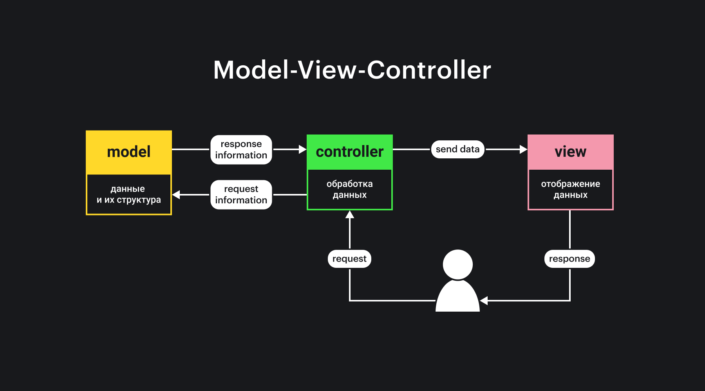

## Кратко

Веб-приложения, которыми мы пользуемся каждый день, хоть и сильно отличаются под капотом, на высоком уровне по большей части похожи.

В этой статье мы рассмотрим, как работают веб-приложения, что такое клиент-серверная архитектура и какие технологии используются для общения клиента и сервера.

Любое веб-приложение, если оно работает в браузере, работает на 3 основных технологиях: HTML, CSS и JS. _Ещё есть WASM, но о нём в этой статье мы говорить не будем._

Все приложения, которыми вы пользуетесь в браузере: GoogleDocs, Notion, Яндекс.Карты, Spotify, YouTube — сделаны с помощью этих технологий.

Но любое сложное приложение — это не только картинка в браузере, это ещё и данные, которые пользователи используют или создают. Эти данные нужно уметь хранить, обрабатывать и выводить.

Хранением и обработкой данных обычно занимается сервер или бэкенд.

_Бэкенд_ — область веб-технологий, работающих на сервере, а также внутренняя часть серверной системы, занимается обработкой данных.

А архитектура, в которой участвуют сервер (бэкенд) и клиент (браузер, фронтенд) называется _клиент-серверной_.

## Клиент-серверная архитектура

Начнём с самого понятия.

_Архитектура_ — это описание системы на самом высоком уровне.

То есть при описании архитектуры мы не вдаёмся в подробности каждого конкретного модуля, а скорее описываем их взаимодействие между собой, «фиксируем договорённости» поведения каждого из них.

_Клиент-серверная архитектура_ описывает, как взаимодействуют между собой клиент (в нашем случае фронтенд) и сервер (бэкенд).

Самый канонический вид такой архитектуры таков:


### Клиент

Клиент обращается с запросами к серверу.

Запросы могут быть разные. Клиент может попросить сервер отдать какие-то данные или попросить их как-то подготовить перед отдачей. Или же может попросить сервер сохранить что-то, что передаст вместе с запросом сам.

Роль клиента _для сервера_ в том, чтобы сообщить серверу, что нужно сделать с данными, которые хранятся в базе, или с данными, которые он передаёт.

Роль клиента _для пользователя_ в том, чтобы представить данные в удобном виде и предоставить механизмы для их обновления.

Для веба клиент почти всегда браузер.

### Сервер

Сервер принимает запросы от клиента.

Его роль в том, чтобы сохранять информацию от клиента в базе данных, обрабатывать её и предоставлять к ней доступ по некоторым правилам. _Такие правила обычно называются бизнес-логикой._

На сервере помимо общения с клиентом могут запускаться какие-то фоновые задачи, например, индексирование информации в базе данных для более быстрого поиска, или запуск автоматических email-рассылок.

### База данных

База данных (БД) — это хранилище всей пользовательской и служебной информации.

Её роль в том, чтобы обеспечивать быстрый и бесперебойный доступ к этой информации и собственно хранение.

### Пример

Возьмём Твиттер. В этом приложении клиентом будет выступать весь его фронтенд: HTML-страницы, CSS-стили, JS-скрипты для взаимодействия пользователя с UI.

Сервером будет его бэкенд. Все технологии, которые используются, чтобы предоставлять информацию из баз данных клиенту через API.

Базами данных (в множественном числе, потому что их много) будут все технологии, которые занимаются хранением, дупликацией, резервированием данных и обеспечением бесперебойной работы.

## Развитие веб-приложений

На клиент-серверной архитектуре построена большая часть приложений. Однако первые приложения всё же немного отличались от нынешних в деталях реализации. Главным отличием была полная перезагрузка страницы в ответ на любое действие.

### Первые приложения

Самые первые веб-приложения не сильно отличались от обычных сайтов.

По сути это и были сайты, потому что вся бизнес-логика реализовывалась на сервере. Клиент лишь показывал результат в виде HTML-страниц пользователю и посылал запросы на другие страницы.

Банальный выбор сортировки списка или таблицы требовал перезагрузки страницы. Сейчас это кажется анахронизмом, но первые приложения работали исключительно таким образом просто потому, что в браузерах не было инструмента для альтернативного общения.

В начале нулевых появился так называемый «Веб 2.0», с которым пришёл AJAX.

### AJAX

_AJAX (Asynchronous JavaScript and XML)_ — общение между клиентом и сервером без перезагрузки страницы.

Когда мы говорим, что какое-то приложение использует AJAX, мы имеем в виду, что при нажатии, например, на кнопку сортировки списка или таблицы, страница не перезагрузится, а сортировка произойдёт как бы «в фоне».

При нажатии браузер пошлёт [запрос на сервер](/js/api/), в котором сообщит, что ему необходимо отсортировать такой-то список по такому-то критерию.

Сервер обработает запрос, достанет нужные данные, отсортирует их и отправит клиенту _готовый кусок интерфейса_, который клиент уже вставит в документ.

Заметьте, что мы всё ещё не передаём данные в чистом виде. Сейчас на клиенте мы принимаем _кусок HTML-разметки_, который потом встраиваем в нужное место в документе.

Это, безусловно, удобнее для пользователя, чем перезагружать страницу в целом, но всё ещё не идеальный вариант для разработчиков.

### Современные приложения

В современных приложениях между клиентом и сервером общение строится именно на данных, а не на отрендеренных кусках разметки. Чаще всего для такого общения выбирают [JSON](/tools/json/).

Сейчас большая часть приложений работает так:

<!-- prettier-ignore -->
1. Клиент делает первичный запрос на сервер.
2. Сервер отвечает HTML-страницей, иногда с набором каких-то данных внедрённых в виде JS-объекта в конце страницы.
    1. Страница может быть либо отрисована на сервере и тогда клиенту придёт готовый HTML.
    2. Либо отрисовкой будет заниматься сам клиент с помощью какой-нибудь библиотеки, например, React. В этом случае от сервера приходит просто набор необходимых данных.
3. Пользователь совершает какое-то действие, например, просит отсортировать таблицу.
4. Клиент в ответ на это действие решает, какой запрос отправить на сервер, строит этот запрос и отправляет его.
5. Сервер принимает этот запрос, обрабатывает его и отправляет на клиент порцию новых данных.
6. Клиент принимает данные и перерисовывает часть страницы по ним сам. То есть он уже не заменяет один кусок разметки другим готовым, а рисует разметку сам.

Плюсов такого общения (когда передаются только данные) несколько:

- _Сервер и клиент становятся независимыми друг от друга_. Сервер может ничего не знать об устройстве страниц, ему достаточно лишь уметь работать с БД и обрабатывать данные (первичная отрисовка может быть сделана самим сервером с помощью SSR).
- _Количество информации, которое приходится передавать и принимать, меньше_ — а это уменьшает объём трафика.
- _Логика приложения на сервере может быть проще_, потому он и клиент становятся менее зависимы друг от друга в плане формата данных.

## Разделение ответственности

Такое общение между сервером и клиентом очень напоминает [паттерн MVC](/js/architecture-mvc/).

_MVC (Model-View-Controller)_ — структура приложения, в которой за данные, их обработку и их вывод отвечают три разных сущности.

- Модель (model) отвечает за данные и их структуру.
- Представление (view) — за их отображение.
- Контроллер (controller) — за их обработку.



Если попробовать сравнить классическую клиент-серверную архитектуру с MVC, то можно сравнить БД с моделью, сервер с контроллером, а клиент с представлением.

В самых первых приложениях, в принципе, так и было. Сейчас, однако, клиент стал сложнее, поэтому MVC может быть и часть архитектуры клиентского приложения.

## MVC на клиенте

Возьмём для примера Notion. Его веб-версия работает прямо в браузере, однако это полноценный текстовый редактор.

Большая часть работы при вводе текста происходит на клиенте. Чтобы такие сложные приложения работали, а в их коде можно было разобраться, клиентский код разработчики тоже стараются писать по правилам и следуя лучшим архитектурным практикам.

Одной из таких практик как раз является разделение данных и представления.

### Как бы текстовый редактор сделали 20 лет назад

Если забыть про невозможность сохранить написанное на сервере, то попробовать написать текстовый редактор можно было и тогда. Но, скорее всего, результатом был бы кусок разметки с инлайновыми стилями и текстом внутри.

Работать такими данными, которые перемешаны с особенностями представления, не удобно, а иногда и невозможно.

### Текстовые редакторы сейчас

...чаще всего делают, разделяя данные от их представления.

Так нам больше не нужно находить текст и чистить его от стилей, потому что в нём содержится только текст и некоторые его атрибуты.

1. Это делает работу с данными сильно проще — можно выгрузить документ в разных форматах: `.md`, `.html`, `.txt`.
2. С таким представлением проще работать в самом коде — отчего и сам код становится проще для понимания.
3. Его удобнее хранить в памяти, как состояние приложения.

## Состояние приложения

Текстовый редактор из нашего примера выше — это приложение с состоянием.

_Состояние приложения_ — это все данные этого приложения на текущий момент.

В случае с текстовым редактором — это весь текст, который пользователь ввёл, а также результаты преобразований над этим текстом.

Разумеется, текстовые редакторы не единственный вид таких приложений. Любое приложение, _которое хранит что-то перед отправкой (или даже без отправки) на сервер_ — это приложение с состоянием.

Плюсы в выделении состояния те же:

- данные перестают зависеть от того, как мы хотим их представлять;
- их проще обрабатывать и хранить;
- представление проще менять.

Как правило, состояние в приложениях на JS — это какой-то объект или массив объектов в памяти.

```js
// Например, так могло бы выглядеть
// состояние текстового редактора:
const State = {
  lastModified: '2020-08-24T18:15:00',
  blocks: [
    {
      type: 'heading',
      data: {
        text: 'Какой-то заголовок',
      },
    },
    {
      type: 'paragraph',
      data: {
        text: 'Какой-то параграф текста под заголовком',
      },
    },
  ],
}
```

Такой вид состояния не только удобен в использовании внутри приложения, но ещё и прост в сохранении с помощью [JSON](/tools/json/).

Кроме этого приложения, в которых за состояние отвечает отдельный модуль, проще развивать и изменять.

Сейчас есть много подходов и инструментов для управления состоянием. Из самых популярных можно назвать: Redux (и основанные на его подходе Vuex, NgRx), MobX, Overmind.

## JSON

JSON — один из самых популярных форматов данных. Он немногословен, понятен и человеку, и компьютеру, много языков с ним уже умеют работать.

В вебе JSON, можно сказать, стандарт, потому что используется как формат по умолчанию во многих фреймворках.

Состояние из примера выше в формате JSON выглядело бы так:

```json
{
  "lastModified": "2020-08-24T18:15:00",
  "blocks": [
    {
      "type": "heading",
      "data": {
        "text": "Какой-то заголовок"
      }
    },
    {
      "type": "paragraph",
      "data": {
        "text": "Какой-то параграф текста под заголовком"
      }
    }
  ]
}
```

...и мы могли бы прямо в таком виде отправить его на сервер, чтобы сохранить в БД.

## Запросы и ответы

Как мы помним, клиент-серверная архитектура строится на запросах и ответах. Разберёмся, что использует браузер, чтобы послать на сервер какой-то запрос.

### `fetch()`

На уровне приложения мы используем встроенное браузерное API, а именно — [`fetch()`](/js/fetch/). Это глобальный метод для отправки запросов.

В примере выше, чтобы сохранить состояние на сервере, мы бы использовали его примерно так:

```js
const response = await fetch('/api/save-text', {
  method: 'POST',
  body: JSON.stringify(State),
})
```

Здесь мы отправляем запрос по адресу `/api/save-text` с телом `JSON.stringify(State)`. Адрес и тело (данные) — понятно, а что такое `method: 'POST'`?

### HTTP-глаголы

Поле `method` — это так называемый HTTP-глагол.

HTTP-_глагол_, потому что его значениями могут быть лишь `GET`, `POST`, `PATCH`, `PUT`, `DELETE` и ещё несколько не так часто и явно используемых глаголов.

Они указывают, какое действие мы хотим выполнить. В примере `method: 'POST'` сообщит серверу, что мы хотим создать новый ресурс и сохранить в него содержимое `body`.

Если бы мы хотели получить какой-то ресурс, мы бы использовали `GET`. Для редактирования — `PATCH`, для замены — `PUT`, а для удаления — `DELETE`.

_HTTP_-глагол, потому что используется в протоколе HTTP — протоколе передачи данных, которым по умолчанию пользуются браузеры при общении с сервером.

_Описывать сам протокол мы не будем, но у нас есть статья [«Протокол HTTP»](/tools/http-protocol/)._

### REST

Внимательные читатели могли заметить, что список HTTP-глаголов выше похож на список методов из `RESTful API`.

_REST (Representational State Transfer)_ — стиль общения компонентов, при котором все необходимые данные указываются в параметрах запроса.

Отличительная особенность этого стиля — это стиль построения адресов и выбор метода.

```js
// Например, метод и адрес для создания пользователя
// могли бы выглядеть так:
// POST /api/users

// Для получения конкретного пользователя:
// GET /api/users/1
// (Где 1 — это ID пользователя.)

// Для редактирования данных о пользователе:
// PATCH /api/users/1

// Для удаления данных:
// DELETE /api/users/1
```

Как мы можем видеть, основа адреса не меняется, а желаемое действие выражается методом.

Списки HTTP-глаголов и REST-методов действительно похожи, потому что REST основывается на HTTP 1.0. Метод — это один из параметров запроса в REST.

Сейчас именно на основе REST работает множество сервисов и приложений.

## Развитие веба и объёмы данных

С развитием веба и интернета в целом пришло время больших объёмов данных. Картинки по 10 МБ уже никого не удивляют.

Вместе с большими объёмами пришли и проблемы с их передачей, потому что трафик поначалу был очень дорогим. _Он и сейчас в некоторых случаях не дешёвый._

### Кэширование

Отчасти решением стало кэширование ресурсов. С картинками это помогло — картинки из кэша не съедают трафик, потому что не гонятся по сети.

Со скриптами и стилями — помогло отчасти, потому что объём лишь одна часть проблемы. Вторая часть — это парсинг и исполнение. Особенно остро эта проблема стоит со скриптами, потому что скрипты весом в 10 МБ уже тоже не редкость.

Сейчас разработчики всеми силами стараются уменьшать количество кода, которое браузеру необходимо скачать и исполнить, чтобы сделать приложения быстрее и легче.

### Код-сплиттинг

Одним из решений стал код-сплиттинг. Это техника, при которой в скрипте оказывается только необходимый на конкретной странице код, а остальной код догружается по мере необходимости.

### Middle-end

Кэширование и код-сплиттинг решают большую часть проблем, однако остаётся ещё одно место, где мы можем передавать слишком много лишней информации — сами запросы.

REST известен не только своим удобством, но и (иногда) чрезмерной избыточностью.

Проблема в том, что REST система проектируется так, чтобы как можно реже меняться при изменении клиента. Из-за этого данные, отдаваемые в ответ, могут содержать детали, которые клиентом использоваться не будут.

Просто так их убрать зачастую бывает нельзя, потому что это противоречит обратной совместимости. Плодить много однотипных эндпоинтов, которые будут отличаться небольшой деталью — дорого и нецелесообразно.

Поэтому сейчас сообщество смотрит в сторону некого мидл-энда — такого слоя между клиентом и сервером (или сразу БД), который бы удалял всё лишнее, что клиенту не требуется, и отдавал бы лишь необходимые данные, таким образом сократив объём. Как, например, GraphQL.

## Заключение

В этой статье мы рассмотрели лишь самые основы работы веб-приложений, не затрагивая деталей.

Мы узнали о клиент-серверной архитектуре, разделении данных от представления и том, как они используются в современных приложениях. Также мы рассмотрели, что такое состояние приложения и поговорили о REST, как одном из распространённых способов построения API.

Эти понятия помогут вам понять работу большей части приложений, с которыми вы можете столкнуться.
