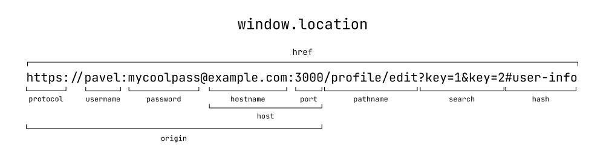

## Кратко

Это объект, хранящийся в `window`, который позволяет получать информацию о текущем адресе старницы и менять его с помощью функций или обновления полей объекта.

## Пример

Получение данных о текущем адресе:

```js
// если выполнить этот скрипт на текущей странице доки в консоли
console.log(window.location.href); // "https://y-doka.site/js/doka/window-location/"
```

Обновление текущего адреса можно произвести двумя способами:

```js
window.location.href = "https://example.com";
window.location.assign("https://example.com");
```

Так же можно сделать клиентский редирект.

```js
window.location.replace("https://example.com");
```

## Как это понять

Для навигации по сайту мы используем разные адреса и параметры страницы. Для того чтобы удобно получать адрес и управлять им существует набор свойств и методов доступных из JavaScript.

## Как пишется

### Свойства



`location.href` – полное представление адреса. Можно сказать, что это зеркало того что находится в адресной строке браузера в данный момент. При попытке записать значение в это свойство произойдет обновление адреса.

Остальные свойства по сути это кусочки `location.href` для того чтобы можно было удобно получит каждый из них отдельно, а не пытаться вытащить их руками полной строки.

```js
console.log(window.location.href); // отобразит текущий адрес
window.location.href = "https://example.com"; // сделает переход по присваевоему адресу
```

`location.hash` - якорная ссылка включая символ `#`. Часть ссылки которая находится в самом конце и отвечает за навигацию между размечеными на странице элементами с помощью установки атрибута `id` на тегах.

```js
window.location.hash = "в-работе"; // проскролит страницу до элемента с `id="в-работе"` если такой присутствует на странице
console.log(window.location.hash); // отобразит якорь
```

`location.host` - содержит значение хост из ссылки. Хост включает в себя название текущего домена и порта.
`location.hostname` - частичка с доменом из свойства `host`, но только не включает в себя порт.
`location.port` - вторая составляющая значения `host` содержащая только домен

Рассмотрим пример когда мы находимся на странице `http://localhost:3000`

```js
console.log(window.location.host); // "location:3000"
console.log(window.location.hostname); // "location"
```

`location.pathname` – репрезентация текущего пути на сайте.

Например если мы находимся по адресу `https://y-doka.site/js/doka/window-location/`

```js
console.log(window.location.pathname); // "/js/doka/window-location/"
```
