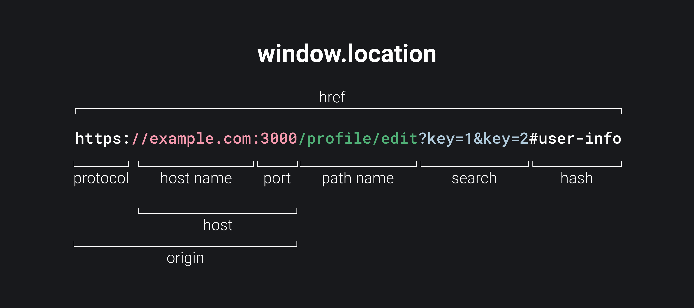

## Кратко

`location` — это объект хранящийся в `window`, который позволяет получать информацию о текущем адресе страницы и менять его с помощью функций или обновления полей объекта.

## Пример

С помощью `location` мы можем получить текущий адрес:

```js
// если выполнить этот скрипт на текущей странице доки в консоли
console.log(window.location.href)
// 'https://doka.guide/js/window-location/'
```

Обновление текущей страницы можно произвести с помощью `reload()`. Этот метод делает то же самое, что и кнопка «Обновить» в браузере:

```js
window.location.reload()
```

С помощью `replace()` можно сделать клиентский редирект, это приведёт к мгновенному переходу по адресу, указанному при вызове метода:

```js
window.location.replace('https://doka.guide/')
```

## Как понять

Для навигации по сайту мы используем адреса и параметры страницы. `window.location` содержит набор свойств и методов, чтобы удобно получать адрес и управлять им.

## Как пишется

### Свойства



`href` – полное представление адреса. Можно сказать, что это зеркало того, что находится в адресной строке браузера в данный момент. Если записать значение в это свойство, то произойдёт обновление адреса и редирект на новый адрес.

Остальные свойства — это кусочки `location.href`. Они нужны, чтобы удобно получать каждый из них отдельно, а не вытаскивать их руками из полной строки адреса.

```js
console.log(window.location.href)
// отобразит текущий адрес
window.location.href = 'https://example.com'
// сделает переход по указанному адресу
```

`protocol` содержит текущий протокол по которому открыта страница. Чаще всего там будет `https` и `http`.

`host` содержит значение хоста из ссылки. Хост включает в себя название текущего домена и порта.

`hostname` — частичка с доменом из свойства `host`, не включает в себя порт.

`port` — вторая составляющая значения `host`, содержит только номер порта. Если порт не указан в явном виде, то значением свойства будет пустая строка `''`.

`origin` включает в себя путь, начиная с `protocol` и заканчивая `port`.

`search` содержит параметры в формате `ключ=значение` разделённые `&`. Если параметров нет, то значением будет пустая строка.

`hash` — якорная ссылка включая символ `#`. Она находится в самом конце пути и отвечает за навигацию между размеченными на странице элементами с помощью [установки атрибута `id`](/html/a/#atributy) на тегах. Эта часть URL не передаётся на сервер. Если параметров нет, то значением будет пустая строка.

```js
window.location.hash = 'в-работе'
// проскролит страницу до элемента с `id="в-работе"` если такой присутствует на странице
console.log(window.location.hash)
// напечатает якорь
```

`pathname` – репрезентация текущего пути на сайте. Если текущий урл не содержит путь, то значением будет корневой путь `"/"`.

Например, значения `window.location.pathname` в зависимости от адреса:

* `https://doka.guide/js/window-location/` → `/js/window-location/`.
* `https://doka.guide` → `/`.

### Методы

`assign(новый_путь)` – метод вызывает переход на страницу, переданную в аргументах. После перехода на страницу пользователь может вернуться на страницу, с которой произошёл переход, с помощью браузерной кнопки назад.

`replace(новый_путь)` аналогичен методу `assign()`, но адрес страницы с которой был вызван этот метод не будет сохранён в истории браузера. При попытке вернуться назад пользователь будет отправлен на страницу предшествующую той, с которой произошёл переход.

`reload()` перезагружает текущую страницу.

`toString()` приводит адрес страницы к строке. Возвращает то же самое значение, что и `location.href`.
