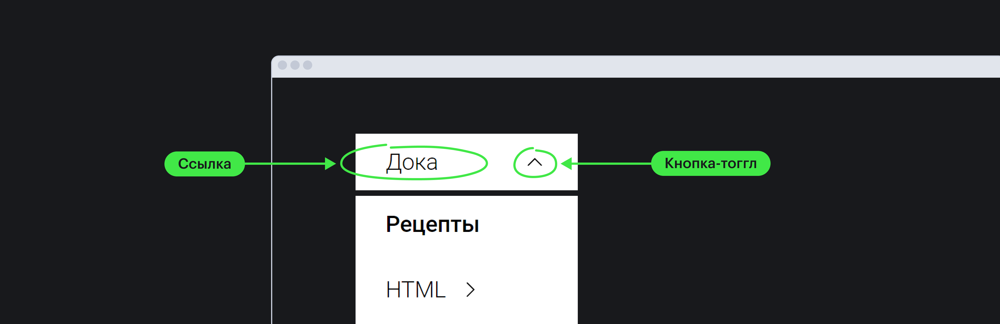

## Задача

Создать навигационное меню содержащее в себе несколько уровней с вложенными элементами.

## Готовое решение

При создании меню на сайте важно использовать семантические теги, чтобы обеспечить базовую доступность и избежать дополнительных действия в JS.

Готовая разметка многоуровневого меню будет выглядеть следующим образом.

```html
<body>
  <header class="header">
    <nav class="site-nav enhanced" aria-label="Сайт">
      <ul class="menu" role="list">
        <li class="menu__item" data-has-children>
          <button class="menu__btn" aria-expanded="false" aria-controls="doka-submenu">Дока</button>

          <!-- Первый уровень вложенности -->
          <ul class="menu" role="list" id="doka-submenu" hidden>
            <li class="menu__item"><a href="#" class="menu__link" aria-current="page">Рецепты</a><li>

            <li class="menu__item">
              <button class="menu__btn" aria-expanded="false" aria-controls="html-submenu">HTML</button>

              <!-- Второй уровень вложенности -->
              <ul class="menu" role="list" id="html-submenu" hidden>
                <li class="menu__item"><a href="#" class="menu__link">Основы</a></li>
                <li class="menu__item"><a href="#" class="menu__link">Форматирование</a></li>
                <li class="menu__item"><a href="#" class="menu__link">Семантика</a></li>
              </ul>
            </li>

            <li class="menu__item">
              <button class="menu__btn" aria-expanded="false" aria-controls="css-submenu">CSS</button>

              <!-- Второй уровень вложенности -->
              <ul class="menu" role="list" id="css-submenu" hidden>
                <li class="menu__item"><a href="#" class="menu__link">Основы</a></li>
                <li class="menu__item"><a href="#" class="menu__link">Селекторы</a></li>
                <li class="menu__item"><a href="#" class="menu__link">Псевдоклассы</a></li>
              </ul>
            </li>
            <li class="menu__item"><a href="#" class="menu__link">JavaScript</a></li>
            <li class="menu__item"><a href="#" class="menu__link">A11y</a></li>
          </ul>
        </li>

        <li class="menu__item"><a href="#" class="menu__link">Новости</a></li>
        <li class="menu__item"><a href="#" class="menu__link">Блог</a></li>
        <li class="menu__item"><a href="#" class="menu__link">Архив</a></li>
      </ul>
    </nav>
  </header>
</body>
```

```css
ul, li {
  list-style: none;

  padding: 0;
  margin: 0;

  text-align: start;
}

button:focus-visible,
a:focus-visible {
  outline: 2px solid;
  outline-offset: 2px;
}

.header {
  display: flex;
  gap: 2rem;
  align-items: center;
  background-color: #fff;
  box-shadow: 0 1px 3px rgba(0 0 0 / 0.1);
  padding: 1em;
}

.menu {
  display: flex;
  gap: 64px;

  min-width: max-content;

  background: #fff;
  color: #111;
}

.menu[hidden] {
  display: none !important;
}

.menu__btn,
.menu__link {
  display: flex;
  gap: .5em;
  align-items: center;

  padding: .75rem 1.5rem;

  font-size: 1.5em;
  color: #18191c;

  cursor: pointer;

  border: none;
  background: none;
}

.menu__link:hover,
.menu__btn:hover,
.menu__btn[aria-expanded="true"] {
  background-color: #eee;
}

.menu__btn-icon {
  color: inherit;
  transition: transform .1s linear;
}

.menu__btn[aria-expanded="true"] .menu__btn-icon {
  transform: rotate(180deg);
}

.menu__item {
  position: relative;
}

.menu__link {
  text-decoration: none;
}

a[aria-current="page"] {
  font-weight: bold;
  color: deepPink;
}

a[aria-current="page"]:hover {
  color: deepPink;
}

/* Вложенное меню */
.menu .menu {
  display: flex;
  flex-direction: column;
  gap: 8px;

  padding-inline-start: 3rem;
}

/* Первый уровень вложенности */
.enhanced .menu .menu {
  position: absolute;
  top: 110%;
  left: 0;

  padding-inline-start: 0;

  box-shadow: 0 0 5px 2px rgba(0,0,0,0.1);
}

/* Второй уровень вложенности */
.enhanced .menu .menu .menu {
  top: 0;
  left: 100%;
}
```

```js
const nav = document.querySelector('.site-nav');
nav.classList.add("enhanced");

const submenus = document.querySelectorAll(".menu__item[data-has-children]");
const dropdowns = document.querySelectorAll(".menu__item[data-has-children] > .menu");

const icon = '<svg>...</svg>'

// Находи подменю, заменяем в нем span на кнопку
submenus.forEach((item) => {
  const dropdown = item.querySelector(":scope > .menu");
  dropdown.setAttribute("hidden", "");

  const span = item.querySelector(":scope > span");
  const text = span.innerText;
  const ariaControlsId = span.dataset.controls;
  const button = document.createElement("button");

  // Добавляем класс и необходимые aria-атрибуты
  button.classList.add("menu__btn")
  button.setAttribute("aria-expanded", "false");
  button.setAttribute("aria-controls", ariaControlsId);

  button.innerText = text;

  // Добавляем иконку к кнопке, чтобы визуально было понятно открыто меню или нет
  button.innerHTML += icon;
  span.replaceWith(button);

  button.addEventListener("click", function (e) {
    toggleDropdown(button, dropdown);
  });

  // Обрабатываем нажатие на esc
  dropdown.addEventListener("keydown", (e) => {
    e.stopImmediatePropagation();

    if (e.keyCode === 27 && focusIsInside(dropdown)) {
      toggleDropdown(button, dropdown);
      button.focus();
    }
  }, false);
});

function toggleDropdown(button, dropdown) {
  if (button.getAttribute("aria-expanded") === "true") {
    button.setAttribute("aria-expanded", "false");
    dropdown.setAttribute("hidden", "");
  } else {
    button.setAttribute("aria-expanded", "true");
    dropdown.removeAttribute("hidden");
  }
}

function focusIsInside(element) {
  return element.contains(document.activeElement);
}

function collapseDropdownsWhenTabbingOutsideNav(e) {
  if (e.keyCode === 9 && !focusIsInside(nav)) {
    dropdowns.forEach(function (dropdown) {
      dropdown.setAttribute("hidden", "");
      const btn = dropdown.parentNode.querySelector("button");
      btn.setAttribute("aria-expanded", "false");
    });
  }
}

function collapseDropdownsWhenClickingOutsideNav(e) {
  const target = e.target;

  dropdowns.forEach(function (dropdown) {
    if (!dropdown.parentNode.contains(target)) {
      dropdown.setAttribute("hidden", "");
      const btn = dropdown.parentNode.querySelector("button");
      btn.setAttribute("aria-expanded", "false");
    }
  });
}

// Закрыть навигацию если протапались за ее пределы
document.addEventListener("keyup", collapseDropdownsWhenTabbingOutsideNav);

// Закрыть навигацию если кликнули вне навигации
window.addEventListener("click", collapseDropdownsWhenClickingOutsideNav);
```

А полученный результат так:

<iframe title="Подгрузка разных картинок" src="demos/menu/" height="700"></iframe>

## Разбор решения

### Первый уровень
При создании многоуровневого меню сначала создается первый, базовый уровень. Семантическая верстка которого может выглядеть следующим образом:

```html
...
<nav class="site-nav" aria-label="Сайт">
  <ul class="menu" role="list">
    <li class="menu__item">
      <a href="#" class="menu__link">Дока</a>
    </li>
    ...
    <li class="menu__item">
      <a href="#" class="menu__link">Блог</a>
    </li>
  </ul
</nav>
...
```

Базовой оберткой в большинстве случаев стоит выбирать элемент [`<nav>`](/html/nav/), так как он явно указывает браузеру свою роль, а именно говорит о том что он является [навигационным элементом](/a11y/role-navigation/).

Данная роль позволяет вспомогательным технологиям разобрать для чего нужен этот элемент и корректно рассказать о нем пользователям. Например, пользователи скринридеров смогут попасть в данное меню с помощью ориентиров, которые помогают им быстрее взаимодействовать со страницей.

Важно чтобы у навигации было дуступное имя, которое поможет отличить одно меню от другого, в случае если на сайте несколько имеется несколько вариантов меню (например, основная навигация, и навигация по хлебным крошкам в категории). В примере для задания доступного имени используется aria-атрибут [`aria-label`](/a11y/aria-label/).

Также важно подсказать пользователям о том что они взаимодействуют с набором связанных элементов. Для этого будем использовать тег [`<ul>`](/html/ul/), который подскажет вспомогательным технологиям сколько элементов в списке. Использование данного тега также поможет в определении уровня меню на котором сейчас сфокусирована пользователь.

### Вложенные уровни

Далее, при необходимости, внутрь какого-либо из базовых уровней может быть добавлен еще один уровень. Для этого необходимо внутрь элемента списка добавить заголовок нового уровня, и добавить еще один список. В нашем примере, в пункт меню "Дока" добавлен еще один список с классом _menu_.

В большинстве случаев для элемента заголовка используется кнопка, [`<button>`](/html/button/). Использование кнопки позволяет попасть на элемент меню с помощью клавиши [`tab`](/html/tabindex/), а также позволяет повесить на нее событие `click`, которое нативно может быть вызвано с помощью клавиш `space` или `enter`. Это особенно важно для людей, которые будут взаимодействовать с меню без использования мыши.

```html
...
<nav class="site-nav" aria-label="Сайт">
  <ul class="menu" role="list">
    <li class="menu__item">
      <button
        class="menu__btn"
        aria-expanded="[false | true]"
        aria-controls="doca-menu"
      >
        Дока
      </button>

      <ul class="menu" role="list" id="doca-menu">
        <a href="#" class="menu__link">HTML</a>
        <a href="#" class="menu__link">CSS</a>
        <a href="#" class="menu__link">JS</a>
        <a href="#" class="menu__link">A11y</a>
      </ul>
    </li>
    ...
    <li class="menu__item"><a href="#" class="menu__link">Блог</a></li>
  </ul
</nav>
...
```

В примере на кнопку добавлены aria-атрибуты, которые помогают вспомогательным технологиям лучше взаимодействовать с вёрсткой. Атрибут [`aria-expanded`](/a11y/aria-expanded/) указывает открыт ли пункт меню или нет. А атрибут [`aria-controls`](/a11y/aria-controls/) связывает кнопку со списком, который она разворачивает или сворачивает.

В таком случае нужно будет написать небольшой скрипт на JS, чтобы можно было программно изменять значение атрибута [`aria-expanded`](/a11y/aria-expanded/) при взаимодействии с кнопкой.

```js
...
button.addEventListener("click", function (e) {
  toggleDropdown(button, dropdown);
});

function toggleDropdown(button, dropdown) {
	if (button.getAttribute("aria-expanded") === "true") {
		button.setAttribute("aria-expanded", "false");
		dropdown.setAttribute("hidden", "");
	} else {
		button.setAttribute("aria-expanded", "true");
		dropdown.removeAttribute("hidden");
	}
}
...
```

Если необходимо чтобы элемент навигации был одновременно и ссылкой, ведущей в родительскую директорию, и содержал вложенную информацию, можно воспользоваться паттерном когда текст обернут в ссылку, а рядом с ним располагается стрелка, представляет собой кнопку, которая будет открывать/закрывать список.



В данном примере, такая реализация не рассматривается, но ее не сложно реализовать самостоятельно.

Процесс вложения одного списка в другой, может повторяться столько раз, сколько необходимо. Но на практике более 3 уровней встречается довольно редко.

### Стили

Стили для меню могут быть абсолютно разными. Чаще всего встречаются горизонтальные и вертикальные варианты меню. Для создания одноуровневого горизонтального меню можно воспользоваться следующими стилями:

```css
.menu {
  /* Сбрасываем стили браузера */
  list-style: none;
  padding: 0;
  margin: 0;

  /* Задаем горизонтальное направление */
  display: flex;
  gap: 16px;
}
```

В примере разметка горизонтального многоуровневого меню базируется на css-позиционировании. Всем элементам списка li задается относительное позиционирование, а вложенному меню ul — абсолютное позиционирование.
Первый уровень вложенного меню оставляем без смещения, я для второго уровня установили смещение влево на 100%, чтобы меню прилипало к правой границе первого меню.

```css
...
/* Первый уровень вложенности */
.menu .menu {
  display: flex;
  flex-direction: column;
  gap: 8px;

  position: absolute;
  top: 110%;
  left: 0;
}

/* Второй уровень вложенности */
.menu .menu .menu {
  top: 0;
  left: 100%;
}
```

Также иногда при создании многоуровневых меню, можно часто встретить вариант когда элементы меню появляются при наведении на них курсора мыши (по событию hover). В таком случае базовая вёрстка останется аналогичной примеру, нужно будет лишь доработать стили появления - скрывать вложенное меню по умолчанию (`display: none`) и показывать при наведении мыши.

В мобильной версии текущая реализация меню представлена в виде аккордеона. Часто мобильное меню прячут за иконкой с тремя линиями (бургер) или чем-то подобным. При такой реализации важно помнить о доступности и скрыть меню полностью, чтобы пользователи не могли на нем сфокусироваться с помощью клавиши [`tab`](/html/tabindex/). В таком случае можно прибегнуть к помощи свойства [`display: none`](/css/display/#kak-pishetsya) или HTML-атрибута [`hidden`](/html/hidden/). Данные методы помогут спрятать меню из [`дерева доступности`](/a11y/screenreaders/#derevo-dostupnosti), но ими часто пренебрегают так как они не позволяют анимировать появление меню.
