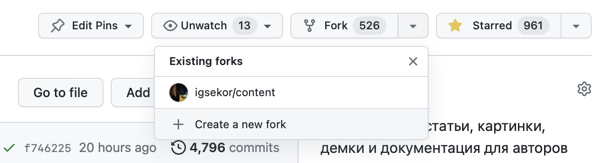
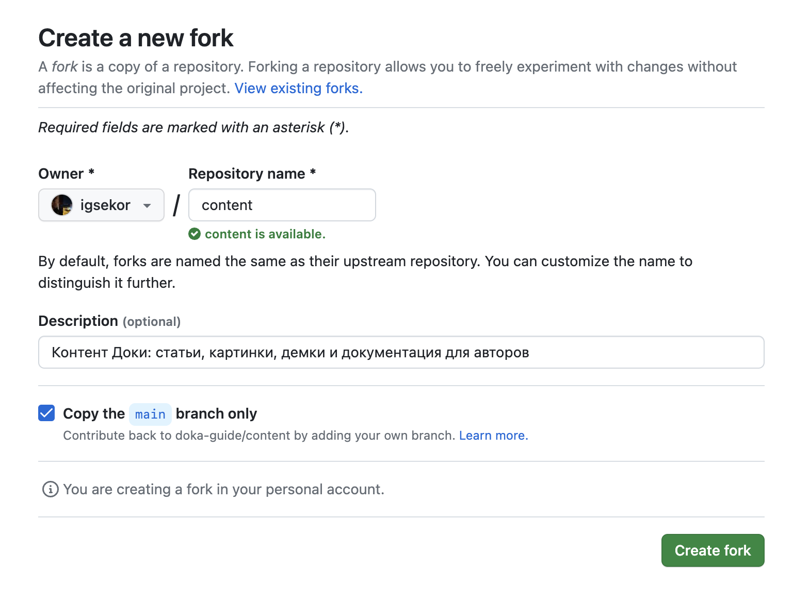
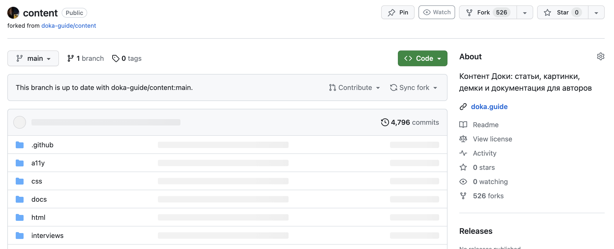

## Задача

Необходимо поработать в собственной копии (форке) репозитория для внесения изменений в другой репозиторий с помощью пулреквестов.

## Готовое решение

Нужно сделать всего несколько шагов.

Откройте вкладку «Code» в нужном репозитории и найдите аккордеон, который называется «Fork». Он находится рядом с количеством звёздочек у проекта. Чтобы раскрыть аккордеон, нажмите на стрелку справа от его названия, и в открывшемся блоке выберите пункт «+ Create a new fork». Если создавали форки репозитория раньше, они тоже отобразятся в самом начале этого блока. Тогда можно перейти в них для работы над репозиторием.

После выбора опции с созданием нового форка, откроется новая страница с его настройками. На ней укажите владельца. По умолчанию будет выбран ваш профиль. Также придумайте уникальное имя репозитория в вашем профиле или профиле организации в поле «Repository name». Дополнительно можете переписать оригинальное описание форка и поставить галочку на пункте «Copy the `main` branch only». Тогда в ваш форк попадёт только основная ветка репозитория. Имя основной ветки не обязательно будет `main`. В конце нажмите на кнопку «Create fork» под формой.

После нескольких секунд ожидания вы окажетесь на странице репозитория уже в вашем профиле или в вашей организации.

## Разбор решения

На GitHub принято использовать несколько паттернов организации работы с репозиториями, с которыми обязательно столкнётесь. Один из таких паттернов — использование форков.

Логика работы может быть такая:

1. Пользователь создаёт собственную копию (форк) у себя в профиле.
1. Клонирует репозиторий или работает с ним напрямую в веб-интерфейсе.
1. Вносит изменение в нужной ветке своего форка.
1. Если всё работает как надо, отправляет пулреквест в основной репозиторий.

Другая схема такая:

1. Пользователю нравится продукт, и лицензия позволяет сделать что-то «по-своему».
1. Делает форк от своего имени или от имени организации.
1. Вносит изменения и оставляет их только в своём форке.

Оба паттерна активно используются пользователями GitHub. Например, форками браузера Chromium стали браузеры Chrome, Яндекс Браузер или современный Edge. Многие дистрибутивы Linux рождались как форки ядра или других дистрибутивов данной операционной системы. В мире JavaScript форки тоже не редкость. Например, пакетный менеджер npm имеет более трёх тысяч форков.
