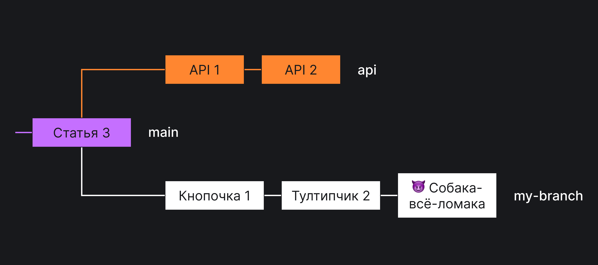

## Управление историей git

Представим, что у вас есть git-репозиторий с несколькими ветками. Вы работаете в одной из них и хотите перенести свои изменения в другую ветку. Такое приходится делать очень часто, если хотите актуализировать свои изменения.

Рассмотрим несколько распространённых сценариев.

Вы начали разрабатывать фичу и создали ветку `my-branch` из основной `main`. За время разработки в ветку `main` приехали изменения коллег. Как переместить ваши изменения на актуальный `main`?


В вашей команде есть фронтенд- и бэкенд-разработчики. Вы работаете в одном репозитории, создали ветку `frontend` из основной ветки `main`, а ваш коллега — ветку `backend` тоже из `main`. В ветке `frontend` два коммита: <!-- yaspeller ignore:start -->Кнопочка 1 и Тултипчик 2<!-- yaspeller ignore:end -->, в `backend` их тоже два — API 1 и API 2. Теперь вы хотите потестировать ваш фронтенд с новым бэкендом. Как это сделать?


В вашей ветке есть _несколько_ коммитов, которые нужны коллеге: <!-- yaspeller ignore:start -->Кнопочка 1 и Тултипчик 2<!-- yaspeller ignore:end -->. Кроме них в ветке есть коммит, который сломает ветку коллеги — <!-- yaspeller ignore:start -->Собака-всё-ломака<!-- yaspeller ignore:end -->. Как потестировать только не ломающие изменения?



Все эти задачи решаются с помощью команды `git rebase --onto`.

## Немного теории

Git хранит коммиты (commits). Коммит — всего лишь ссылка на некоторое состояние репозитория. Состояние — это немножко метаданных и ссылка на _предыдущий_ коммит. Сам по себе коммит — это 40 символов SHA-1 хеша этого состояния.

Ветка (branch) — это ссылка на определённый коммит. У вас может быть только одна активная ветка. На неё (т. е. на определённый коммит) указывает специальный указатель `HEAD`.

Многие команды гит принимают в качестве параметра ревизию. Так как всё в гите это захешированные объекты, то в качестве ревизии можете передавать:

- длинный хеш, например вот так `29aeb39eac6b8d9e0f4cdc1459376599d1aba43c`;
- короткий хеш, например вот так `29aeb39e`;
- тег, если он имеется, например вот так `v1.0.0`;
- имя ссылки; в основном используется для веток, например `main`, `origin/dev`, `refs/heads/foo`.

Можете добавлять магические символы (`@{n}, ^, :`) к этим параметрам, чтобы ещё эффективнее выбирать нужные коммиты. Подробности можно посмотреть [в документации про `gitrevisions`](https://git-scm.com/docs/gitrevisions). Особенно полезен символ `^`. Он позволяет выбирать предыдущие коммиты.

## Как готовить

Подробности можно найти, например, [в официальной документации](https://git-scm.com/docs/git-rebase).

Команда `git rebase` с флагом `--onto` принимает несколько аргументов:

- `--onto` — коммит, на который нужно перенести изменения. Новые коммиты добавятся сразу после него;
- `from` — коммит, с которого нужно перенести изменения. Коммит, который укажете, не перенесётся, а следующие за ним перенесутся;
- `to` — коммит, до которого нужно перенести изменения. Коммит, который укажете, перенесётся.

Последний аргумент можно не использовать. Тогда перенесутся все коммиты, начиная от следующего за `from` коммита до конца ветки.

Например:

```bash
git rebase --onto main feature1
```

Помните, что коммит — это всего лишь хеш? В качестве каждого аргумента можете указывать хеш, например вот так:

```bash
git rebase --onto 29aeb39e 5fd88295
```

Хеши, вообще-то, длиннее 8 символов, но git понимает короткую версию. Можете также указать полный хеш, например вот так:

```bash
git rebase --onto 29aeb39eac6b8d9e0f4cdc1459376599d1aba43c 5fd882953924b47a10794619c3063e7a50257af6
```

Вы можете указать название ветки вместо хеша, например вот так:

```bash
git rebase --onto main feature
```

Если хотите перенести несколько коммитов из основной ветки, можете использовать магию `HEAD` нотации.

```bash
git rebase --onto main HEAD^3 HEAD^
```

Эта команда перенесёт 2 коммита из текущей ветки в ветку `main`. Самый последний не перенесёт.

Рассмотрим один из примеров выше.

Было так:


А нужно, чтобы коммиты <!-- yaspeller ignore:start -->Кнопочка 1 и Тултипчик 2<!-- yaspeller ignore:end --> оказались в ветке `backend`.


Для этого выполните команду:

```bash
git rebase --onto backend main frontend
```

- `git rebase --onto` — переносим;
- backend — на последний коммит ветки backend, т. е. на API 2;
- main — все коммиты в моей ветке frontend, начиная с того, которым заканчивается ветка main (Статья 3);
- frontend — заканчивая последним коммитом ветки frontend (<!-- yaspeller ignore:start -->Тултипчик<!-- yaspeller ignore:end --> 2).

## Бонус

Если хотите посмотреть какой красивой стала ваша история, используйте эту команду:

```bash
git log --oneline --decorate --graph --all
```
