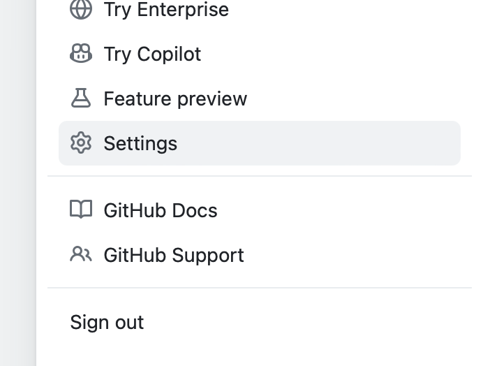
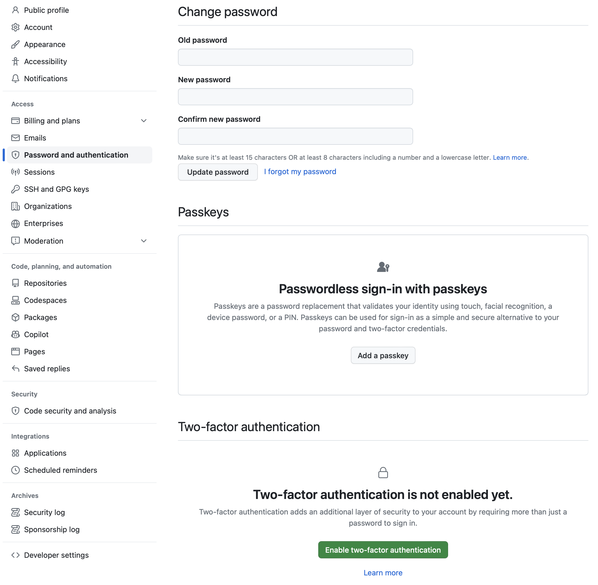
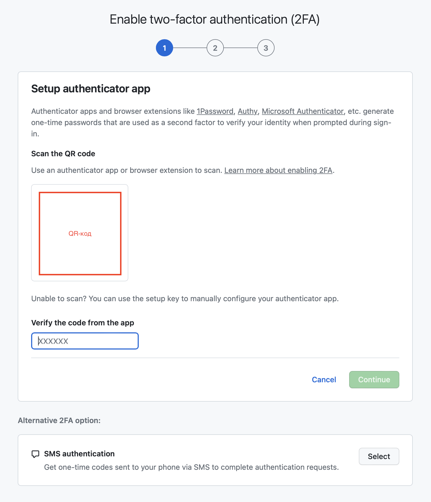
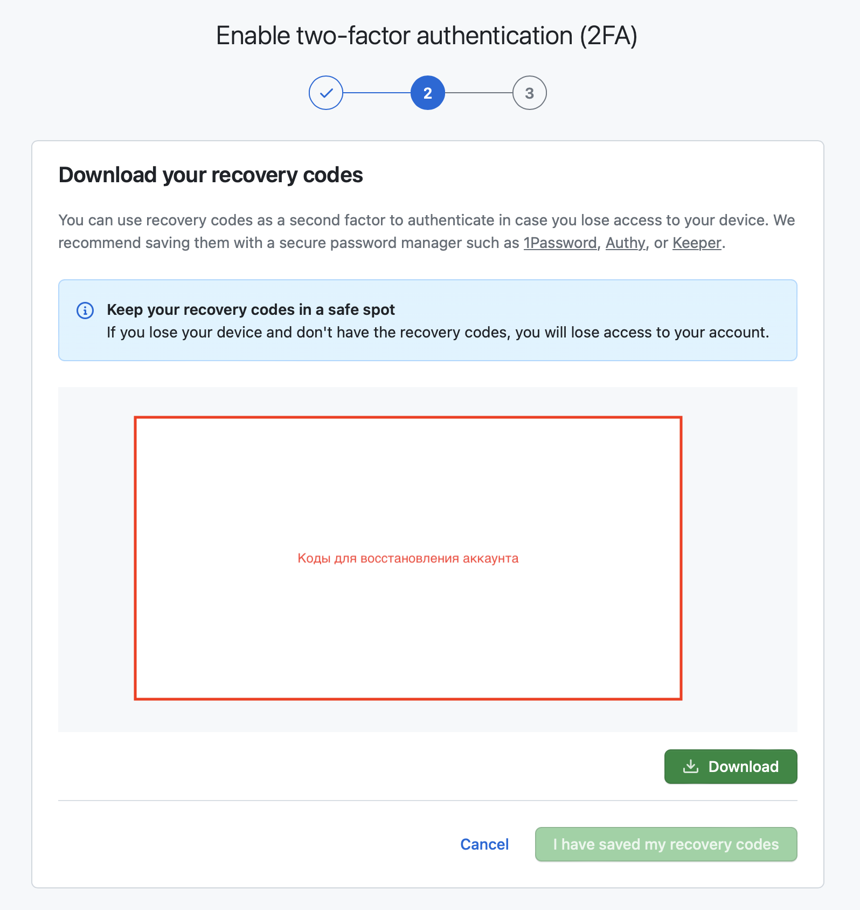
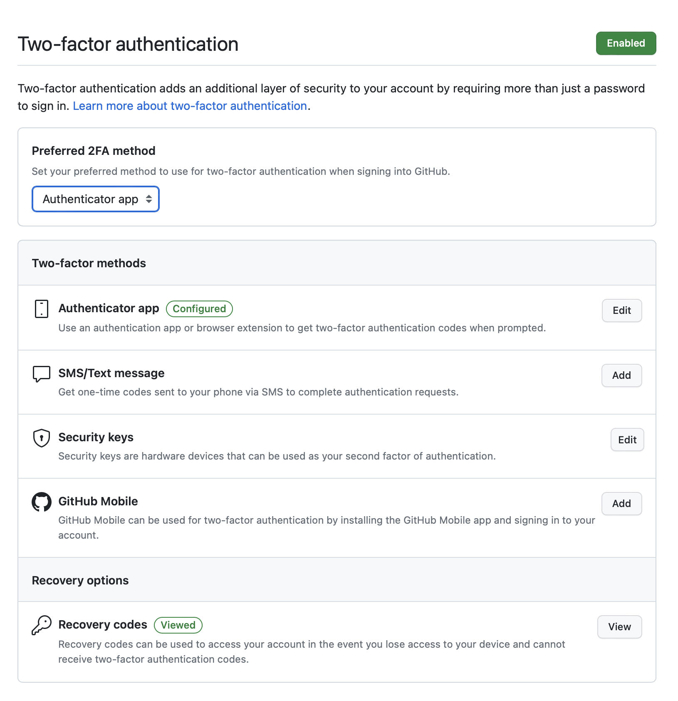
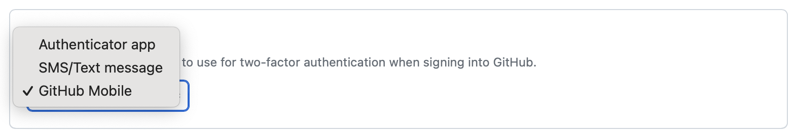

## Задача

Для безопасной работы с репозиториями необходимо настроить двухфакторную аутентификацию.

## Готовое решение

Если управляете репозиторием на GitHub, вы наверняка сталкивались с требованием настроить двухфакторную аутентификацию. Она нужна для того, чтобы обеспечить безопасный доступ к аккаунту и предотвратить несанкционированный доступ. Добавить двухфакторную аутентификацию можно с помощью следующих шагов.

Нажмите в основном меню GitHub в начале страницы на кнопку с картинкой своего профиля. Она называется «Open user account menu» и находится в самом конце меню.

В выпадающем меню, которое открыла кнопка, выберите пункт «Settings» и перейдите в настройки профиля.

В боковой панели вкладок в разделе «Access» раскройте вкладку «Password and authentication». В содержимом вкладки спуститесь к разделу «Two-factor authentication» с настройками двухфакторной аутентификации.

Нажмите на ссылку «Enable two-factor authentication». Она находится под сообщением «Two-factor authentication is not enabled yet».

После перехода по ссылке попадёте на страницу с тремя шагами по включению нового способа аутентификации. На первом шаге попросят установить и открыть приложение для аутентификации на смартфоне. Например, Google Authenticator для [iOS/iPadOS](https://apps.apple.com/us/app/google-authenticator/id388497605) или для [Android](https://play.google.com/store/apps/details?id=com.google.android.apps.authenticator2). Отсканируйте QR-код со страницы. Он находится в разделе «Scan the QR code». После этого в приложении появится специальный 6-значный код, который надо ввести в поле «Verify the code from the app». Теперь нажмите на кнопку «Continue», которая до этого была неактивной.

На странице со вторым шагом нужно скачать ключи для восстановления профиля. Их можно загрузить с помощью кнопки «Download» к себе на компьютер или просто скопировать. Дальше нажмите на «I have saved my recovery codes».

На третьей странице с последним шагом примите поздравления с тем, что настроили двухфакторную аутентификацию. На этой же странице можете настроить доступ с помощью SMS-сообщений или приложения GitHub (для [iOS/iPadOS](https://apps.apple.com/ru/app/github/id1477376905) или для [Android](https://play.google.com/store/apps/details?id=com.github.android&hl=en_US)). Это два оставшихся способа для настройки двухфакторной аутентификации.

После настройки доступа к аккаунту с помощью приложения Google Authenticator в настройках профиля во вкладке «Password and authentication» обновится информация. Появится выпадающее меню с предпочитаемым способа аутентификации, блок «Two-factor methods». В нём можете отредактировать настройки для приложений для аутентификации, SMS и текстовые сообщения, ключи безопасности и GitHub Mobile. Последнее изменение — раздел «Recovery options».

С помощью поля «Preferred 2FA method» можете выбрать удобный способ двухфакторной аутентификации — приложение для аутентификации, SMS или текстовое сообщение, GitHub Mobile.

