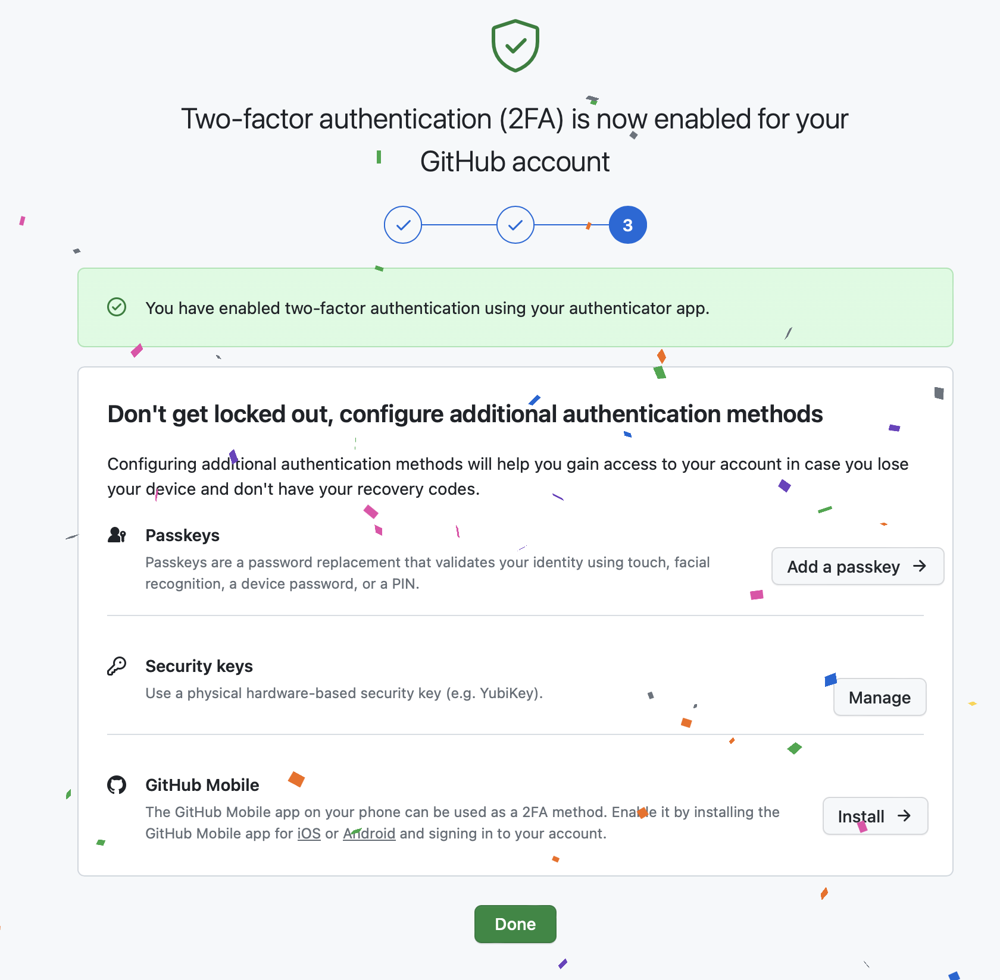

## Задача

Для безопасной работы с репозиториями необходимо настроить двухфакторную аутентификацию.

## Готовое решение

Если вы управляете репозиторием на GitHub, вы наверняка сталкивались с требованием настроить двухфакторную аутентификацию. Данный шаг необходим, чтобы обеспечить безопасный доступ к вашему аккаунту и предотвратить несанкционированный доступ. Добавить двухфакторную аутентификацию можно с помощью следующих шагов:

1. Выбрать в верхнем навигационном меню свой профиль (нажать на картинку профиля).

2. Перейти в настройки профиля, нажав на пункте меню «Settings».

3. Перейти в раздел «Password and authentication» и спуститься вниз до группы настроек двухфакторной аутентификации «Two-factor authentication».

4. Нажать на кнопку «Enable two-factor authentication».

5. На смартфоне запустить приложения для аутентификации, например, Google Authenticator (для [iOS/iPadOS](https://apps.apple.com/us/app/google-authenticator/id388497605) или для [Android](https://play.google.com/store/apps/details?id=com.google.android.apps.authenticator2)), и отсканировать QR-код, который появился на открывшейся странице.

6. На открывшейся странице загрузить с помощью кнопки «Download» к себе на компьютер или просто скопировать ключи для восстановления профиля.

7. На последней третьей странице настройки принять поздравления о том, что вы теперь настроили двухфакторную аутентификацию. На этой же странице вы можете настроить доступ с помощью SMS-сообщений или приложения GitHub (для [iOS/iPadOS](https://apps.apple.com/ru/app/github/id1477376905) или для [Android](https://play.google.com/store/apps/details?id=com.github.android&hl=en_US)). Это два оставшихся способа для настройки двухфакторной аутентификации.

Страница после настройки доступа с помощью приложения Google Authenticator:

С помощью поля «Preferred 2FA method» можно настроить наиболее удобный способ для вас двухфакторной аутентификации.

