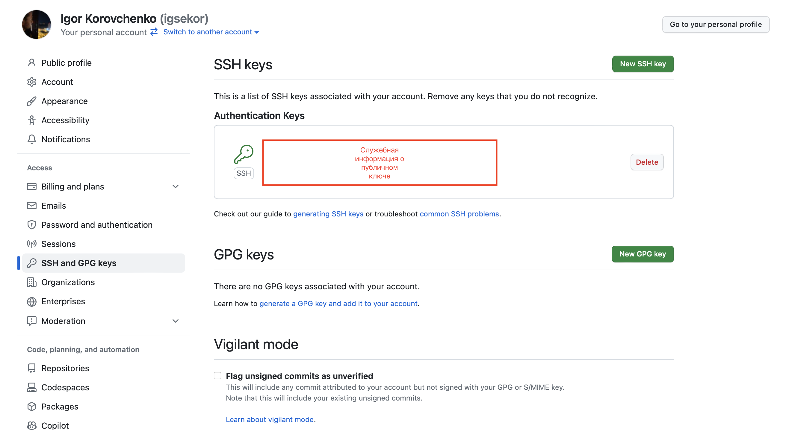
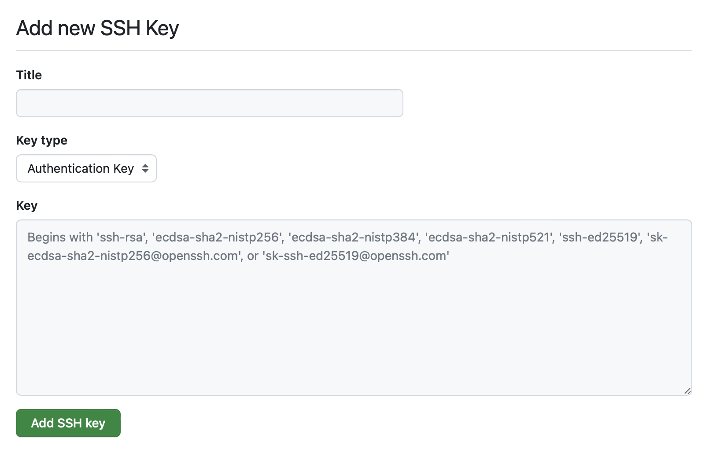

## Задача

Настроить доступ по протоколу SSH для работы с репозиториями.

## Готовое решение

GitHub позволяет получить доступ к репозиториям по [протоколу SSH](/tools/ssh/) (Secure Socket Shell). Это безопасный способ передачи данных по сети. Для того чтобы настроить доступ, добавьте свой публичный ключ на GitHub. Это делается в несколько шагов.

Сначала нажмите кнопку с иконкой вашего профиля «Open user account menu» в главном меню GitHub. Это последний пункт меню.

В выпадающем меню, которое открывает кнопка, выберите пункт «Settings». Он находится рядом с пунктами «Feature preview» и «GitHub Docs».

Откроется новая страница с настройками. В меню со складками выберите «SSH and GPG keys» в разделе «Access».

В содержимом вкладки найдите и нажмите на ссылку «New SSH key». Она находится рядом с заголовком «SSH keys».

На открывшейся странице введите название ключа в поле «Title» (на практике можете работать с GitHub с разных компьютеров), сам ключ в поле «Key» и выберите «Authentication Key» (значение по умолчанию) в поле «Key type».

После нажмите на кнопку «Add SSH key», которая находится под формой. Ключ теперь добавлен на GiHub, и вы можете работать с репозиториями по защищённому протоколу.

