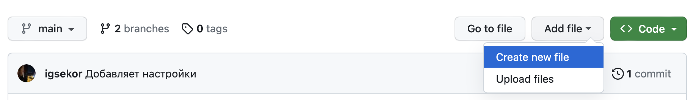
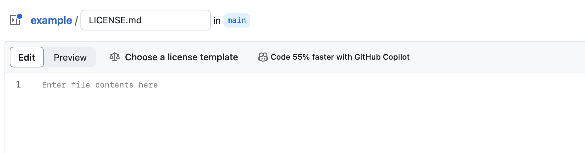
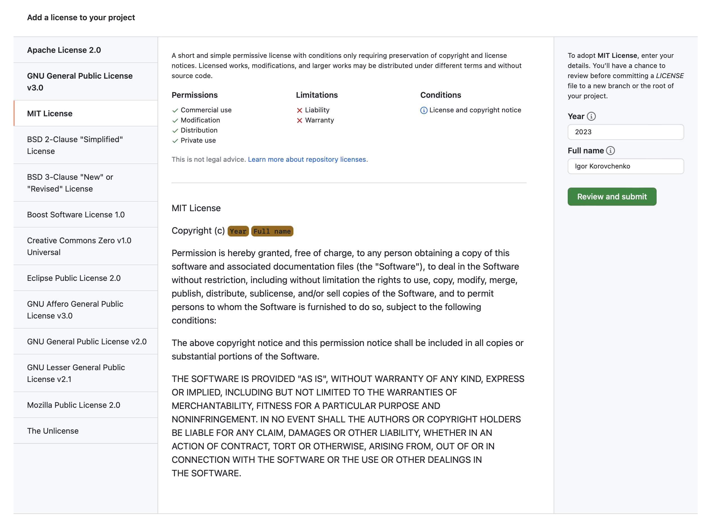
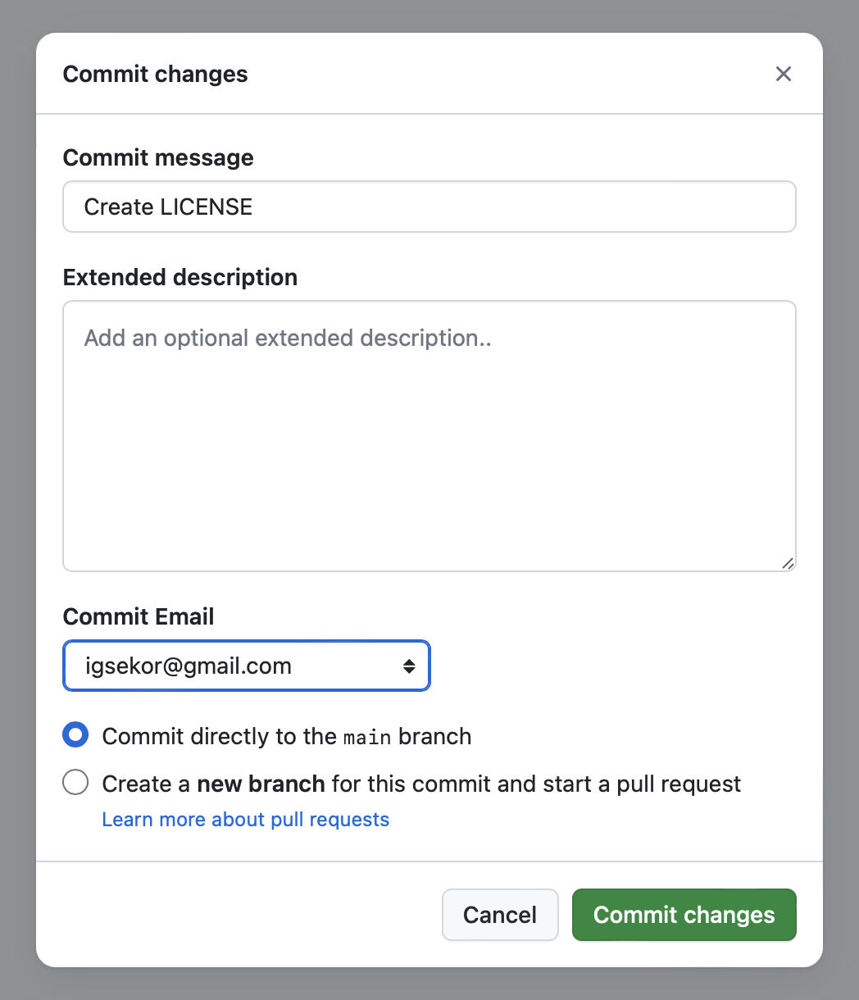
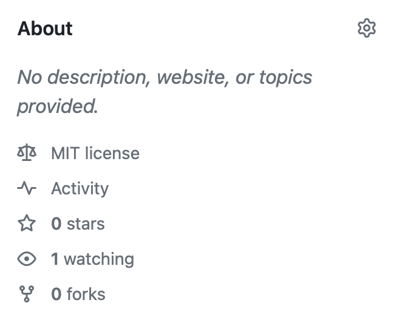
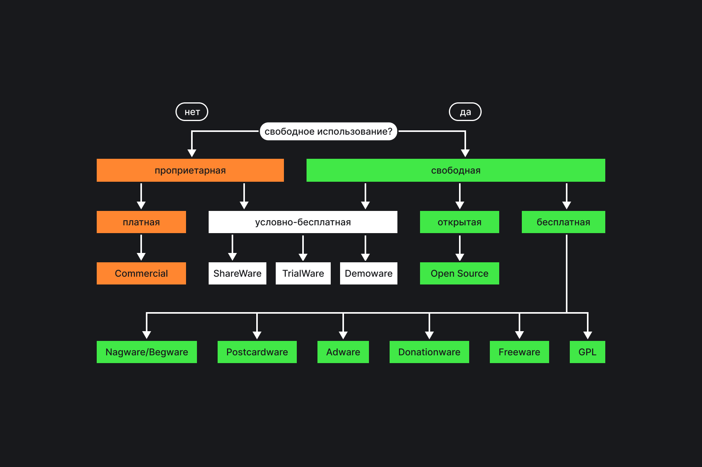
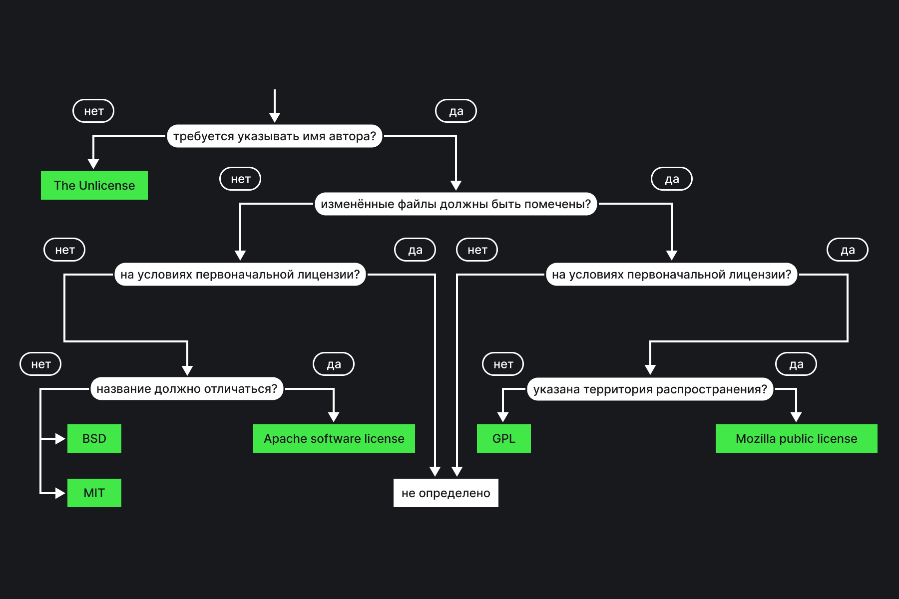

## Задача

Выбрать лицензию для репозитория на GitHub.

## Решение

На GitHub есть возможность указать лицензию для репозитория. Добавить типовую лицензию можно на этапе создания репозитория, как это описано в рецепте «[Как создать репозиторий](https://doka.guide/recipes/github-new-repo/)». Для этого необходимо выбрать лицензию из списка.

Если нужно добавить собственную, а не типовую лицензию, или выбрать лицензию уже после этапа создания репозитория, нужно сделать следующее:

1. Перейти на первую вкладку репозитория.
1. Кликнуть на «Add file», который находится в верхней части репозитория рядом с кнопкой «Code», и выбрать пункт «Create new file» в выпадающем списке.

На открывшейся странице введите имя файла _LICENSE.md_ в специальное поле над блоком с его содержимым. После этого рядом с переключателем для редактирования и превью появится кнопка «Choose a license template». На этом этапе можете выбрать одну из типовых лицензий или написать собственную.

После нажатия на кнопку «Choose a license template» вас спросят, уверены ли вы, что хотите покинуть страницу. Подтвердите, что согласны. В открывшемся окне в боковом меню слева можно выбрать одну из типовых лицензий GitHub. Например, MIT License или Apache License 2.0. В верхнем блоке есть подсказка по авторскому праву, которое защищает выбранная лицензия. В ней описаны разрешения, ограничения и условия.

После того как определились с типом, нажмите кнопку «Review and submit». Она находится в боковом меню справа рядом с полями «Year» и «Full name».

Снова откроется окно из предыдущего пункта. Можете отредактировать типовую лицензию или просто оставить всё как есть. Если вы уверены, нажмите кнопку «Commit changes…». Во всплывающем окне выберите комментарий к коммиту, его расширенное описание, если нужно, почту, а также в какую ветку хотите сделать коммит — основную или создать новую. Затем нажмите кнопку «Commit changes».

После этого в репозитории добавится новый файл с лицензией, и на основной странице репозитория в блоке с информацией о репозитории справа появится выбранная лицензия. Например, MIT license.

## Разбор решения

Лицензия позволит защитить авторские права и опишет условия использования репозитория другими людьми или компаниями. Схема выбора типа лицензии:

Свободное использование? Если да, то лицензия свободная и может быть:

- условно-бесплатной — ShareWare, TrialWare, Demoware;
- открытой — Open Source;
- бесплатной — Nagware/Begware, Postcardware, Adware, Denationware, Freeware, GPL.

Если нет, то лицензия проприетарная и может быть:

- платной — Commercial;
- условно-бесплатной.

Схема выбора открытой лицензии из числа самых распространённых:

1. Требуется указать имя автора? Если нет, это The Unilicense. Если да, переходите ко второму или третьему пунктам.
1. Изменённые файлы должны быть помечены? Если нет, лицензия на условиях первоначальной? Да → лицензия не определена. Нет → название должно отличаться → нет → это BSD или MIT. Если название не должно отличаться, то это Apache software license.
1. Изменённые файлы должны быть помечены? Если да, то лицензия на условиях первоначальной? В случае нет лицензия не определена. Когда ответ да, указана ли территория распространения? Нет → GPL, да → Mozilla public license.

Поскольку GitHub, в основном, используется для хранения кода программного обеспечения, список типовых лицензий состоит из следующих:

- [Apache License 2.0](https://www.apache.org/licenses/LICENSE-2.0);
- [GNU General Public License v3.0](https://www.gnu.org/licenses/gpl-3.0.en.html);
- [MIT License](https://opensource.org/license/mit/);
- [BSD 2-Clause "Simplified" License](https://opensource.org/license/bsd-2-clause/);
- [BSD 3-Clause "New" or "Revised" License](https://opensource.org/license/bsd-3-clause/);
- [Boost Software License 1.0](https://www.boost.org/users/license.html);
- [Creative Commons Zero v1.0 Universal](https://creativecommons.org/publicdomain/zero/1.0/);
- [Eclipse Public License 2.0](https://www.eclipse.org/legal/epl-2.0/);
- [GNU Affero General Public License v3.0](https://www.gnu.org/licenses/agpl-3.0.en.html);
- [GNU General Public License v2.0](https://www.gnu.org/licenses/old-licenses/gpl-2.0.en.html);
- [GNU Lesser General Public License v2.1](https://www.gnu.org/licenses/old-licenses/lgpl-2.1.en.html);
- [Mozilla Public License 2.0](https://www.mozilla.org/en-US/MPL/2.0/);
- The Unlicense — лицензия, которая свидетельствует об отказе от авторских прав.
