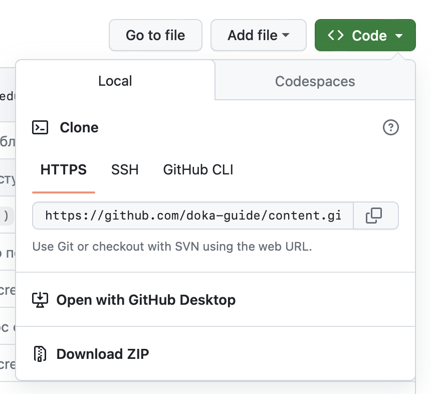
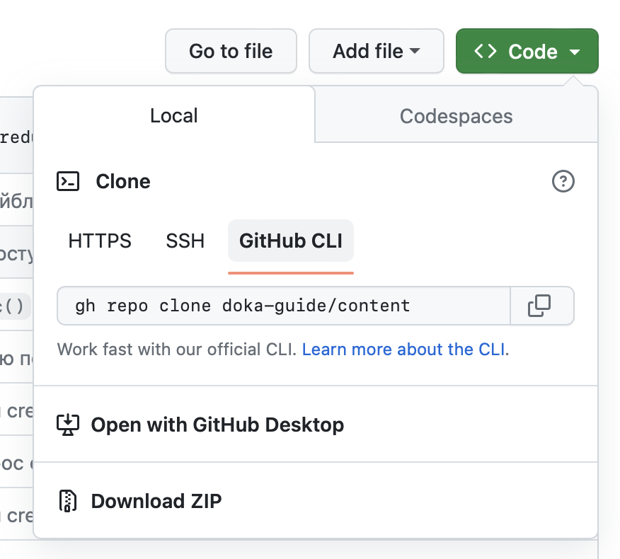

## Задача

Клонировать репозиторий на локальный компьютер.

## Готовое решение

<aside>

📚 Чтобы клонировать репозиторий, нужно установить на компьютер Git CLI. Как это сделать описано в статьях «[Системы управления версиями](/tools/version-control/)» и «[Git CLI](/tools/git-cli/)».

</aside>

Выполните в терминале команду:

```bash
git clone <ссылка на репозиторий>
```

Чтобы найти ссылку на репозиторий, выберите вкладку «\<\> Code» в репозитории на GitHub. Когда переходите к нужному проекту, эта вкладка открывается по умолчанию. Найдите в основной части вкладки аккордеон, который тоже называется «\<\> Code» и разверните его. В развернувшейся панели по умолчанию будет выбрана «Local». В ней выберите формат ссылки.

Первые «HTTPS» и «SSH» — это ссылки на репозиторий, использование которых подходит для стандартной команды клонирования, описанной выше. SSH ссылка будет работать в том случае, если настроили доступ по SSH. Для этого надо установить публичный ключ в настройках профиля на GitHub. Подробнее в рецепте «[Как настроить доступ по SSH на GitHub](/recipes/github-add-ssh-access/)»). Третий формат — «GitHub CLI». Он набран в виде команды, которая будет работать, если у вас установлен [GitHub CLI](https://cli.github.com/).

После выбора скопируйте из поля нужную ссылку или команду. Поле расположено после типов ссылок.






После выполнения команды `git clone` в вашей текущей папке появится папка с тем же именем, что и сам репозиторий. Если хотите указать другую папку для репозитория, укажите в конце команды для клонирования её название:

```bash
git clone <ссылка на репозиторий> <папка>
```
