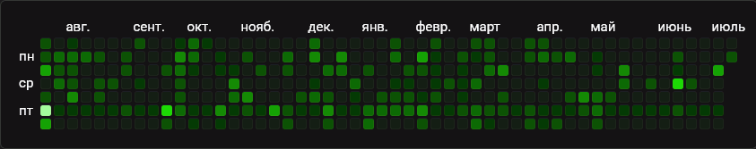

## Задача

«GitHub-плитка» — легко узнаваемый компонент на [странице профиля пользователя GitHub](/recipes/github-new-profile/).

<aside>

Уже более ста лет для визуализации данных используются таблицы, где значения отображаются с помощью цвета. Такой способ визуализации называется тепловая карта (heatmap).

</aside>

Создадим подобный компонент для отображения активности коммитов в репозиторий.

## Готовое решение

В этом рецепте используются:

- GitHub API;
- манипуляции с датами и цветами;
- рендеринг HTML-элементов с помощью JavaScript.



Основа HTML-разметки:

```html
<div id="mainContainer" class="main-container">
  <div class="description"></div>
  <div class="year-grid hidden"></div>
</div>
```

Добавим стили:

```css
html {
  color-scheme: dark;
}

body {
  min-height: 100vh;
  margin: 0;
  padding: 50px;
  display: flex;
  align-items: center;
  justify-content: center;
  box-sizing: border-box;
  background-color: #18191C;
  color: #FFFFFF;
  font-family: "Roboto", sans-serif;
}

.main-container {
  display: flex;
  flex-direction: column;
  gap: .5rem;
  min-width: 200px;
  padding: 1rem;
  position: relative;

  --base-color: hsl(112 100% 50%);
  --text-color: #FFFFFF;
  --label-color: #C56FFF;
}

.main-container div {
  box-sizing: border-box;
}

.description {
  display: flex;
  flex-direction: row;
  gap: .5rem;
  flex-wrap: wrap;
}

.loading {
  position: absolute;
  margin-inline: auto;
  inset-inline: 0;
  inset-block-start: 40%;
  width: 20px;
  height: 20px;
  border: 4px solid #454545;
  border-top: 4px solid var(--base-color);
  border-radius: 50%;
  animation: spin 1s linear infinite;
}

@keyframes spin {
  to {
    transform: rotate(360deg);
  }
}

.repo-name,
.total-row,
.tooltip,
.error-value {
  color: var(--text-color);
}

.description,
.value-label {
  color: var(--label-color);
}

.year-grid {
  flex: 1 1;
  display: flex;
  max-width: 100%;
  min-width: 100px;
  overflow-y: hidden;
  overflow-x: auto;
  padding: 2rem 1rem 1rem 1rem;
  background-color: #121316;
  border: 1px solid #363636;
  border-radius: 5px;
}

.weekday-label,
.month-label {
  font-size: .75rem;
  color: var(--text-color);
}

.weekday-label {
  margin: 10px 4px 0 0;
}

.month-label {
  width: 0;
  margin-top: -1rem;
  overflow-x: visible;
}

.weekday-labels,
.week {
  display: flex;
  flex-direction: column;
  flex: 0 0 auto;
}

.day {
  width: 10px;
  height: 10px;
  margin: 1px;
  border: 1px solid #88888818;
  border-radius: 2px;
}

.day:hover {
  border-color: #88888855;
}

.day.has-commits:hover {
  border-color: #888888AA;
}

.tooltip {
  position: absolute;
  width: max-content;
  max-width: 400px;
  padding: 8px 16px;
  border-radius: 4px;
  background-color: #454545;
}

.tooltip .value-label {
  color: #CCCCCC;
}

.hidden {
  visibility: hidden;
}

@media (max-width: 768px) {
  body {
    padding: 20px;
  }
  .main-container {
    padding: 0;
  }
}
```

Основную работу по созданию всего компонента будет выполнять JS. Рассмотрим его ниже.

Итоговый результат выглядит так:

<iframe title="GitHub-плитка активности репозитория" src="demos/commit-activity-demo/" height="600"></iframe>

## Разбор решения

Задачу можно разделить на несколько частей:

1. получение данных с помощью запроса к GitHub API;
1. преобразование полученных данных;
1. определение цветов;
1. отображение плитки.

### Получение данных с помощью запроса к GitHub API

GitHub предоставляет удобное [API](/tools/api/) и документацию по его использованию. Мы будем использовать [запрос для получения данных об активности коммитов за последний (прошедший начиная с сегодняшнего дня) год](https://docs.github.com/en/rest/metrics/statistics?apiVersion=2022-11-28&versionId=free-pro-team%40latest&category=repos&subcategory=repos#get-the-last-year-of-commit-activity).

Вот как выглядит запрос:

```
GET https://api.github.com/repos/{owner}/{repo}/stats/commit_activity
```

где:
`{owner}` — имя владельца репозитория
`{repo}` — название репозитория

Для примера возьмём данные об активности [репозитория с контентом Доки](https://github.com/doka-guide/content).

Используем функцию формирования пути запроса вместо константы, чтобы иметь возможность проще расширять функциональность в дальнейшем:

```js
// Имя в формате owner/repo
const REPO = 'doka-guide/content'

function createURL(repo = REPO) {
  return `https://api.github.com/repos/${repo}/stats/commit_activity`
}
```

Документация описывает необходимые заголовки (headers) API-запроса:

- `'X-GitHub-Api-Version': '2022-11-28'` — версия API. Этот параметр гарантирует получение ответа в формате, описанном в документации, даже при изменении этой структуры в будущих версиях API;
- `'Accept': 'application/vnd.github+json'` — формат файла ответа. Документация [рекомендует](https://docs.github.com/en/rest/using-the-rest-api/getting-started-with-the-rest-api?apiVersion=2022-11-28#accept) добавлять заголовок `Accept` для уточнения желаемого формата данных.

Напишем функцию выполнения запроса. Функция принимает в качестве параметра путь запроса и возвращает [промис](/js/fetch/):

```js
function requestGitHubData(url) {
  try {
    return fetch(url, {
      method: 'GET',
      headers: {
        'Accept': 'application/vnd.github+json',
        'X-GitHub-Api-Version': '2022-11-28'
      }
    })
  } catch (error) {
    console.error(error)
    return []
  }
}
```

Документация предупреждает о возможности получить [пустой ответ со статусом 202](https://docs.github.com/en/rest/metrics/statistics?apiVersion=2022-11-28#best-practices-for-caching). Чтобы корректно обработать такую ситуацию, предусмотрим возможность выполнения повторных запросов с задержкой.

Для этого нам понадобится функция, проверяющая статус ответа и выполняющая повторные запросы. Функция принимает объект параметров выполнения запроса:

```js
// Количество повторных попыток
const REQ_MAX_ATTEMPTS = 3
// Пауза между попытками, мс
const REQ_ATTEMPT_TIMEOUT = 20000
// Сообщение об ошибке в случае получения ответа со статусом 202
const ERR_202 = 'Данные не готовы'

async function fetchCommitActivity(requestParams = {}) {
  try {
    const {
      url,
      requestAttempts = REQ_MAX_ATTEMPTS,
      requestAttemptTimeout = REQ_ATTEMPT_TIMEOUT
    } = requestParams

    const response = await requestGitHubData(url)

    if (response.status === 202) {
      if (requestAttempts > 0) {
        // Пауза перед повторным запросом
        await new Promise(r => setTimeout(r, requestAttemptTimeout));

        // Рекурсивно вызываем функцию, уменьшая счётчик повторов
        return fetchCommitActivity({
          url,
          requestAttempts: requestAttempts - 1
        })
      }

      // Кидаем ошибку, если все попытки были безуспешны
      throw new Error(ERR_202)
    }

    if (response.ok) {
      return await response.json()
    }
  } catch (error) {
    console.error(error)
    return Promise.reject(error)
  }
}
```

### Преобразование полученных данных

Успешный ответ запроса будет содержать массив объектов, например:

```js
[
  {
    "days": [ 0, 3, 26, 20, 39, 1, 0 ],
    "total": 89,
    "week": 1336280400
  },
  ...
]
```

Каждый элемент массива — объект с информацией о неделе:

- `"days"` — массив значений количества коммитов за каждый день недели (начиная с воскресенья);
- `"total"` — общее количество коммитов за неделю;
- `"week"` —  дата первого дня недели в виде [Unix timestamp](/js/date/#poluchenie-tekushchego-vremeni).

Преобразуем полученные данные для удобства отображения названий дней недели, месяцев и даты дня в формат:

```js
[
  {
    "total": number,
    "weekDate": Date // Date-объект для даты начала недели
    "days": [
      {
        count: number, // Количество коммитов в вс.
        dateFormatted: string // Дата в формате `ГГГГ.MM.ДД`
      },
      {
        count: number // Количество коммитов в пн.
        dateFormatted: string
      },
      ...
    ],
    month: string // Сокращённое название месяца (для первой недели месяца)
  },
  ...
]
```

Ещё понадобятся функции форматирования дат:

```js
// Формат `ГГГГ.MM.ДД`
const DATE_FORMATTER = new Intl.DateTimeFormat('ru', {
  year: 'numeric',
  month: 'numeric',
  day: 'numeric',
})
// Сокращённое имя месяца
const DATE_MONTH_FORMATTER = new Intl.DateTimeFormat('ru', {
  month: 'short',
})

// Функция преобразования timestamp в экземпляр Date
function getWeekDate(weekTimestamp) {
  return new Date(weekTimestamp * 1000)
}

// Функция преобразования экземпляра Date в строку формата `ГГГГ.MM.ДД`
function getDateFormat(date) {
  return DATE_FORMATTER.format(date)
}

// Функция преобразования экземпляра Date в строку с сокращённым именем месяца
function getMonthName(date) {
  return DATE_MONTH_FORMATTER.format(date)
}
```

Создадим функцию преобразования полученных данных:

```js
function parseCommitActivity(responseData = []) {
  if (!Array.isArray(responseData)) {
    throw new Error('Данные не найдены')
  }

  // Текущая дата
  const currDate = new Date()

  let isFirstWeekOfMonth

  // Массив данных о неделях
  return responseData.map((weekItem, weekIndex) => {
    const { total, days: commitsPerDay, week: weekTimestamp } = weekItem

    // Date-объект первого дня недели
    const weekDate = getWeekDate(weekTimestamp)

    // Число месяца первого дня недели
    const firstWeekDay = weekDate.getDate()
    let dayDate

    // Массив данных по дням недели
    const days = commitsPerDay.map((count, dayIndex) => {
      // Date-объект для дня недели
      dayDate = new Date(weekDate)
      dayDate.setDate(firstWeekDay + dayIndex)

      // Если этот день ещё не наступил, возвращаем пустой объект
      if (dayDate > currDate) {
        return {}
      }

      // Дата дня в формате `ГГГГ.MM.ДД`
      const dateFormatted = getDateFormat(dayDate)

      return {
        count,
        dateFormatted
      }
    })

    // Число месяца последнего дня недели
    const lastDay = dayDate.getDate()
    // Для этой недели требуется отображать название месяца?
    showMonthName = (weekIndex === 0 && firstWeekDay < 10) || lastDay <= 7

    return {
      total,
      weekDate,
      days,
      month: showMonthName
        ? getMonthName(dayDate)
        : ''
    }
  })
}
```

Для улучшения наглядности предусмотрим возможность отображения дней недели.
В текущей реализации будем отображать сокращённые названия дней недели: `пн`, `ср`, `пт`.
Для решения этой задачи можно добавить обычную константу, однако мы не пойдём простым путём. Сформируем массив дней недели на основе полученных данных. Это упростит дальнейшие изменения представления данных:

```js
// Формат даты в виде сокращённого названия дня недели
const DATE_WEEK_DAY_FORMATTER = new Intl.DateTimeFormat('ru', {
  weekday: 'short'
})

// Функция преобразования экземпляра Date в строку в формате дня недели
function getWeekDayFormat(date) {
  return DATE_WEEK_DAY_FORMATTER.format(date)
}

// Функция создания массива дней недели
function createWeekDays(commitsData = []) {
  // Получим объект с информацией о первой неделе
  const [firstWeek] = commitsData
  if (!firstWeek) return

  const {days, weekDate} = firstWeek
  // Число месяца первого дня недели
  const firstWeekDay = weekDate.getDate()

  // Накапливаем массив названий чётных дней недели
  const weekDays = days.reduce((acc, dayData, dayIndex) => {
    if (dayIndex % 2) {
      let dayDate = new Date(weekDate)
      dayDate.setDate(firstWeekDay + dayIndex)
      acc.push(getWeekDayFormat(dayDate))
    }
    return acc
  }, [])

  return weekDays
}
```

Мы хотим отображать общее количество коммитов за год.
Кроме этого определим минимальное (`min`) и максимальное (`max`) число коммитов за день. Добавим функцию получения этих данных из массива сформированного ранее:

```js
function analyzeCommits(commitsData = []) {
  return commitsData.reduce((acc, weekData) => {
    const counts = weekData.days.map(item => item.count ?? 0)
    acc.min = Math.min(...counts, acc.min)
    acc.max = Math.max(...counts, acc.max)
    acc.total += weekData.total
    return acc
  }, {min: Number.POSITIVE_INFINITY, max: 0, total: 0})
}
```

### Определение цветов

Идея тепловой карты состоит в отображении данных с помощью цвета. В нашем случае данные — это число коммитов за день. Чем больше это число, тем ярче цвет плитки.

Для краткости используем термин «палитра». Палитра — это набор цветов, созданных на основе базового цвета. Цвета в палитре располагаются от тёмного (цвет для значения `0`) к светлому (соответствует максимальному значению в диапазоне).

При формировании палитры следует определить оптимальное количества цветов. Чем больше цветов в палитре, тем меньше заметна разница оттенков. С другой стороны, если в палитре всего несколько цветов, контраст оттенков слишком велик. Чтобы избежать этих крайностей, добавим константы, определяющие минимальное и максимальное количество цветов. Вынос этих параметров в константы позволит в дальнейшем упростить изменение палитры цветов.

```js
const COLOR_MAX_STEPS = 15
const COLOR_MIN_STEPS = 5
```

Для цветов мы будем использовать цветовую модель [HSL](/css/web-colors/#hsl). Эта модель подходит для нашей задачи, так как позволяет получать новый оттенок, изменяя параметр светлоты (Lightness) базового цвета. Для хранения базового цвета используем кастомную CSS-переменную:

```css
.main-container {
  /* стили */

  --base-color: hsl(112, 100%, 50%);
}
```

Для доступа к значению переменной из JS используются функции [`getComputedStyle()` и `getPropertyValue()`](/js/element-get-property-value/):

```js
const baseColor = getComputedStyle(mainContainer).getPropertyValue('--base-color').trim()
```

Определим требуемое количество цветов (`steps`).

```js
function makeColors(commitCounts, baseColor) {
  const { min, max } = commitCounts
  const steps = Math.max(Math.min(max - min, COLOR_MAX_STEPS), COLOR_MIN_STEPS)

  const startColor = getStartColor(baseColorStr)

  return generatePalette(startColor, steps)
}
```

Из строкового значения `baseColor` получим первый (самый светлый) цвет палитры в виде массива `[h, s, l]`:

```js
function getStartColor(colorStr) {
  const hslMatch = colorStr.match(/hsl\(\s*(\d+)\s*(\d+)%?\s*(\d+)%?\s*\)/)
  const [, h, s, l] = hslMatch
  const hsl = [
    parseInt(h, 10), // Парсим оттенок
    100, // Переопределяем насыщенность
    80 // Переопределяем светлоту базового цвета
  ]
  return hsl
}
```
Сформируем палитру — массив цветов в формате `hsl`.

```js
function generatePalette(hslColor, steps) {
  const [h, s, lBase] = hslColor
  const palette = []
  let lStep

  for (let i = 0; i < steps - 1; i++) {
    // Определяем светлоту цвета
    lStep = lBase - (lBase * i) / steps
    lStep = Math.max(0, lStep)

    // Добавляем в палитру цвет на основе базового
    palette.push(`hsl(${h}, ${s}%, ${Math.round(lStep)}%)`)
  }

  // Добавим в палитру цвет, соответствующий отсутствию коммитов
  const lEmpty = Math.min(9, Math.max(9, Math.round(lStep/2)))

  palette.push(`hsl(${Math.round(h/1.05)}, ${Math.round(s/4)}%, ${lEmpty}%)`) //

  return palette.reverse()
}
```

### Рендеринг HTML-элементов с помощью JavaScript

Теперь, когда почти всё необходимое для отображения плитки готово, приступим к её созданию!

Соединим созданные ранее и ещё не готовые части в единое целое:

```js
const mainContainer = document.querySelector('#mainContainer')
const description = mainContainer.querySelector('.description')
const gridContainer = mainContainer.querySelector('.year-grid')
const spinner = mainContainer.querySelector('.spinner')
const baseColor = getComputedStyle(mainContainer).getPropertyValue('--base-color').trim()

showLoading(true, mainContainer)

fetchCommitActivity({
  url: createURL()
}).then(responseData => {
  return parseCommitActivity(responseData)
}).then(commitsData => {
  const commitCounts = analyzeCommits(commitsData)
  const weekDays = createWeekDays(commitsData)

  const colors = makeColors(commitCounts, baseColor)

  renderRepoInfo({repoName: REPO}, description)
  renderTotal(commitCounts, mainContainer)

  renderYearGrid(
    {commitsData, weekDays, commitCounts, colors},
    gridContainer
  )

  bindTooltip(gridContainer, mainContainer)
}).catch(error => {
  showError(error, description)
}).finally(() => {
  showLoading(false, mainContainer)
})
```

Создадим недостающие функции отображения дополнительных данных и состояния загрузки:

```js
// Отображение/скрытие ожидания загрузки данных в виде спиннера
function showLoading(show, container) {
  let loadingElem = container.querySelector('.loading')
  if (!loadingElem && show) {
    loadingElem = document.createElement('span')
    loadingElem.classList.add('loading')
    container.appendChild(loadingElem)
  }
  else if (loadingElem && !show) {
    loadingElem.remove()
  }
}

// Название репозитория
function renderRepoInfo({repoName}, element) {
  element.innerHTML = `
    <span class='repo-label'>
      Репозиторий:
    </span>
    <span class="repo-name">
      ${repoName}
    </span>
  `
}

// Количество коммитов
function renderTotal({total = null}, container) {
  if (total !== null) {
    const totalElem = document.createElement('div')
    totalElem.className = 'total-row'
    totalElem.innerHTML = `
      <span class="value-label">
        Общее количество коммитов за год:
      </span>
      <span>${total}</span>
    `
    container.appendChild(totalElem)
  }
}

// Информации об ошибке
function showError(error, element) {
  const errorMessage = error?.message ?? `${error}`
  element.innerHTML = `
    <span class='error-label'>
      Ошибка получения данных:
    </span>
    <span class='error-value'>
      ${errorMessage}
    </span>
  `
}
```

Основная часть нашего скрипта — функция `renderYearGrid()`:

```js
function renderYearGrid(params, container) {
  const {commitsData = [], weekDays, commitCounts = {}, colors = []} = params
  const weekCount = commitsData.length ?? 0
  if (weekCount === 0) return

  const {max} = commitCounts

  const steps = colors.length
  const factor = steps - 1

  // Если есть названия дней недели, отображаем их
  if (weekDays) {
    const weekDaysContainer = document.createElement('div')
    weekDaysContainer.className = 'weekday-labels'

    weekDays.forEach(weekDay => {
      const weekDayLabel = document.createElement('div')
      weekDayLabel.className = 'weekday-label'
      weekDayLabel.innerText = weekDay
      weekDaysContainer.appendChild(weekDayLabel)
    })
    container.appendChild(weekDaysContainer)
  }

  // Перебираем массив с данными о неделях
  commitsData.forEach(weekData => {
    const {days, month} = weekData
    // Добавляем название месяца
    if (month) {
      const monthLabel = document.createElement('div')
      monthLabel.className = 'month-label'
      monthLabel.innerText = month
      container.appendChild(monthLabel)
    }

    // Заполняем контейнер с данными недели
    const weekContainer = document.createElement('div')
    weekContainer.className = 'week'

    days.forEach(dayData => {
      const {count = 0, dateFormatted = ''} = dayData
      const isFuture = dateFormatted === ''

      const dayContainer = document.createElement('div')
      let className = 'day cell'

      if (isFuture) {
        className += ' hidden'
      } else {
        // Определяем цвет для фона плитки
        const colorIndex = count > 0
          ? Math.min(
            Math.ceil((count / max) * steps) + (count > 1 ? 1 : 0),
            factor
          )
          : 0
        dayContainer.style.background = colors[colorIndex]
        // Устанавливаем атрибут для показа даты в тултипе
        dayContainer.setAttribute('data-date', dateFormatted)
      }

      if (count) {
        // Устанавливаем атрибут для показа количества коммитов в тултипе
        dayContainer.setAttribute('data-count', count)
        className += ' has-commits'
      }
      dayContainer.className = className
      weekContainer.appendChild(dayContainer)
    })

    container.appendChild(weekContainer)
    container.classList.remove('hidden')
  })
}
```

При наведении указателя на плитку будем отображать тултип с краткой информацией: дата дня и количество коммитов.

```js
function bindTooltip(gridContainer, container) {
  const tooltipElem = document.createElement('div')
  tooltipElem.innerHTML = `
    <div
      class="tooltip hidden"
      role="tooltip"
      id="tooltip"
      data-position="top"
    ></div>
  `
  container.appendChild(tooltipElem)

  let top = 0
  let left = 0

  const toggleTooltip = (target = null) => {
    const show = target !== null

    if (show) {
      const {offsetTop, offsetLeft} = target
      const date = target.getAttribute('data-date')
      if (!date) return
      const count = target.getAttribute('data-count')

      tooltip.style.top = `${offsetTop - (count ? 65 : 40)}px`
      tooltip.style.left = `${offsetLeft - 55}px`

      tooltip.innerHTML = `<div>
        ${date}
        ${count ? `<br><span class="value-label">коммитов:</span> ${count}` : ''}
        </div>
      `
    }

    tooltip.classList.toggle('hidden', ! show)
  }

  const showTooltip = event => {
    const target = event.target
    if (target.classList.contains('day')) {
      if (top !== target.offsetTop || left !== target.offsetLeft)
      {
        top = target.offsetTop
        left = target.offsetLeft
        toggleTooltip(target)
      }
    }
  }

  const hideTooltip = event => {
    top = 0
    left = 0
    toggleTooltip()
  }

  gridContainer.addEventListener('mousemove', showTooltip)
  gridContainer.addEventListener('mouseleave', hideTooltip)
}
```

Наша Github-плитка готова! Продемонстрируем как добиться «тыквенного»-стиля.

Для этого потребуется изменить только базовый цвет:

```css
--base-color: hsl(34, 100%, 50%);
```

Итоговый результат выглядит так:

<iframe title="GitHub-плитка активности репозитория" src="demos/commit-pumpkin-demo/" height="600"></iframe>
