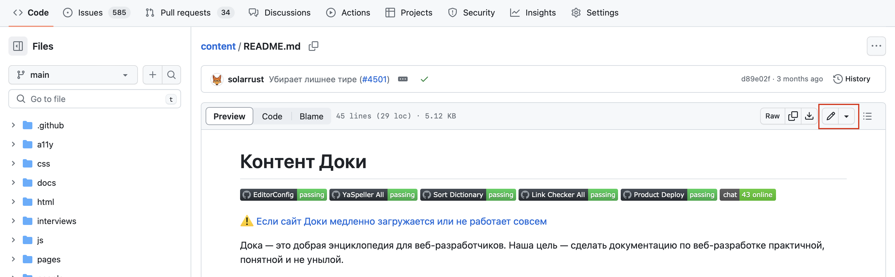
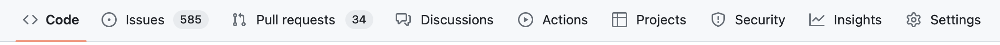
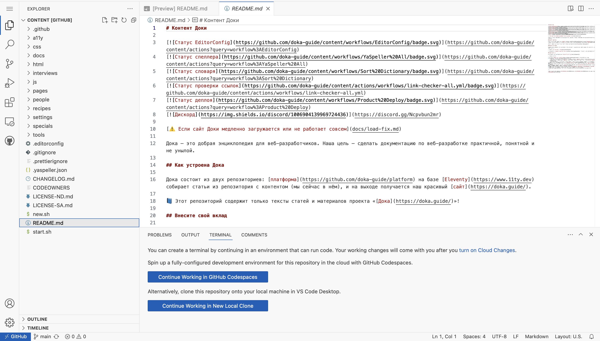

## Задача

Нет доступа к редактору или любимой IDE (Integrated Development Environment — интегрированная среда разработки), надо что-то срочно подправить в репозитории на GitHub.

## Готовое решение

Есть два пути. Первый и самый простой — выбрать нужный файл в репозитории, кликнуть по нему и на открывшейся странице нажать кнопку редактирования (с иконкой с карандашом). Кнопка находится в блоке с информацией о файле и другими элементами для работы с ним. Слева в боковом меню можете найти все файлы и папки репозитория. Чтобы быстро найти нужный файл или переместиться по дереву папок, используйте поле поиска в начале блока рядом с выбранной веткой.

В режиме редактирования, если это файл в формате Markdown, можно переключаться между редактором и предварительным просмотром кнопками «Edit» и «Preview». Они находятся рядом с полем для изменения названия файла.

Когда закончили редактирование, сохраните изменения с помощью коммита. Для этого нажмите на кнопку «Commit changes…» справа вверху. Кнопка тоже находится рядом с названием файла. Если решили отменить изменения, нажмите на соседнюю кнопку «Cancel changes».

Второй способ — загрузить в браузер веб-версию редактора VS Code. Чтобы открыть редактор, нажмите клавишу <kbd>></kbd> (угловая закрывающая скобка) на клавиатуре в английской раскладке. Для этого вы должны быть на основной (первой) вкладке репозитория «Code».

Редактирование в IDE практически ничем не отличается от десктопной версии редактора, однако полноценно запустить код не получится. Для этого нужно оплатить использование [Codespaces](https://docs.github.com/en/codespaces/overview) на GitHub. Если можете внести изменения без запуска сборки, это удобный способ редактирования. В веб-версии VS Code работают стандартные горячие клавиши редактора.

Интерфейс редактора выглядит так же, как десктопный. Есть боковое меню — со вкладками для поиска, плагинами, файлами проекта, ветками и так далее. В основной части экрана находится окно для редактирования файлов и панель вкладок с открытыми документами. Внизу, после основной части экрана, находится консоль со вкладками «Problems», «Output», «Terminal» и «Comments».

