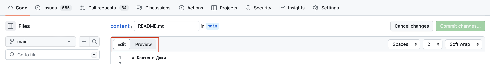

## Задача

Нет доступа к редактору или любимой IDE, надо что-то срочно подправить в репозитории на GitHub.

## Готовое решение

Есть два пути. Первый и самый простой способ: выбрать нужный файл в репозитории, кликнуть по нему, на открывшейся странице нажать кнопку редактирование (карандаш). Слева в колонке будут отображаться все файлы репозитория, по которым можно искать с помощью поискового поля вверху колонки или переходить по дереву папок.

В режиме редактирования, если это файл в формате Markdown, можно переключаться между редактором и предварительным просмотром кнопками «Edit» и «Preview». Когда редактирование закончено, нужно сохранить изменения с помощью коммита, нажав на кнопку «Commit changes…» справа вверху. Если вы раздумаете редактировать файл, нажмите на кнопку «Cancel changes».

Второй способ позволяет загрузить в браузер веб-версию редактора VS Code, нажав кнопку <kbd>> .</kbd> на клавиатуре в английской раскладке. Для этого необходимо находится на основной (первой) вкладке репозитория.

Редактирование в IDE практически ничем не отличается от десктопной версии редактора, однако полноценно запустить код не получится, нужно оплатить использование [Codespaces](https://docs.github.com/en/codespaces/overview) на GitHub. В случае, если вы можете внести изменения без запуска сборки, такой способ редактирования будет вполне приемлемым. Стандартные горячие клавиши дл VS Code действуют и в веб-версии.

