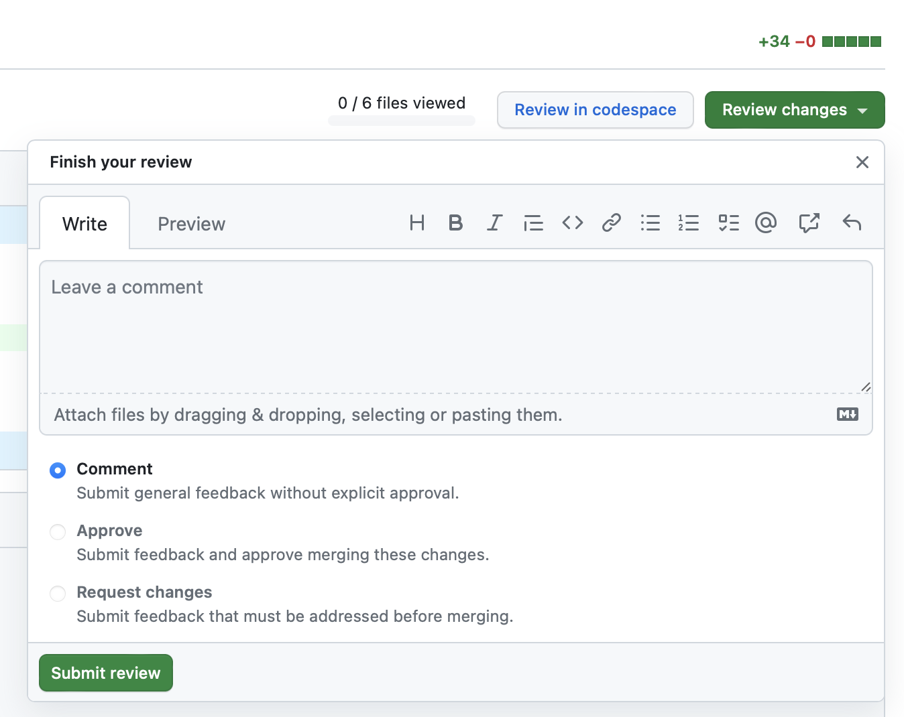

## Задача

Организовать работу в пулреквестах.

## Готовое решение

Пулреквест в интерфейсе GitHub имеет четыре вкладки, на которых справа налево расположены:

- страница для обсуждения изменений;
- страница со списком коммитов;
- страница со списком результатов проверок пулреквеста;
- страница со всеми изменениями в файлах.

Справа в интерфейсе показано, сколько строк изменены в пулреквесте и каким образом. Также дан красно-зелёный график для наглядности характера правок. Красным отмечены удалённые строки, а зелёным — добавленные.

На странице обсуждений в линейном виде, друг под другом, представлены комментарии от автора пулреквеста, ревьюеров, участников дискуссии и автоматические комментарии от роботов самого GitHub или роботов пользователя, например, автоматических проверок, превью результатов пулреквеста, снимки экрана приложения, представление вывода в консоль и прочее.

Работа в пулреквестах организуется вокруг обсуждения изменений между автором (авторами) пулреквеста и ревьюером (ревьюерами). В качестве последних, как правило, выступают опытные пользователи репозитория, часто имеющие необходимые права на управление репозиторием.

Обсуждение изменений в формате форума представлено на первой вкладке в интерфейсе GitHub. На вкладке обсуждений можно добавлять комментарии с помощью поля и кнопки «Comment» внизу страницы. Первым комментарием, как правило, является описание изменений в пулреквесте. Очень важно делать его подробным. Часто можно встретить шаблоны, которые нужно заполнить при создании пулреквеста. Например, в Доке такой шаблон есть. Он позволяет ничего не забыть при описании. На вкладке с обсуждениями также выводятся и все коммиты, комментарии к которым приобретают большой смысл. Они выступают в качестве вех в обсуждении пулреквеста, что вносит дополнительную организацию в работу.

Страница со списком коммитов примечательна быстрым доступом к различным этапам разработки изменений, истории развития продукта в рамках пулреквеста. Эта вкладка позволяет оценить масштабность изменений продукта и различные побочные эффекты, которые вполне могут быть.

Страница со списком проверок называется «Checks» не случайно. Обычно пулреквесты проходят ряд автоматических проверок (орфография, грамматика, стиль кода и прочее). Но эта вкладка рассматривается несколько шире, поскольку содержит список всех результатов действия пайплайнов GitHub, о которых подробнее можно почитать в статье «[GitHub Actions](/tools/github-actions/ "Собираем пример CI/CD пайплайна в Github")». Сами пайплайны не ограничены только проверками, поэтому «Checks» скорее отражает типовое использование GitHub Actions в рамках пулреквеста.

На последней вкладке содержится список изменений в формате разницы между тем, что было (в колонке слева), и что стало (в колонке справа) с файлами репозитория. Режим с двумя колонками доступен, если в настройках вкладке выбран соответсвующий пункт:

Зелёным цветом и плюсами слева показаны добавленные символы или строчки, красным и минусами — удалённые. Если провести мышкой или по левой стороне правой колонки (в колонке с номерами строк), то появляется кнопка «+». При нажатии на неё появляется возможность создать комментарий, привязанный к конкретной строке. Кнопка «+/-» нужна для включения необходимых изменений к пулреквесту. Кнопка «Add single comment» позволяет оставить независимый комментарий, а кнопка «Start a review» — начать ревью.

В верхней части интерфейса последней вкладке также присутствует кнопка «Review changes», при нажатии на которую появляется всплывающее окно с возможностью одобрить пулреквест (кнопкой «Approve»), добавить комментарий (кнопкой «Comment») или запросить изменения у автора пулреквеста (кнопкой «Request changes»). Также можно оставить комментарий автору пулреквеста.

В процессе комментирования ревьюер может оставить комментарии, в которых содержаться изменения в файлах, которые можно принять (закоммитить с комментарием) по одному кнопкой «Commit suggestion» или добавлять их в общий список изменений кнопкой «Add suggestion to batch», чтобы потом закоммитить их все сразу пачкой. Такой подход очень удобен, поскольку позволяет структурировать изменения в ходе ревью. Например, можно принять правки от одного ревьюера, а потом от другого. При нажатии кнопки «Commit suggestion» появляется окно, в котором можно указать комментарий в коммиту и создать его.

