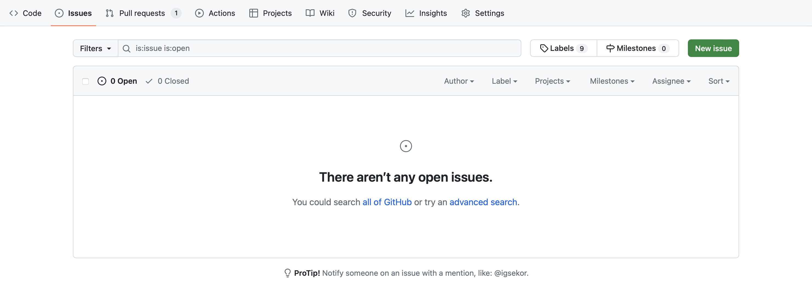
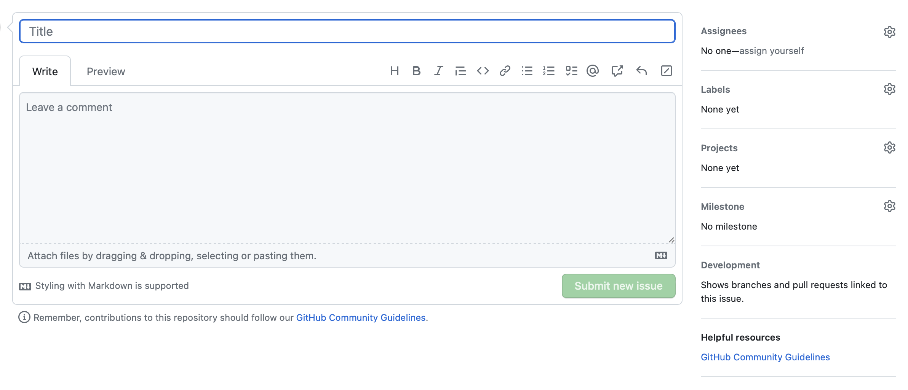
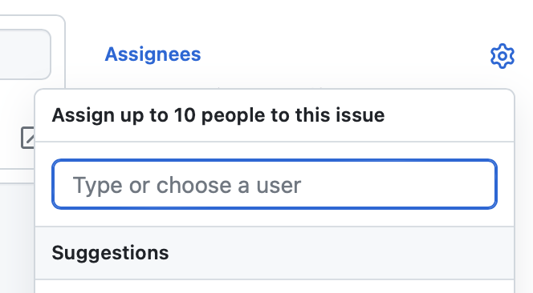
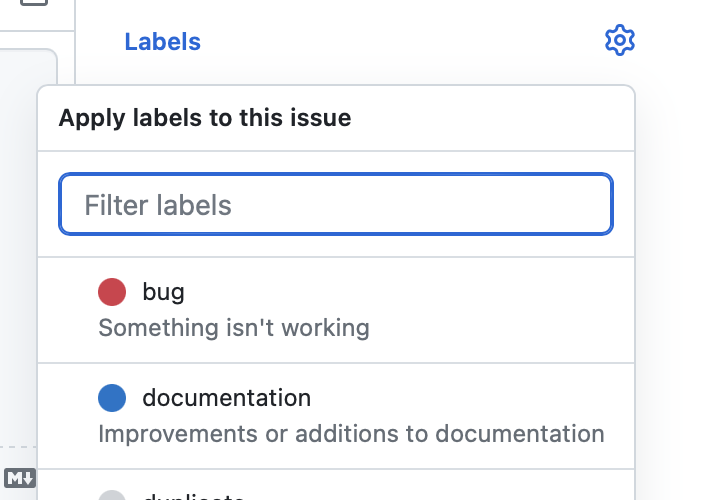
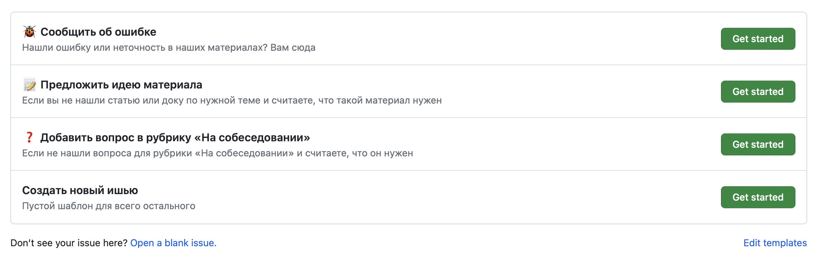
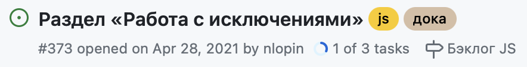

## Задача

Создать ишью в репозитории на GitHub.

## Решение

Чтобы создать ишью, необходимо проделать последовательно следующие шаги.

Перейти в репозитории на вкладку «Issues» и нажать на кнопку «New issue». Кнопка находится под вкладками на одной строчке с поиском и списком лейблов.

При этом может сразу открыться страница с возможностью отредактировать новое ишью. Вы можете отредактировать его название, описать его в текстовом поле после поля для названия, посмотреть превью описания, а также поставить исполнителя, метку, проект и этап разработки.

Справа в колонке можно назначить исполнителем ишью пользователя репозитория. Для этого раскройте аккордеон «Assignees» c картинкой «колесо настройки» и введите в поле ник нужного пользователя на GitHub. Другой способ — выбрать пользователя из списка рекомендуемых. Обычно в него попадают люди, которые недавно работали с проектом. Если хотели выбрать себя, то сделайте это с помощью ссылки-кнопки «assign yourself». Всего можно назначить 10 пользователей.

Для ишью можно добавить метки (labels). Для этого раскройте аккордеон «Labels» c картинкой «колесо настройки». В открывшейся области можно выбрать уже готовые метки, которые используются в проекте. Например, «bug» или «documentation».

Метки — это средства таксономии (что-то вроде хештегов), которые позволяют фильтровать ишью и определять цель и срочность решения.

После того как полностью сформулировали ишью, нажмите кнопку «Submit new issue», чтобы сохранить его. До завершения работы эта кнопка была неактивной.

В репозитории могут храниться шаблоны для ишью. В этом случае при нажатии на кнопку «New issue» откроется страница с выбором шаблона. Например, в Доке есть шаблоны «Сообщить об ошибке», «Предложить идею материала», «Добавить вопрос в рубрику "На собеседовании"» и «Создать новый ишью». Следом за названием и кратким описанием шаблона располагается кнопка «Get started».

Кнопками «Get started» можно выбрать нужный шаблон. Если ни один шаблон не подходит для вашего случая, можно щёлкнуть по ссылке «Open a blank issue» внизу страницы. Она расположена после списка доступных шаблонов. В любом случае, после нажатия перейдёте на страницу редактирования ишью.

## Разбор решения

Ишью — это правильно сформулированная задача на доработку репозитория. Например, исправление ошибок, внедрение новой функциональности, устранение неудобств при разработке и т. д.

Каждое ишью должно содержать подробное описание задач или проблем, с которыми  столкнулся пользователь репозитория, список их возможных причин и описание возможных путей решения. Ишью может содержать и списки того, что нужно сделать в рамках большой задачи, или может быть атомарным, то есть содержать формулировку одной задачи.

Ишью поддерживает [формат Markdown](/tools/markdown/). С его помощью можно создавать туду-листы на основе ненумерованных списков с использованием квадратных скобок в формате `- [x] задача`. Если использовать пробел вместо `x`, то в интерфейсе GitHub такой элемент не будет отмечен галочкой. Галочки можно ставить прямо в интерфейсе. Если ишью содержит туду-листы, то в общем списке они отображаются с кружком. Прогресс выполнения выглядит как заливка другого цвета по форме круга, а рядом подписано сколько задач из общего количества выполнено. Например, «1 of 3 tasks».

Не надо бояться больших номеров ишью. Дело в том, что с точки зрения GitHub, пулреквест — это просто специальное ишью, поэтому номера увеличиваются довольно быстро. Кроме того, ишью, идущие друг за другом, могут иметь номера не по порядку (с пропусками).
