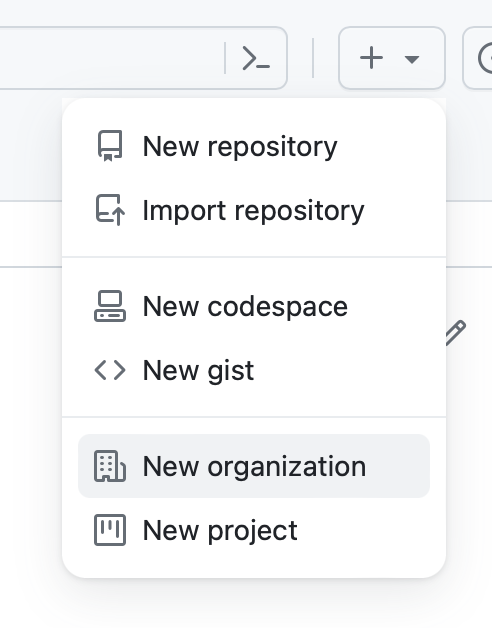
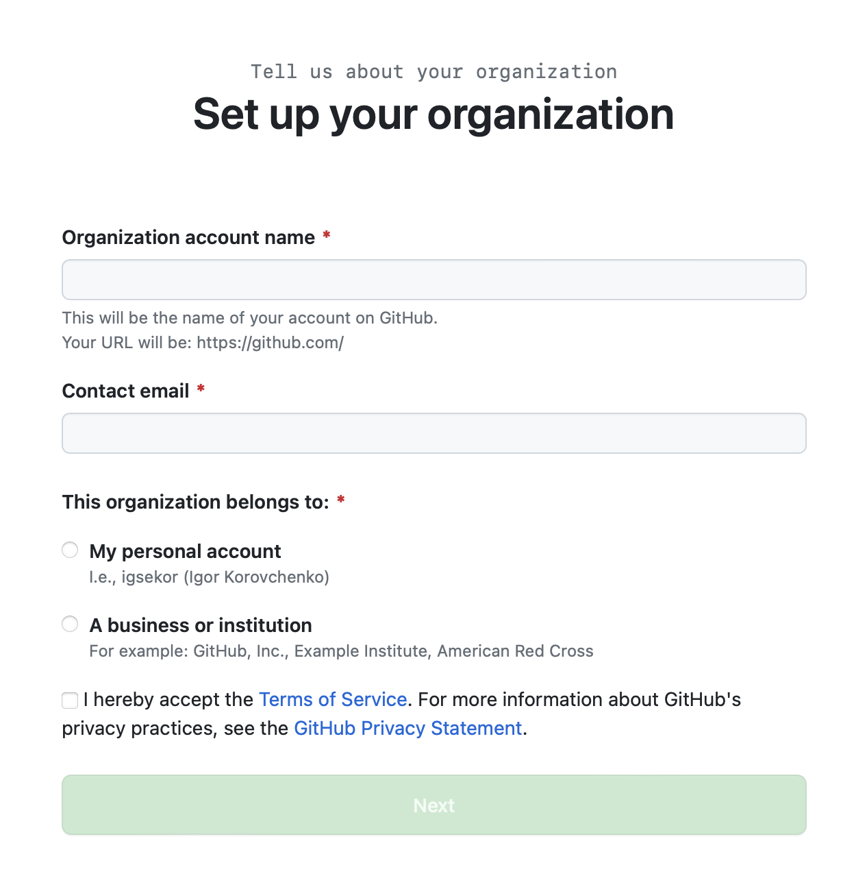
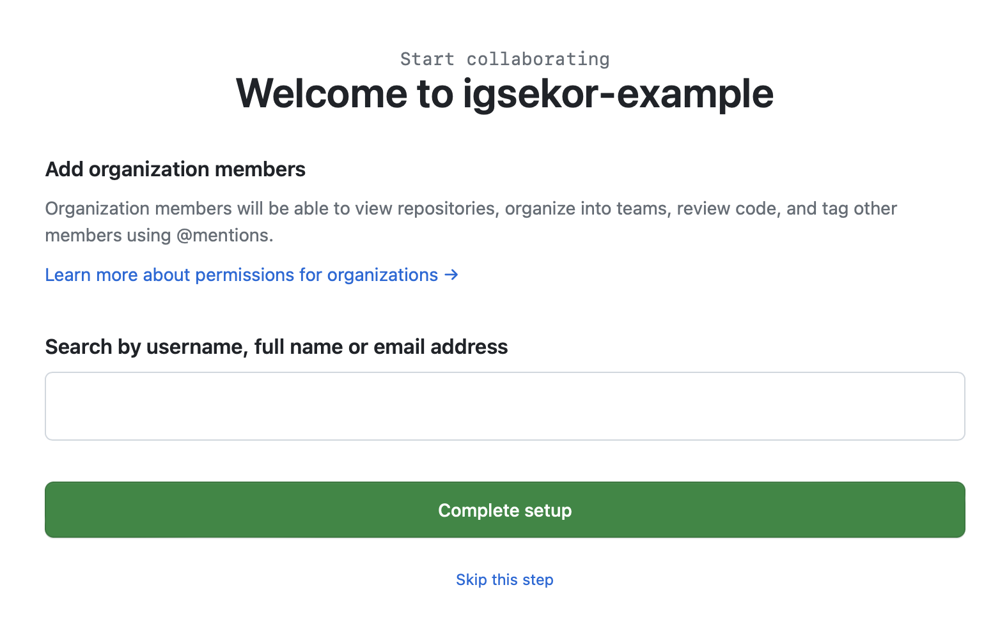

## Задача

У вас есть команда для работы над проектами, надо организовать её работу на GitHub.

## Готовое решение

Есть два пути. Самый короткий — в меню рядом со строкой поиска нажать на кнопку «Create something new», которая выглядит как знак плюс «+», и в открывшемся списке выбрать пункт «New organization».

Второй путь — зайти в настройки вашего профиля и в разделе «Access» выбрать вкладку «Your organizations». В открывшемся содержимом вкладки надо перейти по ссылке «New organization». Она находится рядом с заголовком «Organizations».

На открывшейся вкладке вам предложат выбрать план обслуживания организации. Первый план бесплатный, он не даёт пользоваться некоторыми возможностями, но для базовой работы они, скорее всего, и не потребуются.

План можно выбрать на месяц или год. Другие два плана платные. Это «Team» для небольших команд и «Enterprise» для больших компаний.

После перехода по ссылке с планом, например, «Create a free organization», снова откроется новая страница. Задайте уникальное имя «Organization account name» (аналог профиля) и добавьте электронную почту «Contact email». Также выберите, кому будет принадлежать организация «This organization belongs to». Доступны две опции:

- «My personal account» — если организация на GitHub не будет ассоциироваться с компанией или образовательной организацией, смело выбирайте этот пункт.
- «A business or institution» — если будет ассоциироваться, выберите этот пункт.

Остаётся согласиться с условиями с помощью чекбокса рядом с «I hereby accept the Terms of Service...» и можно жать на кнопку «Next» под формой. На следующем шаге можете выбрать и подключить членов команды. Для этого в поле «Search by username, full name or email address» введите ник, имя или почту нужного участника. После нажмите на кнопку «Complete setup» под формой.

Членов команды можно добавить и позже, тогда нужно нажать на ссылку «Skip this step», которая находится рядом с «Complete setup».

Организация создана, и вы можете настраивать её под свои задачи и дальше. Для быстрой настройки прямо на открывшейся странице можно пройти по пунктам специального руководства для настройки всех основных моментов. Например, пригласить ещё участников, настроить уровни их доступа, создать пулреквест, защитить ветки проекта, настроить CI/CD и узнать больше о других возможностях GitHub.

В боковом меню найдёте настройки видимости проекта, ссылки на создание README-файла, дискуссии, а также можете создавать репозитории в рамках организации кнопкой «Create new repository» или импортировать репозиторий из аккаунта или другой организации.

