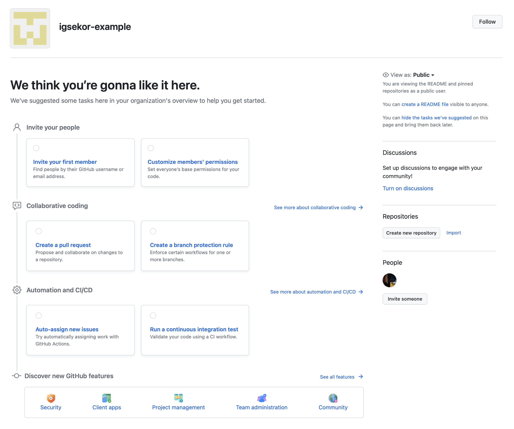

## Задача

У вас есть команда для работы над проектами, надо организовать её работу на GitHub.

## Готовое решение

Есть два пути. Самый короткий — вверху страницы нажать на кнопку «+» и в разворачивающимся списке выбрать пункт «New organization».

Второй путь — зайти в меню профиля, выбрать пункт «Your organizations» и на открывшейся странице нажать кнопку «New organization».

На открывшейся странице вам будет предложено выбрать план обслуживания вашей организации. Самый первый план бесплатный, он не даёт пользоваться некоторыми возможностями, но для базовой работы в принципе они, скорее всего, и не потребуются.

После нажатия на соответствующую кнопку (например, «Create a free organization»), откроется новая страница, на которой можно задать уникальное имя «Organization account name
» (аналог никнейма) и контактная электронная почта «Contact email». Также необходимо выбрать, кому будет принадлежать организация «This organization belongs to». Доступны две опции:

- «My personal account» — если организация на GitHub не будет ассоциироваться с какой-то компанией или образовательной организацией, то смело выбирайте этот пункт.
- «A business or institution» — а если будет — то этот.

Остаётся согласиться с условиями с помощью галочки и можно жать на кнопку «Next». На следующей странице можно выбрать и подключить членов команды. После этого можно нажать кнопку «Complete setup». Членов команды можно добавить и позже, тогда нужно нажать на ссылку «Skip this step».

Организация создана, и вы можете настроить её под свои задачи. Для быстрой настройки прямо на открывшейся странице можно пройти по пунктам специального гайда для настройки всех основных моментов. Внизу страницы можно уже создавать репозитории в рамках организации кнопкой «Create new repository», также можно импортировать репозиторий из аккаунта или другой организации.

