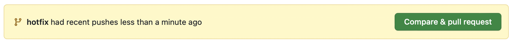
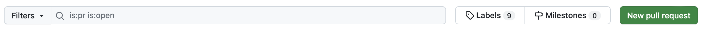
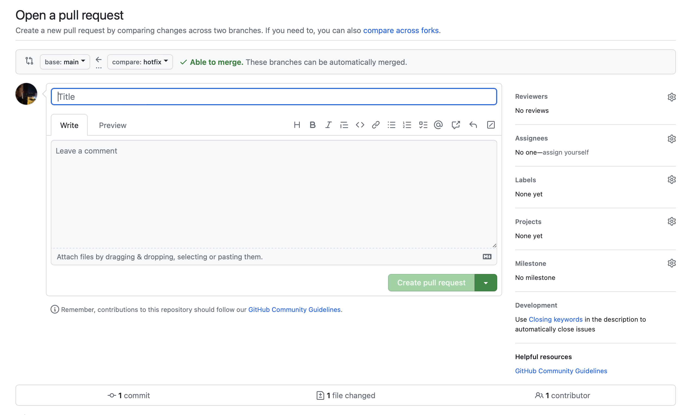

## Задача

Сделать пулреквест в существующий репозиторий на GitHub.

## Готовое решение

Суть пулреквеста — создать запрос на внесение изменений в репозиторий. Обычно такой запрос сопровождается отзывом (ревью) со стороны других пользователей репозитория, обладающих правами на внесение изменений.

Для того чтобы сделать пулреквест, нужно создать отдельную ветку и внести все правки именно в неё. Название ветки можно выбрать произвольным образом, но лучше отразить суть изменений в нескольких английских словах, перечисленных через знак переноса (`-`). Например, чтобы внести изменения (пофиксить), можно использовать слово `fix` или `hotfix` (для срочных изменений) в качестве первого слова:

```bash
git checkout -b hotfix
```

Эта команда создаст ветку с именем `hotfix`, и Git переключит репозиторий на новую ветку. Теперь можно вносить изменения с помощью коммитов, например:

```bash
git commit -m 'Вносит правки в описание'
```

Когда все правки внесены, необходимо отправить изменения на GitHub. Для этого нужно выполнить команду:

```bash
git push -u origin hotfix
```

После этого нужно перейти на сайт GitHub и зайти там в репозиторий. Сверху появится сообщение на жёлтом фоне, в котором вам предложат создать пулреквест:



Можно нажать кнопку «Compare & pull request» в этом сообщении или создать пулреквест «вручную» на странице со списком пулреквестов с помощью кнопки «New pull request»:



Далее вас перекинет на страницу с настройками будущего пулреквеста. На ней можете добавить название и описать изменения, выбрать ветку, в которую хотите внести изменения (по умолчанию выбирается ветка, из которой создавали текущую ветку с изменениями) или связать ваш запрос с текущими нуждами. Обычно они находятся в списке ишью. Также можете добавить ревьюеров для проверки изменений и тестирования:



Внизу страницы будут перечислены коммиты с изменениями.

Когда будете уверены, что заполнили необходимые поля и выбрали подходящие настройки, нажмите кнопку «Create pull request».
