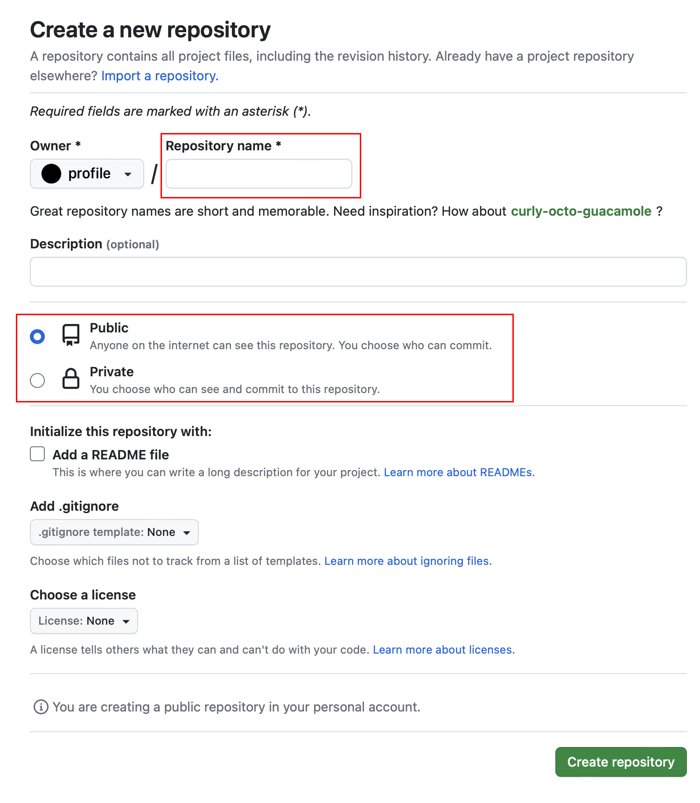

# Как создать репозиторий

## Задача

Работа надо проектом или ваше портфолию — для этого вам точно понадобится репозиторий. Есть несколько сервисов, которые позволяют разместить свой код с ограниченным или публичным доступом. Среди таких платформ наибольшую популярность получил GitHub. Создадим свой репозиторий на GitHub за пару минут.

## Решение

Необходимо в правом углу нужно нажать на кнопку «+» и выбрать пункт «New repository…», как показано на скриншоте:


Откроется окно с выбором параметров создаваемого репозитория, в котором необходимо написать название репозитория в поле «Repository name» (верхнее выделенное красной рамкой), которое должно быть уникальным. Доступность имени будет проверяться по мере того, как вы будете вводить его в поле.



Поле «Owner» заполняется автоматически тем профилем, под которым вы вошли, но если вы являетесь участником организаций на GitHub, то в этом поле можно будет выбрать нужную организацию.

Следующее обязательное поле (нижнее выделенное красной рамкой) — уровень доступа к репозиторию. Репозитории бывают частными (Private), скрытыми от посторонних глаз, и публичными (Public), открытыми для всех желающих. По умолчанию выбран вариант публичного репозитория.

Можно выбрать и другие поля, которые являются необязательными:

- добавить краткое описание репозитория (поле Description);
- добавить файл-описание _README.md_ (Add a README file);
- добавить файл исключений _.gitignore_ для отслеживания файлов папке репозитория (Add .gitignore);
- выбрать одну из заготовленных лицензий (Choose a license).

Помните, что вы можете добавлять эти файлы только в новый репозиторий, который нигде кроме GitHub ещё не создан, иначе возникнет конфликт. Однако эти три файла можно добавить и позже вручную, или они могут присутствовать уже в вашем проекте на локальном компьютере.

После нажатия на кнопку «Create repository» откроется страница пустого репозитория, где появятся всякие подсказки о дальнейших действиях.

Если репозиторий у вас ещё не создан на компьютере, то можно в терминале выполнить команды группы «…or create a new repository on the command line»:

```bash
echo "# python" >> README.md
git init
git add README.md
git commit -m "Комментарий к первому коммиту"
git branch -M main
git remote add origin git@github.com:<путь до репозитория>
git push -u origin main
```

GitHub предлагает первым файлом в репозитории создавать файл с описанием проекта _ README.md_. Основную ветку GitHub предлагает назвать `main`.

Если репозиторий уже существует, можно выполнить только две последние команды:

```bash
git branch -M main
git remote add origin git@github.com:<путь до репозитория>
git push -u origin main
```

Первая команда переименовывает основную ветку вашего репозитория и является необязательной. В случае, если ваша основная ветка называется иначе, вместо `main` нужно будет указать то название ветки, которое используете вы.

Если ваш репозиторий использует иную систему контроля версий, то GitHub может попробовать преобразовать её в git. Для этого вам нужно будет нажать кнопку «Import code»  и следовать инструкции.
