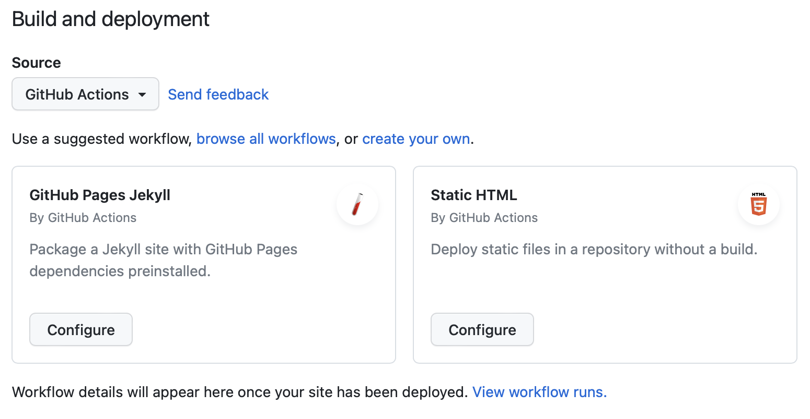
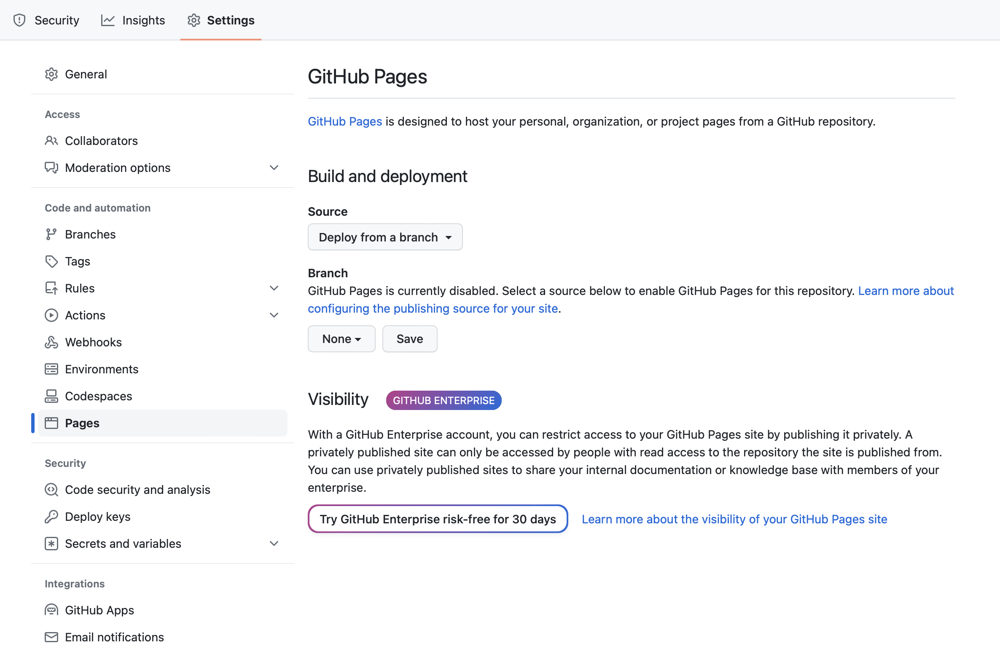
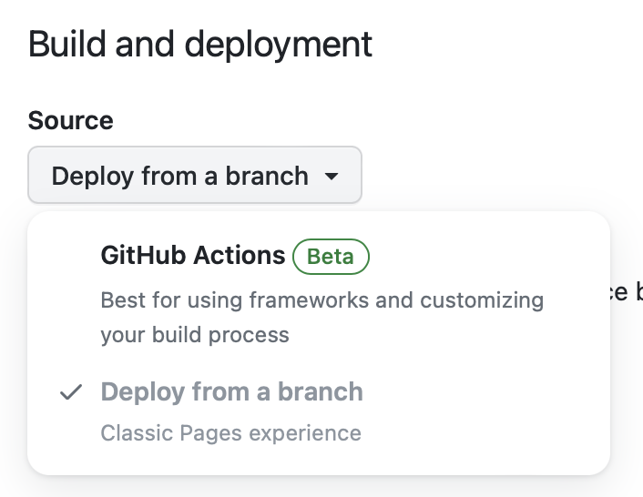
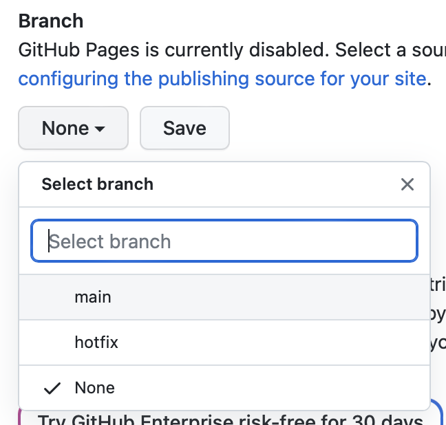
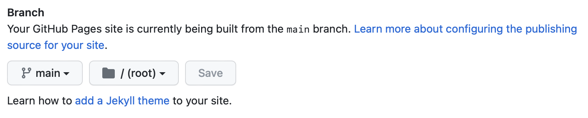

## Задача

Как опубликовать сайт в виде набора HTML-страниц для тестирования или постоянного размещения прямо на GitHub. Например, такой сайт может стать отличным портфолио. Для него будут бесплатными хостинг и доменное имя третьего уровня.

## Готовое решение

На GitHub для этого есть специальный инструмент — GitHub Pages. С помощью него публикуют сайты, используя в качестве хостинга сам сервис. Есть два способа использования этого инструмента:

1. Собранный сайт помещается в отдельную папку в выбранной ветке репозитория, GitHub просто отображает эту папку как корневую для сайта. Такой подход используют для показа уже собранного статического сайта в виде набора файлов в форматах, которые отображаются в браузере напрямую.
1. Статический сайт сначала собирается с помощью средств автоматизации GitHub Actions и публикуется также как в первом случае.

Про GitHub Actions можете почитать в статье «[GitHub Actions](/tools/github-actions/)».

Второй способ не будем рассматривать, так как он находится на этапе бета-тестирования. В этом режиме можно выбрать уже готовые решения, например, GitHub Pages Jekyll и Static HTML, а можно настроить свой воркфлоу.

Рассмотрим подробно первый способ.

На странице с настройками своего профиля откройте вкладку «Settings» и выберите в боковой навигации пункт «Pages» из раздела «Code and automation».

В развернувшемся содержимом вкладки найдите раздел с заголовком «Build and deployment». Раскройте выпадающий список «Source» рядом с заголовком и выберите способ «Deploy from a branch».

В пункте «Branch» в содержимом той же вкладки выберите нужную ветку репозитория. Для этого введите её название в поле с подписью «Select brunch» или выберите одну из веток в выпадающем списке к полю. Затем выберите нужную папку с сайтом. Для этого нужно раскрыть соседний выпадающий список. Наконец, нажмите кнопку «Save».

Теперь инструмент GitHub Pages стал активным. По соответствующему адресу `<имя пользователя>.github.io/<имя репозитория>` через несколько минут станет доступным статический сайт из выбранной папки.
