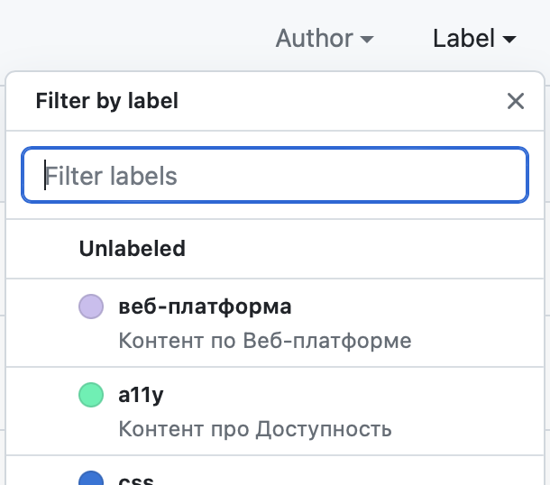

## Задача

Отыскать ишью или пулреквест среди прочих в репозитории на GitHub.

## Решение

Ишью — это задача на доработку, описание какой-то проблемы пользователя, требования к процессу разработки или ошибки. Словом, то, что нужно сделать. Практически любое изменение в репозитории на GitHub начинается с ишью. В формате ишью формируются задачи при разработке многих технологий и методик построения рабочего процесса. Любая проблема, обнаруженная в ходе разработки или использования продукта, также описывается в ишью.

Ориентироваться в списке ишью не так просто. Он может быть огромным. Есть несколько способов, как найти нужное ишью.

Первый — самый простой. На вкладке с ишью или пулреквестами в строке поиска напишите необходимый поисковый запрос. Поле находится перед списком ишью проекта. Имейте в виду, что поиск работает не только по названиям ишью или пулреквестов, но и по комментариям в обсуждении, содержимому изменённых файлов (в случае пулреквестов) и прочему тексту, который к ним относится.

Второй способ позволяет фильтровать ишью по меткам и после искать «вручную» или с помощью поискового запроса в коротком списке. Метки найдёте в выпадающем меню у элемента «Label». В нём можно найти нужную метку с помощью поиска в начале блока или выбрать её из списка со всеми метками проекта. К примеру, в Доке есть метки «веб-платформа» и «a11y».

Точно также можно отфильтровать по автору, проектам, этапам, назначенным исполнителям, а ещё отсортировать ишью по дате создания, количеству комментариев, обновлениям и даже по количеству реакций.

Третий способ — добавить в строку поиска дополнительные ограничения в формате `параметр:значение`. Например, фильтр `type:issue` включает поиск только для ишью, `in:title` ищет только в названиях, а `is:closed` — только в закрытых пулреквестах или ишью. Полный список параметров доступен [на странице официальной документации GitHub](https://docs.github.com/en/search-github/searching-on-github/searching-issues-and-pull-requests). Это эффективный способ. Например, он помогает находить пулреквесты, слитые в основную ветку, за определённый период с помощью `merged:>YYYY-MM-DD`, или искать открытые ишью за определённый период (`created:<YYYY-MM-DD`). Знак меньше или больше значит, что вы задаёте период до или после указанной даты.
