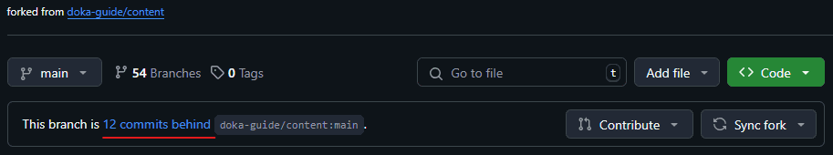

## Основные операции при работе с форком

## Состояние форка

Сразу после создания, форк содержит актуальное состояние исходного (upstream) репозитория. Спустя некоторое время исходный репозиторий может измениться. Эти изменения уже не будут видны в форке.

Проверить изменения исходного репозитория можно на главной странице (вкладка «Code» ) форк-репозитория на GitHub. GitHub отображает состояние текущей ветки относительно исходного репозитория.

## Синхронизация форка

## Удаление ненужных веток

